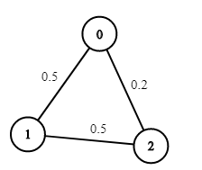
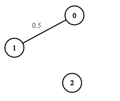
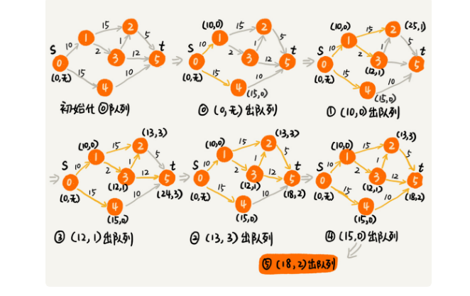

#### 题目：[1514. 概率最大的路径](https://leetcode-cn.com/problems/path-with-maximum-probability/)

> 给你一个由 n 个节点（下标从 0 开始）组成的无向加权图，该图由一个描述边的列表组成，其中 edges[i] = [a, b] 表示连接节点 a 和 b 的一条无向边，且该边遍历成功的概率为 succProb[i] 。
>
> 指定两个节点分别作为起点 start 和终点 end ，请你找出从起点到终点成功概率最大的路径，并返回其成功概率。
>
> 如果不存在从 start 到 end 的路径，请 返回 0 。只要答案与标准答案的误差不超过 1e-5 ，就会被视作正确答案。
>
> 

#### 示例



```java
输入：n = 3, edges = [[0,1],[1,2],[0,2]], succProb = [0.5,0.5,0.2], start = 0, end = 2
输出：0.25000
解释：从起点到终点有两条路径，其中一条的成功概率为 0.2 ，而另一条为 0.5 * 0.5 = 0.25

```



```java
输入：n = 3, edges = [[0,1]], succProb = [0.5], start = 0, end = 2
输出：0.00000
解释：节点 0 和 节点 2 之间不存在路径

```


| 难度 | 初见 | 复习1次 | 复习2次 | 复习3次 | 复习4次 |
| :--: | :--: | :-----: | :-----: | :-----: | :-----: |
| 中等 |  ✖   |         |         |         |         |

#### 分析

建立邻接表，然后bfs编列队列

我们用 Node数组，记录每个顶点的所有边（Edge），边里面记录了边的终点和这条边的权重

我们设置一个虚空起点，这个虚空起点的终点是start，权重为1，然后将其放到优先级队列中。

用visit数组存储当前节点Node是否被遍历过

设置一个倒序队列，这样每次从对头取出的就是最大概率的边（Edge），如果该节点没被遍历过，就取出边的终点（Edge.cur），然后遍历该点的所有边，用当前的权重prob乘以每条边的权重，然后添加到队列中，循环取出吓一条概率最大的边，直至寻找到终点。因为我们一直遍历的是最大概率的边，所以我们找到的终点概率也是最大的。

如果最后都没找到终点，说明不存在，返回0



```java
 public double maxProbability(int n, int[][] edges, double[] succProb, int start, int end) {
            Node[] graph = new Node[n];
            for (int i = 0; i < n; i++) {
                graph[i] = new Node(i);
            }
            for (int i = 0; i < edges.length; i++) {
                graph[edges[i][0]].child.add(new Edge(edges[i][1],succProb[i]));
                graph[edges[i][1]].child.add(new Edge(edges[i][0],succProb[i]));
            }
            //这里是从大到小倒序排列，因为这是一个队列，这样拿到的下一个边是概率最大的
            //之所以要这排列因为可能如果先计算概率小的话可能概率小的边直接到终点就直接退出循环了
            //而高概率的边是可能也到达终点但是概率更高的。
            PriorityQueue<Edge> queue = new PriorityQueue<>((a, b) -> Double.compare(b.prob, a.prob));
            queue.add(new Edge(start,1));
            boolean[] visit = new boolean[n];
            while (!queue.isEmpty()){
                Edge head = queue.poll();
                if (head.cur==end){
                    return head.prob;
                }
                if (!visit[head.cur]){
                    visit[head.cur]=true;
                    List<Edge> list = graph[head.cur].child;
                    for (int i = 0,len = list.size(); i <len ; i++) {
                        queue.add(new Edge(list.get(i).cur,list.get(i).prob*head.prob));
                    }
                }
            }
            return 0;
        }

        public class Node {
            public List<Edge> child;

            public Node(int start) {
                this.start = start;
                child=new ArrayList<>();
            }
        }
        public class Edge {
            public int cur = 0;
            public double prob;

        public Edge(int end, double prob) {
            this.cur = end;
            this.prob = prob;
        }
    }
}
```


#### 复杂度

- 时间复杂度:$O(边的数量*logN)$。因为涉及从优先级队列取数据、往优先级队列中添加数据、更新优先级队列中的数据，这样三个主要的操作。我们知道，优先级队列是用堆来实现的，堆中的这几个操作，时间复杂度都是 O(logN)（堆中的元素个数不会超过顶点的个数 N）。我们一共要处理所有的边，所以综上时间复杂度就是

  边长数量*logN

- 空间复杂度:$O(边的数量)$

