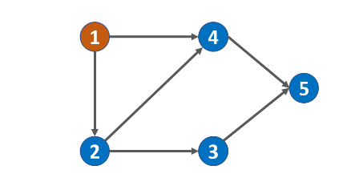

#### 题目：

> 你这个学期必须选修 numCourse 门课程，记为 0 到 numCourse-1 。
>
> 在选修某些课程之前需要一些先修课程。 例如，想要学习课程 0 ，你需要先完成课程 1 ，我们用一个匹配来表示他们：[0,1]
>
> 给定课程总量以及它们的先决条件，请你判断是否可能完成所有课程的学习？
>

#### 示例

```java
输入: 2, [[1,0]] 
输出: true
解释: 总共有 2 门课程。学习课程 1 之前，你需要完成课程 0。所以这是可能的。
```

```java
输入: 2, [[1,0],[0,1]]
输出: false
解释: 总共有 2 门课程。学习课程 1 之前，你需要先完成​课程 0；并且学习课程 0 之前，你还应先完成课程 1。这是不可能的。
```

提示：

- 输入的先决条件是由 边缘列表 表示的图形，而不是 邻接矩阵 。详情请参见图的表示法。
- 你可以假定输入的先决条件中没有重复的边。
- 1 <= numCourses <= 10^5

| 难度 | 初见 | 复习1次 | 复习2次 | 复习3次 | 复习4次 |
| :--: | :--: | :-----: | :-----: | :-----: | :-----: |
| 中等 |  ✖   |         |         |         |         |

#### 分析

这题的本质是拓扑排序和将题目转换为有向无环图。

####  广度优先遍历

我们将给出的课程联系转化为有向无环图，例如5个课程，关系为[[4,1],[2,1],[4,2],[3,2],[5,4],[5,3]]



我们把1这种自己没有前置课程，只提供给其他课程当前置的课程设置一个入度值，为0，

4这种有两个前置的，表示有两条边进入这个节点，所以它的入度为2，以此类推。

我们用数组存储下当前节点的所有前置节点，也就是边的两个节点，然后再记录下当前节点的入度。

最后用bfs，把入度为0的节点记录下来，然后找到该节点的后置节点，剔除当前节点后，把他们的入度减去1，

如果后置节点的入度变为了0，那么加入队列继续循环。

循环一次，就等于剔除了一门课程，最后如果剔除的课程等于总课程，说明所有课都是有依赖关系的，可以全部学习完。

类似于[[0,1],[1,2],[2,0]]这种环形的话就是不可能的，因为他们的入度都为1.

```java
 public boolean canFinish(int numCourses, int[][] prerequisites) {
        List<List<Integer>> side = new ArrayList<>();
        int[] course = new int[numCourses];
        for (int i = 0; i < numCourses; i++) {
            side.add(new ArrayList<>());
        }
        for (int i = 0; i <prerequisites.length ; i++) {
            //后面在前，目的是为了记录下该节点对应的所有后置节点
            side.get(prerequisites[i][1]).add(prerequisites[i][0]);
            course[prerequisites[i][0]]++;
        }
        Deque<Integer> deque = new ArrayDeque<>();
        for (int i = 0; i < numCourses; i++) {
            if (course[i]==0){
                //不是添加course[i],而是课程编号i
                deque.add(i);
            }
        }

        int count = 0;
        while (!deque.isEmpty()) {
            int courseIndex = deque.pollFirst();
            for (int preIndex:side.get(courseIndex)) {
              --course[preIndex];
              if (course[preIndex]==0){
                  //这里和上面的都警惕一下，不是添加course[preIndex]
                  deque.add(preIndex);
              }
            }
            count++;
        }
        return count==numCourses;
    }
```


#### 复杂度

- 时间复杂度: $O(n+m)$，其中$ n$为课程数，mm 为先修课程的要求数。这其实就是对图进行广度优先搜索的时间复杂度。

- 空间复杂度: $O(n+m)$。题目中是以列表形式给出的先修课程关系，为了对图进行广度优先搜索，我们需要存储成邻接表的形式，空间复杂度为 $O(n+m)$。在广度优先搜索的过程中，我们需要最多$ O(n)$ 的队列空间（迭代）进行广度优先搜索。因此总空间复杂度为$ O(n+m)$。

  