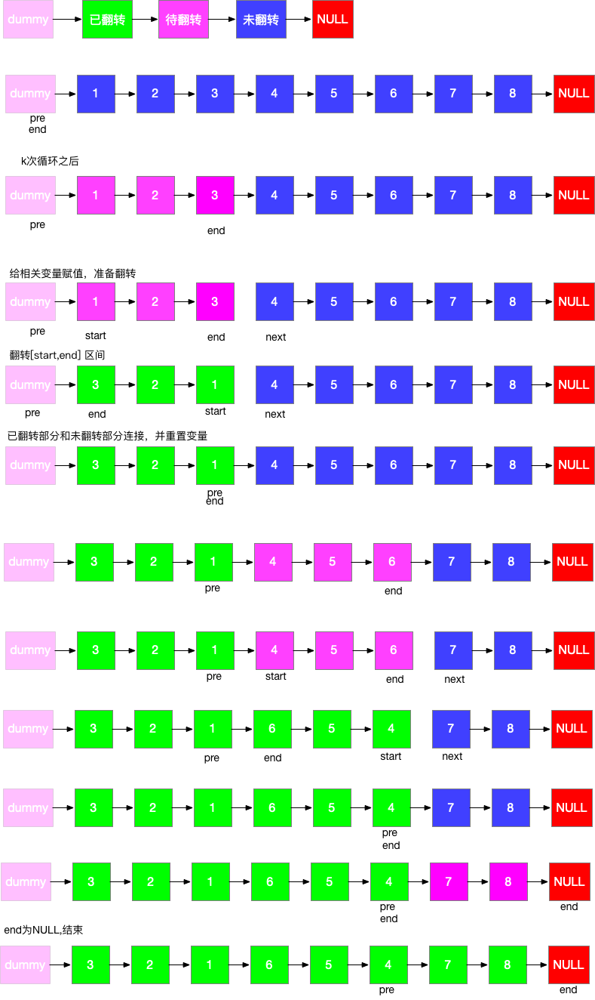

#### 题目

> 给你一个链表，每 *k* 个节点一组进行翻转，请你返回翻转后的链表。
>
> k 是一个正整数，它的值小于或等于链表的长度。
>
> 如果节点总数不是 *k* 的整数倍，那么请将最后剩余的节点保持原有顺序。
>
> **说明：**
>
> - 你的算法只能使用常数的额外空间。
> - **你不能只是单纯的改变节点内部的值**，而是需要实际进行节点交换。
>
> 来源：力扣（LeetCode）
> 链接：https://leetcode-cn.com/problems/reverse-nodes-in-k-group
> 著作权归领扣网络所有。商业转载请联系官方授权，非商业转载请注明出处。

#### 示例

```java
给你这个链表：1->2->3->4->5

当 k = 2 时，应当返回: 2->1->4->3->5

当 k = 3 时，应当返回: 3->2->1->4->5
```

| 初见 | 复习1次 | 复习2次 | 复习3次 | 复习4次 |
| :--: | :-----: | :-----: | :-----: | :-----: |
|  ✖   | ✖(98%)  |         |         |         |

#### 分析

- 链表分区为已翻转部分+待翻转部分+未翻转部分
- 每次翻转前，要确定翻转链表的范围，这个必须通过 k 此循环来确定
- 需记录翻转链表前驱和后继，方便翻转完成后把已翻转部分和未翻转部分连接起来
- 初始需要两个变量 pre 和 end，pre 代表待翻转链表的前驱，end 代表待翻转链表的末尾
- 经过k此循环，end 到达末尾，记录待翻转链表的后继 next = end.next
- 翻转链表，然后将三部分链表连接起来，然后重置 pre 和 end 指针，然后进入下一次循环
- 特殊情况，当翻转部分长度不足 k 时，在定位 end 完成后，end==null，已经到达末尾，说明题目已完成，直接返回即可




```java
  public ListNode reverseKGroup(ListNode head, int k) {
        ListNode newHead = new ListNode(-1);
        newHead.next = head;
        ListNode pre = newHead;
        ListNode end = newHead;
        while (end.next!=null){
            for (int i = 0; i <k&&end!=null ; i++) {
                end = end.next;
            }
            if (end==null){
                break;
            }
            ListNode start = pre.next;
            ListNode nextStart = end.next;
            end.next = null;
            pre.next = reverseListNode(start);
            //这里注意 start变换后start本身没变
            //第二次基本写出来了 就是这个start.next有点没绕过弯
            start.next = nextStart;
            end = start;
            pre = end;

        }
        return newHead.next;

    }

    /**
     * 翻转链表
     * @param head
     * @return
     */
    private ListNode reverseListNode(ListNode head) {
        ListNode pre = null;
        while (head != null) {
            ListNode next = head.next;
            head.next = pre;
            pre = head;
            head = next;
        }
        return pre;
    }

```


#### 复杂度

- 时间复杂度:$O(N)$,head指针会在$O(N/K)$个节点上停留，每次停留需要进行一次$O(k)$的翻转操作
- 空间复杂度:$O(1)$

