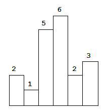
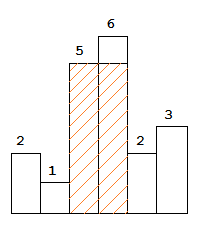

#### 题目：[84. 柱状图中最大的矩形](https://leetcode-cn.com/problems/largest-rectangle-in-histogram/)

> 给定 *n* 个非负整数，用来表示柱状图中各个柱子的高度。每个柱子彼此相邻，且宽度为 1 。
>
> 求在该柱状图中，能够勾勒出来的矩形的最大面积。

#### 示例




以上是柱状图的示例，其中每个柱子的宽度为 1，给定的高度为 [2,1,5,6,2,3]。




图中阴影部分为所能勾勒出的最大矩形面积，其面积为 `10` 个单位。

| 难度 | 初见 | 复习1次 | 复习2次 | 复习3次 | 复习4次 |
| :--: | :--: | :-----: | :-----: | :-----: | :-----: |
| 困难 |  ✖   |         |         |         |         |

#### 分析

本题采用单调栈的方法来做，所谓单调栈，就是栈内的数据时单调递增或递减的。

这里我们可以知道如果某个下标后续的数据比它还大，那么以这个下标为高度的底边宽就可以继续不断向右拓展。

所以建立一个辅助栈，存入数据的下标，当存入的数据大于栈顶的数据时，就将栈顶数据出栈，并求出以此栈顶数据为高度的最大区域是多少。

例如例子。

- 先存入数据2的下标0
- 判断1小于栈顶的2，所以2出栈，此时的最大面积为：以栈顶2为最大高度的面积为：2*（1-0）=2，然后1入栈
- 判断5大于1，5的下标2入栈
- 判断6大于5，5的下标2入栈
- 此时的栈内数据为1，2，3.判断2小于6，所以数据6出栈，且以高度为6的最大长方形面积为6*(4-2-1)=6
- 此时的栈内数据为1，2.判断2小于5，所以数据5出栈，注意，因为我们的栈是单调递增的，所以数据5下标（2）到数据2下标（4）之间的数据肯定是大于等于5的，只不过是上一步出栈了而已，所以最大面积就为：以5为最大高度的面积为5*（4-1-1）=10
- 后面的23数据类似

```java
 public int largestRectangleArea(int[] heights) {
        int len = heights.length;
        if (len == 0) {
            return 0;
        }
        if (len == 1) {
            return heights[0];
        }

        int res = 0;
        Deque<Integer> stack = new ArrayDeque<>(len);
        for (int i = 0; i < len; i++) {
            // 这个 while 很关键，因为有可能不止一个柱形的最大宽度可以被计算出来
            while (!stack.isEmpty() && heights[i] < heights[stack.peekLast()]) {
                int curHeight = heights[stack.pollLast()];
                while (!stack.isEmpty() && heights[stack.peekLast()] == curHeight) {
                    stack.pollLast();
                }

                int curWidth;
                if (stack.isEmpty()) {
                    curWidth = i;
                } else {
                    curWidth = i - stack.peekLast() - 1;
                }

                res = Math.max(res, curHeight * curWidth);
            }
            stack.addLast(i);
        }

        while (!stack.isEmpty()) {
            int curHeight = heights[stack.pollLast()];
            while (!stack.isEmpty() && heights[stack.peekLast()] == curHeight) {
                stack.pollLast();
            }
            int curWidth;
            if (stack.isEmpty()) {
                //为空就是最后一个数据，他就是用整个数组的长度乘以他的高
                curWidth = len;
            } else {
                curWidth = len - stack.peekLast() - 1;
            }
            res = Math.max(res, curHeight * curWidth);
        }
        return res;
    }
}
```

以上参考代码 2 需要考虑两种特殊的情况：

- 弹栈的时候，栈为空；
- 遍历完成以后，栈中还有元素；
  为此可以我们可以在输入数组的两端加上两个高度为 0 （或者是 0.5，只要比 1 严格小都行）的柱形，可以回避上面这两种分类讨论。

这两个站在两边的柱形有一个很形象的名词，叫做**哨兵（Sentinel）。**

有了这两个柱形：

左边的柱形（第 1 个柱形）由于它一定比输入数组里任何一个元素小，它肯定不会出栈，因此栈一定不会为空；

右边的柱形（第 2 个柱形）也正是因为它一定比输入数组里任何一个元素小，它会让所有输入数组里的元素出栈（第 1 个哨兵元素除外）。

这里栈对应到高度，呈单调增加不减的形态，因此称为单调栈（Monotone Stack）。它是暴力解法的优化，计算每个柱形的高度对应的最大矩形的顺序由出栈顺序决定。

```java
public int largestRectangleArea(int[] heights) {
        int length = heights.length;
        if (length==0){
            return 0;
        }
        if (length==1){
            return heights[0];
        }
        int[] newHeight = new int[length+2];
        Deque<Integer> stack =new ArrayDeque<>();
        for (int i = 1; i <= length; i++) {
            newHeight[i] = heights[i-1];
        }
        stack.addLast(0);
        int a =stack.peekLast();
        int result =0;
        for (int i = 1; i < length+2; i++) {
            while (newHeight[stack.peekLast()]>newHeight[i]){
                int maxheight = newHeight[stack.pollLast()];
                int maxWigth = i-stack.peekLast()-1;
                result=Math.max(result,maxheight*maxWigth);
            }
            stack.add(i);
        }
        return result;
    }
```

类似例题

| 题目                                                         | 题解                                                         |
| ------------------------------------------------------------ | ------------------------------------------------------------ |
| [42. 接雨水（困难）](https://leetcode-cn.com/problems/trapping-rain-water/) | [暴力解法、优化、双指针、单调栈](https://leetcode-cn.com/problems/trapping-rain-water/solution/bao-li-jie-fa-yi-kong-jian-huan-shi-jian-zhi-zhen-/) |
| [739. 每日温度（中等）](https://leetcode-cn.com/problems/daily-temperatures/) | [暴力解法 + 单调栈](https://leetcode-cn.com/problems/daily-temperatures/solution/bao-li-jie-fa-dan-diao-zhan-by-liweiwei1419/) |
| [496. 下一个更大元素 I（简单）](https://leetcode-cn.com/problems/next-greater-element-i/) | [暴力解法、单调栈](https://leetcode-cn.com/problems/next-greater-element-i/solution/bao-li-jie-fa-dan-diao-zhan-by-liweiwei1419-2/) |
| [316. 去除重复字母（困难）](https://leetcode-cn.com/problems/remove-duplicate-letters/) | [栈 + 哨兵技巧（Java、C++、Python）](https://leetcode-cn.com/problems/remove-duplicate-letters/solution/zhan-by-liweiwei1419/) |
| [901. 股票价格跨度（中等）](https://leetcode-cn.com/problems/online-stock-span/) | [ 「力扣」第 901 题：股票价格跨度（单调栈）](https://blog.csdn.net/lw_power/article/details/103957702) |
| [402. 移掉K位数字](https://leetcode-cn.com/problems/remove-k-digits/) |                                                              |
| [581. 最短无序连续子数组](https://leetcode-cn.com/problems/shortest-unsorted-continuous-subarray/) |                                                              |


#### 复杂度

- 时间复杂度:$O(N)$
- 空间复杂度:$O(N)$

