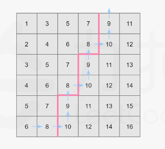

#### 题目：[378. 有序矩阵中第K小的元素](https://leetcode-cn.com/problems/kth-smallest-element-in-a-sorted-matrix/)

> 给定一个 n x n 矩阵，其中每行和每列元素均按升序排序，找到矩阵中第 k 小的元素。
> 请注意，它是排序后的第 k 小元素，而不是第 k 个不同的元素。

#### 示例

```java
matrix = [
   [ 1,  5,  9],
   [10, 11, 13],
   [12, 13, 15]
],
k = 8,

返回 13。
```

| 难度 | 初见 | 复习1次 | 复习2次 | 复习3次 | 复习4次 |
| :--: | :--: | :-----: | :-----: | :-----: | :-----: |
| 中等 |  ✖   |         |         |         |         |

#### 分析

用二分法来做

**思路**

- 把整个矩阵 “展平” 成一个有序的一维数组看待
- 二分查找：算出中间数值（不是中间索引），并算出这个中间值放在矩阵里的话，能排多少位，即小于等于它的有几个
- 将这个排名和 k 比较，如果比 k 小，说明我们选的中间值小了，目标值在右边，调整左边界，否则，说明中间值大了，目标值在左边，调整右边界

**为什么是对“数值”进行二分**

- 二分查找一般用来在有序数组中找到满足条件的值

- 因为是有序的，索引的大小可以反映值的大小，对索引二分即可。但这题索引和数值并没有直接的关系
  矩阵中的最大元素和最小元素是很明确的，求中间值，不断二分，去逼近目标值

**如何求一个值在矩阵中的排名**

- 我们可以让它和一行的最右元素，即一行的老大，进行比较

-  如果大于等于老大，就大于等于这行所有数，否则，逐个和老大左边的数比较



例如这个例子，中位数为1+15/2=8;

从左下角开始：

- 如果数小于mid，那么向右进一格，同时加上这个一整列数字（因为一整列的数最下面是最大的）
- 如果数大于mid，那么向上进一格，寻找一个更小的数，知道找到后继续向右或者没找到爬到顶后退出循环


```java
  public int kthSmallest(int[][] matrix, int k) {
        int len = matrix.length;
        int min = matrix[0][0];
        int max = matrix[len - 1][len - 1];
        while (min < max) {
            int mid = min + (min - max) / 2;
            if (check(matrix, mid, k)) {
                max = mid;
            } else {
                min = mid + 1;
            }
        }
        return min;
    }

    private boolean check(int[][] matrix, int mid, int k) {
        int len = matrix.length;
        //从左下角开始,蜿蜒向右上角爬
        int x = len - 1;
        int y = 0;
        int count = 0;
        while (x >= 0 && y < len) {
            if (matrix[x][y] <= mid) {
                count += x + 1;
                y++;
            } else {
                x--;
            }
        }
        return count >= k;
    }
}

```


#### 复杂度

- 时间复杂度:$O(N)$
- 空间复杂度:$O(1)$