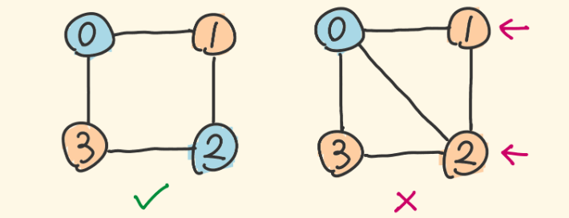

#### 题目：[785. 判断二分图](https://leetcode-cn.com/problems/is-graph-bipartite/)

> 给定一个无向图graph，当这个图为二分图时返回true。
>
> 如果我们能将一个图的节点集合分割成两个独立的子集A和B，并使图中的每一条边的两个节点一个来自A集合，一个来自B集合，我们就将这个图称为二分图。
>
> graph将会以邻接表方式给出，graph[i]表示图中与节点i相连的所有节点。每个节点都是一个在0到graph.length-1之间的整数。这图中没有自环和平行边： graph[i] 中不存在i，并且graph[i]中没有重复的值。
>
> 

#### 示例

```java
示例 1:
输入: [[1,3], [0,2], [1,3], [0,2]]
输出: true
解释: 
无向图如下:
0----1
|    |
|    |
3----2
我们可以将节点分成两组: {0, 2} 和 {1, 3}。
```

```java

示例 2:
输入: [[1,2,3], [0,2], [0,1,3], [0,2]]
输出: false
解释: 
无向图如下:
0----1
| \  |
|  \ |
3----2
我们不能将节点分割成两个独立的子集。
```


| 难度 | 初见 | 复习1次 | 复习2次 | 复习3次 | 复习4次 |
| :--: | :--: | :-----: | :-----: | :-----: | :-----: |
| 中等 |  ✖   |         |         |         |         |

#### 分析

这题看起来没思路，其实做起来很简单

- 二分图：顶点由两个集合组成，且所有边的两个顶点正好分别处于两个集合里
- 更形象化地去表示：我们可以用两种颜色代表这两个集合，相邻的顶点不能是同一种颜色
- 下图右边例子：对顶点0来说，1、2、3和它相邻所以不同色，但1和2因此同色，不是二分图



- 我们考察一个点，给它染上红色，然后寻找它相邻的顶点，染上蓝色，这种“相邻”我会想到BFS，通过BFS对图进行染色，所有顶点都染色后，如果没有冲突，说明是二分图
- 值得注意的是，我们从一个点开始BFS能否遍历完所有的点？如果所有点是连通的，那就能，但题目没有说一定是连通的
- 所以要遍历每个顶点，再遍历当前顶点的所有相邻顶点，保证不漏掉顶点

- 用一个 visited 数组记录顶点们是否被访问过（被染色），避免重复访问，降低时间复杂度
- 同时这个数组会记录：被访问过的顶点所染成的颜色

```java
 public boolean isBipartite(int[][] graph) {
        int len = graph.length;
        int[] visit = new int[len];
        int RED = 1;
        int BLUE = -1;
        int NONE = 0;
        for (int i = 0; i < len; i++) {
            if (visit[i] != NONE) {
                continue;
            }
            Deque<Integer> deque = new ArrayDeque<>();
            deque.add(i);
            visit[i] = RED;
            while (!deque.isEmpty()) {
                int index = deque.pollFirst();
                int neighColor = visit[index] == RED ? BLUE : RED;
                for (int j = 0; j < graph[index].length; j++) {
                    int neigh = graph[index][j];
                    if (visit[neigh] == NONE) {
                        visit[neigh] = neighColor;
                        deque.add(neigh);
                    } else if (visit[neigh] != neighColor) {
                        return false;
                    }
                }
            }
        }
        return true;
    }
```


#### 复杂度

- 时间复杂度:$O(N+M)$,N是顶点，M是边
- 空间复杂度:$O(N)$

