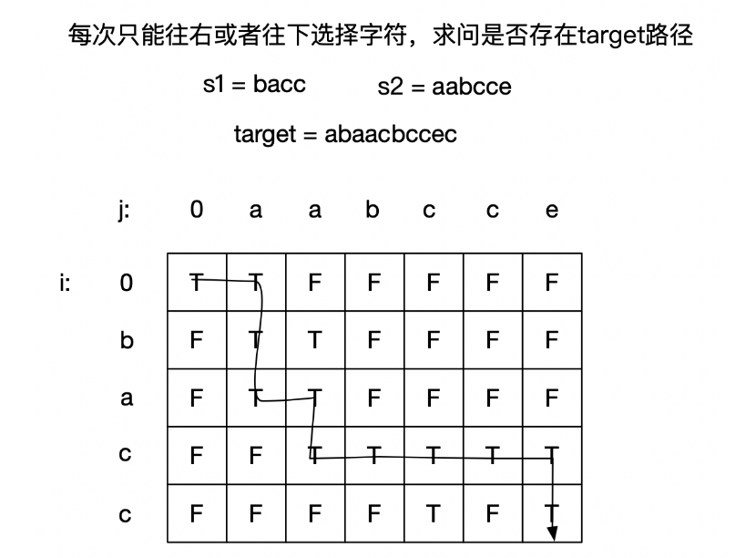

#### 题目：[97. 交错字符串](https://leetcode-cn.com/problems/interleaving-string/)

> 给定三个字符串 *s1*, *s2*, *s3*, 验证 *s3* 是否是由 *s1* 和 *s2* 交错组成的。

#### 示例

```java
输入: s1 = "aabcc", s2 = "dbbca", s3 = "aadbbcbcac"
输出: true
```

```java
输入: s1 = "aabcc", s2 = "dbbca", s3 = "aadbbbaccc"
输出: false
```

| 难度 | 初见 | 复习1次 | 复习2次 | 复习3次 | 复习4次 |
| :--: | :--: | :-----: | :-----: | :-----: | :-----: |
| 困难 |  ✖   |         |         |         |         |

#### 分析

这题一开始想到了动态规划，但还是没想到方程，结果有一种特别取巧的方法。



轻松的一个转换，就把问题转换成了求最短路径的问题。

于是可定义$dp[i][j]$代表$s1$前$i$个字符与$s2$前$j$个字符拼接成$s3$的$i+j$字符，也就是存在目标路径能够到达$(i,j)$；
状态方程：

- 边界1：$dp[0][0] $= true;
- 边界2：横向判断S2的每个位置是否和S3的一致，遇到false后面可以直接省略（这个是重点）
- 边界3：纵向判断S1的每个位置是否和S3的一致，遇到false后面可以直接省略

其他情况，到达（i，j）可能由（i-1,j）点向下一步，选择s1[i-1]到达；也可能由（i,j-1）点向右一步，选择s2[j-1]到达；
$$
dp[i,j] = (dp[i-1][j] \&\& S3[i+j-1] == S1[i-1]) || (dp[i][j-1] \&\& S3[i+j-1] == S2[j-1])
$$

```java
 public boolean isInterleave(String s1, String s2, String s3) {
        int len1 = s1.length();
        int len2 = s2.length();
        if (len1 + len2 != s3.length()) {
            return false;
        }
        boolean dp[][] = new boolean[len1+1][len2+1];
        dp[0][0]=true;
        for (int i = 1; i <= len1; i++) {
            dp[i][0] = s1.charAt(i-1)==s3.charAt(i-1);
            //这个是重点，如果从某个字符不相等，那么后面都为false，不然如果后面遍历的话，有的字符会相等
            if (!dp[i][0]){
                break;
            }
        }
        for (int i = 1; i <= len2; i++) {
            dp[0][i] = s2.charAt(i-1)==s3.charAt(i-1);
            if (!dp[0][i]){
                break;
            }
        }

        for (int i = 1; i <= len1; i++) {
            for (int j = 1; j <= len2; j++) {
                //注意这里s1和s2charAt的值要减去1，因为开头加了个（0，0）起始空值
                if((dp[i-1][j]&&s1.charAt(i-1)==s3.charAt(j+i-1))||(dp[i][j-1]&&s2.charAt(j-1)==s3.charAt(j+i-1))){
                    dp[i][j]=true;
                }
            }
        }
        return dp[len1][len2];
    }
```

### 回溯+状态保存

从暴力回溯可知，当i、j、k一定的情况下，返回值一定，由此我们可以将i、j、k、返回值用$meom[i][j][k]$记录起来，当回溯再次遇到此i、j、k时，直接返回。

显然当i、j一定时，k一定，因为k = i + j，因此，可以将状态缩减成两维，即$meom[i][j]$。

我们对上述暴力回溯进行改造，在回溯返回false的地方用$meom[i][j]$记录下来，在返回true的地方不用记录，因为一旦返回true，回溯就会一直返回，直到回溯入口。


```java
public boolean isInterleave(String s1, String s2, String s3) {
        if(s1 == null) s1 = "";
        if(s2 == null) s2 = "";
        if(s3 == null) s3 = "";
        return helper(s1, s2, s3, 0, 0, 0, new Boolean[s1.length()+1][s2.length()+1]);
    }
    
    public boolean helper(String s1, String s2, String s3, int i, int j, int k, Boolean[][] memo){
        // 若当前memo[i][j]不为空，则直接返回
        if(memo[i][j] != null)
            return memo[i][j];
        if(i == s1.length() && j == s2.length() && k == s3.length())
            return true;

        // 记录
        if(k >= s3.length())
            return memo[i][j] = false;

        if(s1.length() > i){
            if(s1.charAt(i) == s3.charAt(k) && helper(s1, s2, s3, i+1, j, k+1, memo))
                return true;
        }

        if(j < s2.length()){
            if(s2.charAt(j) == s3.charAt(k) && helper(s1, s2, s3, i, j+1, k+1, memo))
                return true;
        }

        // 记录
        return memo[i][j] = false;
    }

```


#### 复杂度

- 时间复杂度:$O(N*M)$
- 空间复杂度:$O(min(N,M))$