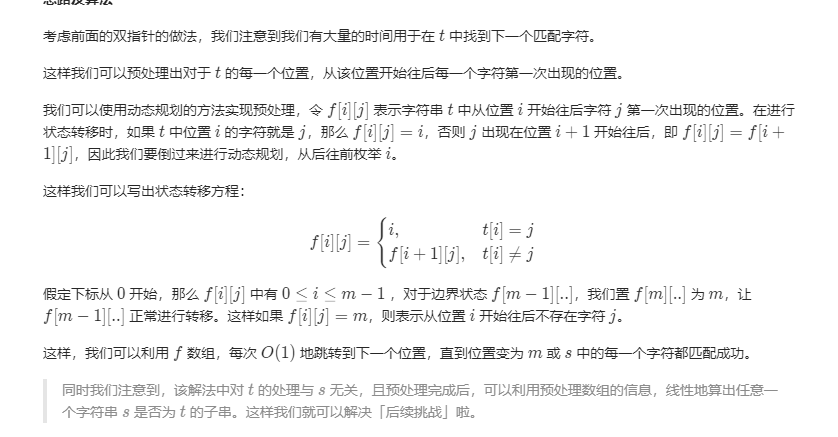

#### 题目：[392. 判断子序列](https://leetcode-cn.com/problems/is-subsequence/)

> 给定字符串 s 和 t ，判断 s 是否为 t 的子序列。
>
> 你可以认为 s 和 t 中仅包含英文小写字母。字符串 t 可能会很长（长度 ~= 500,000），而 s 是个短字符串（长度 <=100）。
>
> 字符串的一个子序列是原始字符串删除一些（也可以不删除）字符而不改变剩余字符相对位置形成的新字符串。（例如，"ace"是"abcde"的一个子序列，而"aec"不是）
>
> 后续挑战 :
>
> 如果有大量输入的 S，称作S1, S2, ... , Sk 其中 k >= 10亿，你需要依次检查它们是否为 T 的子序列。在这种情况下，你会怎样改变代码？
>

#### 示例

```java
s = "abc", t = "ahbgdc"

返回 true.
```

```java
示例 2:
s = "axc", t = "ahbgdc"

返回 false.
```


| 难度 | 初见 | 复习1次 | 复习2次 | 复习3次 | 复习4次 |
| :--: | :--: | :-----: | :-----: | :-----: | :-----: |
| 困难 |  ✖   |         |         |         |         |

#### 分析

这题用双指针的做法不难，难得是动态规划的思路[题解](https://leetcode-cn.com/problems/is-subsequence/solution/)



总而言之，就是预先生成一个数组，容量为$dp[t.length+1][26]$每一行的26个位置记录的是a-z这些字符在t中第一次出现的位置。

然后遍历是s，在第一行中找到s第一次出现的下标行x，然后在x行找s的下一个字符第一次出现的行，直到全部找到（true）,或者在找一个字符时行数超过了数组的限制（false），dp中行数设置为length+1就是这个边界条件，当某个字符第一次出现的行数为最后一行时，说明t中从前一个字符出现的行数后面开始找，找不到这个字符，所以为false。

```java
 public boolean isSubsequence(String s, String t) {
        int n = s.length(), m = t.length();

        int[][] f = new int[m + 1][26];
     	//设置边界条件，最后一行
        for (int i = 0; i < 26; i++) {
            f[m][i] = m;
        }

        for (int i = m - 1; i >= 0; i--) {
            for (int j = 0; j < 26; j++) {
                if (t.charAt(i) == j + 'a')
                    //出现了字符时，记录下行数
                    f[i][j] = i;
                else
                    //其他字符全部继承上一行，包含前一个字符的行数和边界m
                    f[i][j] = f[i + 1][j];
            }
        }
        int add = 0;
        for (int i = 0; i < n; i++) {
            if (f[add][s.charAt(i) - 'a'] == m) {
                return false;
            }
            add = f[add][s.charAt(i) - 'a'] + 1;
        }
        return true;
    }

```


#### 复杂度

- 时间复杂度:$O(m×∣Σ∣+n)$，Σ为字符集，本题中只包含小写字母，所以Σ为26，预处理时间为O(m)，判断子序列时间为O(N).
- 空间复杂度:$O(m×∣Σ∣)$ 动态数组的开销