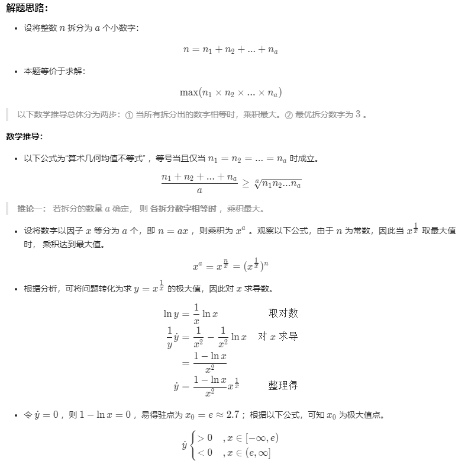
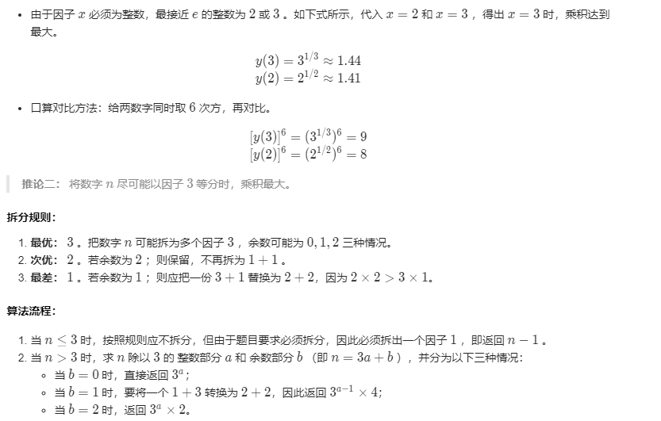
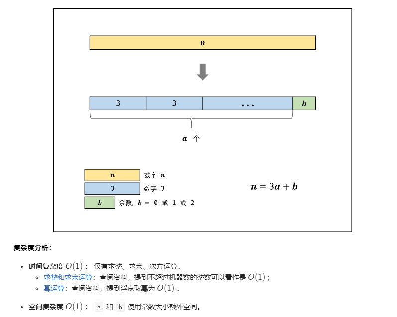

#### 题目：[343. 整数拆分](https://leetcode-cn.com/problems/integer-break/)

> 给定一个正整数 *n*，将其拆分为**至少**两个正整数的和，并使这些整数的乘积最大化。 返回你可以获得的最大乘积。

#### 示例

```java
输入: 2
输出: 1
解释: 2 = 1 + 1, 1 × 1 = 1。
```

```java
输入: 10
输出: 36
解释: 10 = 3 + 3 + 4, 3 × 3 × 4 = 36。
```

| 难度 | 初见 | 复习1次 | 复习2次 | 复习3次 | 复习4次 |
| :--: | :--: | :-----: | :-----: | :-----: | :-----: |
| 中等 |  ✖   |         |         |         |         |

#### 分析

最普通的动态规划：

$dp[i]$表示整数$i$被拆分成数个正整数后的最大乘积之和。

0，1都不能拆分，所以$dp[0] =dp[1]= 0$;

当$i>=2$时，假设整数i拆出的第一个数为j，剩下的数为$i-j$，可拆分也可不拆分。

- 当$dp[i-j]<i-j$时，剩下的拆分就没有意义了，所以$ i-j$不再拆分成多个正整数，此时的最大乘积是$j*(i-j)$；
- 当$dp[i-j]>=i-j$时，说明拆分后的值比不拆分更大，所以$ i-j$继续拆分，此时的最大乘积是$j*dp[i-j]$；

所以，拆分$j$后的最大乘积为：
$$
dp[i] = Math.max(dp[i],Math.max(i*(i-j),i*dp[i-j]))
$$
最终得到$dp[n]$的值即为将正整数 $n$ 拆分成至少两个正整数的和之后，这些正整数的最大乘积。

```java
  public int integerBreak(int n) {
        int[] dp = new int[n + 1];
        for (int i = 2; i <= n; i++) {
            int curMax = 0;
            for (int j = 1; j < i; j++) {
                curMax = Math.max(curMax, Math.max(j * (i - j), j * dp[i - j]));
            }
            dp[i] = curMax;
        }
        return dp[n];
    }

```

通过数学推导得出将数字 $n$ 尽可能以因子 3等分时，乘积最大[题解](https://leetcode-cn.com/problems/integer-break/solution/343-zheng-shu-chai-fen-tan-xin-by-jyd/)







```java
public int integerBreak(int n) {
    if (n <= 3) {
        return n - 1;
    }
    int quotient = n / 3;
    int remainder = n % 3;
    if (remainder == 0) {
        return (int) Math.pow(3, quotient);
    } else if (remainder == 1) {
        return (int) Math.pow(3, quotient - 1) * 4;
    } else {
        return (int) Math.pow(3, quotient) * 2;
    }
}
```


