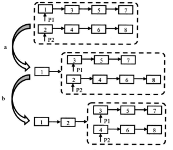

#### 题目

> 题目:输入两个递增排序的链表，合并这两个链表并使新链表中的结点仍然是按照递增排序的。例如链表1和链表2,则合并之后的升序链表如链表3所示。

```
链表1：1-->3-->5-->7-->9

链表2：2-->4-->6-->8-->10

链表3：1-->2-->3-->4->5-->6-->7-->8->9-->10
```

#### 分析

首先，依旧是程序健壮性，判断这两个链表是否存在为空可能性。

两个链表的比较过程如下图，先两个头节点找到最小值，然后另一个头结点与更小值得next节点获取最小点，每一次比较决出一个点。	



- 首先分析合并两个链表的过程。比较两个链表的头指针，将较小值作为合并后链表的头结点，然后继续合并两个链表中的剩余节点。
- 由于两个链表都是单调递增的，所以接下来只需要循环操作第一步到尾部即可，因此我们可以采用递归的方法实现该循环。
- 注意对两个链表中有空指针的情况的分析：只要有一个为空指针，那么就应该以另一个为合并后链表的头。
  

```java
    public Node solve(Node node1, Node node2) {
        if (node1 == null) {
            return node2;
        } else if (node2 == null) {
            return node1;
        }
        Node newHead = null;
        if (node1.value < node2.value) {
            newHead = node1;
            newHead.next = solve(node1.next, node2);
        } else {
            newHead = node2;
            newHead.next = solve(node2.next, node1);
        }
        return newHead;
    }
```

