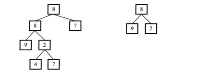

#### 题目

> 题目:输入两棵二叉树A和B,判断B是不是A的子结构。二叉树结点的定义如下:

```java
public class TreeNode {
    public int value;
    public TreeNode left;
    public TreeNode right;
}
```

#### 分析

注意，这里是普通的树，并不是左小右大的排序好的树，相等的条件是左右和根节点都一样，如下图树A和B



右边的树就是左边树的子树，这里只是简单样式，这种情况下我们需要怎么判断；

- 首先最左边节点寻找是否和右边树根节点相同的节点R，实际上就是树的遍历，可以采用递归的方式。
- 如果节点R的值和树B的根节点不相同，则以R为根节点的子树和树B肯定不具有相同的结点；如果它们的值相同，则递归地判断它们各自的左右节点的值是不是相同。递归的终止条件是我们到达了树Ａ或者树B的叶节点

所以我们需要两个判断，先判断根节点，在判断子节点

```java
 public boolean haveSameRootNode(TreeNode nodeA, TreeNode nodeB) {
        if (nodeA == null) {
            return false;
        }
        if (nodeB == null) {
            return false;
        }
        boolean result = false;
        //根节点相同，就去看他们左右子节点是否相同
        if (nodeA.value == nodeB.value) {
            result = haveSameLeafNode(nodeA, nodeB);
        }
        //根节点不相同寻找他们的子节点是否相同
        if (!result) {
            result = haveSameRootNode(nodeA.left, nodeB);
        }
        if (!result) {
            result = haveSameRootNode(nodeA.right, nodeB);
        }
        return result;
    }

    private boolean haveSameLeafNode(TreeNode nodeA, TreeNode nodeB) {
        if (nodeB == null) {
            return true;
        }
        if (nodeA == null) {
            return false;
        }
        //这是自己思考出来的写法，比较繁琐，
//        boolean result = false;
//        if (nodeA.left.value == nodeB.left.value){
//            result = haveSameLeafNode(nodeA.left,nodeB.left);
//        }
//        if (result){
//            if (nodeA.right.value == nodeB.right.value){
//                result = haveSameLeafNode(nodeA.right,nodeB.right);
//            }
//        }
//        return result;
        //这是参考答案
        if (nodeA.value != nodeB.value) {
            return false;
        }
        return haveSameRootNode(nodeA.left, nodeB.left) && haveSameRootNode(nodeA.right, nodeB.right);
    }
```

