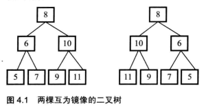

#### 题目

> 给定一个二叉树A，输出它的镜像B,如下图



#### 分析

看起来很复杂，其实就是调换所有非叶子节点的左右子节点，通过不断遍历每一个节点，判断他是否为叶子节点，不是的话就左右节点调换，所以可以用递归来完成。

```java
 public void solve(TreeNode node) {
        if (node == null) {
            return;
        }
        if (node.left == null && node.right == null) {
            return;
        }
        //判断一个节点的左右节点有一个不为null就左右互换，然后递归调用
        TreeNode temp = node.left;
        node.left = node.right;
        node.right = temp;
        if (node.left != null) {
            solve(node.left);
        }
        if (node.right != null) {
            solve(node.right);
        }
    }
```

