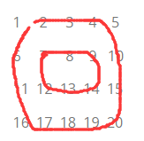
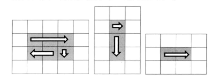

#### 题目（LeetCode 54）

> 题目:输入一个矩阵，按照从外向里以顺时针的顺序依次打印出每一个数字。例如:如果输入如下矩阵:
>
> 1     2     3    4    5
>
> 6     7     8    9   10    
>
> 11  12  13  14  15 
>
> 16  17  18  19  20
>
> 输出就是1 ，2 ， 3 ， 4 ， 5 ， 10 ， 15  ，20 ，19  ，18  ，17 ， 16  ，11 ， 6 ， 7 ， 8  ，9  ，14 ， 13 12 

#### 分析

本题主要分析两个难点，包含多个循环，还需要判断多个边界条件，把问题分成若干个简单的问题

-  一个就是把这个打印顺序看成一个圆，把一个矩阵看成若干个圆，然后按照圆的顺序打印出来，每一次打印矩阵中的一个圆。

  

- 但是这样有一个问题，最里面的圆有可能到最后不是一个圆，可能是一行一列或者是最后一个点

  

  

  所以我们需要仔细分析打印时每一步的前提条件，第一步是总是需要的，因为要打印一圈至少有第一步，如果只有一行就不需要第二步了，也就是需要第二步的前提条件是**终止行号大于起始行号且终止列号大于起始列号**，同理需要打印第四步的前提条件时至少有三行两列，因此要求终止行号比起始行号至少大于2，同时终止列号大于起始列号。

  

  循环终止判断条件分析:

  ​		假设这个矩阵的行数是rows,列数是.columns.打印第一圈的左上角的坐标是(0, 0),第二圈的左上角的坐标是(1,1),依此类推。我们注意到，左上角的坐标中行标和列标总是相同的，于是可以在矩阵中选取左上角为(start, start)的一圈作为我们分析的目标。

  ​		对一个5X5的矩阵而言，最后一圈只有一个数字，对应的坐标为(2, 2)。我们发现5>2X2。对-个6X6的矩阵而言，最后一圈有4个数字，其左上角的坐标仍然为(2, 2)。我们发现6> 2X2依然成立。于是我们可以得出，让
  循环继续的条件是columns > startX X2并且rows > startY X2。所以我们可以用如下的循环来打印矩阵:

  ```java
    public List<Integer> solve(int[][] array) {
        //任何题目最重要的就是数组边界
          if (array == null || array.length <= 0 || array[0].length <= 0) {
              return new ArrayList<>();
          }
          int row = array.length - 1;
          int col = array[0].length - 1;
          int start = 0;
          List<Integer> result = new ArrayList<>();
        	//这里的row和col是数组下标，是从0开始的，这里比较的是行列数量，所以加回1
          while (row + 1 > start * 2 && col + 1 > start * 2) {
              result.addAll(printNumber(array, row, col, start));
              start++;
          }
          return result;
      }
  
       private List<Integer> printNumber(int[][] array, int row, int col, int round) {
          int endCol = col - round;
          int endRow = row - round;
          List<Integer> list = new ArrayList<>();
          //打印从左到右的边
          for (int i = round; i <= endCol; i++) {
              list.add(array[round][i]);
              System.out.printf(" " + array[round][i]);
          }
          if (round < endRow) {
              //打印从上到下的边
              for (int i = round + 1; i <= endRow; i++) {
                  list.add(array[i][endRow]);
                  System.out.printf(" " + array[i][endCol]);
              }
              if (round < endCol) {
                  //打印从右到左的边，因为没有从上到下的边，从左到右也就无稽之谈，所以判断条件在里面
                  for (int i = endCol - 1; i >= round; i--) {
                      list.add(array[endRow][i]);
                      System.out.printf(" " + array[endRow][i]);
                  }
  
              }
          }
          //首先判断起始列小于数组列，因为这是画从右到左的边的条件，没有从右到左的边，从下到上的边也是无稽之谈，
          //第二个条件是判断有没有可供打印出的数字 例如1 3 4 想要有3 4的行号就必须比1大于等于2，所以这里加1
          if (round < endCol && round + 1 < endRow) {
              for (int i = endRow - 1; i >= round + 1; i--) {
                  list.add(array[i][round]);
                  System.out.printf(" " + array[i][round]);
              }
          }
          return list;
  
      }
  ```

  

  #### 总结

  本题主要注意有多种情况下的判断，单行单列，多行多列，一个数字，五种情况

  

  

  

  

