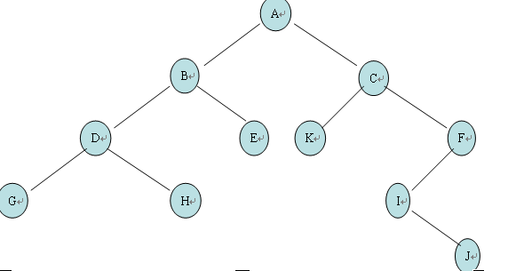

#### 题目

>输入一个整数数组，判断该数组是不是某二叉搜索树的后序遍历的结果。如果是则返回true, 否则返回false. 假设输入的数组的任意两个数字都互不相同。

#### 分析

这里先记忆下二叉树的前序中序后序遍历，这个**前中后序的前中后指的是根**如下图二叉树。



- 前序遍历：按根、左子树、右子树的顺序来遍历（根在最前），上图的结果是 A,B,D,G,H,E,C,K,F,I,J
- 前序遍历：按左子树、根、右子树的顺序来遍历（根在中间），上图的结果是 G,D,H,B,E,A,K,C,I,J,F(注意CFJI顺序)
- 后序遍历：按左子树、右子树、根的顺序来遍历（根在最后），上图的结果是 G,H,D,E,B,K,J,I,F,C,A(注意CFJI顺序)

 不过本题做的不是二叉树的后序遍历，而是给一个数组判断这个数组是否是一个二叉树的后序遍历。

通过上面分析可以知道，数组最后一个肯定是root节点，然后数组可以分成两半（理想情况下），前一半为左子树，后一半为右子树。

这里注意前一半左子树的数组最后一个也就是左子树的root节点，又可以做上一步的判断，通过这么分析可以清楚的看出这可以用一个递归来解决。

```java
 public boolean solve(int[] array) {
        if (array == null || array.length < 2) {
            return true;
        }
        return searchTree(array, 0, array.length - 1);
    }

    private boolean searchTree(int[] array, int leftIndex, int rightIndex) {
        //如果循环到左右点index相同，说明就已经循环完了
        if (leftIndex >= rightIndex) {
            return true;
        }
        int rootNode = array[rightIndex];
        int k = leftIndex;
        //寻找第一个大于根节点的点，这个点就是右子树的开始点
        while (k < rightIndex && array[k] < rootNode) {
            k++;
        }
        int i = k;
        //判断k点后面的点是否都大于根节点，如果有小于的可以直接判断不是后序遍历
        while (i < rightIndex) {
            if (array[i] < rootNode) {
                return false;
            }
            i++;
        }
        //第一个是left子树是否正确，第二个是right子树是否正确，
        // k为右子树的第一个点 所以k-1是左子树的根节点，
        // rightIndex是原始树的根节点，rightIndex - 1就是右子树的根节点
        return searchTree(array, leftIndex, k - 1) && searchTree(array, k, rightIndex - 1);
    }
```

