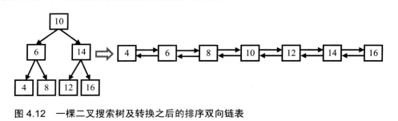
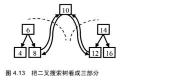

#### 题目

> 输入一棵二叉搜索树，将该二叉搜索树转换成一个排序的双向链表。要求不能创建任何新的结点，只能调整树中结点指针的指向。比如输入图4.12中左边的二义搜索树，则输出转换之后的排序双向链表。当转化完成以后，树中节点的左指针需要指向前驱，树中节点的右指针需要指向后继。还需要返回链表中的第一个节点的指针




#### 分析

上图很明显可以看出链表是按树的中序遍历排列的，可以把链表用下图来简化表示



可以看到先把左右子树按照左叶节点-->root<--右叶节点排列号后，在把左子树右节点-->root<--右子树左节点这样连接起来，左右子树如果还有更深的层数就按照这种方式去遍历。由于遍历和转换过程是一样的，我们很自然地想到可以用递归。(这是书上的写法)


下面是另一种思路，

- 先遍历递归找到最左端的点A，将A赋值给头结点head，A的前驱给preNode，preNode的后驱指向node。

- 将当前节点A赋值给preNode，循环右边，因为右子树一定是比根节点大的，所以遍历右子树的最小值node，把node的前驱指向preNode,preNode的后驱指向node，继续循环递归。

- 这是左-根-右-上一层根-上一层右的顺序来遍历递归的，每次把preNode更新为未遍历过树的最小值，然后和比她大一级的节点进行比较替换指针。

  

不过需要注意的是不能创建任何新的节点，只能用原节点来做转换。

```java
//这两个不算创建新节点
private TreeNode head;
//这个节点是比当前节点小的前一个节点
private TreeNode preNode;

public TreeNode solve(TreeNode node) {
    if (node == null) {
        return node;
    }
    DFS(node);
    //leetcode上的题目是首尾两个节点需要再次相连，所以加这两行，不需要这个条件的话就不加这两行
    preNode.right=head;
    head.left = preNode;
    return head;
}

private void DFS(TreeNode node) {
    if (node == null) {
        return;
    }
    DFS(node.left);
    node.left = preNode;
    if (preNode==null){
        head=node;
    }else{
        preNode.right=node;
    }
    preNode = node;
    DFS(node.right);
}
```


