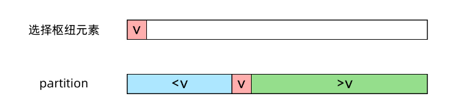

#### 题目

> 输入整数数组 `arr` ，找出其中最小的 `k` 个数。例如，输入4、5、1、6、2、7、3、8这8个数字，则最小的4个数字是1、2、3、4。

#### 分析

这一类的题目我们称之为Top K问题，是面试中的常客。Top K 问题有两种不同的解法，一种解法使用堆（优先队列），另一种解法使用类似快速排序的分治法。这两种方法各有优劣，最好都掌握。本文用图解的形式讲解这道问题的两种解法，包括三个部分：

- 方法一：堆，时间复杂度*O*(*n*log*k*)
- 方法二：快排变形，（平均）时间复杂度 O(n)两种方法的优劣比较

#### 多解法

- 方法一：堆，时间复杂度*O*(*n*log*k*)

​		比较直观的想法是使用堆数据结构来辅助得到最小的 k 个数。堆的性质是每次可以找出最大或最小的元素。我们可以使用一个大小为 k 的最大堆（大顶堆），将数组中的元素依次入堆，判断当先数字和当堆的大小超过 k 时，便将多出的元素从堆顶弹出。

​		这样，**由于每次从堆顶弹出的数都是堆中最大的，最小的 k 个元素一定会留在堆里**。这样，把数组中的元素全部入堆之后，堆中剩下的 k 个元素就是最大的 k 个数了。

​		这里可以使用java的``PriorityQueue``队列，默认是最小堆（正序排列），初始容量为11，这里可以用``compare``改成最大堆。

```java
public int[] getLeastNumbers(int[] arr, int k) {
    if (k == 0) {
        return new int[0];
    }
    // 使用一个最大堆（大顶堆）
    // Java 的 PriorityQueue 默认是小顶堆，添加 comparator 参数使其变成最大堆
    Queue<Integer> heap = new PriorityQueue<>(k, (i1, i2) -> Integer.compare(i2, i1));

    for (int e : arr) {
        // 当前数字小于堆顶元素才会入堆
        if (heap.isEmpty() || heap.size() < k || e < heap.peek()) {
            heap.offer(e);
        }
        if (heap.size() > k) {
            heap.poll(); // 删除堆顶最大元素
        }
    }

    // 将堆中的元素存入数组
    int[] res = new int[heap.size()];
    int j = 0;
    for (int e : heap) {
        res[j++] = e;
    }
    return res;
}

```

算法的复杂度分析：

由于使用了一个大小为 k 的堆，空间复杂度为 O(k)；
入堆和出堆操作的时间复杂度均为 O(logk)，每个元素都需要进行一次入堆操作，故算法的时间复杂度为 O(nlogk)。


- 方法二：快排变形

  Top K 问题的另一个解法就比较难想到，需要在平时有算法的积累。实际上，“查找第 k 大的元素”是一类算法问题，称为选择问题。找第 k 大的数，或者找前 k 大的数，有一个经典的 quick select（快速选择）算法。这个名字和 quick sort（快速排序）看起来很像，算法的思想也和快速排序类似，都是分治法的思想。

  让我们回顾快速排序的思路。快速排序中有一步很重要的操作是 partition（划分），从数组中随机选取一个枢纽元素 v，然后原地移动数组中的元素，使得比 v 小的元素在 v 的左边，比 v 大的元素在 v 的右边，如下图所示：

  

  

​     这个 partition 操作是原地进行的，需要 O(n)的时间，接下来，快速排序会递归地排序左右两侧的数组。而快速选择（quick select）算法的不同之处在于，接下来只需要递归地选择一侧的数组。快速选择算法想当于一个“不完全”的快速排序，因为我们只需要知道最小的 k 个数是哪些，并不需要知道它们的顺序。

我们的目的是寻找最小的 k个数。假设经过一次 partition 操作，枢纽元素位于下标 m，也就是说，左侧的数组有 m 个元素，是原数组中最小的 m 个数。那么：

- 若 k = m，我们就找到了最小的 k 个数，就是左侧的数组；

- 若 k<m ，则最小的 k 个数一定都在左侧数组中，我们只需要对左侧数组递归地 parition 即可；

- 若 k>m，则左侧数组中的 mm 个数都属于最小的 k 个数，我们还需要在右侧数组中寻找最小的 k-m 个数，对右侧数组递归地 partition 即可。

  

这种方法需要多加领会思想，如果你对快速排序掌握得很好，那么稍加推导应该不难掌握 quick select 的要领

```java
public int[] getLeastNumbers(int[] arr, int k) {
    if (k == 0) {
        return new int[0];
    } else if (arr.length <= k) {
        return arr;
    }
    
    // 原地不断划分数组
    int start = 0;
    int end = arr.length-1;
  	int index =   partition(arr, start,end);
    while(index!=k){
        if(index>k){
            end = index-1;
            index = partition(arr, start,end);
        }else{
            start = index+1;
            index =  partition(arr, start,end
        }
    }
    
    // 数组的前 k 个数此时就是最小的 k 个数，将其存入结果
    int[] res = new int[k];
    for (int i = 0; i < k; i++) {
        res[i] = arr[i];
    }
    return res;
}
//这是通俗版本，上面是代码简化版本
void partitionArray(int[] arr, int lo, int hi, int k) {
    // 做一次 partition 操作
    int m = partition(arr, lo, hi);
    // 此时数组前 m 个数，就是最小的 m 个数
    if (k == m) {
        // 正好找到最小的 k(m) 个数
        return;
    } else if (k < m) {
        // 最小的 k 个数一定在前 m 个数中，递归划分
        partitionArray(arr, lo, m-1, k);
    } else {
        // 在右侧数组中寻找最小的 k-m 个数
        partitionArray(arr, m+1, hi, k);
    }
}

// partition 函数和快速排序中相同，具体可参考快速排序相关的资料
// 代码参考 Sedgewick 的《算法4》
int partition(int[] a, int lo, int hi) {
    int i = lo;
    int j = hi + 1;
    int v = a[lo];
    while (true) { 
        while (a[++i] < v) {
            if (i == hi) {
                break;
            }
        }
        while (a[--j] > v) {
            if (j == lo) {
                break;
            }
        }

        if (i >= j) {
            break;
        }
        swap(a, i, j);
    }
    swap(a, lo, j);
    // a[lo .. j-1] <= a[j] <= a[j+1 .. hi]
    return j;
}

void swap(int[] a, int i, int j) {
    int temp = a[i];
    a[i] = a[j];
    a[j] = temp;
}

```

算法的复杂度分析：

空间复杂度 O(1)，不需要额外空间。
时间复杂度的分析方法和快速排序类似。由于快速选择只需要递归一边的数组，时间复杂度小于快速排序，期望时间复杂度为 O(n)，最坏情况下的时间复杂度为 O(n^2)


两种方法的优劣性比较
在面试中，另一个常常问的问题就是这两种方法有何优劣。看起来分治法的快速选择算法的时间、空间复杂度都优于使用堆的方法，但是要注意到快速选择算法的几点局限性：

第一，算法需要修改原数组，如果原数组不能修改的话，还需要拷贝一份数组，空间复杂度就上去了。

第二，算法需要保存所有的数据。如果把数据看成输入流的话，使用堆的方法是来一个处理一个，不需要保存数据，只需要保存 k 个元素的最大堆。而快速选择的方法需要先保存下来所有的数据，再运行算法。当数据量非常大的时候，甚至内存都放不下的时候，就麻烦了。所以当数据量大的时候还是用基于堆的方法比较好。


作者：nettee
链接：https://leetcode-cn.com/problems/zui-xiao-de-kge-shu-lcof/solution/tu-jie-top-k-wen-ti-de-liang-chong-jie-fa-you-lie-/
来源：力扣（LeetCode）
著作权归作者所有。商业转载请联系作者获得授权，非商业转载请注明出处。