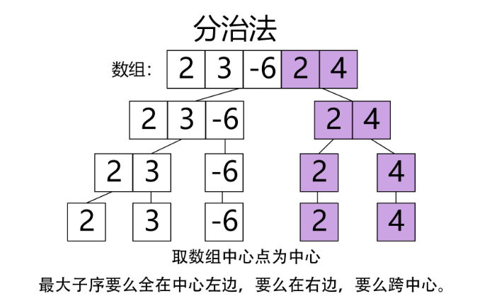

#### 题目（LeetCode 53）

> 给定一个整数数组 `nums` ，找到一个具有最大和的连续子数组（子数组最少包含一个元素），返回其最大和。

#### 示例

```
输入: [-2,1,-3,4,-1,2,1,-5,4],
输出: 6
解释: 连续子数组 [4,-1,2,1] 的和最大，为 6。
```

#### 分析

这题有三种解法，贪心，动态规划和分治法。

贪心和动态规划大致上原理相同，都是不断累加求前面累加值加当前值后是否比当前值大，如果比当前值大，那么把加上当前值继续遍历下一个，如果小于当前值，那么说明前面的累加值为负数，所以直接舍弃，直接用当前值作为新的累加值去和后面遍历

```java
/**
     * 贪心算法，每一次计算都选择最大的值
     * 每次用前面数组之和加上当前数字，如果和大于当前数字，那么就返回这个大值，然后继续
     * 如果小于当前数字，说明前面是负数，等于舍弃这些数字，从当前数字继续开始加。
     */
    public int maxSubArray(int[] nums) {
        if (nums.length == 0) {
            return 0;
        }
        int resultMax = nums[0];
        int curMax = nums[0];
        for (int i = 1; i < nums.length; i++) {
            curMax = Math.max(nums[i], curMax + nums[i]);
            resultMax = Math.max(curMax, resultMax);
        }
        return resultMax;
    }

    /**
     * 动态规划
     * 这里的动态规划和上面贪心算法其实差不多，只不过贪心省去了动态规划的数组，用了一个curMax来代替
     */
    public int maxSubArray2(int[] nums) {
        if (nums.length == 0) {
            return 0;
        }
        int[] dp = new int[nums.length];
        dp[0] = nums[0];
        int resultMax = nums[0];
        for (int i = 1; i < nums.length; i++) {
            if (dp[i - 1] < 0) {
                dp[i] = nums[i];
            } else {
                dp[i] = dp[i - 1] + nums[i];
            }
            resultMax = Math.max(resultMax, dp[i]);
        }
        return resultMax;
    }

```

- 分治法

  把数组细从中间递归划分，然后两两合并求最大值

  

先计算左边序列里面的包含最右边元素的的子序列的最大值，也就是从左边序列的最右边元素向左一个一个累加起来，找出累加过程中每次累加的最大值，就是左边序列的最大值。同理找出右边序列的最大值，就得到了右边子序列的最大值。左右两边的最大值相加，就是包含这两个元素的子序列的最大值。

```java
 public int maxSubArray(int[] nums) {
        return maxSubArrayDivideWithBorder(nums, 0, nums.length-1);
    }

    private int maxSubArrayDivideWithBorder(int[] nums, int start, int end) {
        if (start == end) {
            // 只有一个元素，也就是递归的结束情况
            return nums[start];
        }

        // 计算中间值
        int center = (start + end) / 2;
        int leftMax = maxSubArrayDivideWithBorder(nums, start, center); // 计算左侧子序列最大值
        int rightMax = maxSubArrayDivideWithBorder(nums, center + 1, end); // 计算右侧子序列最大值

        // 下面计算横跨两个子序列的最大值

        // 计算包含左侧子序列最后一个元素的子序列最大值
        int leftCrossMax = Integer.MIN_VALUE; // 初始化一个值
        int leftCrossSum = 0;
        for (int i = center ; i >= start ; i --) {
            leftCrossSum += nums[i];
            leftCrossMax = Math.max(leftCrossSum, leftCrossMax);
        }

        // 计算包含右侧子序列最后一个元素的子序列最大值
        int rightCrossMax = nums[center+1];
        int rightCrossSum = 0;
        for (int i = center + 1; i <= end ; i ++) {
            rightCrossSum += nums[i];
            rightCrossMax = Math.max(rightCrossSum, rightCrossMax);
        }

        // 计算跨中心的子序列的最大值
        int crossMax = leftCrossMax + rightCrossMax;

        // 比较三者，返回最大值
        return Math.max(crossMax, Math.max(leftMax, rightMax));
    }


链接：https://leetcode-cn.com/problems/maximum-subarray/solution/huan-mei-you-nong-
```

