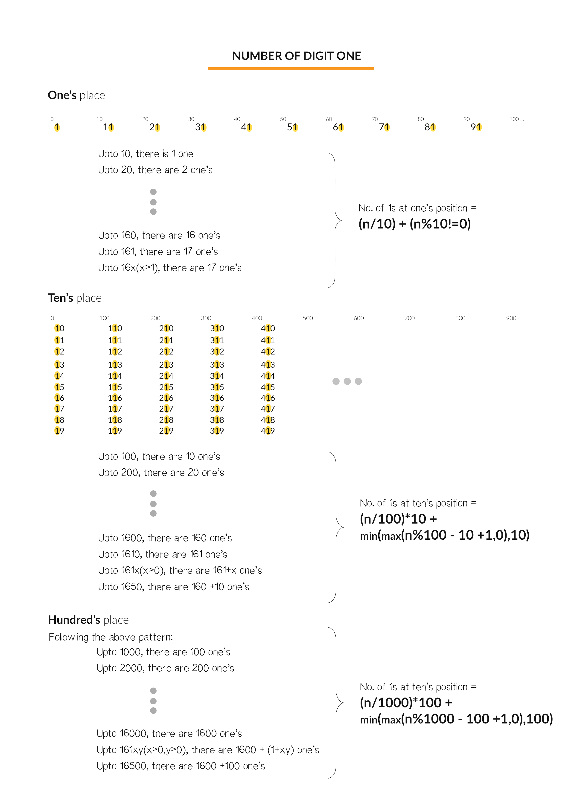

#### 题目（LeetCode233）

> 给定一个整数 n，计算所有小于等于 n 的非负整数中数字 1 出现的个数。

#### 示例

```java
输入: 13
输出: 6 
解释: 数字 1 出现在以下数字中: 1, 10, 11, 12, 13 。
```

#### 分析

本题没思路，下面是看了题解觉得写得比较好的两种写法

- ##### 数学算法

  算，就硬算。我们需要找到 1 在这些数中出现的规律。然后我们就能利用这个规律来形成数学公式解决问题了。

  

由上图所示，我们可以观察到每 10 个数，个位上的  就会出现一次。同样的，每 100 个数，十位上的  就会出现一次。这个规律可以用 **(n/(i×10))×i **公式来表示。

同时，如果十位上的数是 1，那么最后  的数量要加上 x+1，其中 x 是个位上的数值。如果十位上的数大于 1，那么十位上为  的所有的数都是符合要求的，这时候最后  的数量要加 10。

这个规律可以用公式 ``(min(max(n mod (i×10) )-i+1,0),i)`` 来表示。

我们来看一个例子吧，有一个数 n = 1234。

个位上 1 的数量 = 1234/10 (对应 1,11,21,...1221) + min(4,1) (对应 1231) = 124

**注意，这里只计算个位的1，例如11，十位上的1其实是没有计算的，下面的个百千也是一样的**

十位上 1  的数量 = (1234/100)*10 (对应 10,11,12,...,110,111,...1919) + min(21, 10)(对应 1210,1211,...1219) = 130

百位上 1  的数量 = (1234/1000)*100 (对应 100,101,102,...,199) + min(135, 100) (对应1100,1101...1199) = 200

千位上  1 的数量 = (1234/10000)*1000+ min(235, 1000) (对应1000,1001,...1234) = 235

**注意，如果千位这里是大于1，只算1000，因为大于1时百千十位的1已经计算过了**


因此，总数 = 124+130+200+235 = 689。

```java
int countDigitOne(int n)
{
    int countr = 0;
    for ( long i = 1; i <= n; i *= 10) {
         long divider = i * 10;
        countr += (n / divider) * i + min(max(n % divider - i + 1, 0), i);
    }
    return countr;
}


```

- ##### 递归调用

  递归的做法是将数字化为整型，计算整型的数据，然后杂项继续递归化为整型。

  - 例如2324  先计算整型，首先是1000-1999，这里1000个数字千位都是1，有1000个。

  - 接着除去千位0-999这样的情况会出现两次，分别是0-999，1000-1999.注意这里的1000-1999计算的是这个范围内除去千位1的1的数量，而上面算的是这个范围内千位是1的1的数量。

  - 最后计算324出现1的数量

    

  

  ```java
    public int countDigitOne2(int n) {
  
          return DFS(n);
      }
  
      private int DFS(int n) {
          if (n <= 0) {
              return 0;
          }
          String nStr = String.valueOf(n);
          int maxDigit = nStr.charAt(0) - '0';
          int maxPow = (int) Math.pow(10, nStr.length() - 1);
          int last = n - maxDigit * maxPow;
          if (maxDigit == 1) {
              // 最高位是1，如1234, 此时pow = 1000,那么结果由以下三部分构成：
              // (1) dfs(pow - 1)代表[0,999]中1的个数;
              // (2) dfs(last)代表234中1出现的个数;
              // (3) last+1代表固定高位1有多少种情况。
              return DFS(maxPow - 1) + DFS(last) + last + 1;
          } else {
              // 最高位不为1，如2234，那么结果也分成以下三部分构成：
              // (1) pow代表固定高位1，有多少种情况;
              // (2) high * dfs(pow - 1)代表999以内和1999以内低三位1出现的个数;
              // (3) dfs(last)同上。
              return maxPow + maxDigit * DFS(maxPow - 1) + DFS(last);
          }
      }
  ```

  