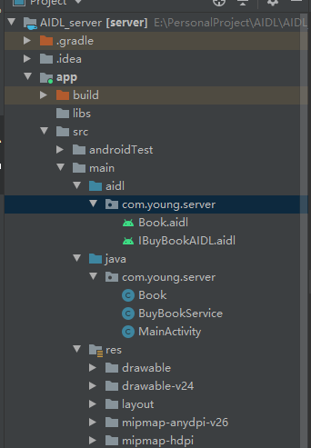
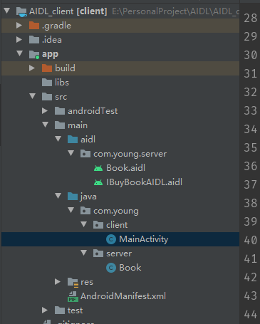

### 一、概述

> AIDL 意思即 Android Interface Definition Language，翻译过来就是Android接口定义语言，是用于定义服务器和客户端通信接口的一种描述语言，可以拿来生成用于IPC的代码。从某种意义上说AIDL其实是一个模板，因为在使用过程中，实际起作用的并不是AIDL文件，而是据此而生成的一个IInterface的实例代码，AIDL其实是为了避免我们重复编写代码而出现的一个模板

设计AIDL这门语言的目的就是为了实现进程间通信。在Android系统中，每个进程都运行在一块独立的内存中，在其中完成自己的各项活动，与其他进程都分隔开来。可是有时候我们又有应用间进行互动的需求，比较传递数据或者任务委托等，AIDL就是为了满足这种需求而诞生的。通过AIDL，可以在一个进程中获取另一个进程的数据和调用其暴露出来的方法，从而满足进程间通信的需求

通常，暴露方法给其他应用进行调用的应用称为**服务端**，调用其他应用的方法的应用称为**客户端**，客户端通过绑定服务端的Service来进行交互

AIDL的语法十分简单，与Java语言基本保持一致，需要记住的规则有以下几点：

1. AIDL文件以 **.aidl** 为后缀名，需要单独建立一个aidl包，且两端的aidl代码都是一致的，包名都是服务端

2. AIDL支持的数据类型分为如下几种：

   - 八种基本数据类型：byte、char、short、int、long、float、double、boolean
   - String，CharSequence
   - 实现了Parcelable接口的数据类型
   - List 类型。List承载的数据必须是AIDL支持的类型，或者是其它声明的AIDL对象
   - Map类型。Map承载的数据必须是AIDL支持的类型，或者是其它声明的AIDL对象

3. AIDL文件可以分为两类。一类用来声明实现了Parcelable接口的数据类型，以供其他AIDL文件使用那些非默认支持的数据类型。还有一类是用来定义接口方法，声明要暴露哪些接口给客户端调用，定向Tag就是用来标注这些方法的参数值

4. 定向Tag。定向Tag表示在跨进程通信中数据的流向，用于标注方法的参数值，分为`` in、out、inout`` 三种。

   - `` in ``表示数据只能由客户端流向服务端.
   - `` out ``表示数据只能由服务端流向客户端
   - `` inout`` 则表示数据可在服务端与客户端之间双向流通。

   此外，如果AIDL方法接口的参数值类型是：基本数据类型、String、CharSequence或者其他AIDL文件定义的方法接口，那么这些参数值的定向 Tag 默认是且只能是 in，所以除了这些类型外，其他参数值都需要明确标注使用哪种定向Tag。定向Tag具体的使用差别后边会有介绍

5. 明确导包。在AIDL文件中需要明确标明引用到的数据类型所在的包名，即使两个文件处在同个包名下

###  二、用法

​	aidl的方法分为服务端代码和客户端代码两种

​	写完AIDL文件后，编译器会帮我们自动生成一个同名的 .java 文件，也是真正实现功能的代码文件，而 .aidl 文件从头到尾都没有出现过。事实上，aidl文件的作	用就是拿来动态生成这些代码，方便使用罢了，如果不用aidl，我们写一遍java代码，照样能够实现功能。

- #### 服务端代码

  新建一个工程，命名为server，创建aidl文件夹，和java同级别，包名和工程包名一致，用androidstudio可以直接创建aidl文件。

  这里我们需要一个Book类，需要Book实体类在两个进程间通信，因为所有需要进程间通信的数据都需要实现IBinder接口，所以这里我们需要创建一个Book.aidl,同时在工程下面创建一个Book实体类。

  

  因为Book类数据传递时需要将其序列化，所以需要Book实体类实现 Parcelable 接口

  ```java
  public class Book implements Parcelable {
      private String name;
      private int price;
  
      public Book(String name, int price) {
          this.name = name;
          this.price = price;
      }
  
      public String getName() {
          return name;
      }
  
      public void setName(String name) {
          this.name = name;
      }
  
      public int getPrice() {
          return price;
      }
  
      public void setPrice(int price) {
          this.price = price;
      }
  
      @Override
      public int describeContents() {
          return 0;
      }
  
      @Override
      public void writeToParcel(Parcel dest, int flags) {
          dest.writeString(this.name);
          dest.writeInt(this.price);
      }
  
      protected Book(Parcel in) {
          this.name = in.readString();
          this.price = in.readInt();
      }
  
      public static final Parcelable.Creator<Book> CREATOR = new Parcelable.Creator<Book>() {
          @Override
          public Book createFromParcel(Parcel source) {
              return new Book(source);
          }
  
          @Override
          public Book[] newArray(int size) {
              return new Book[size];
          }
      };
  }
  
  ```

  现在再来修改 Book.aidl 文件，将之改为声明Parcelable数据类型的AIDL文件

  ```java
  // Book.aidl
  package com.young.server;
  
  parcelable Book;
  ```

  设计两个方法，一是客户端从服务器端获取图书列表，另一个是客户端输入书名，服务端返回价格。

  ```java
  // IBuyBookAIDL.aidl
  package com.young.server;
  //需要手动导入包
  import com.young.server.Book;
  interface IBuyBookAIDL {
      List<Book> getBookList();
  	//这里的inout就是tag，下面会说到
      int buyBook(inout String name);
  }
  
  ```

  在进程间通信的并不是AIDL文件，而是系统依据AIDL文件动态生成的文件，可以在build中查看到

  ```java
  //可以看到继承了IInterface这个接口，
  public interface IBuyBookAIDL extends android.os.IInterface这个接口，
  {
    /** Default implementation for IBuyBookAIDL. */
    public static class Default implements com.young.server.IBuyBookAIDL
    {
      @Override public java.util.List<com.young.server.Book> getBookList() throws android.os.RemoteException
      {
        return null;
      }
      @Override public int buyBook(java.lang.String name) throws android.os.RemoteException
      {
        return 0;
      }
      @Override
      public android.os.IBinder asBinder() {
        return null;
      }
    }
    /** Local-side IPC implementation stub class. */
    public static abstract class Stub extends android.os.Binder implements com.young.server.IBuyBookAIDL
    {
      private static final java.lang.String DESCRIPTOR = "com.young.server.IBuyBookAIDL";
      /** Construct the stub at attach it to the interface. */
      public Stub()
      {
        this.attachInterface(this, DESCRIPTOR);
      }
      /**
       * Cast an IBinder object into an com.young.server.IBuyBookAIDL interface,
       * generating a proxy if needed.
       */
      public static com.young.server.IBuyBookAIDL asInterface(android.os.IBinder obj)
      {
        if ((obj==null)) {
          return null;
        }
        android.os.IInterface iin = obj.queryLocalInterface(DESCRIPTOR);
        if (((iin!=null)&&(iin instanceof com.young.server.IBuyBookAIDL))) {
          return ((com.young.server.IBuyBookAIDL)iin);
        }
        return new com.young.server.IBuyBookAIDL.Stub.Proxy(obj);
      }
      @Override public android.os.IBinder asBinder()
      {
        return this;
      }
      @Override public boolean onTransact(int code, android.os.Parcel data, android.os.Parcel reply, int flags) throws android.os.RemoteException
      {
        java.lang.String descriptor = DESCRIPTOR;
        switch (code)
        {
          case INTERFACE_TRANSACTION:
          {
            reply.writeString(descriptor);
            return true;
          }
          case TRANSACTION_getBookList:
          {
            data.enforceInterface(descriptor);
            java.util.List<com.young.server.Book> _result = this.getBookList();
            reply.writeNoException();
            reply.writeTypedList(_result);
            return true;
          }
          case TRANSACTION_buyBook:
          {
            data.enforceInterface(descriptor);
            java.lang.String _arg0;
            _arg0 = data.readString();
            int _result = this.buyBook(_arg0);
            reply.writeNoException();
            reply.writeInt(_result);
            return true;
          }
          default:
          {
            return super.onTransact(code, data, reply, flags);
          }
        }
      }
      private static class Proxy implements com.young.server.IBuyBookAIDL
      {
        private android.os.IBinder mRemote;
        Proxy(android.os.IBinder remote)
        {
          mRemote = remote;
        }
        @Override public android.os.IBinder asBinder()
        {
          return mRemote;
        }
        public java.lang.String getInterfaceDescriptor()
        {
          return DESCRIPTOR;
        }
        @Override public java.util.List<com.young.server.Book> getBookList() throws android.os.RemoteException
        {
          android.os.Parcel _data = android.os.Parcel.obtain();
          android.os.Parcel _reply = android.os.Parcel.obtain();
          java.util.List<com.young.server.Book> _result;
          try {
            _data.writeInterfaceToken(DESCRIPTOR);
            boolean _status = mRemote.transact(Stub.TRANSACTION_getBookList, _data, _reply, 0);
            if (!_status && getDefaultImpl() != null) {
              return getDefaultImpl().getBookList();
            }
            _reply.readException();
            _result = _reply.createTypedArrayList(com.young.server.Book.CREATOR);
          }
          finally {
            _reply.recycle();
            _data.recycle();
          }
          return _result;
        }
        @Override public int buyBook(java.lang.String name) throws android.os.RemoteException
        {
          android.os.Parcel _data = android.os.Parcel.obtain();
          android.os.Parcel _reply = android.os.Parcel.obtain();
          int _result;
          try {
            _data.writeInterfaceToken(DESCRIPTOR);
            _data.writeString(name);
            boolean _status = mRemote.transact(Stub.TRANSACTION_buyBook, _data, _reply, 0);
            if (!_status && getDefaultImpl() != null) {
              return getDefaultImpl().buyBook(name);
            }
            _reply.readException();
            _result = _reply.readInt();
          }
          finally {
            _reply.recycle();
            _data.recycle();
          }
          return _result;
        }
        public static com.young.server.IBuyBookAIDL sDefaultImpl;
      }
      static final int TRANSACTION_getBookList = (android.os.IBinder.FIRST_CALL_TRANSACTION + 0);
      static final int TRANSACTION_buyBook = (android.os.IBinder.FIRST_CALL_TRANSACTION + 1);
      public static boolean setDefaultImpl(com.young.server.IBuyBookAIDL impl) {
        if (Stub.Proxy.sDefaultImpl == null && impl != null) {
          Stub.Proxy.sDefaultImpl = impl;
          return true;
        }
        return false;
      }
      public static com.young.server.IBuyBookAIDL getDefaultImpl() {
        return Stub.Proxy.sDefaultImpl;
      }
    }
    public java.util.List<com.young.server.Book> getBookList() throws android.os.RemoteException;
    public int buyBook(java.lang.String name) throws android.os.RemoteException;
  }
  
  ```

  现在需要来创建一个 Service 供客户端远程绑定了，这里命名为 BuyBookService

  ```java
  public class BuyBookService extends Service {
      private static final String TAG = "BuyBookService";
      private List<Book> bookList;
  
      @Override
      public void onCreate() {
          super.onCreate();
          bookList = new ArrayList<>();
          Book book1 = new Book("Android开发", 79);
          Book book2 = new Book("Java开发", 88);
          Book book3 = new Book("JVM调优", 100);
          Book book4 = new Book("算法导论", 110);
          Book book5 = new Book("护发宝典", 999);
          Book book6 = new Book("外卖路线规划", 6666);
          bookList.add(book1);
          bookList.add(book2);
          bookList.add(book3);
          bookList.add(book4);
          bookList.add(book5);
          bookList.add(book6);
      }
  
      @Nullable
      @Override
      public IBinder onBind(Intent intent) {
          return stub;
      }
  
      private final IBuyBookAIDL.Stub stub = new IBuyBookAIDL.Stub() {
          @Override
          public List<Book> getBookList() throws RemoteException {
              return bookList;
          }
  
          @Override
          public int buyBook(String name) throws RemoteException {
              for (Book book : bookList) {
                  if (book.getName().equals(name)) {
                      return book.getPrice();
                  }
              }
              return 0;
          }
      };
  }
  ```

  最后，服务端还有一个地方需要注意，因为服务端的Service需要被客户端来远程绑定，所以客户端要能够找到这个Service，可以通过先指定包名，之后再配置Action值或者直接指定Service类名的方式来绑定Service 如果是通过指定Action值的方式来绑定Service，那还需要将Service的声明改为如下所示：

  ```xml
  		<service
              android:name=".BuyBookService"
              android:enabled="true"
              android:exported="true">
              <intent-filter>
                  <action android:name="com.young.server.action" />
                  <category android:name="android.intent.category.DEFAULT" />
              </intent-filter>
          </service>
  ```

  

- #### 客户端代码

  首先需要把服务端的aidl文件拷贝到客户端中，层级一样，代码也无需改动。

  接着需要创建一个相同的Book实体类，但是注意Book类的包名要和服务端的一致

  


```java
public class MainActivity extends AppCompatActivity {
    private static final String TAG = "MainActivity";
    private IBuyBookAIDL buyBookAIDL;
    private List<Book> bookList;
    private boolean isConnect;

    @Override
    protected void onCreate(Bundle savedInstanceState) {
        super.onCreate(savedInstanceState);
        setContentView(R.layout.activity_main);
        findViewById(R.id.book_list_btn).setOnClickListener(v -> {
            if (isConnect) {
                try {
                    bookList = buyBookAIDL.getBookList();
                    for (int i = 0; i < bookList.size(); i++) {
                        Log.i(TAG, "书籍列表: " + bookList.get(i));
                    }

                } catch (RemoteException e) {
                    e.printStackTrace();
                }
            }
        });
        findViewById(R.id.buy_book_btn).setOnClickListener(v -> {
            if (isConnect && bookList.size() > 0) {
                try {
                    Book book = bookList.get(new Random().nextInt(bookList.size()));
                    Log.i(TAG, book.getName() + "的价格是:" + buyBookAIDL.buyBook(book.getName()));
                } catch (RemoteException e) {
                    e.printStackTrace();
                }
            }
        });
		//和服务端的service进行绑定
        Intent intent = new Intent();
        intent.setPackage("com.young.server");
        intent.setAction("com.young.server.action");
        bindService(intent, serviceConnection, Context.BIND_AUTO_CREATE);

    }
	//这里的service就是server那边传过来的IBuyBookAIDL。
    private ServiceConnection serviceConnection = new ServiceConnection() {
        @Override
        public void onServiceConnected(ComponentName name, IBinder service) {
            buyBookAIDL = IBuyBookAIDL.Stub.asInterface(service);
            isConnect = true;
        }

        @Override
        public void onServiceDisconnected(ComponentName name) {
            isConnect = false;
        }
    };

    @Override
    protected void onDestroy() {
        super.onDestroy();
        if (isConnect) {
            unbindService(serviceConnection);
        }
    }
}

```

输出结果：

```java
2020-06-19 16:20:33.746 21798-21798/com.young.client I/MainActivity: 书籍列表: com.young.server.Book@af3fe7b
2020-06-19 16:20:33.746 21798-21798/com.young.client I/MainActivity: 书籍列表: com.young.server.Book@f8f0498
2020-06-19 16:20:33.746 21798-21798/com.young.client I/MainActivity: 书籍列表: com.young.server.Book@8db74f1
2020-06-19 16:20:33.747 21798-21798/com.young.client I/MainActivity: 书籍列表: com.young.server.Book@67868d6
2020-06-19 16:20:33.747 21798-21798/com.young.client I/MainActivity: 书籍列表: com.young.server.Book@cba0757
2020-06-19 16:20:33.747 21798-21798/com.young.client I/MainActivity: 书籍列表: com.young.server.Book@dbbd244
2020-06-19 16:20:34.529 21798-21798/com.young.client I/MainActivity: JVM调优的价格是:100
2020-06-19 16:20:35.772 21798-21798/com.young.client I/MainActivity: Android开发的价格是:79
2020-06-19 16:20:36.392 21798-21798/com.young.client I/MainActivity: 算法导论的价格是:110
```

### 定向Tag

定向tag就是上面使用的inout关键字，一共有三种in，out，inout

-  InOut 类型，服务端对数据的改变同时也同步到了客户端，因此可以说两者之间数据是双向流动的

- In 类型的表现形式是：数据只能由客户端传向服务端，服务端对数据的修改不会影响到客户端

- Out类型的表现形式是：数据只能由服务端传向客户端，即使客户端向方法接口传入了一个对象，该对象中的属性值也是为空的，但是不为null，只是内容是空的，即不包含任何数据，服务端获取到该对象后，对该对象的任何操作，就会同步到客户端这边

  因为会传递一个空数据的对象过去，所以需要实例化一个无参的构造函数，所以要在Book实体类中添加一个无参构造函数以供系统使用


