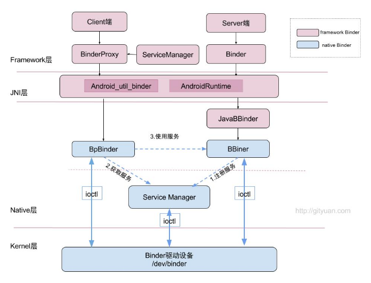
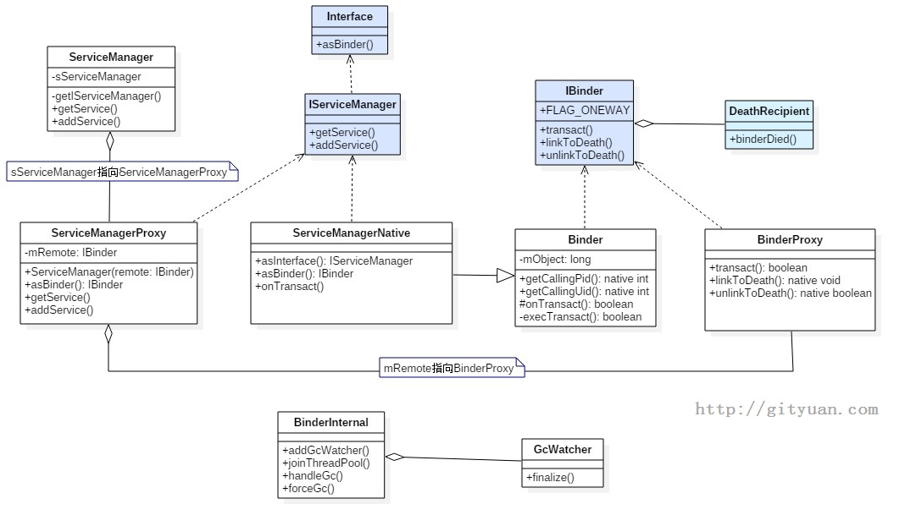

```
    // gNativeDataCache is now logically empty.
664    jobject object = env->CallStaticObjectMethod(gBinderProxyOffsets.mClass,
665            gBinderProxyOffsets.mGetInstance, (jlong) nativeData, (jlong) val.get());
666    if (env->ExceptionCheck()) {
667        // In the exception case, getInstance still took ownership of nativeData.
668        gNativeDataCache = nullptr;
669        return NULL;
670    }
671    BinderProxyNativeData* actualNativeData = getBPNativeData(env, object);
672    if (actualNativeData == nativeData) {
673        // New BinderProxy; we still have exclusive access.
674        nativeData->mOrgue = new DeathRecipientList;
675        nativeData->mObject = val;
676        gNativeDataCache = nullptr;
```

```
public final class BinderProxy implements IBinder {
/**
 * C++ pointer to BinderProxyNativeData. That consists of strong pointers to the
 * native IBinder object, and a DeathRecipientList.
 */
private final long mNativeData;
```


.相关源码

#### framework/base/core/java/android/os/  

- IInterface.java  
- IServiceManager.java  
- ServiceManager.java  
- ServiceManagerNative.java(内含ServiceManagerProxy类)

#### framework/base/core/java/android/os/

- IBinder.java  

- Binder.java(内含BinderProxy类) 
-  - Parcel.java

#### framework/base/core/java/com/android/internal/os/ 

- BinderInternal.java

####  framework/base/core/jni/  

- AndroidRuntime.cpp  

- android_os_Parcel.cpp 

- android_util_Binder.cpp

## 一、概述

  ### 1.1 Binder架构

  binder在framework层，采用JNI技术来调用native(C/C++)层的binder架构，从而为上层应用程序提供服务。 看过binder系列之前的文章，我们知道native层中，binder是C/S架构，分为Bn端(Server)和Bp端(Client)。对于java层在命名与架构上非常相近，同样实现了一套IPC通信架构。



- 图中红色代表整个framework层 binder架构相关组件；
  - Binder类代表Server端，BinderProxy类代码Client端；
- 图中蓝色代表Native层Binder架构相关组件；
- 上层framework层的Binder逻辑是建立在Native层架构基础之上的，核心逻辑都是交予Native层方法来处理。
- framework层的ServiceManager类与Native层的功能并不完全对应，framework层的ServiceManager类的实现最终是通过BinderProxy传递给Native层来完成的，后面会详细说明。



图解：(图中浅蓝色都是Interface，其余都是Class)

1. **ServiceManager：**通过getIServiceManager方法获取的是ServiceManagerProxy对象； ServiceManager的addService, getService实际工作都交由ServiceManagerProxy的相应方法来处理；
2. **ServiceManagerProxy：**其成员变量mRemote指向BinderProxy对象，ServiceManagerProxy的addService, getService方法最终是交由mRemote来完成。
3. **ServiceManagerNative**：其方法asInterface()返回的是ServiceManagerProxy对象，ServiceManager便是借助ServiceManagerNative类来找到ServiceManagerProxy；
4. **Binder：**其成员变量mObject和方法execTransact()用于native方法
5. **BinderInternal：**内部有一个GcWatcher类，用于处理和调试与Binder相关的垃圾回收。
6. **IBinder：**接口中常量FLAG_ONEWAY：客户端利用binder跟服务端通信是阻塞式的，但如果设置了FLAG_ONEWAY，这成为非阻塞的调用方式，客户端能立即返回，服务端采用回调方式来通知客户端完成情况。另外IBinder接口有一个内部接口DeathDecipient(死亡通告)。

## 二、源码实现