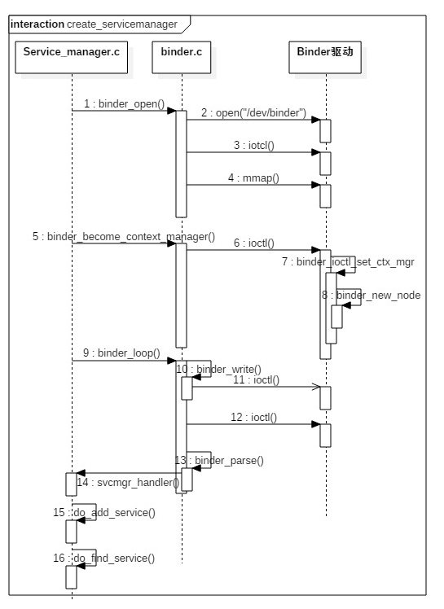
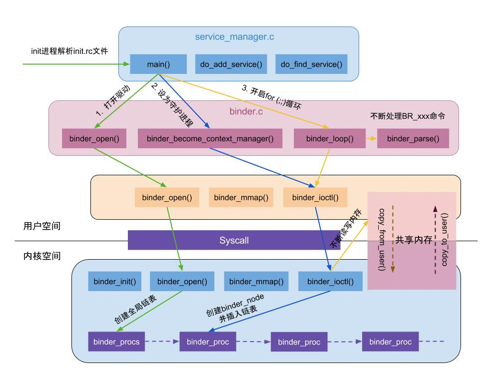

```java
https://www.androidos.net.cn/android/10.0.0_r6/xref/frameworks/native/cmds/servicemanager
frameworks/native/cmds/servicemanager/
  - service_manager.c
  - binder.c
  
https://www.androidos.net.cn/androidkernel/4.4/xref/drivers/android
kernel/drivers/ (不同Linux分支路径略有不同)
  - staging/android/binder.c
  - android/binder.c 
```

## 1.概述

ServiceManager是Binder IPC通信过程中的守护进程，本身也是一个Binder服务，但并没有采用libbinder中的多线程模型来与Binder驱动通信，而是自行编写了binder.c直接和Binder驱动来通信，并且只有一个循环binder_loop来进行读取和处理事务，这样的好处是简单而高效。

ServiceManager本身工作相对简单，其功能：查询和注册服务。 对于Binder IPC通信过程中，其实更多的情形是BpBinder和BBinder之间的通信，比如ActivityManagerProxy和ActivityManagerService之间的通信等。



启动过程主要以下几个阶段：

1. 打开binder驱动：binder_open；
2. 注册成为binder服务的大管家：binder_become_context_manager；
3. 进入无限循环，处理client端发来的请求：binder_loop；



## 二. 启动过程

ServiceManager是由[init进程](http://gityuan.com/2016/02/05/android-init/)通过解析init.rc文件而创建的，其所对应的可执行程序/system/bin/servicemanager，所对应的源文件是``service_manager.c``，进程名为``/system/bin/servicemanager``。

启动Service Manager的入口函数是service_manager.c中的main()方法，代码如下：

### 2.1 [Main](https://www.androidos.net.cn/android/10.0.0_r6/xref/frameworks/native/cmds/servicemanager/service_manager.c)

> frameworks/native/cmds/servicemanager/service_manager.c

```c++
int main(int argc, char** argv)
{
    struct binder_state *bs;
    union selinux_callback cb;
    char *driver;
	//系统启动，这里没有参数，所以   driver = "/dev/binder";
    if (argc > 1) {
        driver = argv[1];
    } else {
        driver = "/dev/binder";
    }
    //打开binder驱动，申请128k字节大小的内存空间 【见小节2.2】
    bs = binder_open(driver, 128*1024);
    if (!bs) {
...
     //成为上下文管理者 【见小节2.3】
    if (binder_become_context_manager(bs)) {
        ALOGE("cannot become context manager (%s)\n", strerror(errno));
        return -1;
    }

   ...
 //通过函数 selinux_android_service_context_handle 获取sehandler指针，也就是得到selinux的操作对象
#ifdef VENDORSERVICEMANAGER
    sehandle = selinux_android_vendor_service_context_handle();
#else
    sehandle = selinux_android_service_context_handle();
#endif
    selinux_status_open(true);

    if (sehandle == NULL) {
        ALOGE("SELinux: Failed to acquire sehandle. Aborting.\n");
        abort();
    }

    if (getcon(&service_manager_context) != 0) {
        ALOGE("SELinux: Failed to acquire service_manager context. Aborting.\n");
        //无法获取service_manager上下文
        abort();
    }

 	//进入无限循环，处理client端发来的请求 【见小节2.4】
    //svcmgr_handler是一个处理接收到消息的方法。
    //处理SVC_MGR_GET_SERVICE，SVC_MGR_CHECK_SERVICE，SVC_MGR_ADD_SERVICE等消息
    binder_loop(bs, svcmgr_handler);

    return 0;
}c
```

### 2.2 [binder_open](https://www.androidos.net.cn/android/10.0.0_r6/xref/frameworks/native/cmds/servicemanager/binder.c)

> frameworks/native/cmds/servicemanager/binder.c

这里的binder.c文件是和和内核中的binder.c文件沟通的桥梁

```c++
struct binder_state
{
    int fd; // dev/binder的文件描述符
    void *mapped; //指向mmap的内存地址
    size_t mapsize; //分配的内存大小，默认为128KB
};
struct binder_state *binder_open(const char* driver, size_t mapsize)
{
    struct binder_state *bs;
    struct binder_version vers;
	//分配所需的内存空间，并返回一个指向它的指针。TODO
    bs = malloc(sizeof(*bs));
    if (!bs) {
        errno = ENOMEM;
        return NULL;
    }
  	//通过系统调用陷入内核，打开Binder设备驱动
    bs->fd = open(driver, O_RDWR | O_CLOEXEC);
    if (bs->fd < 0) {
        fprintf(stderr,"binder: cannot open %s (%s)\n",
                driver, strerror(errno));
        goto fail_open;
    }
	 //通过系统调用，ioctl获取binder版本信息	
    if ((ioctl(bs->fd, BINDER_VERSION, &vers) == -1) ||
        (vers.protocol_version != BINDER_CURRENT_PROTOCOL_VERSION)) {
        fprintf(stderr,
                "binder: kernel driver version (%d) differs from user space version (%d)\n",
                vers.protocol_version, BINDER_CURRENT_PROTOCOL_VERSION);
        goto fail_open;
    }
    //通过系统调用，mmap内存映射，mmap必须是page的整数倍
    bs->mapsize = mapsize;//128K
    bs->mapped = mmap(NULL, mapsize, PROT_READ, MAP_PRIVATE, bs->fd, 0);
    if (bs->mapped == MAP_FAILED) {
        fprintf(stderr,"binder: cannot map device (%s)\n",
                strerror(errno));
        goto fail_map;
    }

    return bs;

fail_map:
    close(bs->fd);
fail_open:
    free(bs);
    return NULL;
}
```

打开binder驱动相关操作:

先调用open()打开binder设备，open()方法经过系统调用，进入Binder驱动，然后调用方法[binder_open()](http://gityuan.com/2015/11/01/binder-driver/#binderopen)，该方法会在Binder驱动层创建一个`binder_proc`对象，再将`binder_proc`对象赋值给fd->private_data，同时放入全局链表`binder_procs`。再通过ioctl()检验当前binder版本与Binder驱动层的版本是否一致。

调用mmap()进行内存映射，同理mmap()方法经过系统调用，对应于Binder驱动层的[binder_mmap()](http://gityuan.com/2015/11/01/binder-driver/#bindermmap)方法，该方法会在Binder驱动层创建`Binder_buffer`对象，并放入当前binder_proc的`proc->buffers`链表。

### 2.2 [binder_become_context_manager](https://www.androidos.net.cn/android/10.0.0_r6/xref/frameworks/native/cmds/servicemanager/service_manager.c)

> frameworks/native/cmds/servicemanager/service_manager.c

```c++
int binder_become_context_manager(struct binder_state *bs)
{
    //通过ioctl，传递BINDER_SET_CONTEXT_MGR指令【见小节2.3.1】
    return ioctl(bs->fd, BINDER_SET_CONTEXT_MGR, 0);
}
```

成为上下文的管理者，整个系统中只有一个这样的管理者。 通过ioctl()方法经过系统调用，对应于Binder驱动层的[binder_ioctl()](http://gityuan.com/2015/11/01/binder-driver/#binderioctl)方法.

### 2.3 [binder_ioctl](https://www.androidos.net.cn/androidkernel/4.4/xref/drivers/android)

> kernel/drivers/android/binder.c

```c++
static long binder_ioctl(struct file *filp, unsigned int cmd, unsigned long arg)
{
	int ret;
	struct binder_proc *proc = filp->private_data;
	struct binder_thread *thread;
	unsigned int size = _IOC_SIZE(cmd);
	void __user *ubuf = (void __user *)arg;
	/*pr_info("binder_ioctl: %d:%d %x %lx\n",
			proc->pid, current->pid, cmd, arg);*/
	binder_selftest_alloc(&proc->alloc);
	trace_binder_ioctl(cmd, arg);
	ret = wait_event_interruptible(binder_user_error_wait, binder_stop_on_user_error < 2);
	if (ret)
		goto err_unlocked;
	thread = binder_get_thread(proc);
	if (thread == NULL) {
		ret = -ENOMEM;
		goto err;
	}
	switch (cmd) {
	case BINDER_WRITE_READ:
	...
	case BINDER_SET_MAX_THREADS: {
	...
	case BINDER_SET_CONTEXT_MGR_EXT: {
		...
	case BINDER_SET_CONTEXT_MGR:
        //见2.4小节
		ret = binder_ioctl_set_ctx_mgr(filp, NULL);
		if (ret)
			goto err;
		break;
	case BINDER_THREAD_EXIT:
		...
	case BINDER_VERSION: {
		...
	case BINDER_GET_NODE_INFO_FOR_REF: {
	...
	case BINDER_GET_NODE_DEBUG_INFO: {
		...
	default:
		ret = -EINVAL;
		goto err;
	}
	ret = 0;
...
	trace_binder_ioctl_done(ret);
	return ret;
}
```

### 2.4 binder_ioctl_set_ctx_mgr

> kernel/drivers/android/binder.c

```c++
struct binder_context {
	struct binder_node *binder_context_mgr_node;
	struct mutex context_mgr_node_lock;
	kuid_t binder_context_mgr_uid;
	const char *name;
};
static int binder_ioctl_set_ctx_mgr(struct file *filp,
				    struct flat_binder_object *fbo)
{
	int ret = 0;
    //先获得Binder驱动程序为service_manager进程创建的binder_prop结构体，并且保存在变量指针proc中
	struct binder_proc *proc = filp->private_data;
	//从proc中获取binder的上下文变量指针context;
    struct binder_context *context = proc->context;
    //新建binder_node节点。
	struct binder_node *new_node;
    //获取当前的service_manager的euid
	kuid_t curr_euid = current_euid();
    //开始加锁
	mutex_lock(&context->context_mgr_node_lock);
    //变量binder_context_mgr_node用来描述与Binder进程间通信机制的上下文管理者相对应的一个Binder实体对象，如果它不等于NULL，
	//那么说明前面已经有组件将自己注册为Binder进程间通信机制的上下文管理者了。由于Binder驱动程序不允许重复注册Binder进程间通信
	//机制的上下文管理者，因此，在这种情况下，它就直接出错返回了。
	if (context->binder_context_mgr_node) {
		pr_err("BINDER_SET_CONTEXT_MGR already set\n");
		ret = -EBUSY;
		goto out;
	}
    //检查当前进程是否具有注册Context Manager的SEAndroid安全权限，该函数在：kernel4.4/security/security.c中定义
	ret = security_binder_set_context_mgr(proc->tsk);
	if (ret < 0)
		goto out;
	if (uid_valid(context->binder_context_mgr_uid)) {
		...
	} else {
        //设置当前线程euid作为Service Manager的uid
		context->binder_context_mgr_uid = curr_euid;
	}
    //调用函数binder_new_node创建一个new_node对象
	new_node = binder_new_node(proc, fbo);
	if (!new_node) {
		ret = -ENOMEM;
		goto out;
	}
    //开始锁住新的节点
	binder_node_lock(new_node);
	new_node->local_weak_refs++;
	new_node->local_strong_refs++;
	new_node->has_strong_ref = 1;
	new_node->has_weak_ref = 1;
	context->binder_context_mgr_node = new_node;
    //解锁新的节点；
	binder_node_unlock(new_node);
    //将new_node移除和释放
	binder_put_node(new_node);
out:
    //解锁，随意前面的mutex_lock
	mutex_unlock(&context->context_mgr_node_lock);
	return ret;
}
```

### 2.5 binder_new_node

> kernel/drivers/android/binder.c

```c++
static struct binder_node *binder_new_node(struct binder_proc *proc,
					   struct flat_binder_object *fp)
{
	struct binder_node *node;
    //分配内核空间
	struct binder_node *new_node = kzalloc(sizeof(*node), GFP_KERNEL);
	if (!new_node)
		return NULL;
	binder_inner_proc_lock(proc);
    //判断该node是否之前已经被创建过了
	node = binder_init_node_ilocked(proc, new_node, fp);
	binder_inner_proc_unlock(proc);
	if (node != new_node)
		/*
		 * The node was already added by another thread
		 */
		kfree(new_node);
	return node;
}
```

## 3 binder_loop

> frameworks/native/cmds/servicemanager/binder.c

```c++
void binder_loop(struct binder_state *bs, binder_handler func)
{
    int res;
    //声明一个binder的读写结构体对象
    struct binder_write_read bwr;
    ///读的缓存为32
    uint32_t readbuf[32];
	//bwr.write_size=0，而bwr.read_size>0；表示只会从Binder驱动读取数据，而并不会向Binder驱动中写入数据
    bwr.write_size = 0;
    bwr.write_consumed = 0;
    bwr.write_buffer = 0;

    readbuf[0] = BC_ENTER_LOOPER;
    //将BC_ENTER_LOOPER命令发送给binder驱动，让Service Manager进入循环 【见小节2.6】
    binder_write(bs, readbuf, sizeof(uint32_t));
	
    for (;;) {
        bwr.read_size = sizeof(readbuf);
        bwr.read_consumed = 0;
        bwr.read_buffer = (uintptr_t) readbuf;
    	
        //binder_ioctl函数->binder_ioctl_write_read函数
		//路径：kernel/drivers/android/binder.c
        res = ioctl(bs->fd, BINDER_WRITE_READ, &bwr);

        if (res < 0) {
            ALOGE("binder_loop: ioctl failed (%s)\n", strerror(errno));
            break;
        }
		//解析binder，调用　svcmgr_handler　的回调函数,就是前面
        //处理SVC_MGR_GET_SERVICE，SVC_MGR_CHECK_SERVICE，SVC_MGR_ADD_SERVICE等消息
        res = binder_parse(bs, 0, (uintptr_t) readbuf, bwr.read_consumed, func);
        if (res == 0) {
            ALOGE("binder_loop: unexpected reply?!\n");
            break;
        }
        if (res < 0) {
            ALOGE("binder_loop: io error %d %s\n", res, strerror(errno));
            break;
        }
    }
}
```

代码中，首先将BC_ENTER_LOOPER协议代码写入到缓冲区readbuf中，接着调用函数binder_write将它发送到Binder驱动程序中。函数binder_write的实现如下所示：

### 3.1  binder_write

> frameworks/native/cmds/servicemanager/binder.c

```c++
int binder_write(struct binder_state *bs, void *data, size_t len)
{
    struct binder_write_read bwr;
    int res;

    bwr.write_size = len;
    bwr.write_consumed = 0;
    //此处data为BC_ENTER_LOOPER
    bwr.write_buffer = (uintptr_t) data;
    bwr.read_size = 0;
    bwr.read_consumed = 0;
    bwr.read_buffer = 0;
    res = ioctl(bs->fd, BINDER_WRITE_READ, &bwr);
    if (res < 0) {
        fprintf(stderr,"binder_write: ioctl failed (%s)\n",
                strerror(errno));
    }
    return res;
}
```

根据传递进来的参数，初始化bwr，其中write_size大小为4，write_buffer指向缓冲区的起始地址，其内容为BC_ENTER_LOOPER请求协议号。通过ioctl将bwr数据发送给binder驱动，则调用其binder_ioctl方法，如下：

#### 3.1.1 [binder_ioctl](https://www.androidos.net.cn/androidkernel/4.4/xref/drivers/android)

> kernel/drivers/android/binder.c

```c++
static long binder_ioctl(struct file *filp, unsigned int cmd, unsigned long arg)
{
	int ret;
	struct binder_proc *proc = filp->private_data;
	struct binder_thread *thread;
	unsigned int size = _IOC_SIZE(cmd);
	void __user *ubuf = (void __user *)arg;
	binder_selftest_alloc(&proc->alloc);
	trace_binder_ioctl(cmd, arg);
	ret = wait_event_interruptible(binder_user_error_wait, binder_stop_on_user_error < 2);
	if (ret)
		goto err_unlocked;
    //根据当前进程的proc获取处理消息的binder_thread
	thread = binder_get_thread(proc);
	...
	switch (cmd) {
	case BINDER_WRITE_READ:
        //进行binder的读写操作
		ret = binder_ioctl_write_read(filp, cmd, arg, thread);
		if (ret)
			goto err;
		break;
...
	trace_binder_ioctl_done(ret);
	return ret;
}
```

#### 3.1.2 [binder_ioctl_write_read](https://www.androidos.net.cn/androidkernel/4.4/xref/drivers/android)

> kernel/drivers/android/binder.c

```c++
static int binder_ioctl_write_read(struct file *filp,
				unsigned int cmd, unsigned long arg,
				struct binder_thread *thread)
{
	int ret = 0;
	struct binder_proc *proc = filp->private_data;
	unsigned int size = _IOC_SIZE(cmd);
	void __user *ubuf = (void __user *)arg;
	struct binder_write_read bwr;
	if (size != sizeof(struct binder_write_read)) {
		ret = -EINVAL;
		goto out;
	}
    //把用户空间数据ubuf拷贝到bwr
	if (copy_from_user(&bwr, ubuf, sizeof(bwr))) {
		ret = -EFAULT;
		goto out;
	}

	if (bwr.write_size > 0) {
		ret = binder_thread_write(proc, thread,
					  bwr.write_buffer,
					  bwr.write_size,
					  &bwr.write_consumed);
		...
	}
	if (bwr.read_size > 0) {
		ret = binder_thread_read(proc, thread, bwr.read_buffer,
					 bwr.read_size,
					 &bwr.read_consumed,
					 filp->f_flags & O_NONBLOCK);
		...
	}
...
	return ret;
}
```

此处将用户空间的binder_write_read结构体 拷贝到内核空间.

#### 3.1.3 [binder_thread_write](https://www.androidos.net.cn/androidkernel/4.4/xref/drivers/android)

> kernel/drivers/android/binder.c

```c++
static int binder_thread_write(struct binder_proc *proc,
			struct binder_thread *thread,
			binder_uintptr_t binder_buffer, size_t size,
			binder_size_t *consumed)
{
	uint32_t cmd;
	struct binder_context *context = proc->context;
	void __user *buffer = (void __user *)(uintptr_t)binder_buffer;
	void __user *ptr = buffer + *consumed;
	void __user *end = buffer + size;
	while (ptr < end && thread->return_error.cmd == BR_OK) {
		int ret;
		if (get_user(cmd, (uint32_t __user *)ptr))
			return -EFAULT;
		ptr += sizeof(uint32_t);
		trace_binder_command(cmd);
		if (_IOC_NR(cmd) < ARRAY_SIZE(binder_stats.bc)) {
			atomic_inc(&binder_stats.bc[_IOC_NR(cmd)]);
			atomic_inc(&proc->stats.bc[_IOC_NR(cmd)]);
			atomic_inc(&thread->stats.bc[_IOC_NR(cmd)]);
		}
		switch (cmd) {
        //这里处理很多case
		case BC_ENTER_LOOPER:
			
			if (thread->looper & BINDER_LOOPER_STATE_REGISTERED) {
				thread->looper |= BINDER_LOOPER_STATE_INVALID;
				binder_user_error("%d:%d ERROR: BC_ENTER_LOOPER called after BC_REGISTER_LOOPER\n",
					proc->pid, thread->pid);
			}
            //设置该线程的looper状态
			thread->looper |= BINDER_LOOPER_STATE_ENTERED;
			break;
		default:
			pr_err("%d:%d unknown command %d\n",
			       proc->pid, thread->pid, cmd);
			return -EINVAL;
		}
		*consumed = ptr - buffer;
	}
	return 0;
}

```

从bwr.write_buffer拿出cmd数据,此处为BC_ENTER_LOOPER. 可见上层本次调用binder_write()方法，主要是完成设置当前线程的looper状态为BINDER_LOOPER_STATE_ENTERED。

binder_write函数会调用 ioctl 发送 BC_ENTER_LOOPER 命令告诉 binder 驱动当前线程已进入消息循环状态。
接下来的死循环，从 binder 驱动读取消息到 &bwr，如果没有消息就会阻塞直到被唤醒，读取到消息后再调用

### 3.2  binder_parse

> frameworks/native/cmds/servicemanager/binder.c

```c++
int binder_parse(struct binder_state *bs, struct binder_io *bio,
                 uintptr_t ptr, size_t size, binder_handler func)
{
    int r = 1;
    uintptr_t end = ptr + (uintptr_t) size;

    while (ptr < end) {
        uint32_t cmd = *(uint32_t *) ptr;
        ptr += sizeof(uint32_t);
#if TRACE
        fprintf(stderr,"%s:\n", cmd_name(cmd));
#endif
        switch(cmd) {
        case BR_NOOP:
            break;
        case BR_TRANSACTION_COMPLETE:
            break;
        case BR_INCREFS:
        case BR_ACQUIRE:
        case BR_RELEASE:
        case BR_DECREFS:
#if TRACE
            fprintf(stderr,"  %p, %p\n", (void *)ptr, (void *)(ptr + sizeof(void *)));
#endif
            ptr += sizeof(struct binder_ptr_cookie);
            break;
        case BR_TRANSACTION_SEC_CTX:
         //最主要就是处理这个事件
        case BR_TRANSACTION: {
            struct binder_transaction_data_secctx txn;
          ...
            binder_dump_txn(&txn.transaction_data);
            if (func) {
                unsigned rdata[256/4];
                struct binder_io msg;
                struct binder_io reply;
                int res;

                bio_init(&reply, rdata, sizeof(rdata), 4);
                bio_init_from_txn(&msg, &txn.transaction_data);
                res = func(bs, &txn, &msg, &reply);
                //如果是异步，不需要返回就直接清空缓存，否则需要send_reply
                if (txn.transaction_data.flags & TF_ONE_WAY) {
                    binder_free_buffer(bs, txn.transaction_data.data.ptr.buffer);
                } else {
                    binder_send_reply(bs, &reply, txn.transaction_data.data.ptr.buffer, res);
                }
            }
            break;
        }
        case BR_REPLY: {
            struct binder_transaction_data *txn = (struct binder_transaction_data *) ptr;
            if ((end - ptr) < sizeof(*txn)) {
                ALOGE("parse: reply too small!\n");
                return -1;
            }
            binder_dump_txn(txn);
            if (bio) {
                bio_init_from_txn(bio, txn);
                bio = 0;
            } else {
                /* todo FREE BUFFER */
            }
            ptr += sizeof(*txn);
            r = 0;
            break;
        }
        case BR_DEAD_BINDER: {
            struct binder_death *death = (struct binder_death *)(uintptr_t) *(binder_uintptr_t *)ptr;
            ptr += sizeof(binder_uintptr_t);
            death->func(bs, death->ptr);
            break;
        }
        case BR_FAILED_REPLY:
            r = -1;
            break;
        case BR_DEAD_REPLY:
            r = -1;
            break;
        default:
            ALOGE("parse: OOPS %d\n", cmd);
            return -1;
        }
    }

    return r;
}

```

binder_parse解析 &bwr 中的消息内容。
binder_parse会调用 func 函数处理请求。func 参数传入的值是一个指向svcmgr_handler函数的函数指针，所以具体的如添加查找函数的请求处理主要都在 svcmgr_handler函数中了。
处理完请求回到binder_parse 后调用binder_send_reply向驱动返回处理的结果（根据请求类型如果不需要回复就没有这一步）

### 3.2.1  binder_send_reply

> frameworks/native/cmds/servicemanager/binder.c

```c++
void binder_send_reply(struct binder_state *bs,
                       struct binder_io *reply,
                       binder_uintptr_t buffer_to_free,
                       int status)
{
    struct {
        uint32_t cmd_free;
        binder_uintptr_t buffer;
        uint32_t cmd_reply;
        struct binder_transaction_data txn;
    } __attribute__((packed)) data;
	//free buffer命令
    data.cmd_free = BC_FREE_BUFFER;
    data.buffer = buffer_to_free;
    //reply命令
    data.cmd_reply = BC_REPLY;
    data.txn.target.ptr = 0;
    data.txn.cookie = 0;
    data.txn.code = 0;
    //status就是调用svcmgr_handler返回的处理状态
    if (status) {
        data.txn.flags = TF_STATUS_CODE;
        data.txn.data_size = sizeof(int);
        data.txn.offsets_size = 0;
        data.txn.data.ptr.buffer = (uintptr_t)&status;
        data.txn.data.ptr.offsets = 0;
    } else {
        data.txn.flags = 0;
        data.txn.data_size = reply->data - reply->data0;
        data.txn.offsets_size = ((char*) reply->offs) - ((char*) reply->offs0);
        data.txn.data.ptr.buffer = (uintptr_t)reply->data0;
        data.txn.data.ptr.offsets = (uintptr_t)reply->offs0;
    }
    binder_write(bs, &data, sizeof(data));
}

```

执行binder_parse方法，先调用svcmgr_handler()，再然后执行binder_send_reply过程。该方法会调用 binder_write进入binder驱动后，将BC_FREE_BUFFER和BC_REPLY命令协议发送给Binder驱动，向client端发送reply. 其中data的数据区中保存的是TYPE为HANDLE.

## 四 核心工作

>  servicemanager的核心工作就是注册服务和查询服务。

### 4.1 注册服务（svcmgr_handler->SVC_MGR_ADD_SERVICE）

> frameworks/native/cmds/servicemanager/service_manager.c

```c++
    case SVC_MGR_ADD_SERVICE:
        s = bio_get_string16(msg, &len);
        if (s == NULL) {
            return -1;
        }
        handle = bio_get_ref(msg);
        allow_isolated = bio_get_uint32(msg) ? 1 : 0;
        dumpsys_priority = bio_get_uint32(msg);
        if (do_add_service(bs, s, len, handle, txn->sender_euid, allow_isolated, dumpsys_priority,
                           txn->sender_pid, (const char*) txn_secctx->secctx))
            return -1;
        break;
  ===================================================================================      
int do_add_service(struct binder_state *bs, const uint16_t *s, size_t len, uint32_t handle,
                   uid_t uid, int allow_isolated, uint32_t dumpsys_priority, pid_t spid, const char* sid) {
    struct svcinfo *si;

    //ALOGI("add_service('%s',%x,%s) uid=%d\n", str8(s, len), handle,
    //        allow_isolated ? "allow_isolated" : "!allow_isolated", uid);

    if (!handle || (len == 0) || (len > 127))
        return -1;
	//权限检查，检查selinux权限是否满足
    if (!svc_can_register(s, len, spid, sid, uid)) {
        ALOGE("add_service('%s',%x) uid=%d - PERMISSION DENIED\n",
             str8(s, len), handle, uid);
        return -1;
    }
	//服务检索【见小节4.1.1】
    si = find_svc(s, len);
    if (si) {
        if (si->handle) {
            ALOGE("add_service('%s',%x) uid=%d - ALREADY REGISTERED, OVERRIDE\n",
                 str8(s, len), handle, uid);
            //服务已注册时，释放相应的服务【见小节4.1.2】
            svcinfo_death(bs, si);
        }
        //用新handler来替代老handler
        si->handle = handle;
    } else {
        si = malloc(sizeof(*si) + (len + 1) * sizeof(uint16_t));
         //内存不足，无法分配足够内存
        if (!si) {
            ALOGE("add_service('%s',%x) uid=%d - OUT OF MEMORY\n",
                 str8(s, len), handle, uid);
            return -1;
        }
        si->handle = handle;
        si->len = len;
        memcpy(si->name, s, (len + 1) * sizeof(uint16_t));
        si->name[len] = '\0';
        si->death.func = (void*) svcinfo_death;
        si->death.ptr = si;
        si->allow_isolated = allow_isolated;
        si->dumpsys_priority = dumpsys_priority;
        // svclist保存所有已注册的服务
        si->next = svclist;
        svclist = si;
    }
//以BC_ACQUIRE命令，handle为目标的信息，通过ioctl发送给binder驱动
    binder_acquire(bs, handle);
  //以BC_REQUEST_DEATH_NOTIFICATION命令的信息，通过ioctl发送给binder驱动，主要用于清理内存等收尾工作。[见小节4.1.4]
    binder_link_to_death(bs, handle, &si->death);
    return 0;
}        
```


注册服务的分以下3部分工作：

- svc_can_register：检查权限，检查selinux权限是否满足；
- find_svc：服务检索，根据服务名来查询匹配的服务；
- svcinfo_death：释放服务，当查询到已存在同名的服务，则先清理该服务信息，再将当前的服务加入到服务列表svclist；

#### 4.1.1 find_svc

> frameworks/native/cmds/servicemanager/service_manager.c

```c++
struct svcinfo *find_svc(const uint16_t *s16, size_t len)
{
    struct svcinfo *si;

    for (si = svclist; si; si = si->next) {
           //当名字完全一致，则返回查询到的结果
        if ((len == si->len) &&
            !memcmp(s16, si->name, len * sizeof(uint16_t))) {
            return si;
        }
    }
    return NULL;
}
```

从svclist服务列表中，根据服务名遍历查找是否已经注册。当服务已存在`svclist`，则返回相应的服务名，否则返回NULL。

当找到服务的handle, 则调用bio_put_ref(reply, handle)，将handle封装到reply.

#### 4.1.2 svcinfo_death

> frameworks/native/cmds/servicemanager/service_manager.c

```c++
void svcinfo_death(struct binder_state *bs, void *ptr)
{
    struct svcinfo *si = (struct svcinfo* ) ptr;

    if (si->handle) {
        binder_release(bs, si->handle);
        si->handle = 0;
    }
}
```

### 4.2查找服务（svcmgr_handler->SVC_MGR_CHECK_SERVICE）

> frameworks/native/cmds/servicemanager/service_manager.c

```c++
      case SVC_MGR_CHECK_SERVICE:
        s = bio_get_string16(msg, &len);
        if (s == NULL) {
            return -1;
        }
        handle = do_find_service(s, len, txn->sender_euid, txn->sender_pid,
                                 (const char*) txn_secctx->secctx);
        if (!handle)
            break;
        bio_put_ref(reply, handle);
        return 0;
===========================================================================================
 uint32_t do_find_service(const uint16_t *s, size_t len, uid_t uid, pid_t spid, const char* sid)
{	//看上面【4.1.1】
    struct svcinfo *si = find_svc(s, len);

    if (!si || !si->handle) {
        return 0;
    }

    if (!si->allow_isolated) {
        // If this service doesn't allow access from isolated processes,
        // then check the uid to see if it is isolated.
        // 检查该服务是否允许孤立于进程而单独存在
        uid_t appid = uid % AID_USER;
        if (appid >= AID_ISOLATED_START && appid <= AID_ISOLATED_END) {
            return 0;
        }
    }

    if (!svc_can_find(s, len, spid, sid, uid)) {
        return 0;
    }

    return si->handle;
}

```

## 五 总结

ServiceManger集中管理系统内的所有服务，通过权限控制进程是否有权注册服务,通过字符串名称来查找对应的Service; 由于ServiceManger进程建立跟所有向其注册服务的死亡通知, 那么当服务所在进程死亡后, 会只需告知ServiceManager. 每个Client通过查询ServiceManager可获取Server进程的情况，降低所有Client进程直接检测会导致负载过重。

**ServiceManager启动流程：**

1. 打开binder驱动，并调用mmap()方法分配128k的内存映射空间：binder_open();
2. 通知binder驱动使其成为守护进程：binder_become_context_manager()；
3. 验证selinux权限，判断进程是否有权注册或查看指定服务；
4. 进入循环状态，等待Client端的请求：binder_loop()。
5. 注册服务的过程，根据服务名称，但同一个服务已注册，重新注册前会先移除之前的注册信息；
6. 死亡通知: 当binder所在进程死亡后,会调用binder_release方法,然后调用binder_node_release.这个过程便会发出死亡通知的回调.

ServiceManager最核心的两个功能为查询和注册服务：

- 注册服务：记录服务名和handle信息，保存到svclist列表；
- 查询服务：根据服务名查询相应的的handle信息。