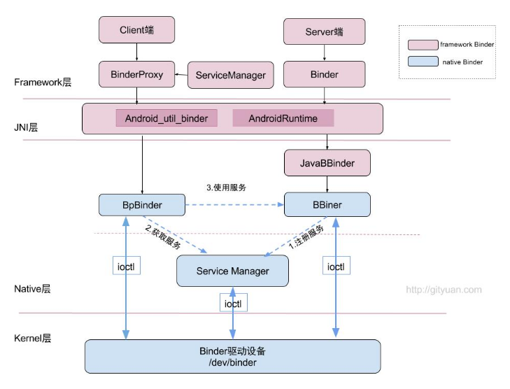
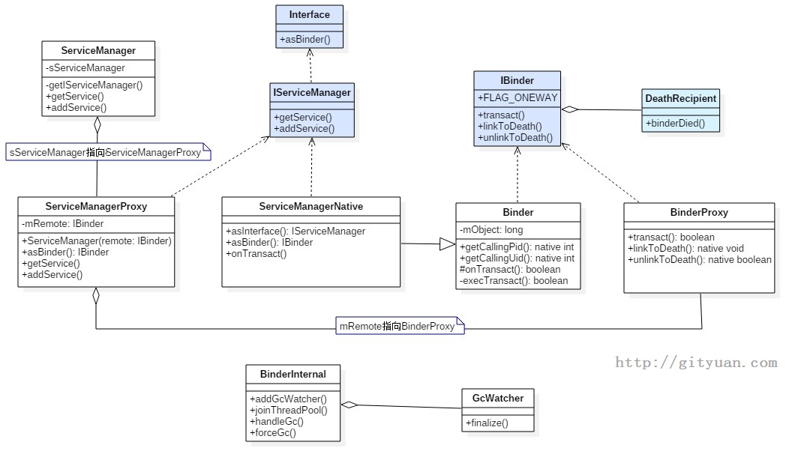

```
    // gNativeDataCache is now logically empty.
664    jobject object = env->CallStaticObjectMethod(gBinderProxyOffsets.mClass,
665            gBinderProxyOffsets.mGetInstance, (jlong) nativeData, (jlong) val.get());
666    if (env->ExceptionCheck()) {
667        // In the exception case, getInstance still took ownership of nativeData.
668        gNativeDataCache = nullptr;
669        return NULL;
670    }
671    BinderProxyNativeData* actualNativeData = getBPNativeData(env, object);
672    if (actualNativeData == nativeData) {
673        // New BinderProxy; we still have exclusive access.
674        nativeData->mOrgue = new DeathRecipientList;
675        nativeData->mObject = val;
676        gNativeDataCache = nullptr;
```

```
public final class BinderProxy implements IBinder {
/**
 * C++ pointer to BinderProxyNativeData. That consists of strong pointers to the
 * native IBinder object, and a DeathRecipientList.
 */
private final long mNativeData;
```


.相关源码

#### framework/base/core/java/android/os/  

- IInterface.java  
- IServiceManager.java  
- ServiceManager.java  
- ServiceManagerNative.java(内含ServiceManagerProxy类)

#### framework/base/core/java/android/os/

- IBinder.java  

- Binder.java(内含BinderProxy类) 
-  - Parcel.java

#### framework/base/core/java/com/android/internal/os/ 

- BinderInternal.java

####  framework/base/core/jni/  

- AndroidRuntime.cpp  

- android_os_Parcel.cpp 

- android_util_Binder.cpp

## 一、概述

  ### 1.1 Binder架构

  binder在framework层，采用JNI技术来调用native(C/C++)层的binder架构，从而为上层应用程序提供服务。 看过binder系列之前的文章，我们知道native层中，binder是C/S架构，分为Bn端(Server)和Bp端(Client)。对于java层在命名与架构上非常相近，同样实现了一套IPC通信架构。



- 图中红色代表整个framework层 binder架构相关组件；
  - Binder类代表Server端，BinderProxy类代码Client端；
- 图中蓝色代表Native层Binder架构相关组件；
- 上层framework层的Binder逻辑是建立在Native层架构基础之上的，核心逻辑都是交予Native层方法来处理。
- framework层的ServiceManager类与Native层的功能并不完全对应，framework层的ServiceManager类的实现最终是通过BinderProxy传递给Native层来完成的，后面会详细说明。



图解：(图中浅蓝色都是Interface，其余都是Class)

1. **ServiceManager：**通过getIServiceManager方法获取的是ServiceManagerProxy对象； ServiceManager的addService, getService实际工作都交由ServiceManagerProxy的相应方法来处理；
2. **ServiceManagerProxy：**其成员变量mRemote指向BinderProxy对象，ServiceManagerProxy的addService, getService方法最终是交由mRemote来完成。
3. **ServiceManagerNative**：其方法asInterface()返回的是ServiceManagerProxy对象，ServiceManager便是借助ServiceManagerNative类来找到ServiceManagerProxy；
4. **Binder：**其成员变量mObject和方法execTransact()用于native方法
5. **BinderInternal：**内部有一个GcWatcher类，用于处理和调试与Binder相关的垃圾回收。
6. **IBinder：**接口中常量FLAG_ONEWAY：客户端利用binder跟服务端通信是阻塞式的，但如果设置了FLAG_ONEWAY，这成为非阻塞的调用方式，客户端能立即返回，服务端采用回调方式来通知客户端完成情况。另外IBinder接口有一个内部接口DeathDecipient(死亡通告)。

## 二、初始化JNI层

在Android系统开机过程中，Zygote启动时会有一个[虚拟机注册过程](http://gityuan.com/2016/02/13/android-zygote/#jnistartreg)，该过程调用AndroidRuntime::`startReg`方法来完成jni方法的注册。

调用``register_android_os_Binder``来注册JNI的Binder相关方法

- ###  register_android_os_Binder

  > framework/base/core/jni/android_util_Binder.cpp

  ```c
  int register_android_os_Binder(JNIEnv* env)
  {	//注册BInder类的Jni方法
      if (int_register_android_os_Binder(env) < 0)
          return -1;
       //注册BinderInternal类的Jni方法
      if (int_register_android_os_BinderInternal(env) < 0)
          return -1;
      //注册BinderProxy类的Jni方法
      if (int_register_android_os_BinderProxy(env) < 0)
          return -1;
  	...
      return 0;
  }
  ```

- ###  注册Binder（int_register_android_os_Binder）

  > framework/base/core/jni/android_util_Binder.cpp

  ```c
  const char* const kBinderPathName = "android/os/Binder";
  static int int_register_android_os_Binder(JNIEnv* env)
  {	//查找android/os/Binder这个路径的路径的Binder类
      jclass clazz = FindClassOrDie(env, kBinderPathName);
  	//将Java层Binder类保存到mClass变量；
      gBinderOffsets.mClass = MakeGlobalRefOrDie(env, clazz);
      //将Java层execTransact()方法保存到mExecTransact变量；
      gBinderOffsets.mExecTransact = GetMethodIDOrDie(env, clazz, "execTransact", "(IJJI)Z");
      //将Java层getInterfaceDescriptor方法保存到mGetInterfaceDescriptor变量
      gBinderOffsets.mGetInterfaceDescriptor = GetMethodIDOrDie(env, clazz, "getInterfaceDescriptor",
          "()Ljava/lang/String;");
      //将Java层mObject属性保存到mObject变量
      gBinderOffsets.mObject = GetFieldIDOrDie(env, clazz, "mObject", "J");
  	//注册JNI方法
      return RegisterMethodsOrDie(
          env, kBinderPathName,
          gBinderMethods, NELEM(gBinderMethods));
  }
  ```

  其中的``gBinderOffsets``是全局静态结构体(struct)，定义如下：

  ```c++
  static struct bindernative_offsets_t
  {
      //记录Binder类
      jclass mClass;
      //记录execTransact()方法
      jmethodID mExecTransact;
      //getInterfaceDescriptor()方法
      jmethodID mGetInterfaceDescriptor;
      //记录mObject属性
      jfieldID mObject;
  } gBinderOffsets;
  
  ```

  ``gBinderOffsets``保存了``BInder.java``类本身以及其成员方法``execTransact()``和``getInterfaceDescriptor()``和成员属性``mObject``,这位JNI层访问Java层提供通道，另外通过查询获取Java层的Bindr信息后保存到``gBinderOffsets``，以后再次访问时不需要再次去查找，节省了时间。

  #### gBinderMethods

  ```c
  static const JNINativeMethod gBinderMethods[] = {
       /* name, signature, funcPtr */
      // @CriticalNative
      { "getCallingPid", "()I", (void*)android_os_Binder_getCallingPid },
      // @CriticalNative
      { "getCallingUid", "()I", (void*)android_os_Binder_getCallingUid },
      // @CriticalNative
      { "isHandlingTransaction", "()Z", (void*)android_os_Binder_isHandlingTransaction },
      // @CriticalNative
      { "clearCallingIdentity", "()J", (void*)android_os_Binder_clearCallingIdentity },
      { "restoreCallingIdentity", "(J)V", (void*)android_os_Binder_restoreCallingIdentity },
      // @CriticalNative
      { "setThreadStrictModePolicy", "(I)V", (void*)android_os_Binder_setThreadStrictModePolicy },
      // @CriticalNative
      { "getThreadStrictModePolicy", "()I", (void*)android_os_Binder_getThreadStrictModePolicy },
      // @CriticalNative
      { "setCallingWorkSourceUid", "(I)J", (void*)android_os_Binder_setCallingWorkSourceUid },
      // @CriticalNative
      { "getCallingWorkSourceUid", "()I", (void*)android_os_Binder_getCallingWorkSourceUid },
      // @CriticalNative
      { "clearCallingWorkSource", "()J", (void*)android_os_Binder_clearCallingWorkSource },
      { "restoreCallingWorkSource", "(J)V", (void*)android_os_Binder_restoreCallingWorkSource },
      { "flushPendingCommands", "()V", (void*)android_os_Binder_flushPendingCommands },
      { "getNativeBBinderHolder", "()J", (void*)android_os_Binder_getNativeBBinderHolder },
      { "getNativeFinalizer", "()J", (void*)android_os_Binder_getNativeFinalizer },
      { "blockUntilThreadAvailable", "()V", (void*)android_os_Binder_blockUntilThreadAvailable }
  };
  ```

  通过``RegisterMethodsOrDie()``方法把gBinderMethods数组中的方法建立一一映射的关系，例如将Binder中的``getCallingPid``和``android_os_Binder_getCallingPid``方法一一关联起来，这样java层就能调用C/C++层对应的方法了

  ​	

  另外的``int_register_android_os_BinderInternal``和``int_register_android_os_BinderProxy``也都一样，都是把Java层的类的native方法和C/C++的代码完成映射，从而为Java层访问JNI层提供通道，同时，JNI层也能通过``gBinderMethods``保存的信息访问Java层。

  也就是说该过程建立了Binder类在Native层与framework层之间的相互调用的桥梁。

  总结：这一步主要是建立了Binder，BinderInternal和BinderProxy在Native层与framework层之间相互调用的桥梁。

  

## Framework层调用

当我们需要调用一个系统服务的功能时，首先要将这个服务注册到系统中，这里就需要用到ServerManager

### ServiceManager.java

> framework/base/core/java/android/os/ServiceManager.java

- #### ServiceManager.addService

  ```java
  	/**
       * @param allowIsolated set to true to allow isolated sandboxed processes
       * @param dumpPriority supported dump priority levels as a bitmask
       * to access this service
       */
  private static IServiceManager sServiceManager;
  public static void addService(String name, IBinder service, boolean allowIsolated,
              int dumpPriority) {
          try {
              getIServiceManager().addService(name, service, allowIsolated, dumpPriority);
          } catch (RemoteException e) {
              Log.e(TAG, "error in addService", e);
          }
      }
      @UnsupportedAppUsage
      private static IServiceManager getIServiceManager() {
          if (sServiceManager != null) {
              return sServiceManager;
          }
  
          // Find the service manager
  		//Binder.allowBlocking的作用是将一个mWarnOnBlocking设为false，这个后面再说
          sServiceManager = ServiceManagerNative
                  .asInterface(Binder.allowBlocking(BinderInternal.getContextObject()));
          return sServiceManager;
      }
  
  ```


- #### android_util_Binder.cpp

  > framework/base/core/jni/android_util_Binder.cpp

  ```c++
  static jobject android_os_BinderInternal_getContextObject(JNIEnv* env, jobject clazz)
  {
      sp<IBinder> b = ProcessState::self()->getContextObject(NULL);
      return javaObjectForIBinder(env, b);
  }
  ```

  调用了ProcessState的getContextObject方法，继续

- #### ProcessState.cpp

  > framework/native/libs/binder/ProcessState.cpp

  ```c++
  sp<IBinder> ProcessState::getContextObject(const sp<IBinder>& /*caller*/)
  {	
      //获得handlerId为0的BpBinder
      return getStrongProxyForHandle(0);
  }
  sp<IBinder> ProcessState::getStrongProxyForHandle(int32_t handle)
  {
      sp<IBinder> result;
  
      AutoMutex _l(mLock);
  
      handle_entry* e = lookupHandleLocked(handle);
  
      if (e != nullptr) {
          // We need to create a new BpBinder if there isn't currently one, OR we
          // are unable to acquire a weak reference on this current one.  See comment
          // in getWeakProxyForHandle() for more info about this.
          IBinder* b = e->binder;
          if (b == nullptr || !e->refs->attemptIncWeak(this)) {
              if (handle == 0) {
                  // Special case for context manager...
                  // The context manager is the only object for which we create
                  // a BpBinder proxy without already holding a reference.
                  // Perform a dummy transaction to ensure the context manager
                  // is registered before we create the first local reference
                  // to it (which will occur when creating the BpBinder).
                  // If a local reference is created for the BpBinder when the
                  // context manager is not present, the driver will fail to
                  // provide a reference to the context manager, but the
                  // driver API does not return status.
                  //
                  // Note that this is not race-free if the context manager
                  // dies while this code runs.
                  //
                  // TODO: add a driver API to wait for context manager, or
                  // stop special casing handle 0 for context manager and add
                  // a driver API to get a handle to the context manager with
                  // proper reference counting.
  
                  Parcel data;
                  status_t status = IPCThreadState::self()->transact(
                          0, IBinder::PING_TRANSACTION, data, nullptr, 0);
                  if (status == DEAD_OBJECT)
                     return nullptr;
              }
  			//当handle值所对应的IBinder不存在或弱引用无效时，则创建BpBinder对象
              b = BpBinder::create(handle);
              e->binder = b;
              if (b) e->refs = b->getWeakRefs();
              result = b;
          } else {
              // This little bit of nastyness is to allow us to add a primary
              // reference to the remote proxy when this team doesn't have one
              // but another team is sending the handle to us.
              result.force_set(b);
              e->refs->decWeak(this);
          }
      }
  	//返回BpBinder对象
      return result;
  }
  ```

  当handle值所对应的IBinder不存在或弱引用无效时会创建BpBinder，否则直接获取。 针对handle==0的特殊情况，通过PING_TRANSACTION来判断是否准备就绪。如果在context manager还未生效前，一个BpBinder的本地引用就已经被创建，那么驱动将无法提供context manager的引用。

- #### javaObjectForIBinder

  > framework/base/core/jni/android_util_Binder.cpp

  ```c++
  // If the argument is a JavaBBinder, return the Java object that was used to create it.
  // Otherwise return a BinderProxy for the IBinder. If a previous call was passed the
  // same IBinder, and the original BinderProxy is still alive, return the same BinderProxy.
  jobject javaObjectForIBinder(JNIEnv* env, const sp<IBinder>& val)
    {	
      if (val == NULL) return NULL;  
  	if (val->checkSubclass(&gBinderOffsets)) {
        // It's a JavaBBinder created by ibinderForJavaObject. Already has Java object.
        jobject object = static_cast<JavaBBinder*>(val.get())->object();
        LOGDEATH("objectForBinder %p: it's our own %p!\n", val.get(), object);
        return object;
    }
    //获取BinderProxy.java的nativeData成员变量，包含native IBinder对象和DeathRecipientList地址，是一个long数据
    BinderProxyNativeData* nativeData = new BinderProxyNativeData();
    nativeData->mOrgue = new DeathRecipientList;
    nativeData->mObject = val;//
    //调用BinderProxy.java的静态方法getInstance()来创建一个BinderProxy对象（9变化，以前是用newObject的方式通过构造方法来创建）
    jobject object = env->CallStaticObjectMethod(gBinderProxyOffsets.mClass,
            gBinderProxyOffsets.mGetInstance, (jlong) nativeData, (jlong) val.get());
    if (env->ExceptionCheck()) {
        // In the exception case, getInstance still took ownership of nativeData.
        return NULL;
    }
    BinderProxyNativeData* actualNativeData = getBPNativeData(env, object);
    if (actualNativeData == nativeData) {
        // Created a new Proxy
        uint32_t numProxies = gNumProxies.fetch_add(1, std::memory_order_relaxed);
        uint32_t numLastWarned = gProxiesWarned.load(std::memory_order_relaxed);
        if (numProxies >= numLastWarned + PROXY_WARN_INTERVAL) {
            // Multiple threads can get here, make sure only one of them gets to
            // update the warn counter.
            if (gProxiesWarned.compare_exchange_strong(numLastWarned,
                        numLastWarned + PROXY_WARN_INTERVAL, std::memory_order_relaxed)) {
                ALOGW("Unexpectedly many live BinderProxies: %d\n", numProxies);
            }
        }
    } else {
        delete nativeData;
    }
    
    return object;
      }
  ```
  根据getContextObject()生成的BpBinder(C++)生成来生成BinderProxy(Java)对象. 主要工作是创建BinderProxy对象,并把BpBinder对象地址保存到BinderProxy.nativeData成员变量中. 

  到此，可知ServiceManagerNative.asInterface(BinderInternal.getContextObject()) 等价于

   ```java
  ServiceManagerNative.asInterface(new BinderProxy())
   ```

- #### ServiceManagerNative.java

  >framework/base/core/java/android/os/ServiceManagerNative.java

  ```java
    public abstract class ServiceManagerNative extends Binder implements IServiceManager
    {
        /**
         * Cast a Binder object into a service manager interface, generating
         * a proxy if needed.
         */
        @UnsupportedAppUsage
        static public IServiceManager asInterface(IBinder obj)
        {
            if (obj == null) {
                return null;
            }
            //由于obj为BpBinder，该方法默认返回null
            IServiceManager in =
                (IServiceManager)obj.queryLocalInterface(descriptor);
            if (in != null) {
                return in;
            }
    
            return new ServiceManagerProxy(obj);
        }
        ...
       }
  //ServiceManagerProxy是ServiceManagerNative的内部类
  class ServiceManagerProxy implements IServiceManager {
      public ServiceManagerProxy(IBinder remote) {
          //BinderProxy对象,该BinderProxy对象对应于BpBinder(0)，其作为binder代理端，指向native层大管家service Manager。
          mRemote = remote;
      }
  ...
  }
  ```

  `ServiceManager.getIServiceManager`最终等价于`new ServiceManagerProxy(new BinderProxy())`,意味着【3.1】中的getIServiceManager().addService()，等价于ServiceManagerProxy.addService().

  framework层的ServiceManager的调用实际的工作确实交给ServiceManagerProxy的成员变量BinderProxy；而BinderProxy通过jni方式，最终会调用BpBinder对象；可见上层binder架构的核心功能依赖native架构的服务来完成的。

- #### ServiceManagerNative.addService

  > framework/base/core/java/android/os/ServiceManagerNative.java

  ```java
      public void addService(String name, IBinder service, boolean allowIsolated, int dumpPriority)
              throws RemoteException {
          Parcel data = Parcel.obtain();
          Parcel reply = Parcel.obtain();
          data.writeInterfaceToken(IServiceManager.descriptor);
          data.writeString(name);
          //注意这个方法
          data.writeStrongBinder(service);
          data.writeInt(allowIsolated ? 1 : 0);
          data.writeInt(dumpPriority);
          mRemote.transact(ADD_SERVICE_TRANSACTION, data, reply, 0);
          reply.recycle();
          data.recycle();
      }
      /**
       * Write an object into the parcel at the current dataPosition(),
       * growing dataCapacity() if needed.
       */
      public final void writeStrongBinder(IBinder val) {
          nativeWriteStrongBinder(mNat
                                  ivePtr, val);
      }  
  ```

- #### android_os_Parcel.cpp

  > framework/base/core/jni/android_os_Parcel.cpp

  - ##### android_os_Parcel_writeStrongBinder

    > framework/base/core/jni/android_os_Parcel.cpp
  
  ```c++
  
    static void android_os_Parcel_writeStrongBinder(JNIEnv* env, jclass clazz, jlong nativePtr, jobject object)
    {	//将java层Parcel转换为native层Parcel
        Parcel* parcel = reinterpret_cast<Parcel*>(nativePtr);
        if (parcel != NULL) {
            const status_t err = parcel->writeStrongBinder(ibinderForJavaObject(env, object));
            if (err != NO_ERROR) {
                signalExceptionForError(env, clazz, err);
            }
        }
    }
  ```
  
  
  
  - ##### ibinderForJavaObject

    > framework/base/core/jni/android_util_Binder.cpp

    ```c++
    
    sp<IBinder> ibinderForJavaObject(JNIEnv* env, jobject obj)
    {
        if (obj == NULL) return NULL;
    	
        // Instance of Binder?
        // 如果是Java层的Binder对象，这里我们要注册一个服务，并不是代理
        if (env->IsInstanceOf(obj, gBinderOffsets.mClass)) {
            JavaBBinderHolder* jbh = (JavaBBinderHolder*)
                env->GetLongField(obj, gBinderOffsets.mObject);
          //  get() 返回一個JavaBBinder，继承自BBinder
            return jbh->get(env, obj);
        }
    
        // Instance of BinderProxy?
        // 如果是Java层的BinderProxy对象
        if (env->IsInstanceOf(obj, gBinderProxyOffsets.mClass)) {
             //返回一个BinderProxy的NativeData数据中的，mObject是它的地址值
            return getBPNativeData(env, obj)->mObject;
        }
    
        ALOGW("ibinderForJavaObject: %p is not a Binder object", obj);
        return NULL;
    }
    sp<JavaBBinder> get(JNIEnv* env, jobject obj)
    {
        AutoMutex _l(mLock);
        sp<JavaBBinder> b = mBinder.promote();
        if (b == NULL) {
            //首次进来，创建JavaBBinder对象
            b = new JavaBBinder(env, obj);
            mBinder = b;
        }
        return b;
    }
    class JavaBBinder : public BBinder
    {
    public:
        JavaBBinder(JNIEnv* env, jobject /* Java Binder */ object)
            : mVM(jnienv_to_javavm(env)), mObject(env->NewGlobalRef(object))
        {
            ALOGV("Creating JavaBBinder %p\n", this);
            gNumLocalRefsCreated.fetch_add(1, std::memory_order_relaxed);
            gcIfManyNewRefs(env);
        }
    
        bool    checkSubclass(const void* subclassID) const
        {
            return subclassID == &gBinderOffsets;
        }
    
        jobject object() const
        {
            return mObject;
        }
    	...
    }
    ```

    根据Binde(Java)生成JavaBBinderHolder(C++)对象. 主要工作是创建JavaBBinderHolder对象,并把JavaBBinderHolder对象地址保存到Binder.mObject成员变量.

    创建JavaBBinder，该对象继承于BBinder对象。

    data.writeStrongBinder(service)最终等价于`parcel->writeStrongBinder(new JavaBBinder(env, obj))`;

    