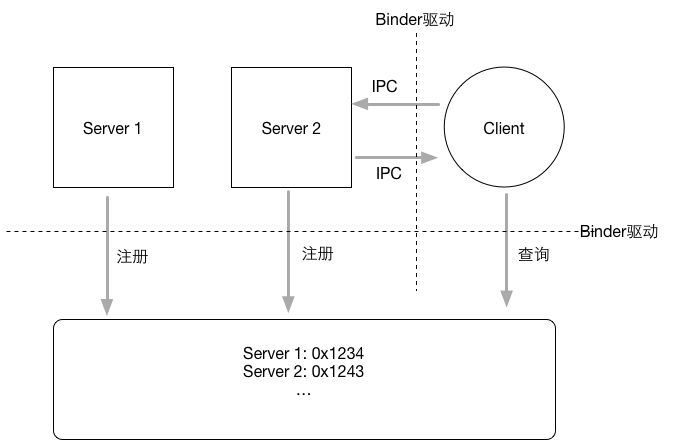
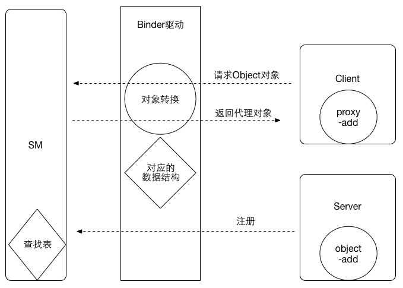

## 1. Binder 架构

- Binder 通信采用 C/S 架构，从组件视角来说，包含 Client、 Server、 ServiceManager 以及 Binder 驱动，其中 ServiceManager 用于管理系统中的各种服务。
- Binder 在 framework 层进行了封装，通过 JNI 技术调用 Native（C/C++）层的 Binder 架构。
- Binder 在 Native 层以 ioctl 的方式与 Binder 驱动（内核）通讯。

## 2.Binder 通信模型

对于跨进程通信的双方，我们姑且叫做Server进程（简称Server），Client进程（简称Client）；由于进程隔离的存在，它们之间没办法通过简单的方式进行通信，那么Binder机制是如何进行的呢？

两个运行在用户空间的进程要完成通信，必须借助内核的帮助，这个运行在内核里面的程序叫做**Binder驱动**，它的功能类似于基站；通信录呢，就是一个叫做**ServiceManager**的东西（简称SM）



整个通信步骤如下：

1.  SM建立(建立通信录)；首先有一个进程向驱动提出申请为SM；驱动同意之后，SM进程负责管理Service（注意这里是Service而不是Server，因为如果通信过程反过来的话，那么原来的客户端Client也会成为服务端Server）不过这时候通信录还是空的，一个号码都没有。
2. 各个Server向SM注册(完善通信录)；每个Server端进程启动之后，向SM报告，我是zhangsan, 要找我请返回0x1234(这个地址没有实际意义，类比)；其他Server进程依次如此；这样SM就建立了一张表，对应着各个Server的名字和地址；就好比B与A见面了，说存个我的号码吧，以后找我拨打10086；
3. Client想要与Server通信，首先询问SM；请告诉我如何联系zhangsan，SM收到后给他一个号码0x1234；Client收到之后，开心滴用这个号码拨通了Server的电话，于是就开始通信了。

那么Binder驱动干什么去了呢？这里Client与SM的通信，以及Client与Server的通信，都会经过驱动，驱动在背后默默无闻，但是做着最重要的工作。驱动是整个通信过程的核心，因此完成跨进程通信的秘密全部隐藏在驱动里面；

## Binder机制跨进程原理

上文给出了Binder的通信模型，指出了通信过程的四个角色: Client, Server, SM, driver; 但是我们仍然不清楚**Client到底是如何与Server完成通信的**。

两个运行在用户空间的进程A和进程B如何完成通信呢？内核可以访问A和B的所有数据；所以，最简单的方式是通过内核做中转；假设进程A要给进程B发送数据，那么就先把A的数据copy到内核空间，然后把内核空间对应的数据copy到B就完成了；用户空间要操作内核空间，需要通过系统调用；刚好，这里就有两个系统调用：`copy_from_user`, `copy_to_user`。

但是，Binder机制并不是这么干的。讲这么一段，是说明进程间通信并不是什么神秘的东西。那么，Binder机制是如何实现跨进程通信的呢？

Binder驱动为我们做了一切。

假设Client进程想要调用Server进程的`object`对象的一个方法`add`;对于这个跨进程通信过程，我们来看看Binder机制是如何做的。 （通信是一个广泛的概念，只要一个进程能调用另外一个进程里面某对象的方法，那么具体要完成什么通信内容就很容易了。）



- 首先，Server进程要向SM注册；告诉自己是谁，自己有什么能力；在这个场景就是Server告诉SM，它叫`zhangsan`，它有一个`object`对象，可以执行`add` 操作；于是SM建立了一张表：`zhangsan`这个名字对应进程Server;

- 然后Client向SM查询：我需要联系一个名字叫做`zhangsan`的进程里面的`object`对象；这时候关键来了：进程之间通信的数据都会经过运行在内核空间里面的驱动，驱动在数据流过的时候做了一点手脚，它并不会给Client进程返回一个真正的`object`对象，而是返回一个看起来跟`object`一模一样的代理对象`objectProxy`，这个`objectProxy`也有一个`add`方法，但是这个`add`方法没有Server进程里面`object`对象的`add`方法那个能力；`objectProxy`的`add`只是一个傀儡，它唯一做的事情就是把参数包装然后交给驱动。(这里我们简化了SM的流程，见下文)

- 但是Client进程并不知道驱动返回给它的对象动过手脚，毕竟伪装的太像了，如假包换。Client开开心心地拿着`objectProxy`对象然后调用`add`方法；我们说过，这个`add`什么也不做，直接把参数做一些包装然后直接转发给Binder驱动。

- 驱动收到这个消息，发现是这个`objectProxy`；一查表就明白了：我之前用`objectProxy`替换了`object`发送给Client了，它真正应该要访问的是`object`对象的`add`方法；于是Binder驱动通知Server进程，*调用你的object对象的`add`方法，然后把结果发给我*，Sever进程收到这个消息，照做之后将结果返回驱动，驱动然后把结果返回给`Client`进程；于是整个过程就完成了。

- 由于驱动返回的`objectProxy`与Server进程里面原始的`object`是如此相似，给人感觉好像是**直接把Server进程里面的对象object传递到了Client进程**；因此，我们可以说**Binder对象是可以进行跨进程传递的对象**

但事实上我们知道，Binder跨进程传输并不是真的把一个对象传输到了另外一个进程；传输过程好像是Binder跨进程穿越的时候，它在一个进程留下了一个真身，在另外一个进程幻化出一个影子（这个影子可以很多个）；Client进程的操作其实是对于影子的操作，影子利用Binder驱动最终让真身完成操作。

理解这一点非常重要；务必仔细体会。另外，Android系统实现这种机制使用的是*代理模式*, 对于Binder的访问，如果是在同一个进程（不需要跨进程），那么直接返回原始的Binder实体；如果在不同进程，那么就给他一个代理对象（影子）；我们在系统源码以及AIDL的生成代码里面可以看到很多这种实现。

另外我们为了简化整个流程，隐藏了SM这一部分驱动进行的操作；实际上，由于SM与Server通常不在一个进程，Server进程向SM注册的过程也是跨进程通信，驱动也会对这个过程进行暗箱操作：SM中存在的Server端的对象实际上也是代理对象，后面Client向SM查询的时候，驱动会给Client返回另外一个代理对象。Sever进程的本地对象仅有一个，其他进程所拥有的全部都是它的代理。

一句话总结就是：**Client进程只不过是持有了Server端的代理；代理对象协助驱动完成了跨进程通信。**

## Binder到底是什么？

我们经常提到Binder，那么Binder到底是什么呢？

> 面向对象思想的引入将进程间通信转化为通过对某个Binder对象的引用调用该对象的方法，而其独特之处在于Binder对象是一个可以跨进程引用的对象，它的实体（本地对象）位于一个进程中，而它的引用（代理对象）却遍布于系统的各个进程之中。
>
> 最诱人的是，这个引用和java里引用一样既可以是强类型，也可以是弱类型，而且可以从一个进程传给其它进程，让大家都能访问同一Server，就象将一个对象或引用赋值给另一个引用一样。Binder模糊了进程边界，淡化了进程间通信过程，整个系统仿佛运行于同一个面向对象的程序之中。形形色色的Binder对象以及星罗棋布的引用仿佛粘接各个应用程序的胶水，这也是Binder在英文里的原意。

Binder的设计采用了面向对象的思想，在Binder通信模型的四个角色里面；他们的代表都是“Binder”，这样，对于Binder通信的使用者而言，Server里面的Binder和Client里面的Binder没有什么不同，一个Binder对象就代表了所有，它不用关心实现的细节，甚至不用关心驱动以及SM的存在；这就是抽象。

- 通常意义下，Binder指的是一种通信机制；我们说AIDL使用Binder进行通信，指的就是**Binder这种IPC机制**。
- 对于Server进程来说，Binder指的是**Binder本地对象**
- 对于Client来说，Binder指的是**Binder代理对象**，它只是**Binder本地对象**的一个远程代理；对这个Binder代理对象的操作，会通过驱动最终转发到Binder本地对象上去完成；对于一个拥有Binder对象的使用者而言，它无须关心这是一个Binder代理对象还是Binder本地对象；对于代理对象的操作和对本地对象的操作对它来说没有区别。
- 对于传输过程而言，Binder是可以进行跨进程传递的对象；Binder驱动会对具有跨进程传递能力的对象做特殊处理：自动完成代理对象和本地对象的转换。

## Java层的Binder

- ### IBinder

  > IBinder是一个接口，它代表了**一种跨进程传输的能力**；只要实现了这个接口，就能将这个对象进行跨进程传递；这是驱动底层支持的；在跨进程数据流经驱动的时候，驱动会识别IBinder类型的数据，从而自动完成不同进程Binder本地对象以及Binder代理对象的转换。

- ### IInterface

  ```java
  /**
   * Base class for Binder interfaces.  When defining a new interface,
   * you must derive it from IInterface.
   * Binder基类接口。当定义新接口时，必须从IInterface派生它。
   */
  public interface IInterface
  {
      /**
       * Retrieve the Binder object associated with this interface.
       * 检索与此接口关联的Binder对象。
       * You must use this instead of a plain cast, so that proxy objects
       * can return the correct result.
       * 你必须使用这种转化方式去替代普通的cast，这样代理对象才能返回正确的结果
       */
      public IBinder asBinder();
  }
  
  ```

  IBinder负责数据传输，那么client与server端的调用契约（这里不用接口避免混淆）呢？这里的IInterface代表的就是远程server对象具有什么能力，就是远端server像外面暴露自己功能的类都需要实现这个接口。例如IActivityManager，这个代码是动态生成的。

- ### Binder类

  Java层的Binder类，代表的其实就是**Binder本地对象**。BinderProxy类是Binder类的一个内部类，它代表远程进程的Binder对象的本地代理；这两个类都继承自IBinder, 因而都具有跨进程传输的能力；实际上，在跨越进程的时候，Binder驱动会自动完成这两个对象的转换。	

- ### Stub类

  在使用AIDL的时候，编译工具会给我们生成一个Stub的静态内部类；这个类继承了Binder, 说明它是一个Binder本地对象，它实现了IInterface接口，表明它具有远程Server承诺给Client的能力；Stub是一个抽象类，具体的IInterface的相关实现需要我们手动完成，这里使用了策略模式。

  

## 例子：AIDL分析

- ### Server端

  首先定义一个接口

  ```java
  package com.young.server;
  //需要手动导入包
  import com.young.server.Book;
  interface IBuyBookAIDL {
      List<Book> getBookList();
  
      int buyBook(inout String name);
  }
  
  ```

  然后用编译工具编译之后，可以得到对应的IBuyBookAIDL.java类，看看系统给我们生成的代码：

  ```java
  public interface IBuyBookAIDL extends android.os.IInterface
  {
    /** Default implementation for IBuyBookAIDL. */
    public static class Default implements com.young.server.IBuyBookAIDL
    {
      @Override public java.util.List<com.young.server.Book> getBookList() throws android.os.RemoteException
      {
        return null;
      }
      @Override public int buyBook(java.lang.String name) throws android.os.RemoteException
      {
        return 0;
      }
      @Override
      public android.os.IBinder asBinder() {
        return null;
      }
    }
    /** Local-side IPC implementation stub class. */
    public static abstract class Stub extends android.os.Binder implements com.young.server.IBuyBookAIDL
    {
      private static final java.lang.String DESCRIPTOR = "com.young.server.IBuyBookAIDL";
      /** Construct the stub at attach it to the interface. */
      public Stub()
      {
        this.attachInterface(this, DESCRIPTOR);
      }
      /**
       * Cast an IBinder object into an com.young.server.IBuyBookAIDL interface,
       * generating a proxy if needed.
       */
      public static com.young.server.IBuyBookAIDL asInterface(android.os.IBinder obj)
      {
        if ((obj==null)) {
          return null;
        }
        android.os.IInterface iin = obj.queryLocalInterface(DESCRIPTOR);
        if (((iin!=null)&&(iin instanceof com.young.server.IBuyBookAIDL))) {
          return ((com.young.server.IBuyBookAIDL)iin);
        }
        return new com.young.server.IBuyBookAIDL.Stub.Proxy(obj);
      }
      @Override public android.os.IBinder asBinder()
      {
        return this;
      }
      @Override public boolean onTransact(int code, android.os.Parcel data, android.os.Parcel reply, int flags) throws android.os.RemoteException
      {
        java.lang.String descriptor = DESCRIPTOR;
        switch (code)
        {
          case INTERFACE_TRANSACTION:
          {
            reply.writeString(descriptor);
            return true;
          }
          case TRANSACTION_getBookList:
          {
            data.enforceInterface(descriptor);
            java.util.List<com.young.server.Book> _result = this.getBookList();
            reply.writeNoException();
            reply.writeTypedList(_result);
            return true;
          }
          case TRANSACTION_buyBook:
          {
            data.enforceInterface(descriptor);
            java.lang.String _arg0;
            _arg0 = data.readString();
            int _result = this.buyBook(_arg0);
            reply.writeNoException();
            reply.writeInt(_result);
            return true;
          }
          default:
          {
            return super.onTransact(code, data, reply, flags);
          }
        }
      }
      private static class Proxy implements com.young.server.IBuyBookAIDL
      {
        private android.os.IBinder mRemote;
        //代理模式，这里的remote最后接收的是BindProxy
        Proxy(android.os.IBinder remote){
          mRemote = remote;
        }
        @Override public android.os.IBinder asBinder()
        {
          return mRemote;
        }
        public java.lang.String getInterfaceDescriptor()
        {
          return DESCRIPTOR;
        }
        @Override public java.util.List<com.young.server.Book> getBookList() throws android.os.RemoteException
        {
          android.os.Parcel _data = android.os.Parcel.obtain();
          android.os.Parcel _reply = android.os.Parcel.obtain();
          java.util.List<com.young.server.Book> _result;
          try {
            _data.writeInterfaceToken(DESCRIPTOR);
            boolean _status = mRemote.transact(Stub.TRANSACTION_getBookList, _data, _reply, 0);
            if (!_status && getDefaultImpl() != null) {
              return getDefaultImpl().getBookList();
            }
            _reply.readException();
            _result = _reply.createTypedArrayList(com.young.server.Book.CREATOR);
          }
          finally {
            _reply.recycle();
            _data.recycle();
          }
          return _result;
        }
        @Override public int buyBook(java.lang.String name) throws android.os.RemoteException
        {
          android.os.Parcel _data = android.os.Parcel.obtain();
          android.os.Parcel _reply = android.os.Parcel.obtain();
          int _result;
          try {
            _data.writeInterfaceToken(DESCRIPTOR);
            _data.writeString(name);
            boolean _status = mRemote.transact(Stub.TRANSACTION_buyBook, _data, _reply, 0);
            if (!_status && getDefaultImpl() != null) {
              return getDefaultImpl().buyBook(name);
            }
            _reply.readException();
            _result = _reply.readInt();
          }
          finally {
            _reply.recycle();
            _data.recycle();
          }
          return _result;
        }
        public static com.young.server.IBuyBookAIDL sDefaultImpl;
      }
      static final int TRANSACTION_getBookList = (android.os.IBinder.FIRST_CALL_TRANSACTION + 0);
      static final int TRANSACTION_buyBook = (android.os.IBinder.FIRST_CALL_TRANSACTION + 1);
      public static boolean setDefaultImpl(com.young.server.IBuyBookAIDL impl) {
        if (Stub.Proxy.sDefaultImpl == null && impl != null) {
          Stub.Proxy.sDefaultImpl = impl;
          return true;
        }
        return false;
      }
      public static com.young.server.IBuyBookAIDL getDefaultImpl() {
        return Stub.Proxy.sDefaultImpl;
      }
    }
    public java.util.List<com.young.server.Book> getBookList() throws android.os.RemoteException;
    public int buyBook(java.lang.String name) throws android.os.RemoteException;
  }
  
  ```

  系统帮我们生成了这个文件之后，我们只需要继承IBuyBookAIDL.Stub这个抽象类，实现它的方法，然后在Service 的onBind方法里面返回就实现了AIDL。这个Stub类非常重要，具体看看它做了什么。

  Stub类继承自Binder，意味着这个Stub其实自己是一个Binder本地对象，然后实现了IBuyBookAIDL接口，IBuyBookAIDL本身是一个IInterface，因此他携带某种客户端需要的调用的买书和查价格的方法。此类有一个内部类Proxy，也就是Binder代理对象；

- ### client端

  client端要调用server端的方法需要先绑定一个service

  ```java
          Intent intent = new Intent();
          intent.setPackage("com.young.server");
          intent.setAction("com.young.server.action");
          bindService(intent, serviceConnection, Context.BIND_AUTO_CREATE);
  ```

  这里通过package和Action找到server端的service。然后在绑定服务成功的时候拿到server传过来的IBinder。

  ```
    private ServiceConnection serviceConnection = new ServiceConnection() {
          @Override
          public void onServiceConnected(ComponentName name, IBinder service) {
              buyBookAIDL = IBuyBookAIDL.Stub.asInterface(service);
              isConnect = true;
          }
  
          @Override
          public void onServiceDisconnected(ComponentName name) {
              isConnect = false;
          }
      };
  
  ```

  可以见到，通过``asInterface``把拿到的远程service进行转换

  ```java
      /**
       * Cast an IBinder object into an com.young.server.IBuyBookAIDL interface,
       * generating a proxy if needed.
       */
      private static final java.lang.String DESCRIPTOR = "com.young.server.IBuyBookAIDL";
      public static com.young.server.IBuyBookAIDL asInterface(android.os.IBinder obj)
      {
        if ((obj==null)) {
          return null;
        }
         //查询本地是否存在这个obj对象，
         //如果是跨进程通信，client这边接收的是一个BindProxy，这里的iin就是个null
        android.os.IInterface iin = obj.queryLocalInterface(DESCRIPTOR);
        if (((iin!=null)&&(iin instanceof com.young.server.IBuyBookAIDL))) {
          return ((com.young.server.IBuyBookAIDL)iin);
        }
         //跨进程传过来BindProxy，然后把这个传递给内部类Proxy的remote
        return new com.young.server.IBuyBookAIDL.Stub.Proxy(obj);
      }
  ```

  首先看函数的参数`IBinder`类型的obj，这个对象是驱动给我们的，如果是Binder本地对象，那么它就是Binder类型，如果是Binder代理对象，那就是`BinderProxy`类型；

  然后，正如上面自动生成的文档所说，它会试着查找Binder本地对象，如果找到，说明Client和Server都在同一个进程，这个参数直接就是本地对象，直接强制类型转换然后返回，如果找不到，说明是远程对象（处于另外一个进程）那么就需要创建一个Binde代理对象，让这个Binder代理实现对于远程对象的访问。一般来说，如果是与一个远程Service对象进行通信，那么这里返回的一定是一个Binder代理对象，这个IBinder参数的实际上是BinderProxy;

  我们拿到  buyBookAIDL这个对象后，调用它的``getBookList``方法时，也就是调用了内部类Proxy的

  ```java
        @Override public java.util.List<com.young.server.Book> getBookList() throws android.os.RemoteException
        {
          android.os.Parcel _data = android.os.Parcel.obtain();
          android.os.Parcel _reply = android.os.Parcel.obtain();
          java.util.List<com.young.server.Book> _result;
          try {
            _data.writeInterfaceToken(DESCRIPTOR);
            boolean _status = mRemote.transact(Stub.TRANSACTION_getBookList, _data, _reply, 0);
            if (!_status && getDefaultImpl() != null) {
              return getDefaultImpl().getBookList();
            }
            _reply.readException();
            _result = _reply.createTypedArrayList(com.young.server.Book.CREATOR);
          }
          finally {
            _reply.recycle();
            _data.recycle();
          }
          return _result;
        }
  ```

  它首先用`Parcel`把数据序列化了，然后调用了`transact`方法；这个`transact`到底做了什么呢？这个`Proxy`类在`asInterface`方法里面被创建，前面提到过，如果是Binder代理那么说明驱动返回的IBinder实际是`BinderProxy`, 因此我们的`Proxy`类里面的`mRemote`实际类型应该是`BinderProxy`；我们看看`BinderProxy`的``transactNative(code, data, reply, flags);``方法

  ```java
   public boolean transact(int code, Parcel data, Parcel reply, int flags) throws RemoteException {
   		//检测data大小，不能超过800K，这也是intent的传参的最大数量
          Binder.checkParcel(this, code, data, "Unreasonably large binder buffer");
  		...
          try {
              //调用native方法
              return transactNative(code, data, reply, flags);
          } finally {
              if (transactListener != null) {
                  transactListener.onTransactEnded(session);
              }
  
              if (tracingEnabled) {
                  Trace.traceEnd(Trace.TRACE_TAG_ALWAYS);
              }
          }
      }
  ```

  这是一个本地方法；它的实现在native层，具体来说在``frameworks/base/core/jni/android_util_Binder.cpp``文件，里面进行了一系列的函数调用，调用链实在太长这里就不给出了；要知道的是它最终调用到了`talkWithDriver`函数；看这个函数的名字就知道，通信过程要交给驱动完成了；这个函数最后通过`ioctl`系统调用，Client进程陷入内核态，Client调用`add`方法的线程挂起等待返回；驱动完成一系列的操作之后唤醒Server进程，调用了Server进程本地对象的`onTransact`函数（实际上由Server端线程池完成）。我们再看Binder本地对象的`onTransact`方法（这里就是`Stub`类里面的此方法）：

  ```java
   @Override public boolean onTransact(int code, android.os.Parcel data, android.os.Parcel reply, int flags) throws android.os.RemoteException
      {
        java.lang.String descriptor = DESCRIPTOR;
        switch (code)
        {
          case INTERFACE_TRANSACTION:
          {
            reply.writeString(descriptor);
            return true;
          }	
           //这里的方法转化成了一个个数字作为标记。
          case TRANSACTION_getBookList:
          {
            data.enforceInterface(descriptor);
            java.util.List<com.young.server.Book> _result = this.getBookList();
            reply.writeNoException();
            reply.writeTypedList(_result);
            return true;
          }
          case TRANSACTION_buyBook:
          {
            data.enforceInterface(descriptor);
            java.lang.String _arg0;
            _arg0 = data.readString();
            int _result = this.buyBook(_arg0);
            reply.writeNoException();
            reply.writeInt(_result);
            return true;
          }
          default:
          {
            return super.onTransact(code, data, reply, flags);
          }
        }
      }
  ```

  在Server进程里面，`onTransact`根据调用号（每个AIDL函数都有一个编号，在跨进程的时候，不会传递函数，而是传递编号指明调用哪个函数）调用相关函数；在这个例子里面，调用了Binder本地对象的`getBookList`方法；这个方法将结果返回给驱动，驱动唤醒挂起的Client进程里面的线程并将结果返回。于是一次跨进程调用就完成了。

  

## 总结

一个需要跨进程传递的对象一定继承自IBinder，如果是Binder本地对象，那么一定继承Binder实现IInterface，如果是代理对象，那么就实现了IInterface并持有了IBinder引用；

Proxy与Stub不一样，虽然他们都既是Binder又是IInterface，不同的是Stub采用的是继承（is 关系），Proxy采用的是组合（has 关系）。

他们均实现了所有的IInterface函数，不同的是，Stub又使用策略模式调用的是虚函数（待子类实现），而Proxy则使用组合模式。为什么Stub采用继承而Proxy采用组合？

事实上，Stub本身is一个IBinder（Binder），asBinder返回的是他自身，它本身就是一个能跨越进程边界传输的对象，所以它得继承IBinder实现transact这个函数从而得到跨越进程的能力（这个能力由驱动赋予）。

Proxy类使用组合，是因为他不关心自己是什么，asBinder返回的也就是持有的IBinder引用BinderProxy，因为它也不需要跨越进程传输，它只需要拥有这个能力即可，要拥有这个能力，只需要保留一个对IBinder（BinderProxy）的引用。

再去翻阅系统的ActivityManagerServer的源码，就知道哪一个类是什么角色了：IActivityManager是一个IInterface，它代表远程Service具有什么能力，

IActivityManager.Stub替代了ActivityManagerNative，这个类是抽象类，里面保存了所有和相关的方法和方法编号id，但是具体实现全部交给了`ActivityManagerService`。

因此对于AMS的最终操作都会进入`ActivityManagerService`这个真正实现；同时如果仔细观察，``IActivityManager.java``里面有一个非公开类Proxy, 它代表的就是Binder代理对象；是不是跟AIDL模型一模一样呢？那么`ActivityManager`是什么？他不过是一个管理类而已，可以看到真正的操作都是转发给``IActivityManager.Stub``进而交给他的实现`ActivityManagerService` 完成的。

```java
//可以看到`ActivityManager`里面实现方法都是通过获得一个单利的IActivityManager来实现，IActivityManager再把实现交给ActivityManagerService
public static void getMyMemoryState(ActivityManager.RunningAppProcessInfo var0) {
    try {
        getService().getMyMemoryState(var0);
    } catch (RemoteException var1) {
        throw var1.rethrowFromSystemServer();
    }
}
protected private static IActivityManager getService() {
    return (IActivityManager)IActivityManagerSingleton.get();
}

```

```
public interface IActivityManager extends IInterface {
   synchronized void activityDestroyed(IBinder var1) throws RemoteException;

    synchronized void activityIdle(IBinder var1, Configuration var2, boolean var3) throws RemoteException;

    synchronized void activityPaused(IBinder var1) throws RemoteException;
    ...
      public abstract static class Stub extends Binder implements IActivityManager {
        private static final String DESCRIPTOR = "android.app.IActivityManager";
        static final int TRANSACTION_activityDestroyed = 58;
        static final int TRANSACTION_activityIdle = 15;
        static final int TRANSACTION_activityPaused = 16;
        ...
        }
          protected private static IActivityManager asInterface(IBinder var0) {
            if (var0 == null) {
                return null;
            } else {
                IInterface var1 = var0.queryLocalInterface("android.app.IActivityManager");
                return (IActivityManager)(var1 != null && var1 instanceof IActivityManager ? (IActivityManager)var1 : new IActivityManager.Stub.Proxy(var0));
            }
        }

}
```

在源代码中有一个IActivityManager.aidl，从而动态生成上述代码