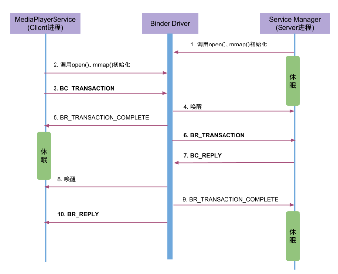

## Binder Dviver 通信过程

native层代码通过调用ioctl和binder内核的代码进行通信，最后调用到内核的binder_ioctl方法

### Binder Driver

#### [binder_ioctl](https://www.androidos.net.cn/androidkernel/4.4/xref/drivers/android/binder.c)

```c++
static long binder_ioctl(struct file *filp, unsigned int cmd, unsigned long arg)
{
	int ret;
	struct binder_proc *proc = filp->private_data;
	struct binder_thread *thread;
	unsigned int size = _IOC_SIZE(cmd);
	void __user *ubuf = (void __user *)arg;

	/*pr_info("binder_ioctl: %d:%d %x %lx\n",
			proc->pid, current->pid, cmd, arg);*/

	trace_binder_ioctl(cmd, arg);
	//当binder_stop_on_user_error>=2时，则该线程加入等待队列并进入休眠状态. 该值默认为0
	ret = wait_event_interruptible(binder_user_error_wait, binder_stop_on_user_error < 2);
	if (ret)
		goto err_unlocked;

	binder_lock(__func__);
    //查找或创建binder_thread结构体
	thread = binder_get_thread(proc);
	if (thread == NULL) {
		ret = -ENOMEM;
		goto err;
	}

	switch (cmd) {
	case BINDER_WRITE_READ:
		ret = binder_ioctl_write_read(filp, cmd, arg, thread);
		if (ret)
			goto err;
		break;
	case ...
err:
	if (thread)
		thread->looper &= ~BINDER_LOOPER_STATE_NEED_RETURN;
	binder_unlock(__func__);
	wait_event_interruptible(binder_user_error_wait, binder_stop_on_user_error < 2);
	if (ret && ret != -ERESTARTSYS)
		pr_info("%d:%d ioctl %x %lx returned %d\n", proc->pid, current->pid, cmd, arg, ret);
err_unlocked:
	trace_binder_ioctl_done(ret);
	return ret;
}
```

首先,根据传递过来的文件句柄指针获取相应的binder_proc结构体, 再从中查找binder_thread,如果当前线程已经加入到proc的线程队列则直接返回， 如果不存在则创建binder_thread，并将当前线程添加到当前的proc.

``wait_event_interruptible``是一个内核函数，它在当条件成立时将当前进程的状态设置成TASK_INTERRUPTIBLE，然后调用schedule()，而schedule()会将位于TASK_INTERRUPTIBLE状态的当前进程从runqueue队列中删除。

从runqueue队列中删除的结果是，当前这个进程将不再参与调度，而当唤醒条件满足时，又调用wake_up()重新将当前进程加入到runqueue队列中，然后该进程就可以继续被调度了。

#### binder_ioctl_write_read

```c++
static int binder_ioctl_write_read(struct file *filp,
				unsigned int cmd, unsigned long arg,
				struct binder_thread *thread)
{
	int ret = 0;
	struct binder_proc *proc = filp->private_data;
	unsigned int size = _IOC_SIZE(cmd);
	void __user *ubuf = (void __user *)arg;
	struct binder_write_read bwr;
	if (size != sizeof(struct binder_write_read)) {
		ret = -EINVAL;
		goto out;
	}
     //将用户空间bwr结构体拷贝到内核空间
	if (copy_from_user(&bwr, ubuf, sizeof(bwr))) {
		ret = -EFAULT;
		goto out;
	}
...
	if (bwr.write_size > 0) {
        //将数据放入目标进程
		ret = binder_thread_write(proc, thread,
					  bwr.write_buffer,
					  bwr.write_size,
					  &bwr.write_consumed);
        //检测数据有没有写完
		trace_binder_write_done(ret);
         //当执行失败，则直接将内核bwr结构体写回用户空间，并跳出该方法
		if (ret < 0) {
			bwr.read_consumed = 0;
			if (copy_to_user(ubuf, &bwr, sizeof(bwr)))
				ret = -EFAULT;
			goto out;
		}
	}
    //上面一步将事务写入了目标进程的线程的工作队列中，这一步唤醒目标进程去处理这些数据
	if (bwr.read_size > 0) {
        //读取自己队列的数据 
		ret = binder_thread_read(proc, thread, bwr.read_buffer,
					 bwr.read_size,
					 &bwr.read_consumed,
					 filp->f_flags & O_NONBLOCK);
		trace_binder_read_done(ret);
		binder_inner_proc_lock(proc);
         //当进程的todo队列有数据,则唤醒在该队列等待的进程
		if (!binder_worklist_empty_ilocked(&proc->todo))
			binder_wakeup_proc_ilocked(proc);
		binder_inner_proc_unlock(proc);
        //当执行失败，则直接将内核bwr结构体写回用户空间，并跳出该方法
		if (ret < 0) {
			if (copy_to_user(ubuf, &bwr, sizeof(bwr)))
				ret = -EFAULT;
			goto out;
		}
	}
	...
	if (copy_to_user(ubuf, &bwr, sizeof(bwr))) {
		ret = -EFAULT;
		goto out;
	}
out:
	return ret;
}

```

此时arg是一个`binder_write_read`结构体，`mOut`数据保存在write_buffer，所以write_size>0，但此时read_size=0。首先,将用户空间bwr结构体拷贝到内核空间,然后执行binder_thread_write()操作.

#### binder_thread_write

```c++
static int binder_thread_write(struct binder_proc *proc,
            struct binder_thread *thread,
            binder_uintptr_t binder_buffer, size_t size,
            binder_size_t *consumed)
{
    uint32_t cmd;
    void __user *buffer = (void __user *)(uintptr_t)binder_buffer;
    void __user *ptr = buffer + *consumed;
    void __user *end = buffer + size;
    while (ptr < end && thread->return_error == BR_OK) {
        //拷贝用户空间的cmd命令，此时为BC_TRANSACTION
        if (get_user(cmd, (uint32_t __user *)ptr)) -EFAULT;
        ptr += sizeof(uint32_t);
        switch (cmd) {
        case BC_TRANSACTION:
        case BC_REPLY: {
            struct binder_transaction_data tr;
            //拷贝用户空间的binder_transaction_data
            if (copy_from_user(&tr, ptr, sizeof(tr)))   return -EFAULT;
            ptr += sizeof(tr);
            // 见小节3.4】
            binder_transaction(proc, thread, &tr, cmd == BC_REPLY);
            break;
        }
        ...
    }
    *consumed = ptr - buffer;
  }
  return 0;
}
```

不断从binder_buffer所指向的地址获取cmd, 当只有`BC_TRANSACTION`或者`BC_REPLY`时, 则调用binder_transaction()来处理事务.

#### binder_transaction

该函数是binder通信中最重要的实现

```c++
static void binder_transaction(struct binder_proc *proc,
			       struct binder_thread *thread,
			       struct binder_transaction_data *tr, int reply,
			       binder_size_t extra_buffers_size)
{
	int ret;
	struct binder_transaction *t;
	struct binder_work *tcomplete;
	binder_size_t buffer_offset = 0;
	binder_size_t off_start_offset, off_end_offset;
	binder_size_t off_min;
	binder_size_t sg_buf_offset, sg_buf_end_offset;
	struct binder_proc *target_proc = NULL;
	struct binder_thread *target_thread = NULL;
	struct binder_node *target_node = NULL;
	struct binder_transaction *in_reply_to = NULL;
	struct binder_transaction_log_entry *e;
	uint32_t return_error = 0;
	uint32_t return_error_param = 0;
	uint32_t return_error_line = 0;
	binder_size_t last_fixup_obj_off = 0;
	binder_size_t last_fixup_min_off = 0;
	struct binder_context *context = proc->context;
	int t_debug_id = atomic_inc_return(&binder_last_id);
	char *secctx = NULL;
	u32 secctx_sz = 0;
	...
	if (reply) {
        //这里是处理回复相关
		...
	} else {
        //执行服务的远端service引用句柄handle
		if (tr->target.handle) {
			struct binder_ref *ref;
			/*
			 * There must already be a strong ref
			 * on this node. If so, do a strong
			 * increment on the node to ensure it
			 * stays alive until the transaction is
			 * done.
			 */
            // 由handle 找到相应 binder_ref, 由binder_ref 找到相应 binder_node
			binder_proc_lock(proc);
			ref = binder_get_ref_olocked(proc, tr->target.handle,
						     true);
			if (ref) {
                //获取目标进程的binder_proc
				target_node = binder_get_node_refs_for_txn(
						ref->node, &target_proc,
						&return_error);
			} else {
				binder_user_error("%d:%d got transaction to invalid handle\n",
						  proc->pid, thread->pid);
				return_error = BR_FAILED_REPLY;
			}
			binder_proc_unlock(proc);
		} else {
			mutex_lock(&context->context_mgr_node_lock);	
            //如果没有指定服务进程，那么一律都是servicemanager处理。
			target_node = context->binder_context_mgr_node;
			if (target_node)
				target_node = binder_get_node_refs_for_txn(
						target_node, &target_proc,
						&return_error);
			else
				return_error = BR_DEAD_REPLY;
			mutex_unlock(&context->context_mgr_node_lock);
			if (target_node && target_proc == proc) {
				binder_user_error("%d:%d got transaction to context manager from process owning it\n",
				...
			}
		}
	...
	//获取目标线程后查看是否存在
	if (target_thread)
		e->to_thread = target_thread->pid;
	e->to_proc = target_proc->pid;
	/* TODO: reuse incoming transaction for reply */
	t = kzalloc(sizeof(*t), GFP_KERNEL);
     //分配空间失败                           
	if (t == NULL) {
		return_error = BR_FAILED_REPLY;
		return_error_param = -ENOMEM;
		return_error_line = __LINE__;
		goto err_alloc_t_failed;
	}
	...
   	//非oneway的通信方式，把当前thread保存到transaction的from字段
	if (!reply && !(tr->flags & TF_ONE_WAY))
		t->from = thread;
	else
		t->from = NULL;
	t->sender_euid = task_euid(proc->tsk);
	t->to_proc = target_proc;//此次通信目标进程为system_server
	t->to_thread = target_thread;
	t->code = tr->code; //此次通信code 
	t->flags = tr->flags;// 此次通信flags = 0
	if (!(t->flags & TF_ONE_WAY) &&
	    binder_supported_policy(current->policy)) {
		/* Inherit supported policies for synchronous transactions */
		t->priority.sched_policy = current->policy;
		t->priority.prio = current->normal_prio;
	} else {
		/* Otherwise, fall back to the default priority */
		t->priority = target_proc->default_priority;
	}
	...
	trace_binder_transaction(reply, t, target_node);
    //从目标进程target_proc中分配内存空间
	t->buffer = binder_alloc_new_buf(&target_proc->alloc, tr->data_size,
		tr->offsets_size, extra_buffers_size,
		!reply && (t->flags & TF_ONE_WAY));
	...
	t->buffer->debug_id = t->debug_id;
	t->buffer->transaction = t;
	t->buffer->target_node = target_node;
	trace_binder_transaction_alloc_buf(t->buffer);
	if (binder_alloc_copy_user_to_buffer(
				&target_proc->alloc,
				t->buffer, 0,
				(const void __user *)
					(uintptr_t)tr->data.ptr.buffer,
				tr->data_size)) {
		binder_user_error("%d:%d got transaction with invalid data ptr\n",
				proc->pid, thread->pid);
		return_error = BR_FAILED_REPLY;
		return_error_param = -EFAULT;
		return_error_line = __LINE__;
		goto err_copy_data_failed;
	}
     //拷贝用户空间的binder_transaction_data中ptr.buffer和ptr.offsets到目标进程的binder_buffer
	if (binder_alloc_copy_user_to_buffer(
				&target_proc->alloc,
				t->buffer,
				ALIGN(tr->data_size, sizeof(void *)),
				(const void __user *)
					(uintptr_t)tr->data.ptr.offsets,
				tr->offsets_size)) {
		binder_user_error("%d:%d got transaction with invalid offsets ptr\n",
				proc->pid, thread->pid);
		return_error = BR_FAILED_REPLY;
		return_error_param = -EFAULT;
		return_error_line = __LINE__;
		goto err_copy_data_failed;
	}
	...
	for (buffer_offset = off_start_offset; buffer_offset < off_end_offset;
	     buffer_offset += sizeof(binder_size_t)) {
		struct binder_object_header *hdr;
		size_t object_size;
		struct binder_object object;
		binder_size_t object_offset;
		binder_alloc_copy_from_buffer(&target_proc->alloc,
					      &object_offset,
					      t->buffer,
					      buffer_offset,
					      sizeof(object_offset));
		object_size = binder_get_object(target_proc, t->buffer,
						object_offset, &object);
		if (object_size == 0 || object_offset < off_min) {
			binder_user_error("%d:%d got transaction with invalid offset (%lld, min %lld max %lld) or object.\n",
					  proc->pid, thread->pid,
					  (u64)object_offset,
					  (u64)off_min,
					  (u64)t->buffer->data_size);
			return_error = BR_FAILED_REPLY;
			return_error_param = -EINVAL;
			return_error_line = __LINE__;
			goto err_bad_offset;
		}
		hdr = &object.hdr;
		off_min = object_offset + object_size;
		switch (hdr->type) {
		case BINDER_TYPE_BINDER:
		case BINDER_TYPE_WEAK_BINDER: {
            	struct flat_binder_object *fp;
			fp = to_flat_binder_object(hdr);
			ret = binder_translate_binder(fp, t, thread);
			if (ret < 0) {
				return_error = BR_FAILED_REPLY;
				return_error_param = ret;
				return_error_line = __LINE__;
				goto err_translate_failed;
			}
			binder_alloc_copy_to_buffer(&target_proc->alloc,
						    t->buffer, object_offset,
						    fp, sizeof(*fp));
		} break;
		case BINDER_TYPE_HANDLE:
		case BINDER_TYPE_WEAK_HANDLE: {
		case BINDER_TYPE_FD: {
		case BINDER_TYPE_FDA: {
		case BINDER_TYPE_PTR: {
		default:
			binder_user_error("%d:%d got transaction with invalid object type, %x\n",
				proc->pid, thread->pid, hdr->type);
			return_error = BR_FAILED_REPLY;
			return_error_param = -EINVAL;
			return_error_line = __LINE__;
			goto err_bad_object_type;
		}
	}
 	//将BINDER_WORK_TRANSACTION_COMPLETE添加到当前线程队列，即thread->todo
	tcomplete->type = BINDER_WORK_TRANSACTION_COMPLETE;
    //将BINDER_WORK_TRANSACTION添加到目标队列,即target_proc->todo       
	t->work.type = BINDER_WORK_TRANSACTION;
	if (reply) {
         //BC_REPLY的过程,binder_enqueue_thread_work最终调用下面的list_add_tail
        //将事务插入到目标进程的现场队列中
		binder_enqueue_thread_work(thread, tcomplete);
		binder_inner_proc_lock(target_proc);
		if (target_thread->is_dead) {
			binder_inner_proc_unlock(target_proc);
			goto err_dead_proc_or_thread;
		}
		BUG_ON(t->buffer->async_transaction != 0);
		binder_pop_transaction_ilocked(target_thread, in_reply_to);
		binder_enqueue_thread_work_ilocked(target_thread, &t->work);
		binder_inner_proc_unlock(target_proc);
         //唤醒等待队列，本次通信的目标队列为target_proc->wait
		wake_up_interruptible_sync(&target_thread->wait);
		binder_restore_priority(current, in_reply_to->saved_priority);
		binder_free_transaction(in_reply_to);
	} else if (!(t->flags & TF_ONE_WAY)) {
        //BC_TRANSACTION 且 非oneway,则设置事务栈信息
		binder_inner_proc_lock(proc);
		/*
		 * Defer(推迟) the TRANSACTION_COMPLETE, so we don't return to
		 * userspace immediately; this allows the target process to
		 * immediately start processing this transaction, reducing
		 * latency(延迟 ). We will then return the TRANSACTION_COMPLETE when
		 * the target replies (or there is an error).
		 */
        //将事务BINDER_WORK_TRANSACTION_COMPLETE添加到thread的todo列表
        //延迟处理，等待reply
		binder_enqueue_deferred_thread_work_ilocked(thread, tcomplete);
		t->need_reply = 1;
		t->from_parent = thread->transaction_stack;
		thread->transaction_stack = t;
		binder_inner_proc_unlock(proc);
        //发送一个事务BINDER_WORK_TRANSACTION给目标进程，唤醒该目标进程去执行。见下一小节
		if (!binder_proc_transaction(t, target_proc, target_thread)) {
			binder_inner_proc_lock(proc);
			binder_pop_transaction_ilocked(thread, t);
			binder_inner_proc_unlock(proc);
			goto err_dead_proc_or_thread;
		}
	} else {
        //BC_TRANSACTION 且 oneway,则加入异步todo队列
        //将BINDER_WORK_TRANSACTION_COMPLETE添加到thread的todo队列，无需等待，立刻处理，
        //不需要等待reply
		binder_enqueue_thread_work(thread, tcomplete);
		if (!binder_proc_transaction(t, target_proc, NULL))
			goto err_dead_proc_or_thread;
	}

...
	
}
  //下面量方法的调用目的是往目标的工作线程中添加一个事务
 static void binder_enqueue_work_ilocked(struct binder_work *work,
			   struct list_head *target_list)
{
	BUG_ON(target_list == NULL);
	BUG_ON(work->entry.next && !list_empty(&work->entry));
	list_add_tail(&work->entry, target_list);
}

static void
binder_enqueue_deferred_thread_work_ilocked(struct binder_thread *thread,
					    struct binder_work *work)
{
	binder_enqueue_work_ilocked(work, &thread->todo);
}
          
```

#### binder_proc_transaction

这一步的目的是发送一个transaction去一个目标进程并唤醒它，将事务发送给目标进程的目标线程

```c++
/**
 * binder_proc_transaction() - sends a transaction to a process and wakes it up
 * @t:		transaction to send
 * @proc:	process to send the transaction to
 * @thread:	thread in @proc to send the transaction to (may be NULL)
 *
 * This function queues a transaction to the specified process. It will try
 * to find a thread in the target process to handle the transaction and
 * wake it up. If no thread is found, the work is queued to the proc
 * waitqueue.
 *
 * If the @thread parameter is not NULL, the transaction is always queued
 * to the waitlist of that specific thread.
 *
 * Return:	true if the transactions was successfully queued
 *		false if the target process or thread is dead
 */
static bool binder_proc_transaction(struct binder_transaction *t,
                struct binder_proc *proc,
                struct binder_thread *thread)
{
   struct binder_node *node = t->buffer->target_node;
   struct binder_priority node_prio;
   //判断是否需要onewy
   bool oneway = !!(t->flags & TF_ONE_WAY);
   bool pending_async = false;
   BUG_ON(!node);
   binder_node_lock(node);
   node_prio.prio = node->min_priority;
   node_prio.sched_policy = node->sched_policy;
   if (oneway) {
      BUG_ON(thread);
      if (node->has_async_transaction) {
         pending_async = true;
      } else {
         node->has_async_transaction = true;
      }
   }
   binder_inner_proc_lock(proc);
    //如果进程死了或者线程也死了，返回false
   if (proc->is_dead || (thread && thread->is_dead)) {
      binder_inner_proc_unlock(proc);
      binder_node_unlock(node);
      return false;
   }
   if (!thread && !pending_async)
      thread = binder_select_thread_ilocked(proc);
   if (thread) {
      binder_transaction_priority(thread->task, t, node_prio,
                   node->inherit_rt);
      //将工作添加到线程的todo列表中，并启用todo队列的处理。
      binder_enqueue_thread_work_ilocked(thread, &t->work);
   } else if (!pending_async) {
      binder_enqueue_work_ilocked(&t->work, &proc->todo);
   } else {
      binder_enqueue_work_ilocked(&t->work, &node->async_todo);
   }
   if (!pending_async)
      binder_wakeup_thread_ilocked(proc, thread, !oneway /* sync */);
   binder_inner_proc_unlock(proc);
   binder_node_unlock(node);
   return true;
}
/**
 * binder_wakeup_thread_ilocked() - wakes up a thread for doing proc work.
 * @proc:	process to wake up a thread in
 * @thread:	specific thread to wake-up (may be NULL)
 * @sync:	whether to do a synchronous wake-up
 *
 * This function wakes up a thread in the @proc process.
 * The caller may provide a specific thread to wake-up in
 * the @thread parameter. If @thread is NULL, this function
 * will wake up threads that have called poll().
 
 * 此函数用于唤醒@proc进程中的线程。调用者可以在@thread参数中提供一个特定的线程来唤醒。
 * 如果@thread为 NULL，此函数将唤醒调用poll（）的线程
 
 * Note that for this function to work as expected, callers
 * should first call binder_select_thread() to find a thread
 * to handle the work (if they don't have a thread already),
 * and pass the result into the @thread parameter.
 */
static void binder_wakeup_thread_ilocked(struct binder_proc *proc,
					 struct binder_thread *thread,
					 bool sync)
{
	assert_spin_locked(&proc->inner_lock);
	if (thread) {
		if (sync)
			wake_up_interruptible_sync(&thread->wait);
		else
			wake_up_interruptible(&thread->wait);
		return;
	}
	/* Didn't find a thread waiting for proc work; this can happen
	 * in two scenarios:
	 * 1. All threads are busy handling transactions
	 *    In that case, one of those threads should call back into
	 *    the kernel driver soon and pick up this work.
	 * 2. Threads are using the (e)poll interface, in which case
	 *    they may be blocked on the waitqueue without having been
	 *    added to waiting_threads. For this case, we just iterate
	 *    over all threads not handling transaction work, and
	 *    wake them all up. We wake all because we don't know whether
	 *    a thread that called into (e)poll is handling non-binder
	 *    work currently.
	 */
	binder_wakeup_poll_threads_ilocked(proc, sync);
}
```


主要功能:

1. 查询目标进程的过程： handle -> binder_ref -> binder_node -> binder_proc

2. 将BINDER_WORK_TRANSACTION

   添加到目标队列target_list:

   - call事务， 则目标队列target_list=`target_proc->todo`;
   - reply事务，则目标队列target_list=`target_thread->todo`;
   - async事务，则目标队列target_list=`target_node->async_todo`.

3. 数据拷贝

   - 将用户空间binder_transaction_data中ptr.buffer和ptr.offsets拷贝到目标进程的binder_buffer->data；
   - 这就是只拷贝一次的真理所在；

4. 设置事务栈信息

   - BC_TRANSACTION且非oneway, 则将当前事务添加到thread->transaction_stack；

5. 事务分发过程：

   - 将`BINDER_WORK_TRANSACTION`添加到目标队列(此时为target_proc->todo队列);
   - 将`BINDER_WORK_TRANSACTION_COMPLETE`添加到当前线程thread->todo队列;

6. 唤醒目标进程target_proc开始执行事务。

   - 如果当前是oneway，那么立刻唤醒当前进程的线程去处理`BINDER_WORK_TRANSACTION_COMPLETE`
   - 如果需要reply，那么需要去目标进程去唤醒一个线程来插入到todo中的事务。当目标进程中没有等待的空闲线程可用时，可能发生下面两种情况
     - 如果所有的现场都在忙于干活,那么需要马上让其中一个回复内核并且马上执行该项事务
     - 如果线程们因为调用poll方法阻塞在等待队列中，我们需要遍历所有的没有处理事务的线程（handling transaction work），唤醒它,我们需要唤醒所有的线程，因为我们并不知道当前哪个线程是因为handling non-binder而调用poll的。

该方法中proc/thread是指当前发起方的进程信息，而binder_proc是指目标接收端进程。 此时当前线程thread的todo队列已经有事务, 接下来便会进入binder_thread_read来处理相关的事务.

#### binder_thread_read

插入到目标进程的线程的todo队列中后，目标线程就开始读取工作了。

```c++
binder_thread_read（）{
   void __user *buffer = (void __user *)(uintptr_t)binder_buffer;
	void __user *ptr = buffer + *consumed;
	void __user *end = buffer + size;
	int ret = 0;
	int wait_for_proc_work;
    //当已使用字节数为0时，将BR_NOOP响应码放入指针ptr
	if (*consumed == 0) {
		if (put_user(BR_NOOP, (uint32_t __user *)ptr))
			return -EFAULT;
		ptr += sizeof(uint32_t);
	}
retry:
	binder_inner_proc_lock(proc);
    //判断当前线程是否在等待工作，空闲就位false
	wait_for_proc_work = binder_available_for_proc_work_ilocked(thread);
	binder_inner_proc_unlock(proc);
    //添加等待工作状态
	thread->looper |= BINDER_LOOPER_STATE_WAITING;
	trace_binder_wait_for_work(wait_for_proc_work,
				   !!thread->transaction_stack,
				   !binder_worklist_empty(proc, &thread->todo));
	if (wait_for_proc_work) {
		if (!(thread->looper & (BINDER_LOOPER_STATE_REGISTERED |
					BINDER_LOOPER_STATE_ENTERED))) {
			binder_user_error("%d:%d ERROR: Thread waiting for process work before calling BC_REGISTER_LOOPER or BC_ENTER_LOOPER (state %x)\n",
				proc->pid, thread->pid, thread->looper);
            //当进程todo队列没有数据,则进入休眠等待状态
			wait_event_interruptible(binder_user_error_wait,
						 binder_stop_on_user_error < 2);
		}
		binder_restore_priority(current, proc->default_priority);
	}
	if (non_block) {
		if (!binder_has_work(thread, wait_for_proc_work))
			ret = -EAGAIN;
	} else {
         //当线程todo队列有数据则执行往下执行；当线程todo队列没有数据，则进入休眠等待状态
		ret = binder_wait_for_work(thread, wait_for_proc_work);
	}
    //退出等待状态, 则进程中空闲binder线程减1
	thread->looper &= ~BINDER_LOOPER_STATE_WAITING;
	if (ret)
		return ret;

    while (1) {

        uint32_t cmd;
        struct binder_transaction_data tr;
        struct binder_work *w;
        struct binder_transaction *t = NULL;
        //先从线程todo队列获取事务数据
        if (!list_empty(&thread->todo)) {
            w = list_first_entry(&thread->todo, struct binder_work, entry);
        // 线程todo队列没有数据, 则从进程todo对获取事务数据
        } else if (!list_empty(&proc->todo) && wait_for_proc_work) {
            w = list_first_entry(&proc->todo, struct binder_work, entry);
        } else {
            //没有数据,则返回retry
            if (ptr - buffer == 4 &&
                !(thread->looper & BINDER_LOOPER_STATE_NEED_RETURN))
                goto retry;
            break;
        }

        switch (w->type) {
            case BINDER_WORK_TRANSACTION:
                //获取transaction数据
                t = container_of(w, struct binder_transaction, work);
                break;

            case BINDER_WORK_TRANSACTION_COMPLETE:
                cmd = BR_TRANSACTION_COMPLETE;
                //将BR_TRANSACTION_COMPLETE写入*ptr，并跳出循环。
                put_user(cmd, (uint32_t __user *)ptr)；
                list_del(&w->entry);
                kfree(w);
                break;

            case BINDER_WORK_NODE: ...    break;
            case BINDER_WORK_DEAD_BINDER:
            case BINDER_WORK_DEAD_BINDER_AND_CLEAR:
            case BINDER_WORK_CLEAR_DEATH_NOTIFICATION: ...   break;
        }

        //只有BINDER_WORK_TRANSACTION命令才能继续往下执行
        if (!t)
            continue;

        if (t->buffer->target_node) {
            //获取目标node
            struct binder_node *target_node = t->buffer->target_node;
            tr.target.ptr = target_node->ptr;
            tr.cookie =  target_node->cookie;
            t->saved_priority = task_nice(current);
            ...
            cmd = BR_TRANSACTION;  //设置命令为BR_TRANSACTION
        } else {
            tr.target.ptr = NULL;
            tr.cookie = NULL;
            cmd = BR_REPLY; //设置命令为BR_REPLY
        }
        tr.code = t->code;
        tr.flags = t->flags;
        tr.sender_euid = t->sender_euid;

        if (t->from) {
            struct task_struct *sender = t->from->proc->tsk;
            //当非oneway的情况下,将调用者进程的pid保存到sender_pid
            tr.sender_pid = task_tgid_nr_ns(sender,
                            current->nsproxy->pid_ns);
        } else {
            //当oneway的的情况下,则该值为0
            tr.sender_pid = 0;
        }

        tr.data_size = t->buffer->data_size;
        tr.offsets_size = t->buffer->offsets_size;
        tr.data.ptr.buffer = (void *)t->buffer->data + proc->user_buffer_offset;
        tr.data.ptr.offsets = tr.data.ptr.buffer +
                    ALIGN(t->buffer->data_size, sizeof(void *));

        //将cmd和数据写回用户空间
        if (put_user(cmd, (uint32_t __user *)ptr))
            return -EFAULT;
        ptr += sizeof(uint32_t);
        if (copy_to_user(ptr, &tr, sizeof(tr)))
            return -EFAULT;
        ptr += sizeof(tr);

        list_del(&t->work.entry);
        t->buffer->allow_user_free = 1;
        if (cmd == BR_TRANSACTION && !(t->flags & TF_ONE_WAY)) {
            t->to_parent = thread->transaction_stack;
            t->to_thread = thread;
            thread->transaction_stack = t;
        } else {
            t->buffer->transaction = NULL;
            kfree(t); //通信完成,则运行释放
        }
        break;
    }
done:
    *consumed = ptr - buffer;
    //当满足请求线程加已准备线程数等于0，已启动线程数小于最大线程数(15)，
    //且looper状态为已注册或已进入时创建新的线程。
    if (proc->requested_threads + proc->ready_threads == 0 &&
        proc->requested_threads_started < proc->max_threads &&
        (thread->looper & (BINDER_LOOPER_STATE_REGISTERED |
         BINDER_LOOPER_STATE_ENTERED))) {
        proc->requested_threads++;
        // 生成BR_SPAWN_LOOPER命令，用于创建新的线程
        put_user(BR_SPAWN_LOOPER, (uint32_t __user *)buffer)；
    }
    return 0;
}
```

该方法功能说明:

此处wait_for_proc_work是指当前线程todo队列为空，并且transaction_stack也为空,该值为true.

1. 当wait_for_proc_work = false, 则进入线程的等待队列thread->wait, 直到thread->todo队列有事务才往下执行;
   - 获取并处理thread->todo队列中的事务;将相应的cmd和数据写回用户空间.
2. 当wait_for_proc_work = true, 则进入线程的等待队列proc->wait, 直到proc->todo队列有事务才往下执行;
   - 获取并处理proc->todo队列中的事务;将相应的cmd和数据写回用户空间.

到这里,可能有人好奇,对于[小节3.4]介绍了target_list有3种, 这里只会处理前2种:thread->todo, proc->todo.那么对于 target_node->async_todo的处理过程时间呢? [见小节5.4]

###  服务端响应事务

1. 执行完binder_thread_write方法后, 通过binder_transaction()首先写入`BINDER_WORK_TRANSACTION_COMPLETE`写入当前线程.
2. 这时bwr.read_size > 0, 回到binder_ioctl_write_read方法, 便开始执行binder_thread_read();
3. 在binder_thread_read()方法, 将获取cmd=BR_TRANSACTION_COMPLETE, 再将cmd和数据写回用户空间;
4. 一次Binder_ioctl完成,接着回调用户空间方法talkWithDriver(),刚才的数据以写入mIn.
5. 这时mIn有可读数据, 回到IPC.waitForResponse()方法,完成BR_TRANSACTION_COMPLETE过程. 如果本次transaction采用非oneway方式, 这次Binder通信便完成, 否则还是要等待Binder服务端的返回。

对于startService过程, 采用的便是非oneway方式,那么发起者进程还会继续停留在waitForResponse()方法,继续talkWithDriver()，然后休眠在binder_thread_read()的wait_event_freezable()过程，等待当前线程的todo队列有数据的到来，即等待收到BR_REPLY消息.

由于在前面binder_transaction()除了向自己所在线程写入了`BINDER_WORK_TRANSACTION_COMPLETE`, 还向目标进程(此处为system_server)写入了`BINDER_WORK_TRANSACTION`命令，那么接下里介绍system_server进程的工作。

### binder_parse

> https://www.androidos.net.cn/android/9.0.0_r8/xref/frameworks/native/cmds/servicemanager/binder.c

由[Binder系列3—启动ServiceManager](http://gityuan.com/2015/11/07/binder-start-sm/)已介绍其原理，循环在binder_loop()过程， 会调用binder_parse()方法。

```c++
int binder_parse(struct binder_state *bs, struct binder_io *bio,
                 uintptr_t ptr, size_t size, binder_handler func)
{
    int r = 1;
    uintptr_t end = ptr + (uintptr_t) size;

    while (ptr < end) {
        uint32_t cmd = *(uint32_t *) ptr;
        ptr += sizeof(uint32_t);
#if TRACE
        fprintf(stderr,"%s:\n", cmd_name(cmd));
#endif
        switch(cmd) {
        case BR_NOOP:
            break;
        case BR_TRANSACTION_COMPLETE:
            break;
        case BR_INCREFS:
        case BR_ACQUIRE:
        case BR_RELEASE:
        case BR_DECREFS:
#if TRACE
            fprintf(stderr,"  %p, %p\n", (void *)ptr, (void *)(ptr + sizeof(void *)));
#endif
            ptr += sizeof(struct binder_ptr_cookie);
            break;
        case BR_TRANSACTION_SEC_CTX:
        case BR_TRANSACTION: {
            struct binder_transaction_data_secctx txn;
            if (cmd == BR_TRANSACTION_SEC_CTX) {
             ...
            } else /* BR_TRANSACTION */ {
                if ((end - ptr) < sizeof(struct binder_transaction_data)) {
                    ALOGE("parse: txn too small (binder_transaction_data)!\n");
                    return -1;
                }
                memcpy(&txn.transaction_data, (void*) ptr, sizeof(struct binder_transaction_data));
                ptr += sizeof(struct binder_transaction_data);

                txn.secctx = 0;
            }

            binder_dump_txn(&txn.transaction_data);
            if (func) {
                unsigned rdata[256/4];
                struct binder_io msg;
                struct binder_io reply;
                int res;

                bio_init(&reply, rdata, sizeof(rdata), 4);
                 //从txn解析出binder_io信息
                bio_init_from_txn(&msg, &txn.transaction_data);
                res = func(bs, &txn, &msg, &reply);
                if (txn.transaction_data.flags & TF_ONE_WAY，) {
                    //如果是TF_ONE_WAY，那么无需返回数据，直接清空buffer
                    binder_free_buffer(bs, txn.transaction_data.data.ptr.buffer);
                } else {
                    binder_send_reply(bs, &reply, txn.transaction_data.data.ptr.buffer, res);
                }
            }
            break;
        }
        case BR_REPLY: {
         ...
        case BR_DEAD_BINDER: {
           ...
        }
    }

    return r;
}
        
 void binder_loop(struct binder_state *bs, binder_handler func)
 binder_loop(bs, svcmgr_handler);
```

注意了，这里的func就是前面binder_loop传进来的``svcmgr_handler``，通过这里的传过来的命令返回相应的结果。

### svcmgr_handler

> https://www.androidos.net.cn/android/9.0.0_r8/xref/frameworks/native/cmds/servicemanager/service_manager.c

```c++
int svcmgr_handler(struct binder_state *bs,
                   struct binder_transaction_data_secctx *txn_secctx,
                   struct binder_io *msg,
                   struct binder_io *reply)
{
    struct svcinfo *si;
    uint16_t *s;
    size_t len;
    uint32_t handle;
    uint32_t strict_policy;
    int allow_isolated;
    uint32_t dumpsys_priority;

    struct binder_transaction_data *txn = &txn_secctx->transaction_data;

    //ALOGI("target=%p code=%d pid=%d uid=%d\n",
    //      (void*) txn->target.ptr, txn->code, txn->sender_pid, txn->sender_euid);

    if (txn->target.ptr != BINDER_SERVICE_MANAGER)
        return -1;

    if (txn->code == PING_TRANSACTION)
        return 0;

    // Equivalent to Parcel::enforceInterface(), reading the RPC
    // header with the strict mode policy mask and the interface name.
    // Note that we ignore the strict_policy and don't propagate it
    // further (since we do no outbound RPCs anyway).
    strict_policy = bio_get_uint32(msg);
    bio_get_uint32(msg);  // Ignore worksource header.
    s = bio_get_string16(msg, &len);
    if (s == NULL) {
        return -1;
    }

    if ((len != (sizeof(svcmgr_id) / 2)) ||
        memcmp(svcmgr_id, s, sizeof(svcmgr_id))) {
        fprintf(stderr,"invalid id %s\n", str8(s, len));
        return -1;
    }

    if (sehandle && selinux_status_updated() > 0) {
#ifdef VENDORSERVICEMANAGER
        struct selabel_handle *tmp_sehandle = selinux_android_vendor_service_context_handle();
#else
        struct selabel_handle *tmp_sehandle = selinux_android_service_context_handle();
#endif
        if (tmp_sehandle) {
            selabel_close(sehandle);
            sehandle = tmp_sehandle;
        }
    }

    switch(txn->code) {
    //SVC_MGR_GET_SERVICE 其实调用的是SVC_MGR_CHECK_SERVICE，
    case SVC_MGR_GET_SERVICE:
    case SVC_MGR_CHECK_SERVICE:
     ...

    case SVC_MGR_ADD_SERVICE:
        
        s = bio_get_string16(msg, &len);
        if (s == NULL) {
            return -1;
        }
        handle = bio_get_ref(msg);
        allow_isolated = bio_get_uint32(msg) ? 1 : 0;
        dumpsys_priority = bio_get_uint32(msg);
       //注册指定服务 【
        if (do_add_service(bs, s, len, handle, txn->sender_euid, allow_isolated, dumpsys_priority, txn->sender_pid, (const char*) txn_secctx->secctx))
            return -1;
        break;

    case SVC_MGR_LIST_SERVICES: {
       ...
    }
    default:
        ALOGE("unknown code %d\n", txn->code);
        return -1;
    }

    bio_put_uint32(reply, 0);
    return 0;
}

```

### do_add_service

```c++
int do_add_service(struct binder_state *bs, const uint16_t *s, size_t len, uint32_t handle,
                   uid_t uid, int allow_isolated, uint32_t dumpsys_priority, pid_t spid, const char* sid) {
    struct svcinfo *si;

    //ALOGI("add_service('%s',%x,%s) uid=%d\n", str8(s, len), handle,
    //        allow_isolated ? "allow_isolated" : "!allow_isolated", uid);

    if (!handle || (len == 0) || (len > 127))
        return -1;
	//权限检查
    if (!svc_can_register(s, len, spid, sid, uid)) {
        ALOGE("add_service('%s',%x) uid=%d - PERMISSION DENIED\n",
             str8(s, len), handle, uid);
        return -1;
    }
    //服务检索
    si = find_svc(s, len);
    if (si) {
        if (si->handle) {
            ALOGE("add_service('%s',%x) uid=%d - ALREADY REGISTERED, OVERRIDE\n",
                 str8(s, len), handle, uid);
            //服务已注册时，释放相应的服务,然后重新注册更新
            svcinfo_death(bs, si);
        }
        si->handle = handle;
    } else {
        si = malloc(sizeof(*si) + (len + 1) * sizeof(uint16_t));
        if (!si) {
             //内存不足，无法分配足够内存
            ALOGE("add_service('%s',%x) uid=%d - OUT OF MEMORY\n",
                 str8(s, len), handle, uid);
            return -1;
        }
        si->handle = handle;
        si->len = len;
        memcpy(si->name, s, (len + 1) * sizeof(uint16_t));
        si->name[len] = '\0';
        si->death.func = (void*) svcinfo_death;
        si->death.ptr = si;
        si->allow_isolated = allow_isolated;
        si->dumpsys_priority = dumpsys_priority;
        si->next = svclist;// svclist保存所有已注册的服务
        svclist = si;
    }
	//以BC_ACQUIRE命令，handle为目标的信息，通过ioctl发送给binder驱动
    binder_acquire(bs, handle);
    //以BC_REQUEST_DEATH_NOTIFICATION命令的信息，通过ioctl发送给binder驱动，主要用于清理内存等收尾工作。
    binder_link_to_death(bs, handle, &si->death);
    return 0;
}

```

### binder_send_reply

在调用了``  res = func(bs, &txn, &msg, &reply);``获取了返回值后，如果不是TF_ONE_WAY,的情况下，需要返回reply信息给内核。

```c++
binder_send_reply(struct binder_state *bs,
                       struct binder_io *reply,
                       binder_uintptr_t buffer_to_free,
                       int status)
{
    struct {
        uint32_t cmd_free;
        binder_uintptr_t buffer;
        uint32_t cmd_reply;
        struct binder_transaction_data txn;
    } __attribute__((packed)) data;

    data.cmd_free = BC_FREE_BUFFER;//清楚buffer
    data.buffer = buffer_to_free;
    data.cmd_reply = BC_REPLY;//REPLY命令
    data.txn.target.ptr = 0;
    data.txn.cookie = 0;
    data.txn.code = 0;
    //判断func是否完成了功能，返回了正确的值，默认正确操作后返回0
    if (status) {
      ...
    } else {
        data.txn.flags = 0;
        data.txn.data_size = reply->data - reply->data0;
        data.txn.offsets_size = ((char*) reply->offs) - ((char*) reply->offs0);
        data.txn.data.ptr.buffer = (uintptr_t)reply->data0;
        data.txn.data.ptr.offsets = (uintptr_t)reply->offs0;
    }
    binder_write(bs, &data, sizeof(data));
}

```

binder_write进入binder驱动后，将BC_FREE_BUFFER和BC_REPLY命令协议发送给Binder驱动， 向client端发送reply.

## 总结

服务注册过程(addService)核心功能：在服务所在进程创建binder_node，在servicemanager进程创建binder_ref。 其中binder_ref的desc再同一个进程内是唯一的：

- 每个进程binder_proc所记录的binder_ref的handle值是从1开始递增的；
- 所有进程binder_proc所记录的handle=0的binder_ref都指向service manager；
- 同一个服务的binder_node在不同进程的binder_ref的handle值可以不同；

Media服务注册的过程涉及到MediaPlayerService(作为Client进程)和Service Manager(作为Service进程)，通信流程图如下所示：



过程分析：

1. MediaPlayerService进程调用ioctl()

   向Binder驱动发送IPC数据，该过程可以理解成一个事务binder_transaction(记为T1)，执行当前操作的线程binder_thread(记为thread1)，则T1->from_parent=NULL，T1->from =thread1

   ，thread1->transaction_stack=T1。其中IPC数据内容包含：

   - Binder协议为BC_TRANSACTION；
   - Handle等于0；
   - RPC代码为ADD_SERVICE；
   - RPC数据为”media.player”。

2. Binder驱动收到该Binder请求，生成`BR_TRANSACTION`命令，选择目标处理该请求的线程，即ServiceManager的binder线程(记为`thread2`)，则 T1->to_parent = NULL，T1->to_thread = `thread2`。并将整个binder_transaction数据(记为`T2`)插入到目标线程的todo队列；

3. Service Manager的线程`thread2`收到`T2`后，调用服务注册函数将服务”media.player”注册到服务目录中。当服务注册完成后，生成IPC应答数据(`BC_REPLY`)，T2->form_parent = T1，T2->from = thread2, thread2->transaction_stack = T2。

4. Binder驱动收到该Binder应答请求，生成`BR_REPLY`命令，T2->to_parent = T1，T2->to_thread = thread1, thread1->transaction_stack = T2。 在MediaPlayerService收到该命令后，知道服务注册完成便可以正常使用。

整个过程中，BC_TRANSACTION和BR_TRANSACTION过程是一个完整的事务过程；BC_REPLY和BR_REPLY是一个完整的事务过程。 到此，其他进行便可以获取该服务，使用服务提供的方法，下一篇文章将会讲述[如何获取服务](http://gityuan.com/2015/11/15/binder-get-service/)。