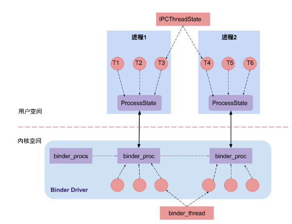
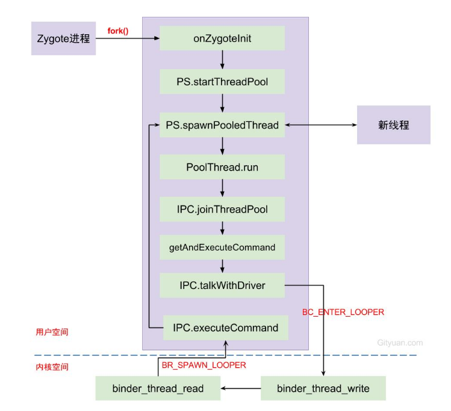

## ProcessState和IPCThreadState



[听说你Binder机制学的不错，来面试下这几个问题（一）](https://cloud.tencent.com/developer/article/1154077)

[gityuan binder线程池](http://gityuan.com/2016/10/29/binder-thread-pool/)

## 源码位置

> https://www.androidos.net.cn/android/10.0.0_r6/xref/frameworks/native/libs/binder/
>
> #### frameworks/native/libs/binder/  
>
> - IPCThreadState.cpp  
>
> - ProcessState.cpp  

### ProcessState

一个进程中只有一个ProcessState，且只有在ProcessState对象建立时才打开Binder设备以及做内存映射

#### ProcessState::self()

```c++
sp<ProcessState> ProcessState::self()
{
    Mutex::Autolock _l(gProcessMutex);
    if (gProcess != nullptr) {
        return gProcess;
    }
    //const char* kDefaultDriver = "/dev/binder"
    gProcess = new ProcessState(kDefaultDriver);
    return gProcess;
}
```

获得ProcessState对象: 这也是**单例模式**，从而保证每一个进程只有一个`ProcessState`对象。其中`gProcess`和`gProcessMutex`是保存在`Static.cpp`类的全局变量。

#### 初始化

```c++
ProcessState::ProcessState(const char *driver)
    : mDriverName(String8(driver))
     //根据驱动字符打开binder驱动
    , mDriverFD(open_driver(driver))
    , mVMStart(MAP_FAILED)
    , mThreadCountLock(PTHREAD_MUTEX_INITIALIZER)
    , mThreadCountDecrement(PTHREAD_COND_INITIALIZER)
    , mExecutingThreadsCount(0)
     //最大bidner线程为15
    , mMaxThreads(DEFAULT_MAX_BINDER_THREADS)
    , mStarvationStartTimeMs(0)
    , mManagesContexts(false)
    , mBinderContextCheckFunc(nullptr)
    , mBinderContextUserData(nullptr)
    , mThreadPoolStarted(false)
    , mThreadPoolSeq(1)
    , mCallRestriction(CallRestriction::NONE)
{
    if (mDriverFD >= 0) {
        // mmap the binder, providing a chunk of virtual address space to receive transactions.
        //采用内存映射函数mmap，给binder分配一块虚拟地址空间来接收事务
        mVMStart = mmap(nullptr, BINDER_VM_SIZE, PROT_READ, MAP_PRIVATE | MAP_NORESERVE, mDriverFD, 0);
        if (mVMStart == MAP_FAILED) {
            // *sigh*
            ALOGE("Using %s failed: unable to mmap transaction memory.\n", mDriverName.c_str());
            //没有足够空间分配给/dev/binder,则关闭驱动
            close(mDriverFD);
            mDriverFD = -1;
            mDriverName.clear();
        }
    }

    LOG_ALWAYS_FATAL_IF(mDriverFD < 0, "Binder driver could not be opened.  Terminating.");
}

```


- `ProcessState`的单例模式的惟一性，因此一个进程只打开binder设备一次,其中ProcessState的成员变量
- `mDriverFD`记录binder驱动的fd，用于访问binder设备。
- `BINDER_VM_SIZE = (1*1024*1024) - (4096 *2)`, binder分配的默认内存大小为1M-8k。
- `DEFAULT_MAX_BINDER_THREADS = 15`，binder默认的最大可并发访问的线程数为16。


#### ProcessState::open_driver

```c++
static int open_driver(const char *driver)
{	///dev/binder设备，建立通道，fd这里应该是对binder驱动的一个标识
    int fd = open(driver, O_RDWR | O_CLOEXEC);
    if (fd >= 0) {
        int vers = 0;
        status_t result = ioctl(fd, BINDER_VERSION, &vers);
        if (result == -1) {
            ALOGE("Binder ioctl to obtain version failed: %s", strerror(errno));
            close(fd);
            fd = -1;
        }
        if (result != 0 || vers != BINDER_CURRENT_PROTOCOL_VERSION) {
          ALOGE("Binder driver protocol(%d) does not match user space protocol(%d)! ioctl() return value: %d",
                vers, BINDER_CURRENT_PROTOCOL_VERSION, result);
            close(fd);
            fd = -1;
        }
        size_t maxThreads = DEFAULT_MAX_BINDER_THREADS;
        // 通过ioctl设置binder驱动，能支持的最大线程数
        // BINDER_SET_MAX_THREADS就是一个事务
        result = ioctl(fd, BINDER_SET_MAX_THREADS, &maxThreads);
        if (result == -1) {
            ALOGE("Binder ioctl to set max threads failed: %s", strerror(errno));
        }
    } else {
        ALOGW("Opening '%s' failed: %s\n", driver, strerror(errno));
    }
    return fd;
}
```

ProcessState采用单例模式，保证每一个进程都只打开一次Binder Driver。

  

#### mmap

```c++
//原型
void* mmap(void* addr, size_t size, int prot, int flags, int fd, off_t offset) 
//此处 mmap(0, BINDER_VM_SIZE, PROT_READ, MAP_PRIVATE | MAP_NORESERVE, mDriverFD, 0);
```

参数说明：

- addr: 代表映射到进程地址空间的起始地址，当值等于0则由内核选择合适地址，此处为0；
- size: 代表需要映射的内存地址空间的大小，此处为1M-8K；
- prot: 代表内存映射区的读写等属性值，此处为PROT_READ(可读取);
- flags: 标志位，此处为MAP_PRIVATE(私有映射，多进程间不共享内容的改变)和 MAP_NORESERVE(不保留交换空间)
- fd: 代表mmap所关联的文件描述符，此处为mDriverFD；
- offset：偏移量，此处为0。

mmap()经过系统调用，执行[binder_mmap](http://gityuan.com/2015/11/01/binder-driver/)过程。

#### ProcessState::startThreadPool

```c++
void ProcessState::startThreadPool()
{
    AutoMutex _l(mLock);    //多线程同步
    if (!mThreadPoolStarted) {
        mThreadPoolStarted = true;
        spawnPooledThread(true);  
    }
}
//从函数名看起来是创建线程池，其实就只是创建一个线程，
//PoolThread继承Thread类。t->run()方法最终调用 PoolThread的threadLoop()方法。
void ProcessState::spawnPooledThread(bool isMain)
{
     if (mThreadPoolStarted) {
        String8 name = makeBinderThreadName();
        ALOGV("Spawning new pooled thread, name=%s\n", name.string());
        sp<Thread> t = new PoolThread(isMain);
        t->run(name.string());
    }
}
//获取Binder线程名，格式为Binder_x, 其中x为整数。每个进程中的binder编码是从1开始，依次递增; 
//只有通过spawnPooledThread方法来创建的线程才符合这个格式，
//对于直接将当前线程通过joinThreadPool加入线程池的线程名则不符合这个命名规则。 
//Binder:<pid>_x格式, 通过binder名称的pid字段可以快速定位该binder线程所属的进程p.
String8 ProcessState::makeBinderThreadName() {
    int32_t s = android_atomic_add(1, &mThreadPoolSeq);
    pid_t pid = getpid();
    String8 name;
    name.appendFormat("Binder:%d_%X", pid, s);
    return name;
}
class PoolThread : public Thread
{
public:
    PoolThread(bool isMain)
        : mIsMain(isMain)
    {
    }

protected:
    virtual bool threadLoop() {
        IPCThreadState::self()->joinThreadPool(mIsMain); //见下面
        return false;
    }
    const bool mIsMain;
};
```

启动Binder线程池后, 则设置mThreadPoolStarted=true. 通过变量mThreadPoolStarted来保证每个应用进程只允许启动一个binder线程池, **次创建的是binder主线程(isMain=true)**.其余binder线程池中的线程都是由Binder驱动来控制创建的。

### IPCThreadState

IPCThreadState是真正干货的类，Binder代理类调用transact()方法，真正工作还是交给IPCThreadState来进行transact工作。先来 看看IPCThreadState::self的过程。

####  IPCThreadState::self()

```c++
IPCThreadState* IPCThreadState::self()
{
    if (gHaveTLS) {
restart:
        const pthread_key_t k = gTLS;
        IPCThreadState* st = (IPCThreadState*)pthread_getspecific(k);
        if (st) return st;
        return new IPCThreadState;
    }

    if (gShutdown) {
        ALOGW("Calling IPCThreadState::self() during shutdown is dangerous, expect a crash.\n");
        return nullptr;
    }

    pthread_mutex_lock(&gTLSMutex);
    if (!gHaveTLS) {
        int key_create_value = pthread_key_create(&gTLS, threadDestructor);
        if (key_create_value != 0) {
            pthread_mutex_unlock(&gTLSMutex);
            ALOGW("IPCThreadState::self() unable to create TLS key, expect a crash: %s\n",
                    strerror(key_create_value));
            return nullptr;
        }
        gHaveTLS = true;
    }
    pthread_mutex_unlock(&gTLSMutex);
    goto restart;
}

```

TLS是指Thread local storage(线程本地储存空间)，每个线程都拥有自己的TLS，并且是私有空间，线程之间不会共享。通过``pthread_getspecific/pthread_setspecific``函数可以获取/设置这些空间中的内容。从线程本地存储空间中获得保存在其中的IPCThreadState对象。

#### 初始化

```c++
IPCThreadState::IPCThreadState()
    : mProcess(ProcessState::self()),
      mWorkSource(kUnsetWorkSource),
      mPropagateWorkSource(false),
      mStrictModePolicy(0),
      mLastTransactionBinderFlags(0),
      mCallRestriction(mProcess->mCallRestriction)
{
    pthread_setspecific(gTLS, this);
    clearCaller();
    mIn.setDataCapacity(256);
    mOut.setDataCapacity(256);
    mIPCThreadStateBase = IPCThreadStateBase::self();
}
```

每个线程都有一个`IPCThreadState`，每个`IPCThreadState`中都有一个mIn、一个mOut。成员变量mProcess保存了ProcessState变量(每个进程只有一个)。

- mIn 用来接收来自Binder设备的数据，默认大小为256字节；
- mOut用来存储发往Binder设备的数据，默认大小为256字节。

#### IPCThreadState::joinThreadPool()

```c++
void IPCThreadState::joinThreadPool(bool isMain)
{
    LOG_THREADPOOL("**** THREAD %p (PID %d) IS JOINING THE THREAD POOL\n", (void*)pthread_self(), getpid());
	//写给binder驱动的内容，如果是binder主线程，就loop循环，
    //如果是一个binder线程，就注册循环
    mOut.writeInt32(isMain ? BC_ENTER_LOOPER : BC_REGISTER_LOOPER);

    status_t result;
    do {
         //清除队列的引用
        processPendingDerefs();
        // now get the next command to be processed, waiting if necessary
         //处理下一条指令
        result = getAndExecuteCommand();

        if (result < NO_ERROR && result != TIMED_OUT && result != -ECONNREFUSED && result != -EBADF) {
            ALOGE("getAndExecuteCommand(fd=%d) returned unexpected error %d, aborting",
                  mProcess->mDriverFD, result);
            abort();
        }

        // Let this thread exit the thread pool if it is no longer
        // needed and it is not the main process thread.
        // 如果不在需要(TIME_OUT)且为主线程时，退出循环，这里可以看到Binder主线程是不退出的
        if(result == TIMED_OUT && !isMain) {
            break;
        }
    } while (result != -ECONNREFUSED && result != -EBADF);

    LOG_THREADPOOL("**** THREAD %p (PID %d) IS LEAVING THE THREAD POOL err=%d\n",
        (void*)pthread_self(), getpid(), result);
	
    mOut.writeInt32(BC_EXIT_LOOPER);
     //false代表bwr数据的read_buffer为空
    talkWithDriver(false);
}

```

- 对于`isMain`=true的情况下， command为BC_ENTER_LOOPER，代表的是Binder主线程，不会退出的线程；
- 对于`isMain`=false的情况下，command为BC_REGISTER_LOOPER，表示是由binder驱动创建的线程。

这个方法的最主要功能是将普通线程变成binder线程，与binder通信，读取binder传过来的事务并处理

#### IPCThreadState::getAndExecuteCommand()

```c++
status_t IPCThreadState::getAndExecuteCommand()
{
    status_t result;
    int32_t cmd;
	//和驱动通信，去通信模型了解
    result = talkWithDriver();
    if (result >= NO_ERROR) {
        size_t IN = mIn.dataAvail();
        if (IN < sizeof(int32_t)) return result;
        cmd = mIn.readInt32();
        IF_LOG_COMMANDS() {
            alog << "Processing top-level Command: "
                 << getReturnString(cmd) << endl;
        }

        pthread_mutex_lock(&mProcess->mThreadCountLock);
        mProcess->mExecutingThreadsCount++;
        if (mProcess->mExecutingThreadsCount >= mProcess->mMaxThreads &&
                mProcess->mStarvationStartTimeMs == 0) {
            mProcess->mStarvationStartTimeMs = uptimeMillis();
        }
        pthread_mutex_unlock(&mProcess->mThreadCountLock);
		//执行Binder响应码
        result = executeCommand(cmd);

        pthread_mutex_lock(&mProcess->mThreadCountLock);
        mProcess->mExecutingThreadsCount--;
        if (mProcess->mExecutingThreadsCount < mProcess->mMaxThreads &&
                mProcess->mStarvationStartTimeMs != 0) {
            int64_t starvationTimeMs = uptimeMillis() - mProcess->mStarvationStartTimeMs;
            if (starvationTimeMs > 100) {
                ALOGE("binder thread pool (%zu threads) starved for %" PRId64 " ms",
                      mProcess->mMaxThreads, starvationTimeMs);
            }
            mProcess->mStarvationStartTimeMs = 0;
        }
        pthread_cond_broadcast(&mProcess->mThreadCountDecrement);
        pthread_mutex_unlock(&mProcess->mThreadCountLock);
    }

    return result;
}

```

#### IPCThreadState::executeCommand()

```c++
status_t IPCThreadState::executeCommand(int32_t cmd)
{
    BBinder* obj;
    RefBase::weakref_type* refs;
    status_t result = NO_ERROR;

    switch ((uint32_t)cmd) {
    case BR_ERROR:
        result = mIn.readInt32();
        break;

    case BR_OK:
        break;

    case BR_ACQUIRE:
        refs = (RefBase::weakref_type*)mIn.readPointer();
        obj = (BBinder*)mIn.readPointer();
        ALOG_ASSERT(refs->refBase() == obj,
                   "BR_ACQUIRE: object %p does not match cookie %p (expected %p)",
                   refs, obj, refs->refBase());
        obj->incStrong(mProcess.get());
        IF_LOG_REMOTEREFS() {
            LOG_REMOTEREFS("BR_ACQUIRE from driver on %p", obj);
            obj->printRefs();
        }
        mOut.writeInt32(BC_ACQUIRE_DONE);
        mOut.writePointer((uintptr_t)refs);
        mOut.writePointer((uintptr_t)obj);
        break;

    case BR_RELEASE:
        refs = (RefBase::weakref_type*)mIn.readPointer();
        obj = (BBinder*)mIn.readPointer();
        ALOG_ASSERT(refs->refBase() == obj,
                   "BR_RELEASE: object %p does not match cookie %p (expected %p)",
                   refs, obj, refs->refBase());
        IF_LOG_REMOTEREFS() {
            LOG_REMOTEREFS("BR_RELEASE from driver on %p", obj);
            obj->printRefs();
        }
        mPendingStrongDerefs.push(obj);
        break;

    case BR_INCREFS:
        refs = (RefBase::weakref_type*)mIn.readPointer();
        obj = (BBinder*)mIn.readPointer();
        refs->incWeak(mProcess.get());
        mOut.writeInt32(BC_INCREFS_DONE);
        mOut.writePointer((uintptr_t)refs);
        mOut.writePointer((uintptr_t)obj);
        break;

    case BR_DECREFS:
        refs = (RefBase::weakref_type*)mIn.readPointer();
        obj = (BBinder*)mIn.readPointer();
        // NOTE: This assertion is not valid, because the object may no
        // longer exist (thus the (BBinder*)cast above resulting in a different
        // memory address).
        //ALOG_ASSERT(refs->refBase() == obj,
        //           "BR_DECREFS: object %p does not match cookie %p (expected %p)",
        //           refs, obj, refs->refBase());
        mPendingWeakDerefs.push(refs);
        break;

    case BR_ATTEMPT_ACQUIRE:
        refs = (RefBase::weakref_type*)mIn.readPointer();
        obj = (BBinder*)mIn.readPointer();

        {
            const bool success = refs->attemptIncStrong(mProcess.get());
            ALOG_ASSERT(success && refs->refBase() == obj,
                       "BR_ATTEMPT_ACQUIRE: object %p does not match cookie %p (expected %p)",
                       refs, obj, refs->refBase());

            mOut.writeInt32(BC_ACQUIRE_RESULT);
            mOut.writeInt32((int32_t)success);
        }
        break;

    case BR_TRANSACTION_SEC_CTX:
    case BR_TRANSACTION:
        {
            binder_transaction_data_secctx tr_secctx;
            binder_transaction_data& tr = tr_secctx.transaction_data;

            if (cmd == (int) BR_TRANSACTION_SEC_CTX) {
                result = mIn.read(&tr_secctx, sizeof(tr_secctx));
            } else {
                result = mIn.read(&tr, sizeof(tr));
                tr_secctx.secctx = 0;
            }

            ALOG_ASSERT(result == NO_ERROR,
                "Not enough command data for brTRANSACTION");
            if (result != NO_ERROR) break;

            //Record the fact that we're in a binder call.
            mIPCThreadStateBase->pushCurrentState(
                IPCThreadStateBase::CallState::BINDER);
            Parcel buffer;
            buffer.ipcSetDataReference(
                reinterpret_cast<const uint8_t*>(tr.data.ptr.buffer),
                tr.data_size,
                reinterpret_cast<const binder_size_t*>(tr.data.ptr.offsets),
                tr.offsets_size/sizeof(binder_size_t), freeBuffer, this);

            const pid_t origPid = mCallingPid;
            const char* origSid = mCallingSid;
            const uid_t origUid = mCallingUid;
            const int32_t origStrictModePolicy = mStrictModePolicy;
            const int32_t origTransactionBinderFlags = mLastTransactionBinderFlags;
            const int32_t origWorkSource = mWorkSource;
            const bool origPropagateWorkSet = mPropagateWorkSource;
            // Calling work source will be set by Parcel#enforceInterface. Parcel#enforceInterface
            // is only guaranteed to be called for AIDL-generated stubs so we reset the work source
            // here to never propagate it.
            clearCallingWorkSource();
            clearPropagateWorkSource();

            mCallingPid = tr.sender_pid;
            mCallingSid = reinterpret_cast<const char*>(tr_secctx.secctx);
            mCallingUid = tr.sender_euid;
            mLastTransactionBinderFlags = tr.flags;

            // ALOGI(">>>> TRANSACT from pid %d sid %s uid %d\n", mCallingPid,
            //    (mCallingSid ? mCallingSid : "<N/A>"), mCallingUid);

            Parcel reply;
            status_t error;
            IF_LOG_TRANSACTIONS() {
                TextOutput::Bundle _b(alog);
                alog << "BR_TRANSACTION thr " << (void*)pthread_self()
                    << " / obj " << tr.target.ptr << " / code "
                    << TypeCode(tr.code) << ": " << indent << buffer
                    << dedent << endl
                    << "Data addr = "
                    << reinterpret_cast<const uint8_t*>(tr.data.ptr.buffer)
                    << ", offsets addr="
                    << reinterpret_cast<const size_t*>(tr.data.ptr.offsets) << endl;
            }
            if (tr.target.ptr) {
                // We only have a weak reference on the target object, so we must first try to
                // safely acquire a strong reference before doing anything else with it.
                if (reinterpret_cast<RefBase::weakref_type*>(
                        tr.target.ptr)->attemptIncStrong(this)) {
                    error = reinterpret_cast<BBinder*>(tr.cookie)->transact(tr.code, buffer,
                            &reply, tr.flags);
                    reinterpret_cast<BBinder*>(tr.cookie)->decStrong(this);
                } else {
                    error = UNKNOWN_TRANSACTION;
                }

            } else {
                error = the_context_object->transact(tr.code, buffer, &reply, tr.flags);
            }

            mIPCThreadStateBase->popCurrentState();
            //ALOGI("<<<< TRANSACT from pid %d restore pid %d sid %s uid %d\n",
            //     mCallingPid, origPid, (origSid ? origSid : "<N/A>"), origUid);

            if ((tr.flags & TF_ONE_WAY) == 0) {
                LOG_ONEWAY("Sending reply to %d!", mCallingPid);
                if (error < NO_ERROR) reply.setError(error);
                sendReply(reply, 0);
            } else {
                LOG_ONEWAY("NOT sending reply to %d!", mCallingPid);
            }

            mCallingPid = origPid;
            mCallingSid = origSid;
            mCallingUid = origUid;
            mStrictModePolicy = origStrictModePolicy;
            mLastTransactionBinderFlags = origTransactionBinderFlags;
            mWorkSource = origWorkSource;
            mPropagateWorkSource = origPropagateWorkSet;

            IF_LOG_TRANSACTIONS() {
                TextOutput::Bundle _b(alog);
                alog << "BC_REPLY thr " << (void*)pthread_self() << " / obj "
                    << tr.target.ptr << ": " << indent << reply << dedent << endl;
            }

        }
        break;

    case BR_DEAD_BINDER:
        {
            BpBinder *proxy = (BpBinder*)mIn.readPointer();
            proxy->sendObituary();
            mOut.writeInt32(BC_DEAD_BINDER_DONE);
            mOut.writePointer((uintptr_t)proxy);
        } break;

    case BR_CLEAR_DEATH_NOTIFICATION_DONE:
        {
            BpBinder *proxy = (BpBinder*)mIn.readPointer();
            proxy->getWeakRefs()->decWeak(proxy);
        } break;

    case BR_FINISHED:
        result = TIMED_OUT;
        break;

    case BR_NOOP:
        break;

    case BR_SPAWN_LOOPER:
        mProcess->spawnPooledThread(false);
        break;

    default:
        ALOGE("*** BAD COMMAND %d received from Binder driver\n", cmd);
        result = UNKNOWN_ERROR;
        break;
    }

    if (result != NO_ERROR) {
        mLastError = result;
    }

    return result;
}

```

可以看出，所有从Driver返回的事务都在这里处理。

Binder主线程的创建是在其所在进程创建的过程一起创建的，后面再创建的普通binder线程是由spawnPooledThread(false)方法所创建的。

```c++
 case BR_SPAWN_LOOPER:
        mProcess->spawnPooledThread(false);
        break;
```

### 总结

默认地，每个进程的binder线程池的线程个数上限为15，该上限不统计通过BC_ENTER_LOOPER命令创建的binder主线程， 只计算BC_REGISTER_LOOPER命令创建的线程。 对此，或者很多人不理解，例个栗子：某个进程的主线程执行如下方法，那么该进程可创建的binder线程个数上限是多少呢？

```c++
ProcessState::self()->setThreadPoolMaxThreadCount(6);  // 6个线程
ProcessState::self()->startThreadPool();   // 1个线程
IPCThread::self()->joinThreadPool();   // 1个线程
```

首先线程池的binder线程个数上限为6个，通过startThreadPool()创建的主线程不算在最大线程上限，最后一句是将当前线程成为binder线程，所以说可创建的binder线程个数上限为8，如果还不理解，建议再多看看这几个方案的源码，多思考整个binder架构。


Binder设计架构中，只有第一个Binder主线程(也就是Binder_1线程)是由应用程序主动创建，Binder线程池的普通线程都是由Binder驱动根据IPC通信需求创建，Binder线程的创建流程图：



每次由Zygote fork出新进程的过程中，伴随着创建binder线程池，调用spawnPooledThread来创建binder主线程。当线程执行binder_thread_read的过程中，发现当前没有空闲线程，没有请求创建线程，且没有达到上限，则创建新的binder线程。

#### Binder的transaction有3种类型：

1. call: 发起进程的线程不一定是在Binder线程， 大多數情況下，接收者只指向进程，并不确定会有哪个线程来处理，所以不指定线程；
2. reply: 发起者一定是binder线程，并且接收者线程便是上次call时的发起线程(该线程不一定是binder线程，可以是任意线程)。
3. async: 与call类型差不多，唯一不同的是async是oneway方式不需要回复，发起进程的线程不一定是在Binder线程， 接收者只指向进程，并不确定会有哪个线程来处理，所以不指定线程。

#### Binder系统中可分为3类binder线程：

- Binder主线程：进程创建过程会调用startThreadPool()过程中再进入spawnPooledThread(true)，来创建Binder主线程。编号从1开始，也就是意味着binder主线程名为`binder_1`，并且主线程是不会退出的。
- Binder普通线程：是由Binder Driver来根据是否有空闲的binder线程来决定是否创建binder线程，回调spawnPooledThread(false) ，isMain=false，该线程名格式为`binder_x`。
- Binder其他线程：其他线程是指并没有调用spawnPooledThread方法，而是直接调用IPC.joinThreadPool()，将当前线程直接加入binder线程队列。例如： mediaserver和servicemanager的主线程都是binder线程，但system_server的主线程并非binder线程。