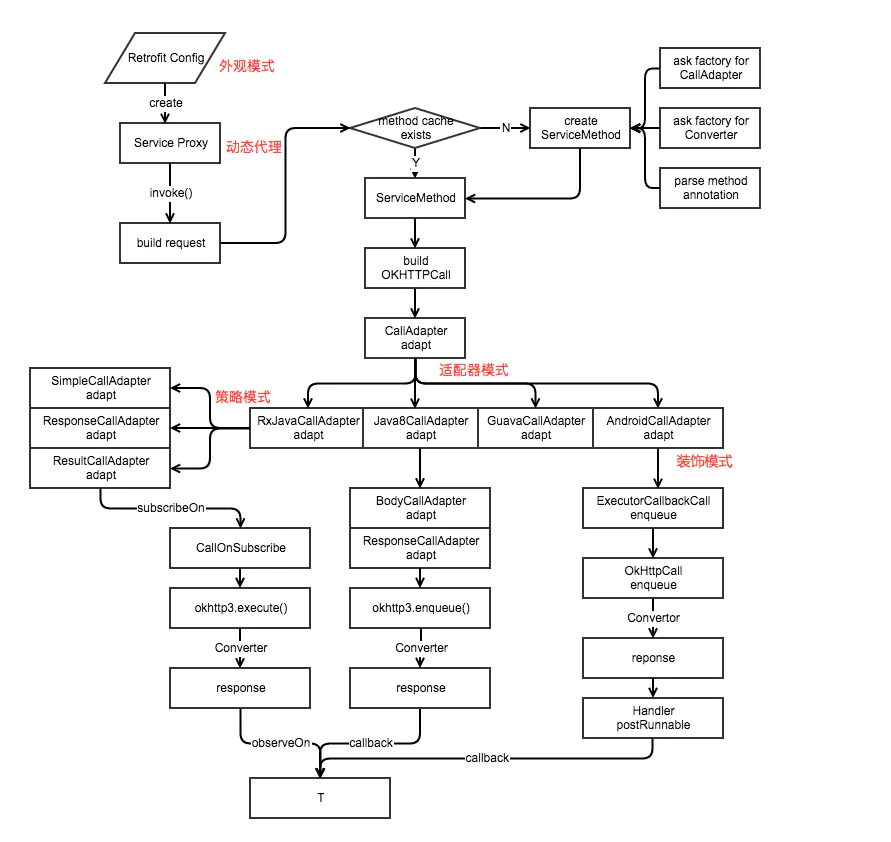

> https://github.com/square/retrofit

#### 1.使用方式

- 声明一个接口，用接口描述你的请求request

```java
public interface GitHubService {
     @GET("users/{user}/repos")
     Call<List<Repo>> listRepos(@Path("user") String user);
 }
```

- 创建一个Retrofit客户端

```java
 Retrofit retrofit = new Retrofit.Builder()
 .baseUrl("https://api.github.com/")
 .build();

 GitHubService service = retrofit.create(GitHubService.class);
```

Retrofit 创建的时候指定了 request 的接口地址，然后调用 retrofit.create 方法创建一个 GitHubService 实例。

- 发起网络请求

```java
 Call<List<Repo>> repos = service.listRepos("user");
 repos.execute().body()
```

上面的例子可以看到，retrofit.create() 方法会创建一个 GitHubService 实例，但是 GitHubService 本身是一个接口。为了了解 retrofit.create() 方法，我们先看下 Retrofit 的创建过程。

#### 2.流程解析

- 创建Retrofit客户端

  Retrofit 和 OkHttp 一样都是使用构建者模式创建对象。先看下 Retrofit.Builder 的 build() 方法。

  - callFactory 用来创建一个实现了 okhttp3.Call.Factory 的对象，如果没有设置，默认为 OkHttpClient。

  - baseUrl 网络接口的地址。 -converterFactories 用来把服务器返回的数据转换为对象。

  - adapterFactories 用来发起网络请求.这个可以自定义，retrofit能够和rxjava结合就是因为编写了自定义的网络请求转换器。

  - callbackExecutor 是一个调度器，用来接收返回的数据，在 Android 上默认是封装了 handler 的 MainThreadExecutor

  - validateEagerly  是一个开关，如果为 true 会缓存创建的 ServiceMethod 。

```java
  public Retrofit build() {
      if (baseUrl == null) {
        throw new IllegalStateException("Base URL required.");
      }

      okhttp3.Call.Factory callFactory = this.callFactory;
      if (callFactory == null) {
        callFactory = new OkHttpClient();
      }

      Executor callbackExecutor = this.callbackExecutor;
      if (callbackExecutor == null) {
        callbackExecutor = platform.defaultCallbackExecutor();
      }

      // 发起网络请求适配器，存储着我们传进来的自定义网络请求功能，retrofit能够和rxjava结合就是因为
      // .addCallAdapterFactory(RxJava2CallAdapterFactory.create());这个添加的转换器，可以自定	   // 义网络请求的时机和返回的数据包装类型。
      List<CallAdapter.Factory> adapterFactories = new ArrayList<>(this.adapterFactories);
      adapterFactories.add(platform.defaultCallAdapterFactory(callbackExecutor));

      // 数据转换器，这里是存储各种数据转换器，把网络请求来的数据转换成我们需要的类型，
      //  .addConverterFactory(GsonConverterFactory.create())就是保存在这里
      // retrofit默认的数据转换器是BuiltInConverters
      List<Converter.Factory> converterFactories = new ArrayList<>(this.converterFactories);

      return new Retrofit(callFactory, baseUrl, converterFactories, adapterFactories,
          callbackExecutor, validateEagerly);
    }
  }
```

- #### 创建代理类Retrofit.create

  这里使用动态代理生成一个我们定义的请求接口的代理类，返回的service就是代理类的实例。

  ```java
    public <T> T create(final Class<T> service) {
      Utils.validateServiceInterface(service);
      if (validateEagerly) {
        eagerlyValidateMethods(service);
      }
      return (T) Proxy.newProxyInstance(service.getClassLoader(), new Class<?>[] { service },
          new InvocationHandler() {
              //用来判断当前的环境，然后设置默认的数据接收调度器，MainThreadExecutor就是在这设置
            private final Platform platform = Platform.get();
  
            @Override public Object invoke(Object proxy, Method method, @Nullable Object[] args)
                throws Throwable {
              // 这里的invoke，Object方法都走这里，比如equals、toString、hashCode什么的
              if (method.getDeclaringClass() == Object.class) {
                return method.invoke(this, args);
              }
              // java8默认方法，1.8的新特性,可以在接口中使用default关键字定义普通方法
              if (platform.isDefaultMethod(method)) {
                return platform.invokeDefaultMethod(method, service, proxy, args);
              }
               //最核心的就是下面两行代码
              ServiceMethod<Object, Object> serviceMethod = (ServiceMethod<Object, Object>) loadServiceMethod(method);
              OkHttpCall<Object> okHttpCall = new OkHttpCall<>(serviceMethod, args);
              return serviceMethod.callAdapter.adapt(okHttpCall);
            }
          });
    }
  ```

  可以看出创建API使用了动态代理，根据接口动态生成的代理类，将接口的都转发给了负责连接代理类和委托类的`InvocationHandler`实例，接口方法也都通过其`invoke`方法来处理。
  在`invoke`方法中，首先会通过`Platform.get()`方法判断出当前代码的执行环境，之后会先把`Object`和Java8的默认方法进行一个处理，也是在进行后续处理之前进行去噪。其中的关键代码其实就是最后三句，这也是这篇文章将要分析的。

- #### 创建ServiceMethod

  ```java
    ServiceMethod<?, ?> loadServiceMethod(Method method) {
      ServiceMethod<?, ?> result = serviceMethodCache.get(method);
      if (result != null) return result;
  
      synchronized (serviceMethodCache) {
        result = serviceMethodCache.get(method);
        if (result == null) {
          result = new ServiceMethod.Builder<>(this, method).build();
          serviceMethodCache.put(method, result);
        }
      }
      return result;
    }
  ```

  j接口中的每一个方法都会保存一个``ServiceMethod``实例，并缓存在``serviceMethodCache``中。

  ServiceMethod通过Builder模式构建

  ```java
    public ServiceMethod build() {
       // 获取CallAdapter的实现，默认为ExecutorCallAdapterFactory.get实现，
       // rxjava的是RxJava2CallAdapterFactory
        callAdapter = createCallAdapter();
        responseType = callAdapter.responseType();
        if (responseType == Response.class || responseType == okhttp3.Response.class) {
          throw methodError("'"
              + Utils.getRawType(responseType).getName()
              + "' is not a valid response body type. Did you mean ResponseBody?");
        }
       // 响应的转换工厂，如GsonConverterFactory
        responseConverter = createResponseConverter();
  	//取出接口方法的注解，也就是@GET @POST @Header那些，在这里统一解析处理
        for (Annotation annotation : methodAnnotations) {
          parseMethodAnnotation(annotation);
        }
  
        if (httpMethod == null) {
          throw methodError("HTTP method annotation is required (e.g., @GET, @POST, etc.).");
        }
  	// POST方法需要有body或者表单
        if (!hasBody) {
          if (isMultipart) {
            throw methodError(
                "Multipart can only be specified on HTTP methods with request body (e.g., @POST).");
          }
          if (isFormEncoded) {
            throw methodError("FormUrlEncoded can only be specified on HTTP methods with "
                + "request body (e.g., @POST).");
          }
        }
  	 // 上面是请求方法，下面是请求参数
        int parameterCount = parameterAnnotationsArray.length;
         // ParameterHandler的实现类有很多，包括了各种参数，@Field、@Query等
        parameterHandlers = new ParameterHandler<?>[parameterCount];
        for (int p = 0; p < parameterCount; p++) {
          Type parameterType = parameterTypes[p];
          if (Utils.hasUnresolvableType(parameterType)) {
            throw parameterError(p, "Parameter type must not include a type variable or wildcard: %s",
                parameterType);
          }
  
          Annotation[] parameterAnnotations = parameterAnnotationsArray[p];
          if (parameterAnnotations == null) {
            throw parameterError(p, "No Retrofit annotation found.");
          }
  
          parameterHandlers[p] = parseParameter(p, parameterType, parameterAnnotations);
        }
  
        if (relativeUrl == null && !gotUrl) {
          throw methodError("Missing either @%s URL or @Url parameter.", httpMethod);
        }
        if (!isFormEncoded && !isMultipart && !hasBody && gotBody) {
          throw methodError("Non-body HTTP method cannot contain @Body.");
        }
        if (isFormEncoded && !gotField) {
          throw methodError("Form-encoded method must contain at least one @Field.");
        }
        if (isMultipart && !gotPart) {
          throw methodError("Multipart method must contain at least one @Part.");
        }
  
        return new ServiceMethod<>(this);
      }
  ```

- #### 创建OkHttpCall

  #### `ServiceMethod`创建完成之后，我们来看看下一行代码中的`OkHttpCall`类，里面的包含了请求的执行和响应处理，我们来看看异步请求的做法。

  ```java
   OkHttpCall(ServiceMethod<T, ?> serviceMethod, @Nullable Object[] args) {
      this.serviceMethod = serviceMethod;
      this.args = args;
    }
  
    @SuppressWarnings("CloneDoesntCallSuperClone") // We are a final type & this saves clearing state.
    @Override public OkHttpCall<T> clone() {
      return new OkHttpCall<>(serviceMethod, args);
    }
  	//创建执行的Call
    private okhttp3.Call createRawCall() throws IOException {
      Request request = serviceMethod.toRequest(args);
        //这里的serviceMethod.callFactory就是retrofit中的OkHttpClient
      okhttp3.Call call = serviceMethod.callFactory.newCall(request);
      if (call == null) {
        throw new NullPointerException("Call.Factory returned null.");
      }
      return call;
    }
  
  
    @Override public void enqueue(final Callback<T> callback) {
    ...
  	//可以看到最终执行网络请求的还是Okhttp
      call.enqueue(new okhttp3.Callback() {
        @Override public void onResponse(okhttp3.Call call, okhttp3.Response rawResponse)
            throws IOException {
          Response<T> response;
          try {
            response = parseResponse(rawResponse);
          } catch (Throwable e) {
            callFailure(e);
            return;
          }
          callSuccess(response);
        }
  
        @Override public void onFailure(okhttp3.Call call, IOException e) {
        ...
        }
  
        private void callFailure(Throwable e) {
         ...
        }
  
        private void callSuccess(Response<T> response) {
        ...
        }
      });
    }
  ```

  - 首先在构造函数中传入了之前新建的`serviceMethod`和动态代理`invoke`方法传递来的`args`参数。

  - 我们来看看其异步方法`enqueue`，将会调用`createRawCall()`方法，跟进来可以看到，做了两件事情，

    - 调用`serviceMethod.toRequest`方法，创造出一个`Request`对象，这个`Request`对象就是根据之前提到的方法参数注解的集合[`parameterHandlers`](#parameterHandlers)创建的。
    - 创建一个`okhttp3.Call`对象，我们都知道Okhttp中创建这个对象的方法就是newCall，这和上面的代码如出一辙，而且这个`callFactory`参数是不是就是就是在Retrofit创建过程中创建的OkHttpClient

    ```java
    /**
     * The HTTP client used for requests.
     * <p>
     * This is a convenience method for calling {@link #callFactory}.
     */
    public Builder client(OkHttpClient client) {
      return callFactory(checkNotNull(client, "client == null"));
    }
    ```

- #### CallAdapter

  创建完了``serviceMethod``和``OkHttpCall``后，接下来就是最后一行代码

  ``serviceMethod.callAdapter.adapt(okHttpCall);``

  这个callAdapter是在serviceMethod创建时通过``callAdapter = createCallAdapter();``创建的

  ```java
   private CallAdapter<T, R> createCallAdapter() {
        Type returnType = method.getGenericReturnType();
        if (Utils.hasUnresolvableType(returnType)) {
          throw methodError(
              "Method return type must not include a type variable or wildcard: %s", returnType);
        }
        if (returnType == void.class) {
          throw methodError("Service methods cannot return void.");
        }
        Annotation[] annotations = method.getAnnotations();
        try {
          //这个adapter是retrofit创建的
          return (CallAdapter<T, R>) retrofit.callAdapter(returnType, annotations);
        } catch (RuntimeException e) { // Wide exception range because factories are user code.
          throw methodError(e, "Unable to create call adapter for %s", returnType);
        }
      }
  ```

  ```java
    public CallAdapter<?, ?> nextCallAdapter(@Nullable CallAdapter.Factory skipPast, Type returnType,
        Annotation[] annotations) {
      checkNotNull(returnType, "returnType == null");
      checkNotNull(annotations, "annotations == null");
  
      int start = adapterFactories.indexOf(skipPast) + 1;
      for (int i = start, count = adapterFactories.size(); i < count; i++) {
        CallAdapter<?, ?> adapter = adapterFactories.get(i).get(returnType, annotations, this);
        if (adapter != null) {
          return adapter;
        }
      }
      ...
      }
  ```

  可以看到这个``CallAdapter``是从adapterFactories这个列表中取出来的，根据返回类型去判断应该使用哪一个请求适配器。

  我们通过``.addCallAdapterFactory(RxJava2CallAdapterFactory.create());``就是添加进这个列表。

  这个列表中存在一个默认的适配器，是在Retrofit创建时就加入的

  ```java
    Executor callbackExecutor = this.callbackExecutor;
        if (callbackExecutor == null) {
          callbackExecutor = platform.defaultCallbackExecutor();
        }
  List<CallAdapter.Factory> adapterFactories = new ArrayList<>(this.adapterFactories);
  adapterFactories.add(platform.defaultCallAdapterFactory(callbackExecutor));
  ```

  ``Platform``是一个判断当前环境的类，通过判断包名是否存在判断当前是``Android``还是``Java``，然后创建默认的请求适配器

  ```java
  static class Android extends Platform {
    @Override public Executor defaultCallbackExecutor() {
      return new MainThreadExecutor();
    }
      //callbackExecutor就是上面的MainThreadExecutor，这也就是为什么数据会自动切换到主线程处理的原因
    @Override CallAdapter.Factory defaultCallAdapterFactory(Executor callbackExecutor) {
        //这就是默认的CallAdapterFactory
      return new ExecutorCallAdapterFactory(callbackExecutor);
    }
    static class MainThreadExecutor implements Executor {
      // Looper.getMainLooper()就是为嘛响应会在主线程的原因
      private final Handler handler = new Handler(Looper.getMainLooper());
      @Override public void execute(Runnable r) {
        handler.post(r);
      }
    }
  }
  ```

  这下我们知道了``serviceMethod.callAdapter.adapt(okHttpCall);``的``callAdapter``就是通过``ExecutorCallAdapterFactory``创建出来的。

  然后看看``adapt``方法

  ````java
   @Override
    public CallAdapter<?, ?> get(Type returnType, Annotation[] annotations, Retrofit retrofit) {
      if (getRawType(returnType) != Call.class) {
        return null;
      }
      final Type responseType = Utils.getCallResponseType(returnType);
        //通过get方法 return一个CallAdapter
      return new CallAdapter<Object, Call<?>>() {
        @Override public Type responseType() {
          return responseType;
        }
  		//最后的adapt调用这里。也就是我们外面的service其实是一个ExecutorCallbackCall
        @Override public Call<Object> adapt(Call<Object> call) {
          return new ExecutorCallbackCall<>(callbackExecutor, call);
        }
      };
    }
  
  ````

  ``ExecutorCallbackCall``是````ExecutorCallAdapterFactory````的内部类，

  ```java
  static final class ExecutorCallbackCall<T> implements Call<T> {
    final Executor callbackExecutor;
    final Call<T> delegate;
  
    ExecutorCallbackCall(Executor callbackExecutor, Call<T> delegate) {
      this.callbackExecutor = callbackExecutor;
      this.delegate = delegate;
    }
  	//当我们调用service.enqueue时，就是调用这里
    @Override public void enqueue(final Callback<T> callback) {
      checkNotNull(callback, "callback == null");
  	//这个delegate就是OkhttpCall
      delegate.enqueue(new Callback<T>() {
        @Override public void onResponse(Call<T> call, final Response<T> response) {
            //可以看到请求返回数据后，通过callbackExecutor，也就是前面的MainThreadExecutor，
            //把数据发到主线程中处理。
          callbackExecutor.execute(new Runnable() {
            @Override public void run() {
              if (delegate.isCanceled()) {
                // Emulate OkHttp's behavior of throwing/delivering an IOException on cancellation.
                callback.onFailure(ExecutorCallbackCall.this, new IOException("Canceled"));
              } else {
                callback.onResponse(ExecutorCallbackCall.this, response);
              }
            }
          });
        }
  
        @Override public void onFailure(Call<T> call, final Throwable t) {
          callbackExecutor.execute(new Runnable() {
            @Override public void run() {
              callback.onFailure(ExecutorCallbackCall.this, t);
            }
          });
        }
      });
    }
  ```

  这里的``delegate``就是前面创建好的`okhttpCall`，这里的参数`callback`就是用户输入的回调对象，我用调用``service,enqueue``就是调用这里的``enqueue``

  ```java
  (ExecutorCallbackCall) Call<List<String>> repos = service.listRepos("octocat");
       repos.enqueue(new Callback<List<String>>(){...} );
   ->	 ExecutorCallbackCall.enqueue(new Callback<List<String>>(){...} );
   ->	 (OkhttpCall)delegate.enqueue(new Callback<T>() {...})
   ->  okhttp3.Call.enqueue(new Callback<T>() {...})
  ```

- #### RxJava2CallAdapter解析

  使用``RxJava2CallAdapter``后，我们可以把数据类型用包装成``observable``类型来给外面使用，同上面一样，它也是由一个工厂类``RxJava2CallAdapterFactory``创建出来的

  ```java
    public static RxJava2CallAdapterFactory create() {
      return new RxJava2CallAdapterFactory(null, false);
    }
    @Override
    public CallAdapter<?, ?> get(Type returnType, Annotation[] annotations, Retrofit retrofit) {
      Class<?> rawType = getRawType(returnType);
  
      if (rawType == Completable.class) {
        // Completable is not parameterized (which is what the rest of this method deals with) so it
        // can only be created with a single configuration.
        // Completable没有参数化（这是此方法的其余部分所处理的），因此只能使用单个配置创建它。
        return new RxJava2CallAdapter(Void.class, scheduler, isAsync, false, true, false, false,
            false, true);
      }
  
      boolean isFlowable = rawType == Flowable.class;
      boolean isSingle = rawType == Single.class;
      boolean isMaybe = rawType == Maybe.class;
        //判断数据类型是否符合
      if (rawType != Observable.class && !isFlowable && !isSingle && !isMaybe) {
        return null;
      }
  
      boolean isResult = false;
      boolean isBody = false;
      Type responseType;
      if (!(returnType instanceof ParameterizedType)) {
        String name = isFlowable ? "Flowable"
            : isSingle ? "Single"
            : isMaybe ? "Maybe" : "Observable";
        throw new IllegalStateException(name + " return type must be parameterized"
            + " as " + name + "<Foo> or " + name + "<? extends Foo>");
      }
  
      Type observableType = getParameterUpperBound(0, (ParameterizedType) returnType);
      Class<?> rawObservableType = getRawType(observableType);
      if (rawObservableType == Response.class) {
        if (!(observableType instanceof ParameterizedType)) {
          throw new IllegalStateException("Response must be parameterized"
              + " as Response<Foo> or Response<? extends Foo>");
        }
        responseType = getParameterUpperBound(0, (ParameterizedType) observableType);
      } else if (rawObservableType == Result.class) {
        if (!(observableType instanceof ParameterizedType)) {
          throw new IllegalStateException("Result must be parameterized"
              + " as Result<Foo> or Result<? extends Foo>");
        }
        responseType = getParameterUpperBound(0, (ParameterizedType) observableType);
        isResult = true;
      } else {
        responseType = observableType;
        isBody = true;
      }
  
      return new RxJava2CallAdapter(responseType, scheduler, isAsync, isResult, isBody, isFlowable,
          isSingle, isMaybe, false);
    }
  ```

  创建``RxJava2CallAdapter``后 来看看他的adapt方法。

  ```java
    @Override public Object adapt(Call<R> call) {
        //判断请求是同步还是异步，这里返回的是处理结果的observalbe
      Observable<Response<R>> responseObservable = isAsync
          ? new CallEnqueueObservable<>(call)
          : new CallExecuteObservable<>(call);
  	
      Observable<?> observable;
      if (isResult) {
        observable = new ResultObservable<>(responseObservable);
      } else if (isBody) {
        observable = new BodyObservable<>(responseObservable);
      } else {
        observable = responseObservable;
      }
  	
      if (scheduler != null) {
        observable = observable.subscribeOn(scheduler);
      }
  
      if (isFlowable) {
        return observable.toFlowable(BackpressureStrategy.LATEST);
      }
      if (isSingle) {
        return observable.singleOrError();
      }
      if (isMaybe) {
        return observable.singleElement();
      }
      if (isCompletable) {
        return observable.ignoreElements();
      }
      return observable;
    }
  }
  ```

  adapter最终创建了Observable，主我们这里分析其中开头的两步来：

  - 分异步和同步请求创建responseObservable
  - 根据返回的类型创建observable

  这里以异步为例，看看`CallEnqueueObservable`类

  ```java
  final class CallEnqueueObservable<T> extends Observable<Response<T>> {
    private final Call<T> originalCall;
  
    CallEnqueueObservable(Call<T> originalCall) {
      this.originalCall = originalCall;
    }
  	//这个方法很重要，subscribeActual是在subscribe之后执行，所以subscribe触发subscribeActual后让call调用请求
      //observer就是subscribe{}中的结果箭头，把他和call一起封装成一个CallCallback传给call.enqueue,这样就能在得知结果
      //后用observale分发出来。
    @Override protected void subscribeActual(Observer<? super Response<T>> observer) {
      // Since Call is a one-shot type, clone it for each new observer.
        //因为Call方法只能执行一次，所以这里克隆下它
      Call<T> call = originalCall.clone();
      CallCallback<T> callback = new CallCallback<>(call, observer);
      observer.onSubscribe(callback);
      call.enqueue(callback);
    }
  
    private static final class CallCallback<T> implements Disposable, Callback<T> {
      private final Call<?> call;
      private final Observer<? super Response<T>> observer;
      boolean terminated = false;
  
      CallCallback(Call<?> call, Observer<? super Response<T>> observer) {
        this.call = call;
        this.observer = observer;
      }
  
      @Override public void onResponse(Call<T> call, Response<T> response) {
        if (call.isCanceled()) return;
  
        try {
          observer.onNext(response);
  
          if (!call.isCanceled()) {
            terminated = true;
            observer.onComplete();
          }
        } catch (Throwable t) {
          if (terminated) {
            RxJavaPlugins.onError(t);
          } else if (!call.isCanceled()) {
            try {
              observer.onError(t);
            } catch (Throwable inner) {
              Exceptions.throwIfFatal(inner);
              RxJavaPlugins.onError(new CompositeException(t, inner));
            }
          }
        }
      }
  
      @Override public void onFailure(Call<T> call, Throwable t) {
        if (call.isCanceled()) return;
  
        try {
          observer.onError(t);
        } catch (Throwable inner) {
          Exceptions.throwIfFatal(inner);
          RxJavaPlugins.onError(new CompositeException(t, inner));
        }
      }
  
      @Override public void dispose() {
        call.cancel();
      }
  
      @Override public boolean isDisposed() {
        return call.isCanceled();
      }
    }
  }
  
  ```

  在`subscribeActual`方法内，主要做了三件事情：

  - clone了原有的call，因为OkHttp.Call只能使用一次
  - 设置了onSubscribe，可用于解除订阅
  - 执行了enqueue请求

  创建好responableObservable后，根据我们对数据包裹的类型，可以分为Result和Response

  ```java
     Observable<?> observable;
      if (isResult) {
        // 这个ResultObservable在错误产生时会把错误分发到onNext，并不会单独走onError
        observable = new ResultObservable<>(responseObservable);
      } else if (isBody) {
        // 这里会对数据做处理，分发给onNext的是response.body()
        observable = new BodyObservable<>(responseObservable);
      } else {
        observable = responseObservable;
      }
  ```

  在请求到数据后，我们需要对数据进行解析，将json转换为类，这里就涉及到``ConverterFactory``了

  在OkHttpCall中，enqueue获取到数据后

  ```java
   call.enqueue(new okhttp3.Callback() {
        @Override public void onResponse(okhttp3.Call call, okhttp3.Response rawResponse)
            throws IOException {
          Response<T> response;
          try {
             //调用parseResponse解析数据
            response = parseResponse(rawResponse);
          } catch (Throwable e) {
            callFailure(e);
            return;
          }
          callSuccess(response);
        }
       
   Response<T> parseResponse(okhttp3.Response rawResponse) throws IOException {
      ResponseBody rawBody = rawResponse.body();
  
      // 移除主体的源（唯一的有状态对象），以便我们可以传递响应。
      rawResponse = rawResponse.newBuilder()
          .body(new NoContentResponseBody(rawBody.contentType(), rawBody.contentLength()))
          .build();
  
      int code = rawResponse.code();
      if (code < 200 || code >= 300) {
       ...
      }
  
      if (code == 204 || code == 205) {
        ...
      }
      ExceptionCatchingRequestBody catchingBody = new ExceptionCatchingRequestBody(rawBody);
      try {
        T body = serviceMethod.toResponse(catchingBody);
        return Response.success(body, rawResponse);
      } catch (RuntimeException e) {
        // If the underlying source threw an exception, propagate that rather than indicating it was
        // a runtime exception.
        catchingBody.throwIfCaught();
        throw e;
      }
    }
       
  serviceMethod.java 
    /** Builds a method return value from an HTTP response body. */
    R toResponse(ResponseBody body) throws IOException {
      return responseConverter.convert(body);
    }
  ```

  可以看出parseResponse最终调用了`Converter.convert`方法。这里以常用的GsonConverterFactory为例。

  ```java
  final class GsonResponseBodyConverter<T> implements Converter<ResponseBody, T> {
    private final Gson gson;
    private final TypeAdapter<T> adapter;
  
    GsonResponseBodyConverter(Gson gson, TypeAdapter<T> adapter) {
      this.gson = gson;
      this.adapter = adapter;
    }
  
    @Override public T convert(ResponseBody value) throws IOException {
      JsonReader jsonReader = gson.newJsonReader(value.charStream());
      try {
        return adapter.read(jsonReader);
      } finally {
        value.close();
      }
    }
  }
  ```

  GsonResponseBodyConverter的创建和上面的CallAdapter一样，都是在ServiceMethod.build（）的时候初始化的，通过遍历converterFactories拿到创建的工厂类，然后通过工厂类去创建相应的实体类，这点很巧妙，非常解耦，存储的是``CallAdapter.Factory``，然后使用的时候调用去创建需要的类。

  `responseBodyConverter`方法中用到的type参数就是之前我在CallAdapter中提到的`responseType`方法的返回值。生成adapter方法，用于`convert`方法使用。OkHttpCall在这之后的代码就比较简单了，通过回调将转换后得响应数据发送出去即可。

  借用一张图

  

