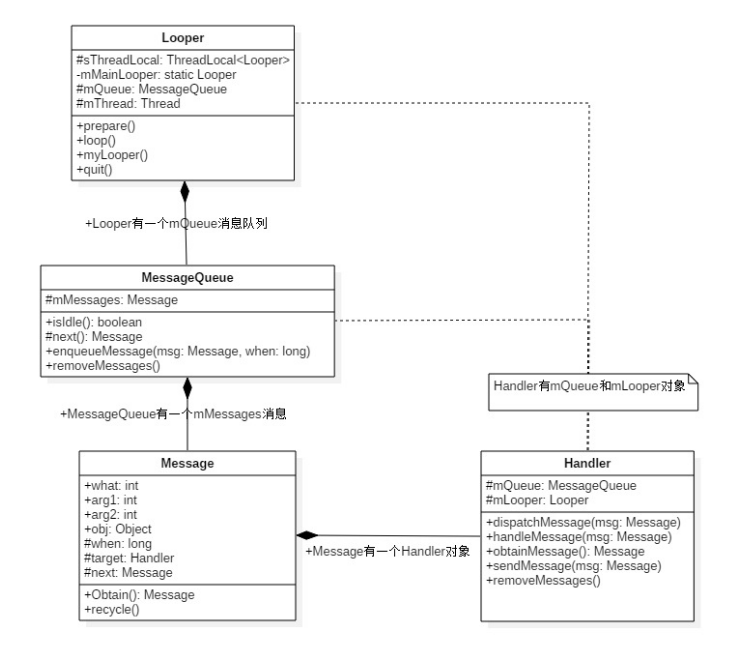
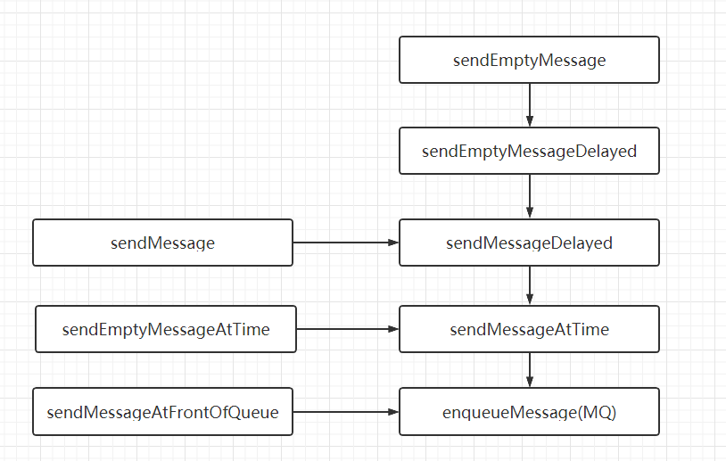
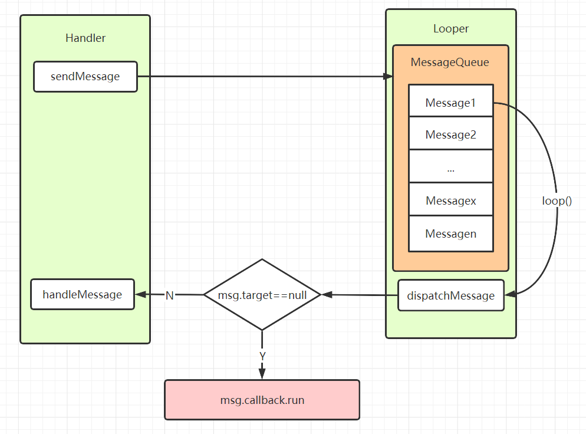

## Handler

### 一、简介

> 在Android系统中，除了Binder进行跨进程通讯，撑起四大组件相互通讯的消息机制就是Handler全家桶了，Android系统中任何交互的过程都离不开Handler，整个App就是在Looper.loop中不断循环取消息。

#### 1.1组成

handler消息机制主要包含以下四个组成部分：

- Message：单个消息，承载了当次操作包含的内容（例如长按，点击）和传递的数据（例如msg.what）。
- MessageQueue：消息队列，向消息池投递消息(MessageQueue.enqueueMessage)和取出消息(MessageQueue.next)
- Handler：发送和处理消息，通过sendMessage向消息池发送消息，通过handleMessage处理对应消息
- Looper：消息轮询，通过Looper.loop循环执行调用MessageQueue.next不断取出消息，将消息分发给对应的处理者(Handler)

 



- **Looper**有一个MessageQueue消息队列；
- **MessageQueue**有一组待处理的Message；
- **Message**中有一个用于处理消息的Handler；
- **Handler**中有Looper和MessageQueue。

#### 1.2使用

```java
class DemoThread extends Thread {
    public Handler mHandler;

    public void run() {
        Looper.prepare();  
        mHandler = new Handler() { 
            public void handleMessage(Message msg) {
            }
        };
        Looper.loop();  
    }
}
```

上述例子中是展示在一个线程中如何使用Handler，但是我们在主线程中却没用到``  Looper.prepare();  ``和``  Looper.loop();  ``，那是因为这两行代码在ActivityThread中已经写好了，而ActivityThread就是我们所说的主线程。

```java
public final class ActivityThread extends ClientTransactionHandler {   
    ...
	public static synchronized void main(String[] var0) {
        Trace.traceBegin(64L, "ActivityThreadMain");
        CloseGuard.setEnabled(false);
        Environment.initForCurrentUser();
        EventLogger.setReporter(new ActivityThread.EventLoggingReporter());
        TrustedCertificateStore.setDefaultUserDirectory(Environment.getUserConfigDirectory(UserHandle.myUserId()));
        Process.setArgV0("<pre-initialized>");
        Looper.prepareMainLooper();
		...
        Looper.loop();
        throw new RuntimeException("Main thread loop unexpectedly exited");
    }
}
	//可以看到这个prepareMainLooper只允许被调用一次，然后整个app就在Looper.loop();中不断循环区消息。
    public static void prepareMainLooper() {
        prepare(false);
        synchronized (Looper.class) {
            if (sMainLooper != null) {
                throw new IllegalStateException("The main Looper has already been prepared.");
            }
            sMainLooper = myLooper();
        }
    }
```

### 二 详解

#### 2.1 Looper

Looper作位一个轮询器，不断调用MessageQueue.next获取消息池中的消息进行分发，Looper主要调用的方法都是静态方法，主要包含以下几个

##### 2.1.1 Looper.prepare()

```java
  public static void prepare() {
        prepare(true);
    }

    private static void prepare(boolean quitAllowed) {
        if (sThreadLocal.get() != null) {
            throw new RuntimeException("Only one Looper may be created per thread");
        }
        //创建该线程唯一的Looper对象，保存在线程的TLS区域
        sThreadLocal.set(new Looper(quitAllowed));
    }
```

想要在一个线程中使用Handler，必须要为这个线程配置唯一的Looper，每个线程只允许执行一次，quitAllowed这里默认为true，表示这个Looper可以退出，只有主线程的Looper是不允许退出的。

因为Looper是轮询消息的，所以在Looper创建的过程中也会为这个Looper创建一个消息队列（MessageQueue）

```java
    public static @NonNull MessageQueue myQueue() {
        return myLooper().mQueue;
    }

    private Looper(boolean quitAllowed) {
        mQueue = new MessageQueue(quitAllowed);
        mThread = Thread.currentThread();
    }
```

##### 2.1.2 Looper.loop()

```java
    /**
     * Run the message queue in this thread. Be sure to call
     * {@link #quit()} to end the loop.
     */
    public static void loop() {
        //获取该线程的TLS中存储的Looper对象
        final Looper me = myLooper();
        if (me == null) {
            throw new RuntimeException("No Looper; Looper.prepare() wasn't called on this thread.");
        }
        final MessageQueue queue = me.mQueue;
        // Make sure the identity of this thread is that of the local process,
        // and keep track of what that identity token actually is.
        // 确保当前线程是在本地进程中，然后记录下当前的的身份token
        Binder.clearCallingIdentity();
        final long ident = Binder.clearCallingIdentity();
		...

        for (;;) {
            //从消息队列中取消息，如果没有消息，则可能会阻塞在这
            Message msg = queue.next(); // might block
            if (msg == null) {
                // No message indicates that the message queue is quitting.
                return;
            }
            ...
                //中间是打印log的方法，用来调试，可以通过setMessageLogging()来打印
            if (logging != null) {
                logging.println(">>>>> Dispatching to " + msg.target + " " +
                 msg.callback + ": " + msg.what);
            }
                //还有发生问题时生成Trace报告的方法
            if (traceTag != 0 && Trace.isTagEnabled(traceTag)) {
                Trace.traceBegin(traceTag, msg.target.getTraceName(msg));
            }
			...
            try {
                //这里的msg的target就是这个消息的发送者，也就是handler，所以最后方法都发送到了handleMessage中
                msg.target.dispatchMessage(msg);
                dispatchEnd = needEndTime ? SystemClock.uptimeMillis() : 0;
            } finally {
                if (traceTag != 0) {
                    Trace.traceEnd(traceTag);
                }
            }
           ...

            // Make sure that during the course of dispatching the
            // identity of the thread wasn't corrupted.
            // 确保在分派线程的过程中未损坏线程的身份。
            final long newIdent = Binder.clearCallingIdentity();
            if (ident != newIdent) {
                Log.wtf(TAG, "Thread identity changed from 0x"
                        + Long.toHexString(ident) + " to 0x"
                        + Long.toHexString(newIdent) + " while dispatching to "
                        + msg.target.getClass().getName() + " "
                        + msg.callback + " what=" + msg.what);
            }
			//将用完的消息放回消息池等待被重新获取使用(handler.obtainMessage())
            msg.recycleUnchecked();
        }
    }
```

Loop()方法不断从消息队列中取出(next)中取出下一条消息，然后将消息分发给这条消息的target，就是发送这条消息的Handler，交给handleMessage去处理。最后用完的消息回收到消息池中，等待下次被使用。

##### 2.1.3 Looper.myLooper()

```java
    public static @Nullable Looper myLooper() {
        return sThreadLocal.get();
    }
```

获得当前线程的Looper

##### 2.1.4 Looper.quit()

```java
    public void quit() {
        mQueue.quit(false);
    }
    public void quitSafely() {
        mQueue.quit(true);
    }
```

可以看到Looper退出的方法最后调用的是MessageQueue的quit方法

```java
void quit(boolean safe) {
    // 这是在Looper创建时创建的，判断当前线程能否被退出
    if (!mQuitAllowed) {
        throw new IllegalStateException("Main thread not allowed to quit.");
    }

    synchronized (this) {
        //只允许被推出一次
        if (mQuitting) {
            return;
        }
        mQuitting = true;

        if (safe) {
            //移除尚未触发的所有消息，正在处理的消息会让他们处理完，并不会移除
            removeAllFutureMessagesLocked();
        } else {
            //移除所有的消息
            removeAllMessagesLocked();
        }

        // We can assume mPtr != 0 because mQuitting was previously false.
        // 我们可以假设mPtr！= 0，因为mQuitting以前是false。
        nativeWake(mPtr);
    }
}
```

####  2.2 MessageQueue

MessageQueue对消息的处理的主要调用还是native方法，java层的MessageQueue只是一个中转站，主要包含了以下方法：

```java
    private native static long nativeInit();
    private native static void nativeDestroy(long ptr);
    private native void nativePollOnce(long ptr, int timeoutMillis); /*non-static for callbacks*/
    private native static void nativeWake(long ptr);
    private native static boolean nativeIsPolling(long ptr);
    private native static void nativeSetFileDescriptorEvents(long ptr, int fd, int events);
```

##### 2.2.1 实例化

```java
    MessageQueue(boolean quitAllowed) {
        mQuitAllowed = quitAllowed;
        // 通过native方法初始化消息队列，其中mPtr是供native代码使用，例如上面的nativeWake
        mPtr = nativeInit();
    }
```

##### 2.2.1 next

```java
 Message next() {
        // Return here if the message loop has already quit and been disposed.
        // This can happen if the application tries to restart a looper after quit
        // which is not supported.
        final long ptr = mPtr;
     	// 当ptr等于0时，表示消息环迅已经退出，如果应用程序退出后不支持重启一个Looper时，则会发生这种情况。
     	// 返回null后，Looper.loop也就退出了循环
        if (ptr == 0) {
            return null;
        }

        int pendingIdleHandlerCount = -1; // -1 only during first iteration
        int nextPollTimeoutMillis = 0;
        for (;;) {
            if (nextPollTimeoutMillis != 0) {
                Binder.flushPendingCommands();
            }
 			//阻塞操作，当等待nextPollTimeoutMillis时长，或者消息队列被唤醒，都会返回
            nativePollOnce(ptr, nextPollTimeoutMillis);

            synchronized (this) {
                // Try to retrieve the next message.  Return if found.
                final long now = SystemClock.uptimeMillis();
                Message prevMsg = null;
                Message msg = mMessages;
                //当消息的Handler为空时，则查询异步消息
                if (msg != null && msg.target == null) {
                    // Stalled by a barrier.  Find the next asynchronous(异步) message in the queue.
                    do {
                        prevMsg = msg;
                        msg = msg.next;
                    } while (msg != null && !msg.isAsynchronous());
                }
                if (msg != null) {
                    if (now < msg.when) {
                        // Next message is not ready.  Set a timeout to wake up when it is ready.
                        // 下一条消息还没准备好，例如延时发送的消息还没到触发时间
                        nextPollTimeoutMillis = (int) Math.min(msg.when - now, Integer.MAX_VALUE);
                    } else {
                        // Got a message.
                        mBlocked = false;
                        if (prevMsg != null) {
                            prevMsg.next = msg.next;
                        } else {
                            mMessages = msg.next;
                        }
                        msg.next = null;
                        if (DEBUG) Log.v(TAG, "Returning message: " + msg);
                        //设置消息的使用状态，表明这个消息正在使用
                        msg.markInUse();
                        return msg;
                    }
                } else {
                    // No more messages.
                    nextPollTimeoutMillis = -1;
                }

                // Process the quit message now that all pending messages have been handled.
                // 消息当前正在退出，处理所有待处理的消息
                if (mQuitting) {
                    // 处理native层的消息队列
                    dispose();
                    return null;
                }

                // If first time idle(空闲), then get the number of idlers to run.
                // Idle handles only run if the queue is empty or if the first message
                // in the queue (possibly a barrier) is due to be handled in the future.
                // 当消息队列为空，或者是消息队列的第一个消息时
                if (pendingIdleHandlerCount < 0 && (mMessages == null || now < mMessages.when)) {
                    pendingIdleHandlerCount = mIdleHandlers.size();
                }
                if (pendingIdleHandlerCount <= 0) {
                    // No idle handlers to run.  Loop and wait some more.
                    // 没有空闲的handler运行，则循环并且等待
                    mBlocked = true;
                    continue;
                }

                if (mPendingIdleHandlers == null) {
                    // 创建IdleHandler数组，最少4个，最多不限制，看我们通过addIdleHandler添加多少个
                    mPendingIdleHandlers = new IdleHandler数组，最少4个，最多[Math.max(pendingIdleHandlerCount, 4)];
                }
                mPendingIdleHandlers = mIdleHandlers.toArray(mPendingIdleHandlers);
            }

            // Run the idle handlers.
            // We only ever reach this code block during the first iteration.
            // 只有第一次循环时，会运行idle handlers，执行完成后，重置pendingIdleHandlerCount为0.
            for (int i = 0; i < pendingIdleHandlerCount; i++) {
                final IdleHandler idler = mPendingIdleHandlers[i];
                mPendingIdleHandlers[i] = null; // release the reference to the handler

                boolean keep = false;
                try {
                    keep = idler.queueIdle();
                } catch (Throwable t) {
                    Log.wtf(TAG, "IdleHandler threw exception", t);
                }
				//拿出所有的queueIdle返回值，如果为false，那么调用一次后就被删除
                if (!keep) {
                    synchronized (this) {
                        mIdleHandlers.remove(idler);
                    }
                }
            }

            // Reset the idle handler count to 0 so we do not run them again.
            //重置idle handler个数为0，以保证不会再次重复运行
            pendingIdleHandlerCount = 0;

            // While calling an idle handler, a new message could have been delivered
            // so go back and look again for a pending message without waiting.
             //当调用一个空闲handler时，一个新message能够被分发，因此无需等待可以直接查询pending message
            nextPollTimeoutMillis = 0;
        }
    }
```

`nativePollOnce`是阻塞操作，其中`nextPollTimeoutMillis`代表下一个消息到来前，还需要等待的时长；当nextPollTimeoutMillis = -1时，表示消息队列中无消息，会一直等待下去。

`nativePollOnce()`在native做了大量的工作，想进一步了解可查看 [Android消息机制2-Handler(native篇)](http://gityuan.com/2015/12/27/handler-message-native/#nativepollonce)。

##### 2.2.2 IdleHandler

```java
     /**
     * Callback interface for discovering when a thread is going to block
     * waiting for more messages.
     */
    public static interface IdleHandler {
        /**
         * Called when the message queue has run out of messages and will now
         * wait for more.  Return true to keep your idle handler active, false
         * to have it removed.  This may be called if there are still messages
         * pending in the queue, but they are all scheduled to be dispatched
         * after the current time.
         */
        boolean queueIdle();
    }
```

IdleHandler 顾名思义，空闲的Handler，主要作用是在当前队列将进入阻塞等待消息时调用该接口回调，主要目的是当前线程消息队列空闲时做些事情，提高性能，

queueIdle：返回true表示单次调用后不删除，下次空闲时继续毁掉该方法，false只回调一次。

```java
//getMainLooper().myQueue()或者Looper.myQueue()
Looper.myQueue().addIdleHandler(new IdleHandler() {  
    @Override  
    public boolean queueIdle() {  
        //你要处理的事情
        return false;    
    }  
});
```

##### 2.2.2 enqueueMessage

```java
//handler各种发送消息的方法最后都会调用到这里
 boolean enqueueMessage(Message msg, long when) {
        if (msg.target == null) {
            throw new IllegalArgumentException("Message must have a target.");
        }
        if (msg.isInUse()) {
            throw new IllegalStateException(msg + " This message is already in use.");
        }

        synchronized (this) {
            // 如果正在推出，回收msg
            if (mQuitting) {
                IllegalStateException e = new IllegalStateException(
                        msg.target + " sending message to a Handler on a dead thread");
                Log.w(TAG, e.getMessage(), e);
                msg.recycle();
                return false;
            }
			
            msg.markInUse();
            msg.when = when;
            Message p = mMessages;
            boolean needWake;
            // p等于null表示当前消息队列没消息，或者该消息触发时间比消息队列中最早的还要早
            if (p == null || when == 0 || when < p.when) {
                // New head, wake up the event queue if blocked.
                msg.next = p;
                mMessages = msg;
                needWake = mBlocked;
            } else {
                // Inserted within the middle of the queue.  Usually we don't have to wake
                // up the event queue unless there is a barrier at the head of the queue
                // and the message is the earliest asynchronous message in the queue.、
                //将消息按时间顺序插入到MessageQueue。一般地，不需要唤醒事件队列，除非
          	    //消息队头存在barrier，并且同时Message是队列中最早的异步消息。
                needWake = mBlocked && p.target == null && msg.isAsynchronous();
                Message prev;
                for (;;) {
                    prev = p;
                    p = p.next;
                    if (p == null || when < p.when) {
                        break;
                    }
                    if (needWake && p.isAsynchronous()) {
                        needWake = false;
                    }
                }
                msg.next = p; // invariant: p == prev.next
                prev.next = msg;
            }

            // We can assume mPtr != 0 because mQuitting is false.
            // mQuitting为false表示消息队列没有退出，此时 mPtr != 0
            if (needWake) {
                nativeWake(mPtr);
            }
        }
        return true;
    }
```

`MessageQueue`是按照Message触发时间（when）的先后顺序排列的，队头的消息是将要最早触发的消息。当有消息需要加入消息队列时，会从队列头开始遍历，直到找到消息应该插入的合适位置，以保证所有消息的时间顺序。

##### 2.2.3 removeMessages

```java
void removeMessages(Handler h, int what, Object object) {
        if (h == null) {
            return;
        }

        synchronized (this) {
            Message p = mMessages;

            // Remove all messages at front.
            // 从队头开始循环遍历删除所有符合的消息
            while (p != null && p.target == h && p.what == what
                   && (object == null || p.obj == object)) {
                Message n = p.next;
                mMessages = n;
                p.recycleUnchecked();
                p = n;
            }

            // Remove all messages after front.
            // 从p消息遍历后面所有的消息，找到所有符合删除要求的消息，删除并且回收
            while (p != null) {
                Message n = p.next;
                if (n != null) {
                    if (n.target == h && n.what == what
                        && (object == null || n.obj == object)) {
                        Message nn = n.next;
                        n.recycleUnchecked();
                        p.next = nn;
                        continue;
                    }
                }
                p = n;
            }
        }
    }
```

#### 2.3Handler

handler主要用来收发消息，发消息的各种sendXXX，handleMessage接收消息



可以看到所有的发送消息最后都是调用``MessageQueue``的``enqueueMessage()``

Handler里面包含``Looper``和``MessageQueue``，通过``Looper.myLooper();``得到``mLooper``，通过``mLooper``得到``mQueue``.

```java
    public Handler(Callback callback, boolean async) {
    ...
        mLooper = Looper.myLooper();
        if (mLooper == null) {
            throw new RuntimeException(
                "Can't create handler inside thread " + Thread.currentThread()
                        + " that has not called Looper.prepare()");
        }
        mQueue = mLooper.mQueue;
        mCallback = callback;
        mAsynchronous = async;
    }
```


##### 2.3.1 sendMessage

```java
    public final boolean sendMessage(Message msg){
        return sendMessageDelayed(msg, 0);
    }
    public final boolean sendMessageDelayed(Message msg, long delayMillis)
    {
        if (delayMillis < 0) {
            delayMillis = 0;
        }
        return sendMessageAtTime(msg, SystemClock.uptimeMillis() + delayMillis);
    }
    public boolean sendMessageAtTime(Message msg, long uptimeMillis) {
        MessageQueue queue = mQueue;
        if (queue == null) {
            RuntimeException e = new RuntimeException(
                    this + " sendMessageAtTime() called with no mQueue");
            Log.w("Looper", e.getMessage(), e);
            return false;
        }
        return enqueueMessage(queue, msg, uptimeMillis);
    }
private boolean enqueueMessage(MessageQueue queue, Message msg, long uptimeMillis) {
    //这里可以看到消息最终处理的target对象就是该handler
    msg.target = this;
    if (mAsynchronous) {
        msg.setAsynchronous(true);
    }
    return queue.enqueueMessage(msg, uptimeMillis); 【见4.3】
}
```

##### 2.3.2 sendEmptyMessage

```java
    public final boolean sendEmptyMessage(int what)
    {
        return sendEmptyMessageDelayed(what, 0);
    }
    public final boolean sendEmptyMessageDelayed(int what, long delayMillis) {
        Message msg = Message.obtain();
        msg.what = what;
        return sendMessageDelayed(msg, delayMillis);
    }
```

##### 2.3.3 sendMessageAtFrontOfQueue

```java
public final boolean sendMessageAtFrontOfQueue(Message msg) {
    MessageQueue queue = mQueue;
    if (queue == null) {
        return false;
    }
    return enqueueMessage(queue, msg, 0);
}
```

该方法通过设置uptimeMillis为0让消息直接插入到队头，第一个执行。

##### 2.3.3 Post

除了用send来发送消息，Handler也可以通过Post的方式来发送消息

```java
    new Handler().post(new Runnable() {
        @Override
        public void run() {
            //消息回调
        }
    });
    public final boolean post(Runnable r)
    {
       return  sendMessageDelayed(getPostMessage(r), 0);
    }
   private static Message getPostMessage(Runnable r) {
        Message m = Message.obtain();
        m.callback = r;
        return m;
    }
```

可以看到还是调用了``sendMessageDelayed``，这里把把回调方法传给了m.callback，在Looper.loop中

```java
 msg.target.dispatchMessage(msg);
 //Handler
     public void dispatchMessage(Message msg) {
        if (msg.callback != null) {
            handleCallback(msg);
        } else {
            if (mCallback != null) {
                if (mCallback.handleMessage(msg)) {
                    return;
                }
            }
            handleMessage(msg);
        }
    }
    private static void handleCallback(Message message) {
        message.callback.run();
    }
```

可以看到，当msg消息的callback不为null时，直接调用run方法来达到消息回调的目的。

##### 2.3.4 View.post

除了用Handler.post，我们还可以用View.post来发消息到主线程处理。

```java
    public boolean post(Runnable action) {
        //如果当前视图已经添加到父视图时，就会获得父视图提供的一些信息，其中就包含了UI线程的Handler
        final AttachInfo attachInfo = mAttachInfo;
        if (attachInfo != null) {
            //这个和上面的一个方法
            return attachInfo.mHandler.post(action);
        }

        // Postpone the runnable until we know on which thread it needs to run.
        // Assume that the runnable will be successfully placed after attach.
        // 推迟可运行对象，直到我们知道它需要在哪个线程上运行。 假设runnable能够在view attach后成功运行
        getRunQueue().post(action);
        return true;
    }
    private HandlerActionQueue getRunQueue() {
        if (mRunQueue == null) {
            mRunQueue = new HandlerActionQueue();
        }
        return mRunQueue;
    }
```

HandlerActionQueue类是处理那些没有attach到父视图上但是有事需要去做的View。

```java
public class HandlerActionQueue {
    private HandlerAction[] mActions;
    private int mCount;

    public void post(Runnable action) {
        postDelayed(action, 0);
    }

    public void postDelayed(Runnable action, long delayMillis) {
        final HandlerAction handlerAction = new HandlerAction(action, delayMillis);

        synchronized (this) {
            if (mActions == null) {
                mActions = new HandlerAction[4];
            }
            mActions = GrowingArrayUtils.append(mActions, mCount, handlerAction);
            mCount++;
        }
    }
    // View attach道窗口视图上时，获得mAttachInfo后传进来mAttachInfo.hanlder来处理
  public void executeActions(Handler handler) {
        synchronized (this) {
            final HandlerAction[] actions = mActions;
            for (int i = 0, count = mCount; i < count; i++) {
                final HandlerAction handlerAction = actions[i];
                handler.postDelayed(handlerAction.action, handlerAction.delay);
            }

            mActions = null;
            mCount = 0;
        }
    }
   private static class HandlerAction {
        final Runnable action;
        final long delay;

        public HandlerAction(Runnable action, long delay) {
            this.action = action;
            this.delay = delay;
        }

        public boolean matches(Runnable otherAction) {
            return otherAction == null && action == null
                    || action != null && action.equals(otherAction);
        }
    }
    ...
}
```

HandlerActionQueue记录下要做的工作后，等到这个View attach到窗口视图上时。

```java
   void dispatchAttachedToWindow(AttachInfo info, int visibility) {
        mAttachInfo = info;
		...
        // Transfer all pending runnables.
        if (mRunQueue != null) {
            //传入主线程的handler去处理所有待做的工作
            mRunQueue.executeActions(info.mHandler);
            mRunQueue = null;
        }
   }
```

#### 2.4 Message

Message就是Handler发送的消息，包含了此时传递的数据，信息和触发时间，发送后到达MessageQueue循环

```java
public final class Message implements Parcelable {
   	// 消息类型
    public int what;
	//arg1 arg2都是消息参数
    public int arg1;
    public int arg2;
	// 消息内容
    public Object obj;
	//消息状态：使用中
    /*package*/ static final int FLAG_IN_USE = 1 << 0;

    //消息状态：异步消息
    /*package*/ static final int FLAG_ASYNCHRONOUS = 1 << 1;	
	//消息状态
    /*package*/ int flags;
	//触发时间
    /*package*/ long when;
	// 传递携带的数据
    /*package*/ Bundle data;
	//消息处理的target
    /*package*/ Handler target;
	//消息回调处理的接口
    /*package*/ Runnable callback;
	//吓一跳消息
    // sometimes we store linked lists of these things
    /*package*/ Message next;
	//消息池
    private static Message sPool;
    private static int sPoolSize = 0;
	//消息池最大为50
    private static final int MAX_POOL_SIZE = 50;
    ...
}
```

##### 2.4.1 handler.obtainMessage

通常我们使用消息都是使用handler.obtainMessage

```java
    public final Message obtainMessage()
    {
        return Message.obtain(this);
    }
    public static Message obtain(Handler h) {
        Message m = obtain();
        m.target = h;

        return m;
    }
    public static Message obtain() {
        synchronized (sPoolSync) {
            if (sPool != null) {
                Message m = sPool;
                sPool = m.next;
                m.next = null;
                m.flags = 0; // clear in-use flag
                sPoolSize--;
                return m;
            }
        }
        return new Message();
    }
```

可以看到，当消息池不为null时，取出一个消息，清除它的状态，并断开这个消息连接，然后返回，如果当前消息池空了（等于null），那么直接创建一个Message。

##### 2.4.2 Message.recycle

```java
    public void recycle() {
        if (isInUse()) {
            if (gCheckRecycle) {
                throw new IllegalStateException("This message cannot be recycled because it "
                        + "is still in use.");
            }
            return;
        }
        recycleUnchecked();
    }
    void recycleUnchecked() {
        // Mark the message as in use while it remains in the recycled object pool.
        // Clear out all other details.
        // 将标记设为IN_USE,然后清除其他数据
        flags = FLAG_IN_USE;
        what = 0;
        arg1 = 0;
        arg2 = 0;
        obj = null;
        replyTo = null;
        sendingUid = -1;
        when = 0;
        target = null;
        callback = null;
        data = null;

        synchronized (sPoolSync) {
            if (sPoolSize < MAX_POOL_SIZE) {
                // 插到消息池链表表头
                next = sPool;
                sPool = this;
                sPoolSize++;
            }
        }
    }

```

从上面可以看到，obtain时会清空标志，所以这里把flag设为使用中，防止再回收的过程中又被拿去使用，导致数据混乱，清空数据后把消息插到消息池链表的表头，等待被获取。


### 总结



- Handler通过sendMessage()发送Message到MessageQueue队列；
- Looper通过loop()，不断提取出达到触发条件的Message，并将Message交给target来处理；
- 经过dispatchMessage()后，交回给Handler的handleMessage()来进行相应地处理。
- 将Message加入MessageQueue时，处往管道写入字符，可以会唤醒loop线程；如果MessageQueue中没有Message，并处于Idle状态，则会执行IdelHandler接口中的方法，往往用于做一些清理性地工作。

**消息分发的优先级：**

1. Message的回调方法：`message.callback.run()`，优先级最高；
2. Handler的回调方法：`Handler.mCallback.handleMessage(msg)`，优先级仅次于1；
3. Handler的默认方法：`Handler.handleMessage(msg)`，优先级最低。

