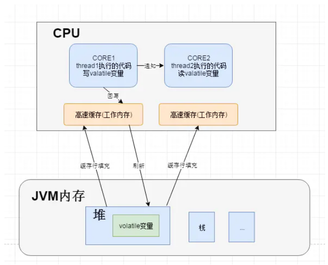
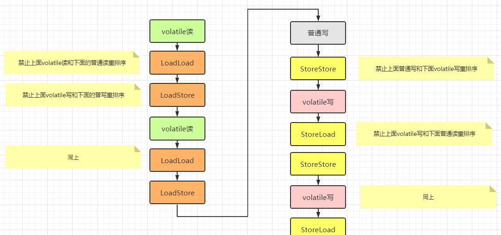
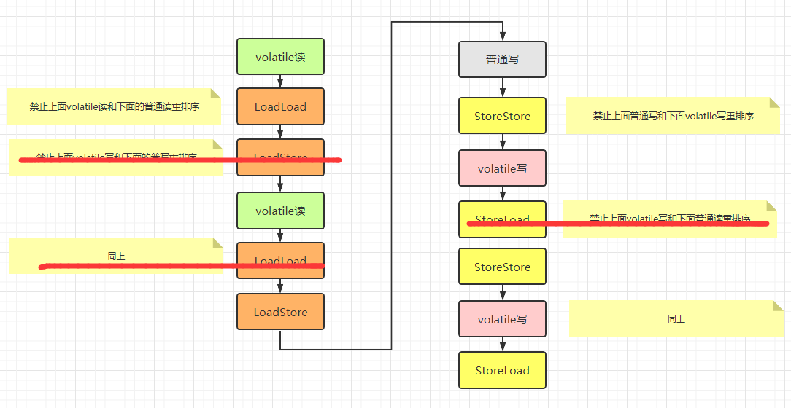
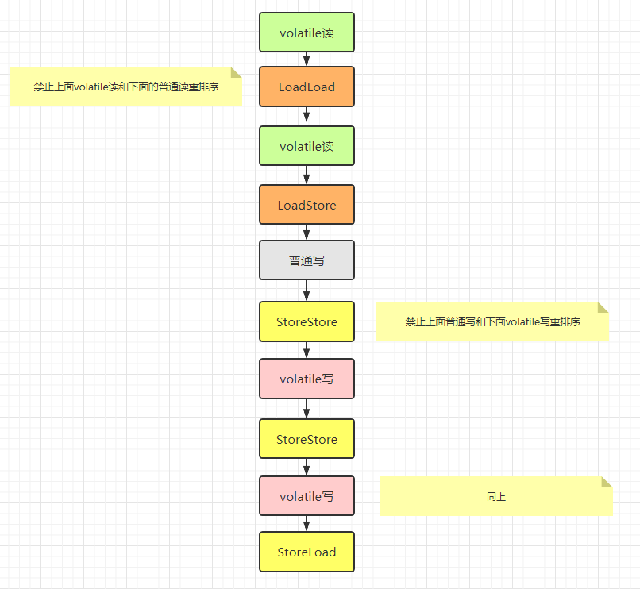

## Volatile

``Volatile``是一个关键字，用来将变量的更新操作通知到其他线程，是一种稍弱的同步机制。编译器与运行时都会注意到这个变量是共享的，因此不会将该变量上的操作与其他内存操作一起重排序。``volatile``变量不会被缓存在寄存器或者对其他处理器不可见的地方，因此在读取``volatile``类型的变量时总会返回最新写入的值。

在访问volatile变量时不会执行加锁操作，因此也就不会使执行线程阻塞，因此volatile变量是一种比``sychronized``关键字更轻量级的同步机制。

### CPU的缓存

在多线程中，每个线程中都有一个自己的工作内存（CPU的高速缓存），还有一个JVM的共享内存，因为CPU运算速度要比内存读写速度快得多，举个例子：

- 一次主内存的访问通常在几十到几百个时钟周期
- 一次L1高速缓存的读写只需要1~2个时钟周期
- 一次L2高速缓存的读写也只需要数十个时钟周期

这种访问速度的显著差异，导致CPU可能会花费很长时间等待数据到来或把数据写入内存。所以CPU大多数情况下都不会直接访问内存，而是将内存中CPU需要的一小部分缓存到工作内存中，CPU缓存是位于CPU与内存之间的临时存储器，它的容量比内存小得多但是交换速度却比内存快得多。

那么这样一来就有了问题，当一个非volatile变量在线程A中被修改了之后，会将值写入高速缓存然后再刷新到内存，如果在刷新之前，因为是共享变量，线程B中也用到了这个值，那么线程B用的值依然是旧的。

``Volatile``关键字就是用来解决这个问题的，被Volatile修饰的共享变量在转换成汇编语言前会加上一个``lock``前缀的指令，当CPU发现这个指令时：

- 立刻将高速缓存中的数据立刻写会内存中
- 在其他线程中缓存了该内存地址的数据全部无效。

所以线程B在发现数据无效后重新从内存中读取到的数据就是最新的。



### JVM内存模型可见性，原子性和有序性

#### 1.可见性

可见性指的是当一个线程修改了共享变量的值，其他线程能够立即得到这个修改。

这个上面已经描述过了，``Volatile``的特殊规则能够保证新值立刻同步到主内存，以及每次使用前都立刻从主内存刷新，因此``Volatile``保证了多线程操作时变量的可见性，而普通的变量不能保证这一点。

除了``Volatile，synchronize和final``关键字也能保证可见性

- 同步块的可见性是由“对一个变量指向``unlock``操作之前，必须将此变量同步回主内存中”这条规则实现的

- final的可见性有点不太一样，指的是当``final``修饰的字段在构造器中一旦初始化完成，且构造器没有把“this”引用逃逸出去（this引用逃逸可能会让其他线程拿到一个初始化了一半的对象），那么其他线程就能看到final字段的值。

  ```java
  public class FinalFiled {
      final int x;
      final int z=100;
      int y;
      static FinalFiled f;
  
      public FinalFiled() {
          x = 100;
          y = 100;
      }
  
      static void writer() {
          f = new FinalFiled();
      }
  
      static void reader() {
          if (f != null) {
              int i = f.x;  // 保证此时一定是 100
              int j = f.y;  // 有可能此时还是 0
              int z = f.z;  // 保证此时一定是 100
          }
      }
  ```

  当线程 A 执行了 writer 方法后，有线程 B 会进入 f != null 成立条件的代码块，此时由于可能指令重排序的原因赋给了f内存地址,到那时初始化还未完成，所以y可能还没赋值。而类的 final 域在编译器层面会保证在类的构造器运行结束之前一定要初始化完成，所以final字段可见，普通字段可能不可见。

  

#### 2.有序性

Java程序天然的有序性可以概括为：**如果在本线程内观察，所有的操作都是有序的；如果在一个线程观察另一个线程，所以的操作都是无序的。**前半句指的是“线程内表现为串行的语义”，后半句指的是“指令重排序”现象和“工作内存与主内存的同步延迟”现象。

Java语言提供了`volatile`和`synchronized`两个关键字保证线程之间操作的有序性。volatile关键字本身就包含了禁止指令重排序的语义，而``synchronized``则是由“一个变量在同一时刻只允许一条线程对其进行lock操作”这条规则获取的。

#### 3.原子性

我们大致可以认为**基本数据类型**的访问读写时具有原子性的（例外的就是long和double的非原子性协议）。如果应用场景需要一个更大范围的原子性保证。那么就需要`synchronized`关键字保证了。

如果需要更大范围的原子性，Java内存中提供了lock和unlock，对应到字节码指令就是monitorenter和monitorexit，对应到java代码中就是synchronize关键字，所以synchronize块之间的操作也具备原子性。

例如创建一个对象赋值或者``a++``这种都不是原子性操作，原子性操作类似于``a=1,``这种

### 内存屏障

volatile保持内存可见性和防止指令重排序的原理，本质上是同一个问题，也都**依靠内存屏障得到解决**，**内存屏障正是通过阻止屏障两边的指令重排序来避免编译器和硬件的不正确优化而提出的一种解决办法**。

####  硬件层的内存屏障

Intel硬件提供了一系列的内存屏障，主要有： 

-  lfence，是一种Load Barrier 读屏障 
-  sfence, 是一种Store Barrier 写屏障 
-  mfence, 是一种全能型的屏障，具备ifence和sfence的能力 
-  Lock前缀，Lock不是一种内存屏障，但是它能完成类似内存屏障的功能。Lock会对CPU总线和高速缓存加锁，可以理解为CPU指令级的一种锁。它后面可以跟ADD, ADC, AND, BTC, BTR, BTS, CMPXCHG, CMPXCH8B, DEC, INC, NEG, NOT, OR, SBB, SUB, XOR, XADD, and XCHG等指令。

#### 内存屏障的主要类型

JVM中提供了四类内存屏障指令：

| 屏障类型   | 指令示例                   | 说明                                                         |
| :--------- | :------------------------- | :----------------------------------------------------------- |
| LoadLoad   | Load1; LoadLoad; Load2     | 保证load1的读取操作在load2及后续读取操作之前执行             |
| StoreStore | Store1; StoreStore; Store2 | 在store2及其后的写操作执行前，保证store1的写操作已刷新到主内存 |
| LoadStore  | Load1; LoadStore; Store2   | 在stroe2及其后的写操作执行前，保证load1的读操作已读取结束    |
| StoreLoad  | Store1; StoreLoad; Load2   | 保证store1的写操作已刷新到主内存之后，load2及其后的读操作才能执行 |

**为了实现volatile的内存语义，编译器在生成字节码时，会在指令序列中插入内存屏障来禁止特定类型的处理器重排序**。然而，对于编译器来说，发现一个最优布置来最小化插入屏障的总数几乎不可能，为此，Java内存模型采取保守策略。
下面是基于保守策略的JMM内存屏障插入策略：
在每个volatile写操作的前面插入一个StoreStore屏障。
在每个volatile写操作的后面插入一个StoreLoad屏障。
在每个volatile读操作的后面插入一个LoadLoad屏障。
在每个volatile读操作的后面插入一个LoadStore屏障。

如下例子：

```java
	int a = 0;
    volatile int v1 = 1;
    volatile int v2 = 2;
    
    void readAndWrite(){
        int i = v1;     //volatile读
        int j = v2;     //volatile读
        a = i + j;      //普通写
        v1 = i + 1;     //volatile写
        v2 = j * 2;     //volatile写
    }}
```




但是  可以 看到上面很多屏障是多余的，例如两个读之间不需要读写屏障，所以去掉之后简化为：



最后就是：

