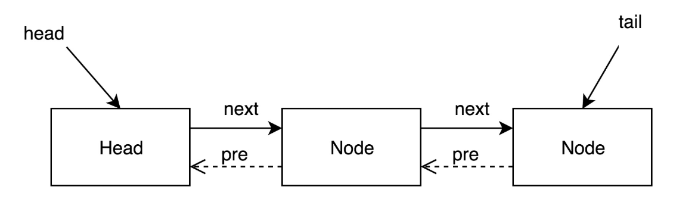

## ReentrantLock

Java中除了使用synchronize来实现独占锁之外，还可以使用ReentrantLock来，而且ReentrantLock的功能和灵活性相较于synchronize也更好一些，但是需要手动去加锁和释放锁，在使用上稍逊一筹。

### 简介

顾名思义，ReentrantLock意思为可折返再进入的锁，也就是俗称的可重入锁，同synchronize一样，计算可重复的方法都是计数器，ReentrantLock中计数器在AQS(AbstractQueuedSynchronizer)内部。

不同于synchronize关键字的JVM实现，ReentrantLock依赖JDK，甚至我们自己可以重写一套类似的锁代码。

#### AQS

　　AbstarctQueuedSynchronizer简称AQS，是一个用于构建锁和同步容器的框架。事实上concurrent包内许多类都是基于AQS构建的，例如ReentrantLock，Semphore，CountDownLatch，ReentrantReadWriteLock，FutureTask等。AQS解决了在实现同步容器时大量的细节问题。

　　AQS使用一个FIFO队列表示排队等待锁的线程，队列头结点称作“哨兵节点”或者“哑结点”，它不与任何线程关联。其他的节点与等待线程关联，每个阶段维护一个等待状态waitStatus。如图：



　　AQS中还有一个表示状态的字段state，例如ReentrantLock用它来表示线程重入锁的次数，Semphore用它表示剩余的许可数量，FutureTask用它表示任务的状态。对state变量值的更新都采用CAS操作保证更新操作的原子性。

　　AbstractQueuedSynchronized继承了AbstractOwnableSynchronized，这个类只有一个变量：exclusiveOwnerThread，表示当前占用该锁的线程，并且提供了相应的get，set方法。

　　理解AQS可以帮助我们更好的理解JUC包中的同步容器。

### 属性

#### 1.构造函数

```java
    public ReentrantLock() {
        sync = new NonfairSync();
    }

    public ReentrantLock(boolean fair) {
        sync = fair ? new FairSync() : new NonfairSync();
    }
```

ReentrantLock内有两种锁，公平锁和非公平锁，公平锁的含义是如果一个锁先于另一个锁阻塞等待，那么锁被释放后，先等待的先获得锁，synchronize就是一个非公平锁。

这里的Sync是一个内部类，继承与AQS(AbstractQueuedSynchronizer),两种锁继承与Sync，具体的细节实现在两者的内部。

#### 2.使用方法

```java
 static Lock lock = new ReentrantLock();
    public static void main(String[] args) throws InterruptedException {
        Thread a = new Thread(() -> test("线程A"));
        Thread b = new Thread(() -> test("线程B"));
        a.start();
        b.start();

    }

    static void test(String threadName) {
        lock.lock();
        try {
            for (int j = 0; j < 5; j++) {
                System.out.println("threadName = " + threadName);
            }
        } finally {
            lock.unlock();
        }

    }
}
输出：
threadName = 线程A
threadName = 线程A
threadName = 线程A
threadName = 线程A
threadName = 线程A
threadName = 线程B
threadName = 线程B
threadName = 线程B
threadName = 线程B
threadName = 线程B
```

上面就是ReentrantLock最简单的一种使用方式，通过lock加锁，unlock解锁。下面就来看看细节

#### 3加锁

```java
lock.lock();
-> this.sync.lock();(ReentrantLock)
-> FairSync.lock()或NonfairSync.lock();
-> 这里用非公平锁介绍
  /**
    * Performs lock.  Try immediate barge, backing up to normal
    * acquire on failure.
    */
final void lock() {
    if (compareAndSetState(0, 1))
        //设置当前线程为独占锁的所有者
   		 setExclusiveOwnerThread(Thread.currentThread());
    else
  		 acquire(1);
}
protected final boolean compareAndSetState(int expect, int update) {
    return U.compareAndSwapInt(this, STATE, expect, update);
}
/**
 * The current owner of exclusive mode synchronization.
 */
private transient Thread exclusiveOwnerThread;
```

##### 3.1 尝试获取锁：tryAcquire

熟悉的CAS,首先将当前线程的STATE值（AbstractQueuedSynchronizer）将其由0改为1，如果成功了，说明当前锁还没有线程使用，那么当前线程获得该锁的占有权，设置exclusiveOwnerThread为当前线程。如果失败，则说明线程已经被占用，那么当前线程需要阻塞住。

```java
    /** Marker to indicate a node is waiting in exclusive mode */
    static final Node EXCLUSIVE = null;  
	public final void acquire(int arg) {
        //再试一遍，万一在这点时间内锁就释放出来了
        if (!tryAcquire(arg) &&
            acquireQueued(addWaiter(Node.EXCLUSIVE), arg))
            //将当前锁阻塞
            selfInterrupt();//Thread.currentThread().interrupt();
    }
    protected final boolean tryAcquire(int acquires) {
        return nonfairTryAcquire(acquires);
    }
    final boolean nonfairTryAcquire(int acquires) {
        final Thread current = Thread.currentThread();
        int c = getState();
        //再试一遍，万一为0了
        if (c == 0) {
            if (compareAndSetState(0, acquires)) {
                setExclusiveOwnerThread(current);
                return true;
            }
        }
        //可重入锁，如果当前占有的锁正是当前锁，那么state+1，再进去
        else if (current == getExclusiveOwnerThread()) {
            int nextc = c + acquires;
            if (nextc < 0) // overflow
                throw new Error("Maximum lock count exceeded");
            setState(nextc);
            return true;
        }
        return false;
    }
```

##### 3.2添加锁节点到队列：addWaiter

在第一次失败后，在进行一次获取锁尝试，顺便判断当前线程是否就是获得锁的线程（锁的可重入性），再次失败后将当前线程加入队列后阻塞该线程。

```java
    private Node addWaiter(Node mode) {
        //初始化节点,设置关联线程和模式(独占 or 共享)
        Node node = new Node(mode);
        for (;;) {
            Node oldTail = tail;
            if (oldTail != null) {
                U.putObject(node, Node.PREV, oldTail);
                //cas的方式将当前线程node插入到尾节点后面
                if (compareAndSetTail(oldTail, node)) {
                    oldTail.next = node;
                    return node;
                }
            } else {
                //初始化队列
                initializeSyncQueue();
            }
        }
    }

	final boolean acquireQueued(final Node node, int arg) {
        try {
            //标记线程是否被中断过
            boolean interrupted = false;
            for (;;) {
                //获取前驱节点
                final Node p = node.predecessor();
                //如果前驱是head,即该结点已成老二，那么便有资格去尝试获取锁
                if (p == head && tryAcquire(arg)) {
                    // 获取成功,将当前节点设置为head节点
                    setHead(node);
                    p.next = null; // help GC
                    return interrupted;
                }
                 // 判断获取失败后是否可以挂起,若可以则挂起
                if (shouldParkAfterFailedAcquire(p, node) &&
                    parkAndCheckInterrupt())
                     // 线程若被中断,设置interrupted为true
                    interrupted = true;
            }
        } catch (Throwable t) {
            cancelAcquire(node);
            throw t;
        }
    }
    private final boolean compareAndSetTail(Node expect, Node update) {
        return U.compareAndSwapObject(this, TAIL, expect, update);
    }
    private final void initializeSyncQueue() {
        Node h;
        if (U.compareAndSwapObject(this, HEAD, null, (h = new Node())))
            tail = h;
    }
```

##### 3.3 失败后挂起锁：shouldParkAfterFailedAcquire

如果队列中的锁过多，当前锁并不能设置为头结点，那么会执行第二个if

```java
    /**
     * 检查并更新无法获取的节点的状态。
     * 如果线程应阻塞，则返回true。
     * 这是获取锁循环中的信号控制中心。 
     * 注意pred == node.prev。
     * @param threadName
     */   
	private static boolean shouldParkAfterFailedAcquire(Node pred, Node node) {
        //见下面【2.3.1】
        int ws = pred.waitStatus;
        //该节点已经设置了信号，可以安全挂起
        if (ws == Node.SIGNAL)
            return true;
        // 前驱节点状态为CANCELLED
        if (ws > 0) {
    	// 从队尾向前寻找第一个状态不为CANCELLED的节点
            do {
                node.prev = pred = pred.prev;
            } while (pred.waitStatus > 0);
            pred.next = node;
        } else {
            /*
             * waitStatus must be 0 or PROPAGATE.  Indicate that we
             * need a signal, but don't park yet.  Caller will need to
             * retry to make sure it cannot acquire before parking.
             */
            pred.compareAndSetWaitStatus(ws, Node.SIGNAL);
        }
        return false;
    }
/**
 * 挂起当前线程,返回线程中断状态并重置
 */
private final boolean parkAndCheckInterrupt() {
    LockSupport.park(this);
    return Thread.interrupted();
}
```

###### 3.3.1waitStatus

waitStatus是一个volatile修饰的int属性值，它有如下几个值：

- SIGNAL（-1）：该节点的后继节点（或者即将很快）已经被阻塞（通过park方法被阻塞）了，因此当前节点在释放或者取消的时候必须unpark它的后继节点，为了避免冲突，acquire方法必须首先表明他们需要一个signal，然后在原子性的获取，如果失败了则阻塞。

  也就是说，线程入队后能够挂起的前提是，它的前驱节点的状态为SIGNAL。它的含义是“Hi，前面的兄弟，如果你获取锁并且出队后，记得把我唤醒！

  所以shouldParkAfterFailedAcquire会先判断当前节点的前驱是否状态符合要求，若符合则返回true，然后调用parkAndCheckInterrupt，将自己挂起。如果不符合，再看前驱节点是否>0(CANCELLED)，若是那么向前遍历直到找到第一个符合要求的前驱，若不是则将前驱节点的状态设置为SIGNAL。

  整个流程中，如果前驱结点的状态不是SIGNAL，那么自己就不能安心挂起，需要去找个安心的挂起点，同时可以再尝试下看有没有机会去尝试竞争锁。

- CANCELLED（1）：这个节点由于超时或中断被取消了。节点不会离开（改变）这个状态。事实上，一个被取消的线程不再会被阻塞了。

- CONDITION（-2）：与condition的使用有关

- PROPAGATE（-3）：暂时未知

- 0：上面所有情况之外的情况

  ```java
          /** Marker to indicate a node is waiting in shared mode */
          static final Node SHARED = new Node();
          /** Marker to indicate a node is waiting in exclusive mode */
          static final Node EXCLUSIVE = null;
  
          /** waitStatus value to indicate thread has cancelled. */
          static final int CANCELLED =  1;
          /** waitStatus value to indicate successor's thread needs unparking. */
          static final int SIGNAL    = -1;
          /** waitStatus value to indicate thread is waiting on condition. */
          static final int CONDITION = -2;
          /**
           * waitStatus value to indicate the next acquireShared should
           * unconditionally propagate.
           */
          static final int PROPAGATE = -3;
  ```

  

这里的目的是找到一个信号为Singal的前置节点，如果找不到，那么把自己设为Singal。

#### 4 解锁

```java
    public void unlock() {
        sync.release(1);
    }
    public final boolean release(int arg) {
        if (tryRelease(arg)) {
            Node h = head;
            if (h != null && h.waitStatus != 0)
                unparkSuccessor(h);
            return true;
        }
        return false;
    }
    protected final boolean tryRelease(int releases) {
         // 计算释放后state值
        int c = getState() - releases;
        if (Thread.currentThread() != getExclusiveOwnerThread())
            throw new IllegalMonitorStateException();
        boolean free = false;
         // 锁被重入次数为0,表示释放成功
        if (c == 0) {
            free = true;
            setExclusiveOwnerThread(null);
        }
        setState(c);
        return free;
    }
```

首先尝试去释放锁，释放成功后，获取头结点，如果头结点不为0，就开始去唤醒后继节点。

```java
    private void unparkSuccessor(Node node) {
        /*
         * If status is negative (i.e., possibly needing signal) try
         * to clear in anticipation of signalling.  It is OK if this
         * fails or if status is changed by waiting thread.
         */
        int ws = node.waitStatus;
        if (ws < 0)
            //清空当前节点的信号
            node.compareAndSetWaitStatus(ws, 0);

        /*
         * Thread to unpark is held in successor, which is normally
         * just the next node.  But if cancelled or apparently null,
         * traverse backwards from tail to find the actual
         * non-cancelled successor.
         */
        Node s = node.next;
        //如果有后继节点，那么直接唤醒，否则从后向前寻找一个不为CANCEL状态的节点
        if (s == null || s.waitStatus > 0) {
            s = null;
            for (Node p = tail; p != node && p != null; p = p.prev)
                if (p.waitStatus <= 0)
                    s = p;
        }
        if (s != null)
            LockSupport.unpark(s.thread);
    }
```

#### 5.公平锁和飞公平锁的差异

```java
        final void lock() {
            if (compareAndSetState(0, 1))
                setExclusiveOwnerThread(Thread.currentThread());
            else
                acquire(1);//公平锁直接执行这行
        }
```

公平锁祛除了直接获取锁的路径，就是直接调用``acquire(1)``，这样所有的锁都会老老实实去排队，不会出现一进来就有机会拿到锁的可能。

还有在tryAcquire中多了一行是否有前置节点的判断

```java
        protected final boolean tryAcquire(int acquires) {
            final Thread current = Thread.currentThread();
            int c = getState();
            if (c == 0) {
                if (!hasQueuedPredecessors() &&
                    compareAndSetState(0, acquires)) {
                    setExclusiveOwnerThread(current);
                    return true;
                }
            }
            ...
        }
	//当队列中没有节点或者节点就是当前线程（重入了）
	 public final boolean hasQueuedPredecessors() {
        // The correctness of this depends on head being initialized
        // before tail and on head.next being accurate if the current
        // thread is first in queue.
        Node t = tail; // Read fields in reverse initialization order
        Node h = head;
        Node s;
        return h != t &&
            ((s = h.next) == null || s.thread != Thread.currentThread());
    }

```


