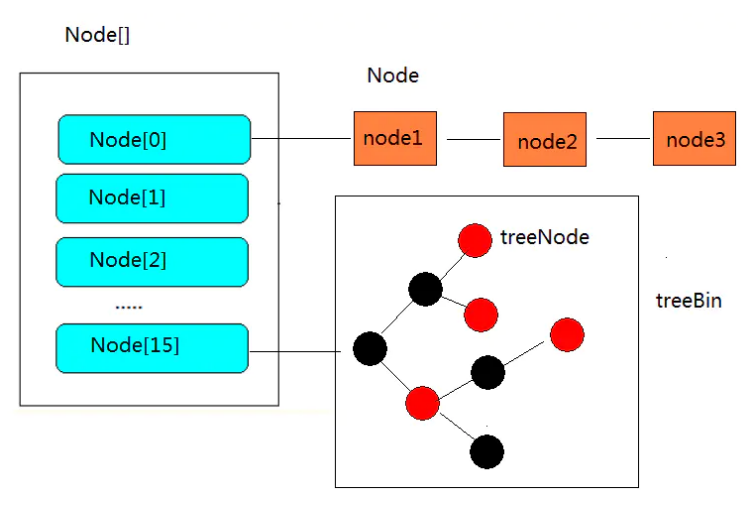
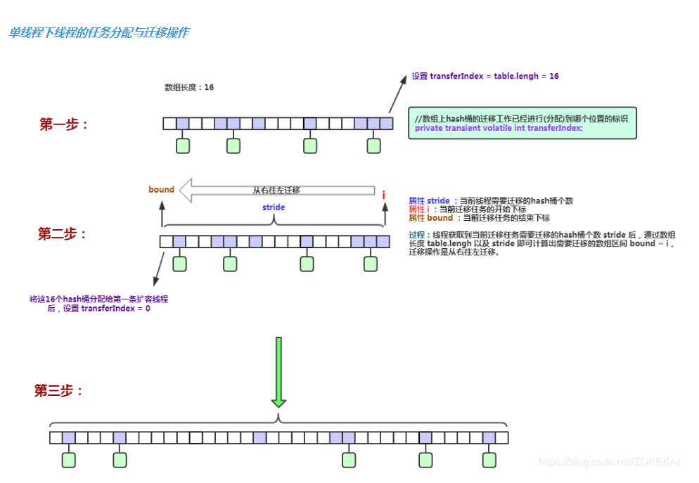
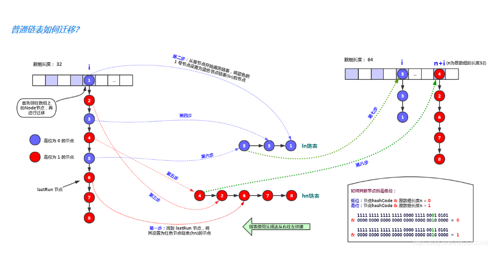
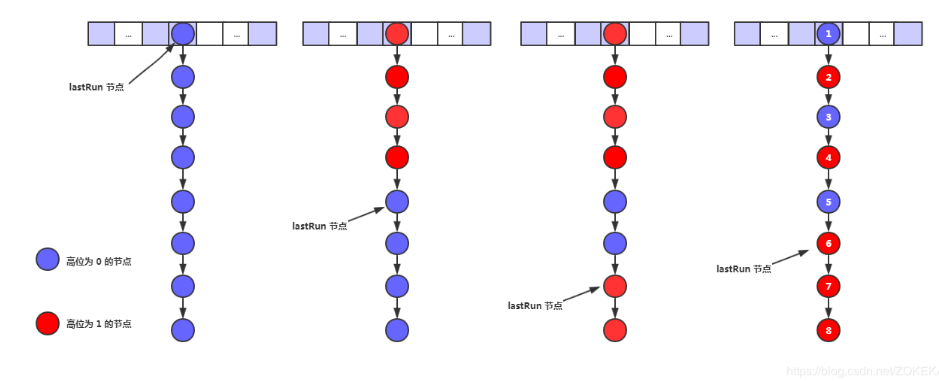
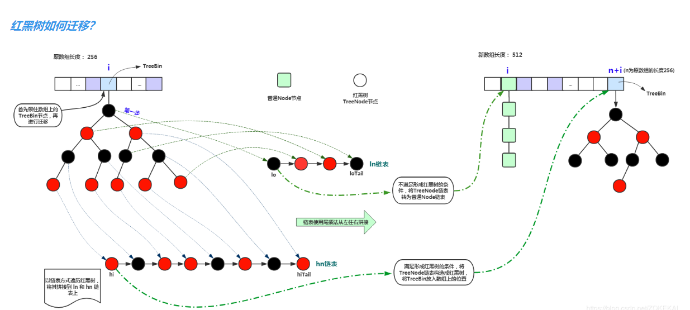

## ·ConcurrentHashMap

ConcurrentHashMap是一个线程安全的HashMap，相较于HashTable给每个方法上锁，它采用了更轻量级的分段锁来实现线程安全。

> 此哈希表的主要设计目标是保持并发可读性（通常是get（）方法，还包括迭代器和相关方法），同时最大程度地减少更新竞争。 次要目标是使空间消耗保持与java.util.HashMap相同或更好，并支持许多线程对空表的高初始插入率。

以下分析基于JDK8

jdk8直接抛弃了Segment的设计，采用了较为轻捷的Node + CAS + Synchronized设计，保证线程安全。

### 属性

```java
/**
 * 箱子(桶)数组，和HashMap一样，第一次插入的时候初始化，大小为2的次幂，
 * 由迭代器直接访问
 */
transient volatile Node<K,V>[] table;

/**
 * 扩容时使用，平时为 null，只有在扩容的时候才为非 null
 */
private transient volatile Node<K,V>[] nextTable;

/**
 * Base counter value, used mainly when there is no contention,
 * but also as a fallback during table initialization
 * races. Updated via CAS.
 * 该属性保存着整个哈希表中存储的所有的结点的个数总和，有点类似于 HashMap 的 size 属性。
 */
private transient volatile long baseCount;

/**
 * 这个值比较重要，下面解释 
 */
private transient volatile int sizeCtl;

/**
 * The next table index (plus one) to split while resizing.
 * 表示扩容时的nextTable的下标
 */
private transient volatile int transferIndex;

/**
 * Spinlock (locked via CAS) used when resizing and/or creating CounterCells.
 *  // 标识当前cell数组是否在初始化或扩容中的CAS标志位
 */
private transient volatile int cellsBusy;

/**
 * Table of counter cells. When non-null, size is a power of 2.
 * 每个Cell的数量，size()方法返回的值就是遍历累加数组所有的值
 */
private transient volatile CounterCell[] counterCells;

// views
private transient KeySetView<K,V> keySet;
private transient ValuesView<K,V> values;
private transient EntrySetView<K,V> entrySet;
```

``sizeCtl``:用volatile修饰的一个变量，用与数组初始化与扩容控制

- ``sizeCtl==0``：未指定初始容量，初始容量就为默认初始容量

- ``sizeCtl>0``：
- 如果当前数组table为null时表示table正在初始化，``sizeCtl``就是要新建数组的长度。由指定的初始容量计算而来，再找最近的2的幂次方。比如传入6，计算公式为6+6/2+1=10，最近的2的幂次方为16，所以sizeCtl就为16
  - 如果当前数据已经初始化完成，表示当前数据的阈值，超过了该临界值就扩容，值为table.length*0.75(扩容因子)

- ``sizeCtl<0``：
  - -1：当前table正在初始化
  - -N：高16位表示的是当前容量，用于记录扩容时容器的大小，低16位等于M，表示当前有M-1个扩容线程

### 方法

#### 1.put

  ```java
	
	public V put(K key, V value) {
        return putVal(key, value, false);
    }

    /** Implementation for put and putIfAbsent */
    final V putVal(K key, V value, boolean onlyIfAbsent) {
        //key和map都不能为null fail-fast机制
        if (key == null || value == null) throw new NullPointerException();
        //高低位混合位运算
        int hash = spread(key.hashCode());
        int binCount = 0;
        for (Node<K,V>[] tab = table;;) {
            Node<K,V> f; int n, i, fh;
            if (tab == null || (n = tab.length) == 0)
                //初始化table
                tab = initTable();
            else if ((f = tabAt(tab, i = (n - 1) & hash)) == null) {
            /*
             * table 对应下标的头结点为 null
             * 基于 CAS 设置结点，如果成功则本次 put 操作完成，【看1.1】
             * 如果失败则说明期间有并发操作，需要进入一轮新的循环
             */
                if (casTabAt(tab, i, null,new Node<K,V>(hash, key, value, null)))】
                   // 设置结点成功，put 操作完成
                    break;                   // no lock when adding to empty bin
            }
            //如果 Map 正在执行扩容操作（MOVED 哈希值表示正在扩容），则帮助扩容
            else if ((fh = f.hash) == MOVED)
                //后续再看
                tab = helpTransfer(tab, f);
            else {
                 // 获取到 hash 值对应下标的头结点，且结点不为 null
                V oldVal = null;
                synchronized (f) {
                    // 再次校验头结点为 f
                    if (tabAt(tab, i) == f) {
                        // 头结点的哈希值大于等于 0，说明是链表，如果是树的话应该是 -2
                        if (fh >= 0) {
                            binCount = 1;
                            for (Node<K,V> e = f;; ++binCount) {
                                K ek;
                                // 如果是已经存在的 key，则在允许覆盖的前提下直接覆盖已有的值
                                if (e.hash == hash &&((ek = e.key) == key ||(ek != null && key.equals(ek)))) {
                                    oldVal = e.val;
                                    if (!onlyIfAbsent)
                                        e.val = value;
                                    break;
                                }
                                 // 如果是不存在的 key，则直接在链表尾部插入一个新的结点
                                Node<K,V> pred = e;
                                if ((e = e.next) == null) {
                                    pred.next = new Node<K,V>(hash, key,value, null);
                                    break;
                                }
                            }
                        }
                         // 头结点的哈希值小于0，判断节点是否是树节点
                        else if (f instanceof TreeBin) {
                            Node<K,V> p;
                            binCount = 2;
                            // 调用红黑树的方法获取到修改的结点，并插入或更新结点（如果允许）
                            if ((p = ((TreeBin<K,V>)f).putTreeVal(hash, key, value)) != null) {
                                oldVal = p.val;
                                if (!onlyIfAbsent)
                                    p.val = value;
                            }
                        }
                        //一个占位符节点，为了加锁【看1.2】
                        else if (f instanceof ReservationNode)
                            throw new IllegalStateException("Recursive update");
                    }
                }
                if (binCount != 0) {
                     /*
                     * 结点数目大于等于 8，对链表执行转换操作
                     * - 如果 table 长度小于 64，则执行扩容
                     * - 如果 table 长度大于等于 64，则转换成红黑树
                     */
                    if (binCount >= TREEIFY_THRESHOLD)
                        treeifyBin(tab, i);
                    if (oldVal != null)
                        return oldVal;
                    break;
                }
            }
        }
        addCount(1L, binCount);
        return null;
    }

    /**
     * Initializes table, using the size recorded in sizeCtl.
     */
    private final Node<K,V>[] initTable() {
        Node<K,V>[] tab; int sc;
        while ((tab = table) == null || tab.length == 0) {
            if ((sc = sizeCtl) < 0)
                Thread.yield(); // lost initialization race; just spin
            else if (U.compareAndSwapInt(this, SIZECTL, sc, -1)) {
                try {
                    if ((tab = table) == null || tab.length == 0) {
                        int n = (sc > 0) ? sc : DEFAULT_CAPACITY;
                        @SuppressWarnings("unchecked")
                        Node<K,V>[] nt = (Node<K,V>[])new Node<?,?>[n];
                        table = tab = nt;
                        sc = n - (n >>> 2);
                    }
                } finally {
                    sizeCtl = sc;
                }
                break;
            }
        }
        return tab;
    }
  ```

##### 1.1 直接操作主存tab数组

```java
  
	//以volatile读的方式读取table数组中的元素
	//直接读取主存中tab的第i个位置的数据
    static final <K,V> Node<K,V> tabAt(Node<K,V>[] tab, int i) {
        return (Node<K,V>)U.getObjectVolatile(tab, ((long)i << ASHIFT) + ABASE);
    }
    //以volatile写的方式，将元素插入table数组
    static final <K,V> void setTabAt(Node<K,V>[] tab, int i, Node<K,V> v) {
        U.putObjectVolatile(tab, ((long)i << ASHIFT) + ABASE, v);
    }
    //以CAS的方式，将元素插入table数组
    static final <K,V> boolean casTabAt(Node<K,V>[] tab, int i,
                                        Node<K,V> c, Node<K,V> v) {
        //原子的执行如下逻辑：如果tab[i]==c,则设置tab[i]=v，并返回ture.否则返回false
        return U.compareAndSwapObject(tab, ((long)i << ASHIFT) + ABASE, c, v);
    }
    
```

以上的三个方法指的是直接去主存中读取tab的值，因为volatile修饰的是table数组，他只能保证数组的引用在变化时刷新，在数组内元素变化的时候对其他线程并不具有可见性，而且这里的tab还是一个局部变量，它没有volatile修饰，所以更不具有可见性，所以需要直接操作主存。

##### 1.2 ReservationNode

这个点是一个保留节点，或者也叫空节点。``computeIfAbsent``和``compute``这两个函数式api中才会使用。它的hash值固定为-3，就是个占位符，不会保存实际的数据，正常情况是不会出现的，在jdk1.8新的函数式有关的两个方法``computeIfAbsent``和``compute``中才会出现。

ReservationNode在ComputeIfAbsent()及其相关方法中作为一个预留节点使用。computeIfAbsent()方法会先判断相应的Key值是否已经存在，如

果不存在，则调用由用户实现的自定义方法来生成Value值，组成KV键值对，随后插入此哈希集合中。在并发场景下，在从得知Key不存在到插入哈希

集合的时间间隔内，为了防止哈希槽被其他线程抢占，当前线程会使用一个ReservationNode节点放到槽中并加锁，从而保证了线程的安全性。

```java
static final class ReservationNode<K,V> extends Node<K,V> {
    ReservationNode() {
        super(RESERVED, null, null, null);
    }
    // 空节点代表这个hash桶当前为null，所以肯定找不到“相等”的节点
    Node<K,V> find(int h, Object k) {
        return null;
    }
}
```

方法的执行流程可以概括为：

1. 计算 key 的哈希值
2. 如果 table 为空，则执行初始化
3. 否则，计算 key 哈希值对应的下标，并获取 table 中对应下标的头结点
4. 如果头结点为 null，则基于 CAS 尝试添加头结点
5. 否则，如果头结点不为 null，但是头结点的哈希值为 MOVED，说明目前正在执行扩容操作，则帮助扩容
6. 否则，如果头结点不为 null，且未处于扩容状态，则尝试添加或更新结点
7. 如果当前头结点是个占位符，就抛出异常
8. 判断当前 bin 范围内结点数目是否大于阈值，如果大于阈值则执行扩容操作


#### 2.get

```java
public V get(Object key) {
     Node<K,V>[] tab; Node<K,V> e, p; int n, eh; K ek;
 	   // 计算 key 的 hash 值	
        int h = spread(key.hashCode());
    	 // table 表不为空，且 key 对应的 table 头结点存在
        if ((tab = table) != null && (n = tab.length) > 0 &&(e = tabAt(tab, (n - 1) & h)) != null) {
            if ((eh = e.hash) == h) {
                if ((ek = e.key) == key || (ek != null && key.equals(ek)))
                     // 找到对应的 key，返回 value
                    return e.val;
            }
            //eh=-1，说明该节点是一个ForwardingNode，正在迁移，此时调用ForwardingNode的find方法去nextTable里找。
            //eh=-2，说明该节点是一个TreeBin，此时调用TreeBin的find方法遍历红黑树，由于红黑树有可能正在旋转变色，所以find里会有读写锁。
            //eh>=0，说明该节点下挂的是一个链表，直接遍历该链表即可
            else if (eh < 0)
                return (p = e.find(h, key)) != null ? p.val : null;
            // 当前 bin 是链表，直接遍历检索
            while ((e = e.next) != null) {
                if (e.hash == h &&((ek = e.key) == key || (ek != null && key.equals(ek))))
                    return e.val;
            }
        }
        return null;
}
```

方法首先依据相同的实现计算 key 的哈希值，然后定位 key 在 table 中的 bin 位置。如果 bin 结点存在，则依据当前 bin 类型（链表或红黑树）检索目标值。

但是可以看到get方法并没有任何一处加锁，那么get方法是怎么保证多线程并发？

```java
    static class Node<K,V> implements Map.Entry<K,V> {
        final int hash;
        final K key;
        volatile V val;
        volatile Node<K,V> next;
```

get操作可以无锁是由于Node的元素val和指针next是用volatile修饰的，在多线程环境下线程A修改结点的val或者新增节点的时候是对线程B可见的。

另外，table数组也是volatile修饰的，但是volatile修饰数组时只对其引用地址保持可见性，对其元素的改变没有引用性，那么加volatile的作用是什么？

主要是:**为了使得Node数组在扩容的时候对其他线程具有可见性而加的volatile**

- 在1.8中ConcurrentHashMap的get操作全程不需要加锁，这也是它比其他并发集合比如hashtable、用Collections.synchronizedMap()包装的hashmap安全效率高的原因之一。
- get操作全程不需要加锁是因为Node的成员val是用volatile修饰的和数组用volatile修饰没有关系。
- 数组用volatile修饰主要是保证在数组扩容的时候保证可见性。

#####  3.remove

```java
 public V remove(Object key) {
        return replaceNode(key, null, null);
    }

    /**
     * value:当 value==null 时 ，删除节点 。否则 更新节点的值为value
     * cv:一个期望值， 当cv==null:表示直接更新value/删除节点,
     * cv不为空，则只有在key的oldValue等于期望值的时候，才更新value/删除节点
     */
    final V replaceNode(Object key, V value, Object cv) {
        int hash = spread(key.hashCode());
        for (Node<K,V>[] tab = table;;) {
            Node<K,V> f; int n, i, fh;
            if (tab == null || (n = tab.length) == 0 ||
                (f = tabAt(tab, i = (n - 1) & hash)) == null)
                break;
            else if ((fh = f.hash) == MOVED)
                tab = helpTransfer(tab, f);
            else {
                V oldVal = null;
                boolean validated = false;
                synchronized (f) {
                    //如果这里的tabAt(tab, i)不等于f，说明在这个判断时间内其他线程修改了tab[i]，继续for循环重新来过
                    if (tabAt(tab, i) == f) {
                        //大于0位node链表
                        if (fh >= 0) {
                            validated = true;
                            for (Node<K,V> e = f, pred = null;;) {
                                K ek;
                               //找的key对应的node
                                if (e.hash == hash &&((ek = e.key) == key ||(ek != null && key.equals(ek)))) {
                                    V ev = e.val;
                                    //这里cv为null
                                    if (cv == null || cv == ev || (ev != null && cv.equals(ev))) {
                                        oldVal = ev;
                                        //更新，这里并不是
                                        if (value != null)
                                            e.val = value;
                                        //删除非头节点
                                        else if (pred != null)
                                            pred.next = e.next;
                                        //删除头结点，当pred为null时才会进入这里，e就是头结点，所以把next设为新的头结点
                                        else
                                             //因为已经获取了头结点锁，所以此时不需要使用casTabAt	
                                            setTabAt(tab, i, e.next);
                                    }
                                    break;
                                }//这里对应第一个if
                                pred = e;
                                if ((e = e.next) == null)
                                    //到达链表尾部，依旧没有找到，跳出循环
                                    break;
                            }//这里对应for循环结尾
                        }
                        else if (f instanceof TreeBin) {
                            validated = true;
                            TreeBin<K,V> t = (TreeBin<K,V>)f;
                            TreeNode<K,V> r, p;
                            if ((r = t.root) != null &&                                                   
                                (p = r.findTreeNode(hash, key, null)) != null) {
                                V pv = p.val;
                                if (cv == null || cv == pv ||
                                    (pv != null && cv.equals(pv))) {
                                    oldVal = pv;
                                    if (value != null)
                                        p.val = value;
                                    else if (t.removeTreeNode(p))
                                        setTabAt(tab, i, untreeify(t.first));
                                }
                            }
                        }
                        else if (f instanceof ReservationNode)
                            throw new IllegalStateException("Recursive update");
                    }
                }
                if (validated) {
                    if (oldVal != null) {
                        if (value == null)
                            //减去一个容量，第二个-1表示不需要检测去扩容
                            addCount(-1L, -1);
                        return oldVal;
                    }
                    break;
                }
            }
        }
        return null;
    }
```

#### 4.扩容机制

##### 4.1 触发扩容的时机

```java
/**
 * 添加计数，如果表太小且尚未扩容，则开始启动扩容transfer方法。
 * 如果已经开始扩容，则帮助扩容。
 * transfer后重新检查占用，是因为其他地方扩容可能也用到了，因为扩容是滞后的。
 * check if <0, don't check resize, if <= 1 only check if uncontended(无竞争),这里的check是桶的数量binCount
 */

    private final void addCount(long x, int check) {
        CounterCell[] as; long b, s;

        if ((as = counterCells) != null ||
                !U.compareAndSwapLong(this, BASECOUNT, b = baseCount, s = b + x)) {
            CounterCell a; long v; int m;
            boolean uncontended = true;
            if (as == null || (m = as.length - 1) < 0 ||
                    (a = as[ThreadLocalRandom.getProbe() & m]) == null ||
                    !(uncontended =
                            U.compareAndSwapLong(a, CELLVALUE, v = a.value, v + x))) {
                fullAddCount(x, uncontended);
                return;
            }
            if (check <= 1)
                return;
            s = sumCount();
        }
        if (check >= 0) {
            Node<K,V>[] tab, nt; int n, sc;
            /**
             * 检查当前集合元素个数 s 是否达到扩容阈值 sizeCtl ，
             * 扩容时 sizeCtl 为负数，依旧成立，同时还得满足数组非空且数组长度不能大于允许的数组最大长度这两个条件才能继续
             * 这个 while 循环除了判断是否达到阈值从而进行扩容操作之外还有一个作用:
             * 就是当一条线程完成自己的迁移任务后，如果集合还在扩容，则会继续循环，继续加入扩容大军，申请后面的迁移任务
             */
            while (s >= (long)(sc = sizeCtl) && (tab = table) != null &&
                    (n = tab.length) < MAXIMUM_CAPACITY) {
                int rs = resizeStamp(n);
                // sc < 0 说明集合正在扩容当中
                if (sc < 0) {
                    //判断扩容是否结束或者并发扩容线程数是否已达最大值，如果是的话直接结束while循环
                    if ((sc >>> RESIZE_STAMP_SHIFT) != rs || sc == rs + 1 ||
                            sc == rs + MAX_RESIZERS || (nt = nextTable) == null ||
                            transferIndex <= 0)
                        break;
                    //扩容还未结束，并且允许扩容线程加入，此时加入扩容大军中
                    if (U.compareAndSwapInt(this, SIZECTL, sc, sc + 1))
                        transfer(tab, nt);
                }
                //如果集合还未处于扩容状态中，则进入扩容方法，并首先初始化 nextTab 数组，也就是新数组
                //(rs << RESIZE_STAMP_SHIFT) + 2 为首个扩容线程所设置的特定值，
                // 后面扩容时会根据线程是否为这个值来确定是否为最后一个线程
                else if (U.compareAndSwapInt(this, SIZECTL, sc,
                        (rs << RESIZE_STAMP_SHIFT) + 2))
                    transfer(tab, null);
                s = sumCount();
            }
        }
    }
```

##### 4.2扩容占位符

ForwardingNode是一个特殊的占位对象Node，该占位对象的 hash 值为 -1 该占位对象存在时表示集合正在扩容状态，key、value、next 属性均为 null ，nextTable 属性指向扩容后的数组

- 占位作用，用于标识数组该位置的桶已经迁移完毕，处于扩容中的状态。
- 作为一个转发的作用，扩容期间如果遇到查询操作，遇到转发节点，会把该查询操作转发到新的数组上去，不会阻塞查询操作。

```java
  /**
     * A node inserted at head of bins during transfer operations.
     */
    static final class ForwardingNode<K,V> extends Node<K,V> {
        final Node<K,V>[] nextTable;
        ForwardingNode(Node<K,V>[] tab) {
            super(MOVED(-1), null, null, null);
            this.nextTable = tab;
        }
		//通过此方法，访问被迁移到nextTable中的数据
        Node<K,V> find(int h, Object k) {
            // loop to avoid arbitrarily deep recursion on forwarding nodes
            outer: for (Node<K,V>[] tab = nextTable;;) {
                Node<K,V> e; int n;
                if (k == null || tab == null || (n = tab.length) == 0 ||
                    //找到根据hash分配的桶
                    (e = tabAt(tab, (n - 1) & h)) == null)
                    return null;
                for (;;) {
                    int eh; K ek;
                    //(eh就是前面的MOVED,也就是-1)) 
                    if ((eh = e.hash== h &&
                        ((ek = e.key) == k || (ek != null && k.equals(ek))))
                        return e;
                    if (eh < 0) {
                        if (e instanceof ForwardingNode) {
                            tab = ((ForwardingNode<K,V>)e).nextTable;
                            continue outer;
                        }
                        else
                            return e.find(h, k);
                    }
                    if ((e = e.next) == null)
                        return null;
                }
            }
        }
    }
```

##### 4.3扩容(transfer)

```java
// check if <0, don't check resize, if <= 1 only check if uncontended(无竞争)
    private final void addCount(long x, int check) {
        CounterCell[] as; long b, s;

        if ((as = counterCells) != null ||
                !U.compareAndSwapLong(this, BASECOUNT, b = baseCount, s = b + x)) {
            CounterCell a; long v; int m;
            boolean uncontended = true;
            if (as == null || (m = as.length - 1) < 0 ||
                    (a = as[ThreadLocalRandom.getProbe() & m]) == null ||
                    !(uncontended =
                            U.compareAndSwapLong(a, CELLVALUE, v = a.value, v + x))) {
                fullAddCount(x, uncontended);
                return;
            }
            if (check <= 1)
                return;
            s = sumCount();
        }
        if (check >= 0) {
            Node<K,V>[] tab, nt; int n, sc;
            /**
             * 检查当前集合元素个数 s 是否达到扩容阈值 sizeCtl ，
             * 扩容时 sizeCtl 为负数，依旧成立，同时还得满足数组非空且数组长度不能大于允许的数组最大长度这两个条件才能继续
             * 这个 while 循环除了判断是否达到阈值从而进行扩容操作之外还有一个作用:
             * 就是当一条线程完成自己的迁移任务后，如果集合还在扩容，则会继续循环，继续加入扩容大军，申请后面的迁移任务
             */
            while (s >= (long)(sc = sizeCtl) && (tab = table) != null &&
                    (n = tab.length) < MAXIMUM_CAPACITY) {
                int rs = resizeStamp(n);
                // sc < 0 说明集合正在扩容当中
                if (sc < 0) {
                    //判断扩容是否结束或者并发扩容线程数是否已达最大值，如果是的话直接结束while循环
                    if ((sc >>> RESIZE_STAMP_SHIFT) != rs || sc == rs + 1 ||
                            sc == rs + MAX_RESIZERS || (nt = nextTable) == null ||
                            transferIndex <= 0)
                        break;
                    //扩容还未结束，并且允许扩容线程加入，此时加入扩容大军中
                    if (U.compareAndSwapInt(this, SIZECTL, sc, sc + 1))
                        transfer(tab, nt);
                }
                //如果集合还未处于扩容状态中，则进入扩容方法，并首先初始化 nextTab 数组，也就是新数组
                //(rs << RESIZE_STAMP_SHIFT) + 2 为首个扩容线程所设置的特定值，
                // 后面扩容时会根据线程是否为这个值来确定是否为最后一个线程
                else if (U.compareAndSwapInt(this, SIZECTL, sc,
                        (rs << RESIZE_STAMP_SHIFT) + 2))
                    transfer(tab, null);
                s = sumCount();
            }
        }
    }
    private final void transfer(Node<K,V>[] tab, Node<K,V>[] nextTab) {
        int n = tab.length, stride;
        // NCPU为CPU的数量，stride表示每个桶处理桶的数量，当为单核CPU时，一个线程处理所有
        // 当为多核CPU时,每条线程至少处理16个桶，如果计算出来的结果少于16，则一条线程处理16个桶
        if ((stride = (NCPU > 1) ? (n >>> 3) / NCPU : n) < MIN_TRANSFER_STRIDE)
            stride = MIN_TRANSFER_STRIDE(16); // subdivide range
        if (nextTab == null) {            // initiating
            try {
                // 初始化新数组(原数组长度的2倍
                @SuppressWarnings("unchecked")
                Node<K,V>[] nt = (Node<K,V>[])new Node<?,?>[n << 1];
                nextTab = nt;
            } catch (Throwable ex) {      // try to cope with OOME
                sizeCtl = Integer.MAX_VALUE;
                return;
            }
            nextTable = nextTab;
            // 更新转移下标，就是 老的 tab 的 length,他表示的是开始转移的下标，从右向左转移
            transferIndex = n;

        }
        int nextn = nextTab.length;
        //新建占位符Node，指向的新的扩容数组
        ForwardingNode<K,V> fwd = new ForwardingNode<K,V>(nextTab);
        //该标识用于控制是否继续处理下一个桶，为 true 则表示已经处理完当前桶，可以继续迁移下一个桶的数据
        boolean advance = true;
        //该标识用于控制扩容何时结束，该标识还有一个用途是最后一个扩容线程会负责重新检查一遍数组查看是否有遗漏的桶
        boolean finishing = false; // to ensure sweep before committing nextTab
        for (int i = 0, bound = 0;;) {
            Node<K,V> f; int fh;
            // 如果当前线程可以向后推进；这个循环就是控制 i 递减。同时，每个线程都会进入这里取得自己需要转移的桶的区间
            while (advance) {
                int nextIndex, nextBound;
                // 经过了下面两步之后，这个i就是可处理区间[nextBound,nextIndex]内从右到左的下标值，
                // 每次减一，直到小于bound(nextBound)后退出循环
                if (--i >= bound || finishing)
                    advance = false;
                //第一步：先获得可以转移数据的最大坐标，也就是原数组的最大下标，
                else if ((nextIndex = transferIndex) <= 0) {
                    //当transferIndex小于等于0时，说明已经没有区间可供转移了，所以扩容结束
                    i = -1;
                    advance = false;
                }
                // 第二步
                // stride前面可以知道是一个线程可以处理的桶的数量，nextIndex是当前可处理的最大数组下标，
                // 两者相减得出了该线程处理的区间，然后重点来了，因为线程已经包揽了[nextBound,nextIndex]这段区间的桶的处理
                // 那么留给别的线程处理的数组最大只能从nextBound开始了，所以修改主存中的transferIndex为这个nextBound
                // 然后该线程的nextIndex就一直不会等于主存中的TRANSFERINDEX，所以该线程这里的compareAndSwapInt就是一直返回false。
                // CAS 修改 transferIndex(直接修改主存，对所有线程可见)，即 length - 区间值，留下剩余的区间值供后面的线程使用
                else if (U.compareAndSwapInt(this, TRANSFERINDEX(读取的主内存中的transferIndex),
                        nextIndex,nextBound = (nextIndex > stride ?nextIndex - stride : 0))) {
                    // 这个值就是当前线程可以处理的最小当前区间最小下标
                    bound = nextBound;
                    i = nextIndex - 1;
                    advance = false;
                }
            }//对应前面while
            // 如果 i 小于0 （不在 tab 下标内，按照上面的判断，领取最后一段区间的线程扩容结束）
            //  如果 i >= tab.length(不知道为什么这么判断)
            //  如果 i + tab.length >= nextTable.length  （不知道为什么这么判断）
            if (i < 0 || i >= n || i + n >= nextn) {
                int sc;
                //扩容结束后做后续工作，将 nextTable 设置为 null，表示扩容已结束，将 table 指向新数组，sizeCtl 设置为扩容阈值
                if (finishing) {
                    nextTable = null;
                    table = nextTab;;// 更新 table
                    sizeCtl = (n << 1) - (n >>> 1);// 更新阈值(2n-0.5n)=1.5n=0.75*2
                    return;
                }
                // 尝试将 sc -1. 表示这个线程结束帮助扩容了，将 sc 的低 16 位减一。
                if (U.compareAndSwapInt(this, SIZECTL, sc = sizeCtl, sc - 1)) {
                    // 如果 sc - 2 不等于标识符左移 16 位。如果他们相等了，说明没有线程在帮助他们扩容了。也就是说，扩容结束了。
                    if ((sc - 2) != resizeStamp(n) << RESIZE_STAMP_SHIFT)
                        return;// 不相等，说明没结束，当前线程结束方法。
                    finishing = advance = true;// 如果相等，扩容结束了，更新 finising 变量
                    i = n; // 再次循环检查一下整张表做检测
                }
            }
            else if ((f = tabAt(tab, i)) == null)
                // 获取原区间i下标的Node，如果为null，那么插入fwd占位节点
                // 如果成功写入 fwd 占位，再次推进一个下标
                advance = casTabAt(tab, i, null, fwd);
            else if ((fh = f.hash) == MOVED)
                // 如果不是 null 且 hash 值是 MOVED。
                // 说明这个桶正在被扩容，所以等于这个桶已经被推进了，直接下一个
                advance = true; // already processed
            else {
                // 到这里，说明这个位置有实际值了，且不是占位符。对这个节点上锁。为什么上锁，防止 putVal 的时候向链表插入数据
                synchronized (f) {
                    // 判断 i 下标处的桶节点是否和 f 相同，防止在判断前面两个的过程中其他线程修改了这个下标的值
                    if (tabAt(tab, i) == f) {
                        // low, height 低位桶头结点，高位桶头结点(指的是&运算后第一位二进制是0还是1)
                        Node<K,V> ln, hn;
                        // 如果 f 的 hash 值大于 0 说明是链表。TreeBin 的 hash 是 -2
                        if (fh >= 0) {
                            // 对老长度进行与运算（第一个操作数的的第n位于第二个操作数的第n位如果都是1，那么结果的第n为也为1，否则为0）
                            // 由于 Map 的长度都是 2 的次方（000001000 这类的数字），那么取于 length 只有 2 种结果，一种是 0，一种是1
                            //  如果是结果是0 ，Doug Lea 将其放在低位，反之放在高位，目的是将链表重新 hash，放到对应的位置上，让新的取于算法能够击中他。
                            int runBit = fh & n;
                            Node<K,V> lastRun = f; // 尾节点，且和头节点的 hash 值取于不相等
                            // 遍历这个桶
                            for (Node<K,V> p = f.next; p != null; p = p.next) {
                                // 取于桶中每个节点的 hash 值
                                int b = p.hash & n;
                                // 如果节点的 hash 值和首节点的 hash 值取于结果不同
                                if (b != runBit) {
                                    runBit = b; // 更新 runBit，用于下面判断 lastRun 该赋值给 ln 还是 hn。
                                    lastRun = p; // 这个 lastRun 保证后面的节点与自己的取于值相同，避免后面没有必要的循环
                                }
                            }
                            if (runBit == 0) {// 如果最后更新的 runBit 是 0 ，设置低位节点
                                ln = lastRun;
                                hn = null;
                            }
                            else {
                                hn = lastRun; // 如果最后更新的 runBit 是 1， 设置高位节点
                                ln = null;
                            }// 再次循环，生成两个链表，lastRun 作为停止条件，这样就是避免无谓的循环（lastRun 后面都是相同的取于结果）
                            for (Node<K,V> p = f; p != lastRun; p = p.next) {
                                int ph = p.hash; K pk = p.key; V pv = p.val;
                                // 如果与运算结果是 0，那么就还在低位
                                if ((ph & n) == 0) // 如果是0 ，那么创建低位节点
                                    ln = new Node<K,V>(ph, pk, pv, ln);
                                else // 1 则创建高位
                                    hn = new Node<K,V>(ph, pk, pv, hn);
                            }
                            // 其实这里类似 hashMap
                            // 设置低位链表放在新链表的 i
                            setTabAt(nextTab, i, ln);
                            // 设置高位链表，在原有长度上加 n
                            setTabAt(nextTab, i + n, hn);
                            // 将旧的链表设置成占位符
                            setTabAt(tab, i, fwd);
                            // 继续向后推进
                            advance = true;
                        }// 如果是红黑树
                        else if (f instanceof TreeBin) {
                            TreeBin<K,V> t = (TreeBin<K,V>)f;
                            TreeNode<K,V> lo = null, loTail = null;
                            TreeNode<K,V> hi = null, hiTail = null;
                            int lc = 0, hc = 0;
                            // 遍历
                            for (Node<K,V> e = t.first; e != null; e = e.next) {
                                int h = e.hash;
                                TreeNode<K,V> p = new TreeNode<K,V>
                                        (h, e.key, e.val, null, null);
                                // 和链表相同的判断，与运算 == 0 的放在低位
                                if ((h & n) == 0) {
                                    if ((p.prev = loTail) == null)
                                        lo = p;
                                    else
                                        loTail.next = p;
                                    loTail = p;
                                    ++lc;
                                } // 不是 0 的放在高位
                                else {
                                    if ((p.prev = hiTail) == null)
                                        hi = p;
                                    else
                                        hiTail.next = p;
                                    hiTail = p;
                                    ++hc;
                                }
                            }
                            // 如果树的节点数小于等于 6，那么转成链表，反之，创建一个新的树
                            ln = (lc <= UNTREEIFY_THRESHOLD) ? untreeify(lo) :
                                    (hc != 0) ? new TreeBin<K,V>(lo) : t;
                            hn = (hc <= UNTREEIFY_THRESHOLD) ? untreeify(hi) :
                                    (lc != 0) ? new TreeBin<K,V>(hi) : t;
                            // 低位树
                            setTabAt(nextTab, i, ln);
                            // 高位数
                            setTabAt(nextTab, i + n, hn);
                            // 旧的设置成占位符
                            setTabAt(tab, i, fwd);
                            // 继续向后推进
                            advance = true;
                        }
                    }
                }
            }
        }
    }
```






这里的lastRun指的是链表从后往前数，第一个使得后面节点都是相同（高位或者地位）的节点，可为高位，也可为低位，主要是减少计算





##### 4.4 协助扩容

扩容状态下其他线程对集合进行插入、修改、删除、合并、compute等操作时遇到 ForwardingNode 节点会调用该帮助扩容方法

```java
    final V putVal(K key, V value, boolean onlyIfAbsent) {
        if (key == null || value == null) throw new NullPointerException();
        int hash = spread(key.hashCode());
        int binCount = 0;
        for (Node<K,V>[] tab = table;;) {
            Node<K,V> f; int n, i, fh;
            if (tab == null || (n = tab.length) == 0)
                tab = initTable();
            else if ((f = tabAt(tab, i = (n - 1) & hash)) == null) {
                if (casTabAt(tab, i, null,
                             new Node<K,V>(hash, key, value, null)))
                    break;                   // no lock when adding to empty bin
            }
            //MOVED表示该节点正在扩容
            else if ((fh = f.hash) == MOVED)
                tab = helpTransfer(tab, f);
            ...
        }
        
final Node<K,V>[] helpTransfer(Node<K,V>[] tab, Node<K,V > f) {
    Node<K,V>[] nextTab; int sc;
     // 如果在从上面到下面的短时间内扩容完成了，那么就直接返回扩容后的新table
    // 当该节点是ForwardingNode占位节点，如果不为null表示还没扩容完毕，因为扩容完毕后nextTable会设置为null
	// 如果在从上面到下面的短时间内扩容完成了，那么就直接返回扩容后的新table
    if (tab != null && (f instanceof ForwardingNode) && (nextTab = ((ForwardingNode<K,V>)f).nextTable) != null) {
        //查看步骤一
        int rs = resizeStamp(tab.length);
        // 如果 nextTab 没有被并发修改 且 tab 也没有被并发修改
        // 且 sizeCtl  < 0 （说明还在扩容）
        while (nextTab == nextTable && table == tab && (sc = sizeCtl) < 0) {
             //条件1：检查是对容量n的扩容，保证sizeCtl与n是一块修改好的
             //条件2与条件3：应该是进行sc的最小值或最大值判断。
             //条件4与条件5: 确保tranfer()中的nextTable相关初始化逻辑已走完。
            if ((sc >>> RESIZE_STAMP_SHIFT) != rs || sc == rs + 1 ||
                sc == rs + MAX_RESIZERS || transferIndex <= 0)
                break;
            // 如果以上都不是, 将 sizeCtl + 1, （表示增加了一个线程帮助其扩容）
            if (U.compareAndSwapInt(this, SIZECTL, sc, sc + 1)) {
                transfer(tab, nextTab);
                break;
            }
        }
        return nextTab;
    }
    return table;
    
```

###### 步骤一

```java
/**
 * The maximum number of threads that can help resize.
 * Must fit in 32 - RESIZE_STAMP_BITS bits.
 */
private static final int MAX_RESIZERS = (1 << (32 - RESIZE_STAMP_BITS)) - 1;
/**
 * The number of bits used for generation stamp in sizeCtl.
 * Must be at least 6 for 32bit arrays.
*/
private static int RESIZE_STAMP_BITS = 16;

/**
 * The bit shift for recording size stamp in sizeCtl.
 * 
 */
private static final int RESIZE_STAMP_SHIFT = 32 - RESIZE_STAMP_BITS;

static final int resizeStamp(int n) {
   return Integer.numberOfLeadingZeros(n) | (1 << (RESIZE_STAMP_BITS - 1));
}
```

`Integer.numberOfLeadingZeros(n)`用于计算n转换成二进制后前面有几个0。这个有什么作用呢？
首先``ConcurrentHashMap``的容量必定是2的幂次方，所以不同的容量n前面0的个数必然不同，这样可以保证是在原容量为n的情况下进行扩容。
`(1 << (RESIZE_STAMP_BITS - 1)`即是1<<15，表示为二进制即是高16位为0，第16位为1：

```java
0000 0000 0000 0000 1000 0000 0000 0000
```

所以``resizeStamp()``的返回值(简称为rs) **高16位置0，第16位为1，低15位存放当前容量n扩容标识，用于表示是对n的扩容。**
rs与RESIZE_STAMP_SHIFT配合可以求出新的sizeCtl的值，分情况如下：

- sc >= 0
  表示没有线程在扩容，使用CAS将sizeCtl的值改为(rs << RESIZE_STAMP_SHIFT) + 2)。
- sc < 0
  已经有线程在扩容，将sizeCtl+1并调用transfer()让当前线程参与扩容。

rs即resizeStamp(n)，如当前容量为8时sc(sizeCtl)的计算过程如下：

```java
//容量n=8
0000 0000 0000 0000 0000 0000 0000 1000
//Integer.numberOfLeadingZeros(8)=28，二进制表示如下：
0000 0000 0000 0000 0000 0000 0001 1100
0000 0000 0000 0000 1000 0000 0000 0000(1 << (RESIZE_STAMP_BITS - 1)
//rs
0000 0000 0000 0000 1000 0000 0001 1100
//temp = rs << RESIZE_STAMP_SHIFT，即 temp = rs << 16，左移16后temp最高位为1，所以temp成了一个负数。
1000 0000 0001 1100 0000 0000 0000 0000
//第一个线程要扩容时，sc = (rs << RESIZE_STAMP_SHIFT) + 2)
1000 0000 0001 1100 0000 0000 0000 0010
12345678910
```

那么在扩容时sizeCtl值的意义便如下图所示：

|    高15位     |      低16位      |
| :-----------: | :--------------: |
| 容量n扩容标识 | 并行扩容线程数+1 |

##### 步骤二

- 第一个判断：sizeCtl钱15位存储的是数组容量N，如果不一致说明发生了改变

- 第二第三个判断都是判断线程数：默认第一个线程设置 sc ==rs 左移 16 位 + 2，当第一个线程结束扩容了，就会将 sc 减一。这个时候，sc 就等于 rs + 1，

  或者`` sizeCtl == rs + 65535``如果达到最大帮助线程的数量，即 65535

- 或者转移下标正在调整 （扩容结束）

https://www.codercto.com/a/57430.html

  ​	