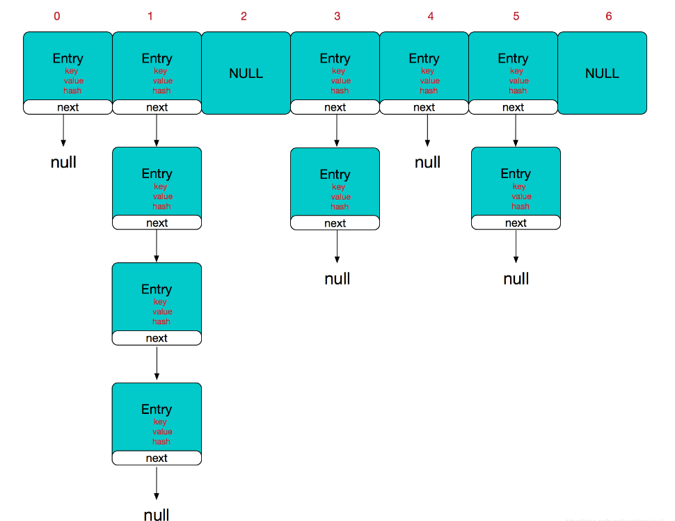
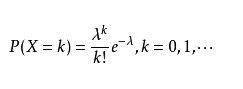

## HashMap

> HashMap作为一种优秀的数据存储结构，本质是一种(key,value)结构，它结合的数组和链表的优点对数据进行存储，通过对数据key的hashcode计算分配到对应的数组中，如果出现碰撞，使用链地址法将数据转化为链表，在Java8中，当链表长度大于8时转化为红黑树。



### 优点

- 数组结构在查询和插入删除复杂度方面分别为O(1)和O(n)
- 链表结构在查询和插入删除复杂度方面分别为O(n)和O(1)
- 二叉树做了平衡 两者都为O(lgn)
- 而哈希表两者结合了数组和链表的优点，在大部分情况下基本查询都为O(1)，就算数据很大产生了很长的链表，那么在转换成红黑树的情况下查询和插入的速度都基本为O(logN)

### 属性

```java
  	/**
     * 默认的初始化桶容量，必须为2的次幂
     */
    static final int DEFAULT_INITIAL_CAPACITY = 1 << 4; // aka 16

    /**
     * 最大容量为2^30 依旧是2的次幂
     */
    static final int MAXIMUM_CAPACITY = 1 << 30;

    /**
     * 扩容加载因子，例如初始值16在有16 * 0.75 = 12对键值对的情况下就要扩容
     */
    static final float DEFAULT_LOAD_FACTOR = 0.75f;

    /**
     * 当桶中的链表太长时，会将其自动转换成红黑树，
     * 这个值就是链表的转换点，当链表长度大于8时转换成红黑树
     */
    static final int TREEIFY_THRESHOLD = 8;

    /**
     * 在哈希表扩容时，如果发现链表长度小于 6，则会由树重新退化为链表。
     */
    static final int UNTREEIFY_THRESHOLD = 6;

    /**
     * 红黑树化的最小值，想要将链表中的数据转化成红黑树，键值对数量最少要64
     */
    static final int MIN_TREEIFY_CAPACITY = 64;

    /**
     * 也就是桶，存储后续链表的头结点，也是红黑树的root节点
     * 该数组在存入数据的时候才开始初始化，创建HashMap的时候并不会初始化
     */
    transient Node<K,V>[] table;
```

我们通过[Hash算法](./Hash算法.md)可以让每个数据尽可能平均的分配到每个桶中，理想状态下哈希表的每个箱子中，元素的数量遵守泊松分布：



当负载因子为0.75时，上述公式中的$\lambda $约等于 0.5，因此箱子中元素个数和概率的关系如下:

| 数量 | 概率       |
| ---- | ---------- |
| 0    | 0.60653066 |
| 1    | 0.30326533 |
| 2    | 0.07581633 |
| 3    | 0.01263606 |
| 4    | 0.00157952 |
| 5    | 0.00015795 |
| 6    | 0.00001316 |
| 7    | 0.00000094 |
| 8    | 0.00000006 |

这就是为什么箱子中链表长度超过 8 以后要变成红黑树，因为在正常情况下出现这种现象的几率小到忽略不计。一旦出现，几乎可以认为是哈希函数设计有问题导致的。

### 方法

#### 1.put

```java
   public V put(K key, V value) {
        return putVal(hash(key), key, value, false, true);
    }
    /**
     * @param onlyIfAbsent 为true时，key相同的情况不下更新value值
     * @param evict if false, the table is in creation mode.
     * @return previous value, or null if none
     */
   final V putVal(int hash, K key, V value, boolean onlyIfAbsent,
                   boolean evict) {
        Node<K,V>[] tab; Node<K,V> p; int n, i;
       	//如果table还没初始化，先初始化table，resize()方法用于初始化或者扩容
        if ((tab = table) == null || (n = tab.length) == 0)
            n = (tab = resize()).length;
        //i = (n - 1) & hash]通过hash方法取模后获得桶的下标，如果为空就存入
        if ((p = tab[i = (n - 1) & hash]) == null)
            tab[i] = newNode(hash, key, value, null);
        else {
            Node<K,V> e; K k;
            //如果当前点hash key value值都想同，说明这个要存的值在Hashmap中已经存在了，后面略过
            if (p.hash == hash &&
                ((k = p.key) == key || (key != null && key.equals(k))))
                e = p;
            else if (p instanceof TreeNode)
                //如果红黑树中存在改节点则返回，否则创建新节点加入树后返回null
                e = ((TreeNode<K,V>)p).putTreeVal(this, tab, hash, key, value);
            else {
                //循环遍历，直到遍历到链表尾部插入或者找到一个键值对相同的节点
                for (int binCount = 0; ; ++binCount) {
                    if ((e = p.next) == null) {
                        p.next = newNode(hash, key, value, null);
                        //如果链表长度大于8(包含了头结点)，那么需要把链表红黑树化
                        if (binCount >= TREEIFY_THRESHOLD - 1) // -1 for 1st
                            treeifyBin(tab, hash);
                        break;
                    }
                    if (e.hash == hash &&
                        ((k = e.key) == key || (key != null && key.equals(k))))
                        break;
                    p = e;
                }
            }
            //如果Map中存在key对应的Node节点
            if (e != null) { // existing mapping for key
                V oldValue = e.value;
                //默认是需要更新value值，或者原来的value值为null时也要更新value值
                if (!onlyIfAbsent || oldValue == null)
                    e.value = value;
                afterNodeAccess(e);
                return oldValue;
            }
        }
       //和ArrayList一样，因为是线程不安全的，所以需要用modCount来计算版本号
        ++modCount;
        if (++size > threshold)
            resize();
        afterNodeInsertion(evict);
        return null;
    }
```

##### 1.1红黑树化

```java
 final void treeifyBin(Node<K,V>[] tab, int hash) {
        int n, index; Node<K,V> e;
     	//前面说了转换成红黑树最少需要64个数据，当小于这个数据时，就只进行扩容
        if (tab == null || (n = tab.length) < MIN_TREEIFY_CAPACITY)
            resize();
        else if ((e = tab[index = (n - 1) & hash]) != null) {
            //hd代表头节点，tl代表尾节点，形成一个双向链表
            TreeNode<K,V> hd = null, tl = null;
            do {
                //将链表中的结点转换为树结点，形成一个TreeNode形式的新链表
                TreeNode<K,V> p = replacementTreeNode(e, null);
                if (tl == null)
                    hd = p;
                else {
                    p.prev = tl;
                    tl.next = p;
                }
                tl = p;
            } while ((e = e.next) != null);
             //将新的树结点链表原来的位置
            if ((tab[index] = hd) != null)
                //在前面我们已经把新节点加到链表最后了，这里的hd是树节点形成的链表的头结点
                //调用treeify把链表转换成树
                hd.treeify把链表转换成树(tab);
        }
    }
	TreeNode<K,V> replacementTreeNode(Node<K,V> p, Node<K,V> next) {
        return new TreeNode<>(p.hash, p.key, p.value, next);
    }
```

#### 2.get

```java
    public V get(Object key) {
        Node<K,V> e;
        return (e = getNode(hash(key), key)) == null ? null : e.value;
    }
    final Node<K,V> getNode(int hash, Object key) {
        Node<K,V>[] tab; Node<K,V> first, e; int n; K k;
        //桶数组存在，且长度大于0且该桶中存在节点
        if ((tab = table) != null && (n = tab.length) > 0 &&
            (first = tab[(n - 1) & hash]) != null) {
            //如果第一个节点就相同就返回，否则就红黑树节点或者链表中遍历查找
            if (first.hash == hash && // always check first node
                ((k = first.key) == key || (key != null && key.equals(k))))
                return first;
            if ((e = first.next) != null) {
                if (first instanceof TreeNode)
                    return ((TreeNode<K,V>)first).getTreeNode(hash, key);
                do {
                    if (e.hash == hash &&
                        ((k = e.key) == key || (key != null && key.equals(k))))
                        return e;
                } while ((e = e.next) != null);
            }
        }
        return null;
    }
```

#### 3.remove

```java
    public V remove(Object key) {
        Node<K,V> e;
        return (e = removeNode(hash(key), key, null, false, true)) == null ?
            null : e.value;
    }
    /**
     * Implements Map.remove and related methods
     * @param value the value to match if matchValue, else ignored
     * @param matchValue为true时，只有value也相等时才可以删除
     * @param movable if false do not move other nodes while removing
     * @return the node, or null if none
     */
    final Node<K,V> removeNode(int hash, Object key, Object value,
                               boolean matchValue, boolean movable) {
        Node<K,V>[] tab; Node<K,V> p; int n, index;
        //照例判断桶数组是否为空，然后找到对应的桶中的头结点
        if ((tab = table) != null && (n = tab.length) > 0 &&
            (p = tab[index = (n - 1) & hash]) != null) {
            Node<K,V> node = null, e; K k; V v;
            //相同就删除
            if (p.hash == hash &&
                ((k = p.key) == key || (key != null && key.equals(k))))
                node = p;
            else if ((e = p.next) != null) {
                if (p instanceof TreeNode)
                    //从红黑树中找对应点，没找到则为null
                    node = ((TreeNode<K,V>)p).getTreeNode(hash, key);
                else {
                    //遍历链表找点
                    do {
                        if (e.hash == hash &&
                            ((k = e.key) == key ||
                             (key != null && key.equals(k)))) {
                            node = e;
                            break;
                        }
                        p = e;
                    } while ((e = e.next) != null);
                }
            }
            //这里判断相等还要用Value类型自身的equal方法，这里是为了适配自定义的equal方法
            if (node != null && (!matchValue || (v = node.value) == value ||
                                 (value != null && value.equals(v)))) {
                if (node instanceof TreeNode)
                    ((TreeNode<K,V>)node).removeTreeNode(this, tab, movable);
                else if (node == p)
                    tab[index] = node.next;
                else
                    p.next = node.next;
                ++modCount;
                --size;
                afterNodeRemoval(node);
                return node;
            }
        }
        return null;
    }
```

containvalue 为什么不便利数