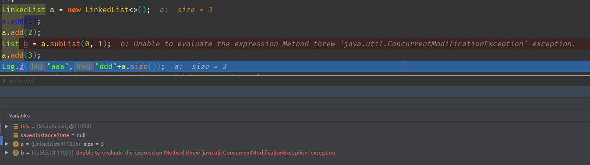

## LinkedList

> LinkedList是一个实现了List和Deque接口的双向链表，实现了所有可选的列表操作，并且运行存储任何元素，包括null，所以既可以将 LinkedList 当做一个有序容器，也可以将之看作一个队列。

``LinkedList``也是非线程安全的，但是如果想要保持现场安全，除了对操作加锁外，还可以使用源码注释推荐的

```java
List list = Collections.synchronizedList(new LinkedList(...))
```

同ArrayList一样，``LinkedList``也不允许在迭代的时候进行增删操作，原理一样（``modCount``），抛出的错误也是一样（``ConcurrentModificationException``）

因为底层是链表，所以LinkedList有高效的插入和删除操作，但是查找速度略逊。

### 属性

```java
public class LinkedList<E>
    extends AbstractSequentialList<E>
    implements List<E>, Deque<E>, Cloneable, java.io.Serializable
{
    transient int size = 0;

    /**
     * Pointer to first node.
     * Invariant: (first == null && last == null) ||
     *            (first.prev == null && first.item != null)
     */
    transient Node<E> first;

    /**
     * Pointer to last node.
     * Invariant: (first == null && last == null) ||
     *            (last.next == null && last.item != null)
     */
    transient Node<E> last;
    
        private static class Node<E> {
        E item;
        Node<E> next;
        Node<E> prev;

        Node(Node<E> prev, E element, Node<E> next) {
            this.item = element;
            this.next = next;
            this.prev = prev;
        }
    }
    
```

``LinkedList``内部维护了两个头结点，一个在头部，一个在尾部，每个节点都包含前驱节点和后续节点。

### 方法

#### add

LinkedList因为实现了队列接口，所以可以在头部和尾部添加数据

```java
    /**
     * Links e as first element.
     */
    private void linkFirst(E e) {
        final Node<E> f = first;
        //创建的Node，默认前驱为null，后驱为头结点
        final Node<E> newNode = new Node<>(null, e, f);
        first = newNode;
        //如果first为null，说明此事的linkedlist还没有数据，所以把last爷设为当前node，此时头尾节点是同一个
        if (f == null)
            last = newNode;
        else
            f.prev = newNode;
        size++;
        modCount++;
    }

    /**
     * Links e as last element.
     */
    void linkLast(E e) {
        final Node<E> l = last;
        final Node<E> newNode = new Node<>(l, e, null);
        last = newNode;
        if (l == null)
            first = newNode;
        else
            l.next = newNode;
        size++;
        modCount++;
    }
    public void push(E e) {
        addFirst(e);
    }


```

push方法默认从头部插入

上面为eque接口的添加方法，下面为List接口的添加方法，add方法默认从尾部开始添加

```java
    public boolean add(E e) {
        linkLast(e);
        return true;
    }
    public void add(int index, E element) {
        //检查是否越界
        checkPositionIndex(index);
		//如果等于最后一个，那么从尾部插入，否则从前面插入
        if (index == size)
            linkLast(element);
        else
            linkBefore(element, node(index));
    }    
	Node<E> node(int index) {
        // assert isElementIndex(index);

        if (index < (size >> 1)) {
            Node<E> x = first;
            for (int i = 0; i < index; i++)
                x = x.next;
            return x;
        } else {
            Node<E> x = last;
            for (int i = size - 1; i > index; i--)
                x = x.prev;
            return x;
        }
    }
    void linkBefore(E e, Node<E> succ) {
        // assert succ != null;
        final Node<E> pred = succ.prev;
        final Node<E> newNode = new Node<>(pred, e, succ);
        succ.prev = newNode;
        //如果前驱为null，说明index为0，插入的点就变成了头结点
        if (pred == null)
            first = newNode;
        else
            pred.next = newNode;
        size++;
        modCount++;
    }
```

#### remove

```java
//poll默认从头节点开始删除   
public E poll() {
        final Node<E> f = first;
        return (f == null) ? null : unlinkFirst(f);
    }
//删除头结点
  private E unlinkFirst(Node<E> f) {
        // assert f == first && f != null;
        final E element = f.item;
        final Node<E> next = f.next;
    	 //设为null帮助GC
        f.item = null;
        f.next = null; // help GC
        first = next;
      //如果next为null，说明头尾是一个节点，把尾巴节点也设置为null
        if (next == null)
            last = null;
        else
            next.prev = null;
        size--;
        modCount++;
        return element;
    }
    private E unlinkLast(Node<E> l) {
        // assert l == last && l != null;
        final E element = l.item;
        final Node<E> prev = l.prev;
        l.item = null;
        l.prev = null; // help GC
        last = prev;
        if (prev == null)
            first = null;
        else
            prev.next = null;
        size--;
        modCount++;
        return element;
    }
    public E pop() {
        return removeFirst();
    }
```

push和pop方法为一对，push从头部插入，``pop``从头部删除，``poll``也是从头部删除,``add``从尾部插入.

#### clear

```java
    public void clear() {
        // Clearing all of the links between nodes is "unnecessary", but:
        // - helps a generational GC if the discarded nodes inhabit
        //   more than one generation
        // - is sure to free memory even if there is a reachable Iterator
        for (Node<E> x = first; x != null; ) {
            Node<E> next = x.next;
            //全部设为null方便GC
            x.item = null;
            x.next = null;
            x.prev = null;
            x = next;
        }
        first = last = null;
        size = 0;
        modCount++;
    }
```

#### 迭代器

LinkedList和ArrayList，也可以通过迭代器遍历数据

```java
  private class ListItr extends Itr implements ListIterator<E> {
        ListItr(int index) {
            cursor = index;
        }

        public boolean hasPrevious() {
            return cursor != 0;
        }

        public E previous() {
            checkForComodification();
            try {
                int i = cursor - 1;
                E previous = get(i);
                lastRet = cursor = i;
                return previous;
            } catch (IndexOutOfBoundsException e) {
                checkForComodification();
                throw new NoSuchElementException();
            }
        }

        public int nextIndex() {
            return cursor;
        }

        public int previousIndex() {
            return cursor-1;
        }

        public void set(E e) {
            if (lastRet < 0)
                throw new IllegalStateException();
            checkForComodification();

            try {
                AbstractList.this.set(lastRet, e);
                expectedModCount = modCount;
            } catch (IndexOutOfBoundsException ex) {
                throw new ConcurrentModificationException();
            }
        }

        public void add(E e) {
            checkForComodification();

            try {
                int i = cursor;
                AbstractList.this.add(i, e);
                lastRet = -1;
                cursor = i + 1;
                expectedModCount = modCount;
            } catch (IndexOutOfBoundsException ex) {
                throw new ConcurrentModificationException();
            }
        }
    }
 private class Itr implements Iterator<E> {
        /**
         * Index of element to be returned by subsequent call to next.
         */
        int cursor = 0;

        /**
         * Index of element returned by most recent call to next or
         * previous.  Reset to -1 if this element is deleted by a call
         * to remove.
         */
        int lastRet = -1;

        /**
         * The modCount value that the iterator believes that the backing
         * List should have.  If this expectation is violated, the iterator
         * has detected concurrent modification.
         */
        int expectedModCount = modCount;

        public boolean hasNext() {
            return cursor != size();
        }

        public E next() {
            checkForComodification();
            try {
                int i = cursor;
                E next = get(i);
                lastRet = i;
                cursor = i + 1;
                return next;
            } catch (IndexOutOfBoundsException e) {
                checkForComodification();
                throw new NoSuchElementException();
            }
        }

        public void remove() {
            if (lastRet < 0)
                throw new IllegalStateException();
            checkForComodification();

            try {
                AbstractList.this.remove(lastRet);
                if (lastRet < cursor)
                    cursor--;
                lastRet = -1;
                expectedModCount = modCount;
            } catch (IndexOutOfBoundsException e) {
                throw new ConcurrentModificationException();
            }
        }
		//判断两者的版本号是否相同
        final void checkForComodification() {
            if (modCount != expectedModCount)
                throw new ConcurrentModificationException();
        }
    }
```

原理和ArrayList类似，操作数据都是用过调用 AbstractList.this.XXX来实现，且每次调用前都需要判断两者版本号是否相同，否则就会抛出异常。

#### subList

``LinkedList``也有``subList``方法，但是不同的是，``ArrayList``返回的``SubList``是``ArrayList``的内部类，这里返回的是``AbstractList``的内部类

但是同理调用``subList``返回的类型不能转换为``LinkedList``。

因为``subList``调用的是``AbstractList``的``subList``，返回的类型如下，他也是``AbstractList``，因而两者不能互相转换。

```java
public List<E> subList(int fromIndex, int toIndex) {
        return (this instanceof RandomAccess ?
                new RandomAccessSubList<>(this, fromIndex, toIndex) :
                new SubList<>(this, fromIndex, toIndex));
}
class SubList<E> extends AbstractList<E> {
    private final AbstractList<E> l;
    private final int offset;
    private int size;

    SubList(AbstractList<E> list, int fromIndex, int toIndex) {
        if (fromIndex < 0)
            throw new IndexOutOfBoundsException("fromIndex = " + fromIndex);
        if (toIndex > list.size())
            throw new IndexOutOfBoundsException("toIndex = " + toIndex);
        if (fromIndex > toIndex)
            throw new IllegalArgumentException("fromIndex(" + fromIndex +
                                               ") > toIndex(" + toIndex + ")");
        l = list;
        offset = fromIndex;
        size = toIndex - fromIndex;
        this.modCount = l.modCount;
    }
    }

    public E set(int index, E element) {
        //判断是否越界，判断modCount是否相等
        rangeCheck(index);
        checkForComodification();
        return l.set(index+offset, element);
    }

    public E get(int index) {
        rangeCheck(index);
        checkForComodification();
        return l.get(index+offset);
    }

    public int size() {
        checkForComodification();
        return size;
    }

    public void add(int index, E element) {
        rangeCheckForAdd(index);
        checkForComodification();
        l.add(index+offset, element);
        this.modCount = l.modCount;
        size++;
    }

    public E remove(int index) {
        rangeCheck(index);
        checkForComodification();
        E result = l.remove(index+offset);
        this.modCount = l.modCount;
        size--;
        return result;
    }
```

后面的原理和ArrayList类型，先判断是否越界，在判断modCount是否相等，操作数据，同步modCount。

在结构性改变后，会抛出``ConcurrentModificationException``异常,如下操作

```java
        LinkedList a = new LinkedList<>();
        a.add(1);
        a.add(2);
        List b = a.subList(0, 1);
        a.add(3);
```

但是不会崩溃，只是b数据消失，显示异常。



#### clone

```java
    public Object clone() {
        LinkedList<E> clone = superClone();

        // Put clone into "virgin" state
        clone.first = clone.last = null;
        clone.size = 0;
        clone.modCount = 0;

        // Initialize clone with our elements
        for (Node<E> x = first; x != null; x = x.next)
            clone.add(x.item);

        return clone;
    }
```

也是深拷贝，把数据一个个add进clone中。

### 总结

- 线程不安全，但是可以调用``List list = Collections.synchronizedList(new LinkedList(...))``

- 内部维护了一个双向链表，有头尾两个节点，拥有List和Deque的双重属性

- subList返回的是AbstractList的内部类``SubList``

  