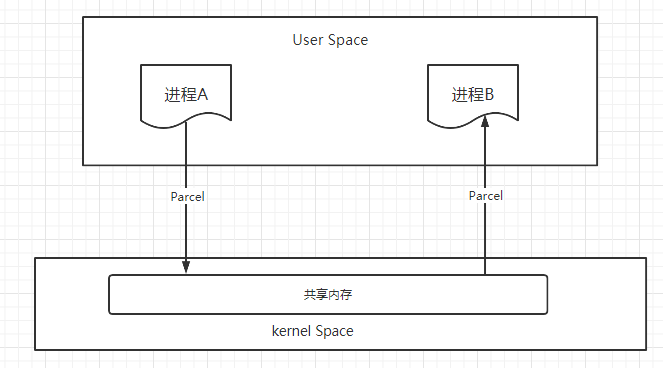

## 序列化

 **序列化 (Serialization)**将对象的状态信息转换为可以存储或传输的形式的过程。在序列化期间，对象将其当前状态写入到临时或持久性存储区。以后，可以通过从存储区中读取或反序列化对象的状态，重新创建该对象。简单地说，“序列化”就是将运行时的对象状态转换成二进制，然后保存到流、内存或者通过网络传输给其他端。

我们使用intent传递简单数据时，可以直接调用intent的put方式可以传递整型，浮点型，字符串等等数据，但如果是复杂的对象数据时，就需要对复杂数据进行序列化。


### 序列化的方式

- Serializable：主要用于Java，序列化方式为保存在磁盘上。
- Parcelable：是安卓特有的一种内存序列化方式。

### Serializable

Serializable是一个没有方法的空接口，可以理解成他是一个标识接口，一旦实现了此接口，JVM就知道该类的对象就是可序列化的。

在进行序列化操作时，会判断要被序列化的类是否是Enum、Array和Serializable类型，如果都不是则直接抛出NotSerializableException。

```java
public interface Serializable {
}
```

- 序列化对象的成员变量也必须序列化，例如Person类中有一个Man类，这两者都要初始化
- 同一个对象序列化多次，这个对象并不会被序列化多次，这个主要是由``serialVersionUID``控制的
- **反序列化并不会调用构造方法。反序列的对象是由JVM自己生成的对象，不通过构造方法生成。(重要)**

序列化对象时，判断版本唯一靠的是``serialVersionUID``，这个值我们可以自己手动设置，如果不设置系统也会默认设置一个随机值。

这样序列化的对象都有一个唯一的序列化编码号，当程序试图序列化一个对象时，会先检查此对象是否已经序列化过，只有此对象从未（在此虚拟机）被序列化过，才会将此对象序列化为字节序列输出。

如果此对象已经序列化过，则直接输出编号即可。

#### 注意点：

由于java序利化算法不会重复序列化同一个对象，只会记录已序列化对象的编号。**如果序列化一个可变对象（对象内的内容可更改）后，更改了对象内容，再次序列化，并不会再次将此对象转换为字节序列，而只是保存序列化编号。**

《阿里巴巴Java开发手册》也有这个规定：

> 10. [强制]序列化类新增属性时，请不要修改serialVersionUID字段，避免反序列失败:如果完全不兼容升级，避免反序列化混乱，那么请修改serialVersionUID值。说明:注意serialVersionUID不一致会抛出序列化运行时异常。

一个类如果被序列化后修改了这个类中的``serialVersionUID``值，那么反序列化时就会抛出异常：

```java
java.io.InvalidClassException: com.hollis.User1; local class incompatible: stream classdesc serialVersionUID = -2986778152837257883, local class serialVersionUID = 7961728318907695402
```

为了向下兼容，序列化``serialVersionUID``是不会变的，就像String的``serialVersionUID``就一直没变过。

```java
    try (ObjectOutputStream oos = new ObjectOutputStream(new FileOutputStream("person.txt"));
             ObjectInputStream ios = new ObjectInputStream(new FileInputStream("person.txt"))) {
            //第一次序列化person
            Person person = new Person("张三", 23);
            oos.writeObject(person);
            System.out.println(person);

            //修改name
            person.setName("李四");
            System.out.println(person);
            //第二次序列化person
            oos.writeObject(person);

            //依次反序列化出p1、p2
            Person p1 = (Person) ios.readObject();
            Person p2 = (Person) ios.readObject();
            System.out.println(p1 +""+ p2);
            System.out.println(p1.getName()+"  " +(p2.getName()));
        } catch (Exception e) {
            e.printStackTrace();
        }
//输出结果
Person{name='张三', age=23}
Person{name='李四', age=23}
Person{name='张三', age=23}Person{name='张三', age=23}
张三  张三
```

#### 自定义序列化

我们可以自定义序列化和反序列化这个过程，选择我们需要的数据进行序列化。这时可以**使用transient关键字选择不需要序列化的字段。**

**使用transient修饰的属性，java序列化时，会忽略掉此字段，所以反序列化出的对象，被transient修饰的属性是默认值。对于引用类型，值是null；基本类型，值是0；boolean类型，值是false。**

```java
public class Person implements Serializable {
   //不需要序列化名字与年龄
   private transient String name;
   private transient int age;
   private int height;
   private transient boolean singlehood;
   public Person(String name, int age) {
       this.name = name;
       this.age = age;
   }
   //省略get,set方法
}

public class TransientTest {
   public static void main(String[] args) throws Exception {
       try (ObjectOutputStream oos = new ObjectOutputStream(new FileOutputStream("person.txt"));
            ObjectInputStream ios = new ObjectInputStream(new FileInputStream("person.txt"))) {
           Person person = new Person("张三", 23);
           person.setHeight(185);
           System.out.println(person);
           oos.writeObject(person);
           Person p1 = (Person)ios.readObject();
           System.out.println(p1);
       }
   }
}
//输出结果
//Person{name='张三', age=23', singlehood=true', height=185cm}
//Person{name='null', age=0', singlehood=false', height=185cm}
```

**使用transient修饰的属性，java序列化时，会忽略掉此字段，所以反序列化出的对象，被transient修饰的属性是默认值。对于引用类型，值是null；基本类型，值是0；boolean类型，值是false。**

##### writeObject和readObject

除了上面自定义序列化属性，我们还可以选择控制序列化的方式，或者对序列化的过程的数据进行操作，例如加密解密。

```java
private void writeObject(java.io.ObjectOutputStream out) throws IOException；
private void readObject(java.io.ObjectIutputStream in) throws IOException,ClassNotFoundException;
private void readObjectNoData() throws ObjectStreamException;
```

通过重写``writeObject``与``readObject``方法，可以自己选择哪些属性需要序列化， 哪些属性不需要。如果writeObject使用某种规则序列化，则相应的readObject需要相反的规则反序列化，以便能正确反序列化出对象。这里展示对名字进行反转加密。

```java
public class Person implements Serializable {
   private String name;
   private int age;
   //省略构造方法，get及set方法

   private void writeObject(ObjectOutputStream out) throws IOException {
       //将名字反转写入二进制流
       out.writeObject(new StringBuffer(this.name).reverse());
       out.writeInt(age);
   }

   private void readObject(ObjectInputStream ins) throws IOException,ClassNotFoundException{
       //将读出的字符串反转恢复回来
       this.name = ((StringBuffer)ins.readObject()).reverse().toString();
       this.age = ins.readInt();
   }
}
```

当序列化流不完整时，readObjectNoData()方法可以用来正确地初始化反序列化的对象。例如，使用不同类接收反序列化对象，或者序列化流被篡改时，系统都会调用readObjectNoData()方法来初始化反序列化的对象。

##### writeReplace和readResolve

更彻底的操纵序列化，

- **writeReplace：在序列化时，会先调用此方法，再调用writeObject方法。此方法可将任意对象代替目标序列化对象**

  ```java
  public class Person implements Serializable {
    private String name;
    private int age;
    private Object writeReplace() throws ObjectStreamException {
        //把对象改成字符串
        return name+"修改"+age;
    }
  
     public static void main(String[] args) throws Exception {
        try (ObjectOutputStream oos = new ObjectOutputStream(new FileOutputStream("person.txt"));
             ObjectInputStream ios = new ObjectInputStream(new FileInputStream("person.txt"))) {
            Person person = new Person("张三", 23);
            oos.writeObject(person);
            String str = (String)ios.readObject();
            System.out.println(str);
        }
    }
  }
  //输出结果
  //张三修改23 可以看到输出的结果从一个对象变成了一个字符串
  ```

  

- **readResolve：反序列化时替换反序列化出的对象，反序列化出来的对象被立即丢弃。此方法在readeObject后调用。**

  ```java
  public class Person implements Serializable {
      private String name;
      private int age;
      //省略构造方法，get及set方法
       private Object readResolve() throws ObjectStreamException{
          return new ("李四", 23);
      }
      public static void main(String[] args) throws Exception {
          try (ObjectOutputStream oos = new ObjectOutputStream(new FileOutputStream("person.txt"));
               ObjectInputStream ios = new ObjectInputStream(new FileInputStream("person.txt"))) {
              Person person = new Person("张三", 23);
              oos.writeObject(person);
              HashMap map = (HashMap)ios.readObject();
              System.out.println(map);
          }
      }
  }
  //输出结果
  //{李四=23}
  ```

  **readResolve常用来反序列单例类，保证单例类的唯一性。**

  **注意：readResolve与writeReplace的访问修饰符可以是private、protected、public，如果父类重写了这两个方法，子类都需要根据自身需求重写，这显然不是一个好的设计。通常建议对于final修饰的类重写readResolve方法没有问题；否则，重写readResolve使用private修饰。**

#### 强制自定义序列化：Externalizable

实现Externalizable接口，就必须实现writeExternal、readExternal方法来强制对序列化进行自定义。

**实现此接口必须实现接口中的两个方法实现自定义序列化，这是强制性的；特别之处是必须提供pulic的无参构造器，因为在反序列化的时候需要反射创建对象。**

##### serialVersionUID

前面说了``serialVersionUID``是一个对象序列化的唯一编号，一般情况下是不会改变的，所以**在做兼容性升级的时候，不要改变类中serialVersionUID的值。**

- 修改类的方法时，不会影响类的属性，所以不用修改``serialVersionUID``
- 修改静态变量和transient修饰的变量时，反序列化不受影响，也不用修改``serialVersionUID``
- 修改了普通的成员变量时，可能导致反序列化时白，如果心累中变量的类型与序列化时类的类型不一致，则会导致反序列化失败，这时候就需要修改``serialVersionUID``的值，
- 增删变量，如果新增了变量，则反序列化回来时新增的是一个默认值，如果删除了某个变量，则反序列化时会忽略减少的变量。

### Parcelable

Parcelable是android特有的序列化方式，Android的源码中有一个Parcel类，native源码中也有，是binder跨进程传输的重要工具，序列化数据存储在内存中。我们将要传输的数据用Parcel打包好后，可以通过binder中进行传输。

Parcel可以包含原始数据类型（用各种对应的方法写入，比如writeInt(),writeFloat()等），可以包含Parcelable对象，它还包含了一个活动的IBinder对象的引用，这个引用导致另一端接收到一个指向这个IBinder的代理IBinder。Parcelable通过Parcel实现了read和write的方法,从而实现序列化和反序列化。

简单来说，Parcel提供了一套机制，可以将序列化之后的数据写入到一个共享内存中，其他进程通过Parcel可以从这块共享内存中读出字节流，并反序列化成对象,下图是这个过程的模型。



使用方法：

```java
public class Person implements Parcelable {
    private String name;
    private int age;

    // 系统自动添加，给createFromParcel里面用
    protected Person(Parcel in) {
        name=in.readString();
        age=in.readInt();
    }

    @Override
    public void writeToParcel(Parcel dest, int flags) {
        //将数据序列化到对象中
        dest.writeString(name);
        dest.writeInt(age);
    }

    @Override
    public int describeContents() {
        //只针对一些特殊的需要描述信息的对象,需要返回1,其他情况返回0就可以
        return 0;
    }

    public static final Creator<Person> CREATOR = new Creator<Person>() {
        @Override
        public Person createFromParcel(Parcel in) {
            // 反序列化，读取数据
            return new Person(in);
        }
        //供反序列化本类数组时调用的
        @Override
        public Person[] newArray(int size) {
            return new Person[size];
        }
    };

...set get方法
}

```


### 对比

|           Serializable            |                     Parcelable                     |
| :-------------------------------: | :------------------------------------------------: |
|               Java                |                      Android                       |
| 序列化时需要大量的I/O操作，开销大 |            只需要少量的I/O操作，开销小             |
|          效率低，速度慢           | 效率高，速度快（因为是操作内存，大概是前者的10倍） |
| 序列化数据到本地磁盘或者网络传输  |              序列化到内存供binder传输              |

