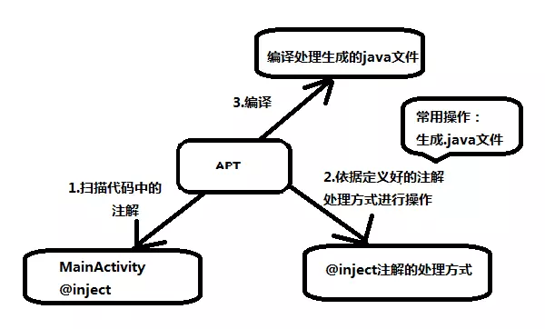

### 注解

> 在Java中，注解(Annotation)引入始于Java5，用来描述Java代码的元信息，通常情况下注解不会直接影响代码的执行，尽管有些注解可以用来做到影响代码执行

#### 1.基本使用 

- 定义一个注解

  ```java
  public @interface Example {
      String name();
      String sex();
  }
  ```

  使用@来告诉编译器这是一个注解，里面包含了name和sex两个属性

- 使用一个注解

  ```java
  @Example(name = "v", name = "male")
  ```

#### 2.注解类型

|  注解类型  |                             含义                             |
| :--------: | :----------------------------------------------------------: |
| Documented | 表示含有该注解类型的元素(带有注释的)会通过javadoc或类似工具进行文档化 |
| Inherited  |                   表示注解类型能被自动继承                   |
| Retention  |                    表示注解类型的存活时长                    |
|   Target   |              表示注解类型所适用的程序元素的种类              |

- Documented

  作用是在生成javadoc文档的时候将该Annotation也写入到文档中。代码可以转化成doc文档，如果使用了该注解，可以 将代码和注释转化为文档。

- Inherited

  **类继承关系中``@Inherited``的作用**

  类继承关系中，子类会继承父类使用的注解中被``@Inherited``修饰的注解

  **接口继承关系中``@Inherited``的作用**

  接口继承关系中，子接口不会继承父接口中的任何注解，不管父接口中使用的注解有没有被``@Inherited``修饰

  **类实现接口关系中``@Inherited``的作用**

  类实现接口时不会继承任何接口中定义的注解

- Retention

  表示该注解类型的注解保留的时长。当注解类型声明中没有@Retention元注解，则默认保留策略为RetentionPolicy.CLASS。关于保留策略(RetentionPolicy)是枚举类型，共定义3种保留方式

  

  |          name           |                             含义                             |
  | :---------------------: | :----------------------------------------------------------: |
  | RetentionPolicy.SOURCE  |        仅存在Java源文件，经过编译器后便丢弃相应的注解        |
  |  RetentionPolicy.CLASS  | 存在Java源文件，以及经编译器后生成的Class字节码文件，但在运行时VM不再保留注释 |
  | RetentionPolicy.RUNTIME | 存在源文件、编译生成的Class字节码文件，以及保留在运行时VM中，可通过反射性地读取注解 |

  - SOURCE

	  注解只保留在源文件，当[Java](https://link.jianshu.com/?t=http://lib.csdn.net/base/javase)文件编译成class文件的时候，注解被遗弃

    这种应用场景主要在开发中，例如``@IntDef``的使用，来对被注解的地方做一些内容限制

    ```java
     public static class TestSource {
    
            // 注解仅存在于源码中，在class字节码文件中不包含
            @Retention(RetentionPolicy.SOURCE)
            // 限定取值范围为{STATUS_OPEN, STATUS_CLOSE}
            @IntDef({TestSource.Status.STATUS_OPEN,TestSource.Status.STATUS_CLOSE})
            public @interface Status {
                // 状态值(接口中声明变量默认为 public static final)
                int STATUS_OPEN = 1;
                int STATUS_CLOSE = 2;
            }
    
            private int mStatus = TestSource.Status.STATUS_OPEN;
    
            /**
             * 限定参数的取值
             */
            public void setStatus(@TestSource.Status int status) {
                mStatus = status;
            }
    
            public int getStatus() {
                return mStatus;
            }
        }
    
    ```

  - CLASS

    注解被保留到class文件，但jvm加载class文件时候被遗弃，这是默认的生命周期

    这种就是最常用的注解时长形式了，在编译的时候生成字节码文件，在打包后该注解会消失，但是生成的文件会被打包。

  - RUNTIME
  
    注解不仅被保存到class文件中，jvm加载class文件之后，仍然存在；
    
    和上面类似，但是打包后该注解不会消失，仍然可以通过反射的方式获取该注解，该注解主要用于在代码运行时仍然可以去查找的环境中。
    

- Target

  表示该注解类型的所使用的程序元素类型。当注解类型声明中没有``@Target``元注解，则默认为可适用所有的程序元素。如果存在指定的``@Target``元注解，则编译器强制实施相应的使用限制。关于程序元素(ElementType)是枚举类型，共定义8种程序元素
  
  | **ElementType** |              **exp**               |
  | :-------------: | :--------------------------------: |
  |      TYPE       | 类、接口（包括注解类型）或枚举声明 |
  |   CONSTRUCTOR   |            构造方法声明            |
  |     PACKAGE     |               包声明               |
  | LOCAL_VARIABLE  |            局部变量声明            |
  |     METHOD      |              方法声明              |
  | ANNOTATION_TYPE |            注解类型声明            |
  |    PARAMETER    |              参数声明              |
  |      FIELD      |     字段声明（包括枚举常量）.      |

#### 2.注解处理器

​	在第一步生成了注解之后，并不是把注解加到你要的类或方法上面就生效了，这里还需要注解处理器来处理这些注解所对应的的功能，才能让这些注解生效。

​	使用注解处理器时我们一般会使用``annotationProcessor ``,使用了注解处理器的第三方框架一般都会让你引用一个``annotationProcessor ``,例如

```java
implementation 'com.jakewharton:butterknife:9.0.0-rc1'
annotationProcessor 'com.jakewharton:butterknife-compiler:9.0.0-rc1'
```

``annotationProcessor``是APT(Annotation Processing Tool)工具中的一种，随着Android Gradle 插件 2.2 版本的发布，Android Gradle 插件提供了名为 ``annotationProcessor`` 的功能来完全代替 android-apt，不需要引入，可以直接在build.gradle文件中使用。

注解处理器对源代码文件进行检测找到其中的``Annotation``，根据注解自动生成代码。 ``Annotation``处理器在处理``Annotation``时可以根据源文件中的``Annotation``生成额外的源文件和其它的文件，之后将编译生成的源文件和原来的源文件一起生成class文件



注意的是如果在``kotlin``中使用注解处理器，需要用``kapt``来替代``annotationProcessor``。同时，需要额外引入``kotlin-kapt``
```java
apply plugin: 'kotlin-kapt'
......
kapt "com.android.databinding:compiler:$android_plugin_version"
```

#### 3.实例

​	1.首先需要创一个纯java的module(lib_annotation)，不包含任何android代码。	

​	2.创建一个注解处理器module(lib_compiler)，该module依赖上面那个module，这里做对注解的逻辑处理，该module不会被打包进apk中。只用于存放注解。该module需要导入:

```java
//这一行有的情况需要加上，有的时候不需要加，加了没错
annotationProcessor 'com.google.auto.service:auto-service:1.0-rc4' 
implementation 'com.google.auto.service:auto-service:1.0-rc4'
implementation project(':lib_annotation')
 //生成代码文件的框架
 implementation 'com.squareup:javapoet:1.10.0'
```

先创建一个注解

```java
@Retention(RetentionPolicy.CLASS)
@Target(ElementType.FIELD)
public @interface RandomInt {
}

```

在创建注解处理器

```java
@AutoService(Processor.class)
public class RandomProcessor extends AbstractProcessor {
    private static final List<Class<? extends Annotation>> RANDOM_TYPES
            = Arrays.asList(RandomInt.class, RandomString.class);

    private Messager messager;
    private Types typesUtil;
    private Elements elementsUtil;
    private Filer filer;
    private static final String packageName = "com.permissionx.app";


    /**
     * 在该方法中可以获取到processingEnvironment对象，
     * 借由该对象可以获取到生成代码的文件对象, debug输出对象，以及一些相关工具类
     *
     * @param processingEnvironment
     */
    @Override
    public synchronized void init(ProcessingEnvironment processingEnvironment) {
        super.init(processingEnvironment);
        messager = processingEnv.getMessager();
        typesUtil = processingEnv.getTypeUtils();
        elementsUtil = processingEnv.getElementUtils();
        filer = processingEnv.getFiler();
    }

    /**
     * 你所需要处理的所有注解，该方法的返回值会被process()方法所接收
     *
     * @return
     */
    @Override
    public Set<String> getSupportedAnnotationTypes() {
        Set<String> annotations = new LinkedHashSet<>();

        for (Class<? extends Annotation> annotation : RANDOM_TYPES) {
            annotations.add(annotation.getCanonicalName());
        }
        return annotations;
    }

    /**
     * 重点，扫描所有被注解的元素，并作处理，最后生成文件。
     * 该方法的返回值为boolean类型，若返回true,则代表本次处理的注解已经都被处理，不希望下一个注解处理器继续处理，
     * 否则下一个注解处理器会继续处理。
     */
    @Override
    public boolean process(Set<? extends TypeElement> set, RoundEnvironment roundEnvironment) {
        // 扫描所有注解元素，并对注解元素的类型做判断
        messager.printMessage(Diagnostic.Kind.NOTE, "asdsadas");
        for (Element element : roundEnvironment.getElementsAnnotatedWith(RandomInt.class)) {
            //AnnotatedRandomInt是对被RandomInt注解的Elment的简单封装
            //判断被注解的类型是否符合要求
            StringBuilder builder = new StringBuilder()
                    .append("package " + packageName + ";\n\n")
                    .append("import java.util.Random;\n\n")
                    .append("public class SecondActivity_1")
                    .append(" {\n\n") // open class
                    .append("public  SecondActivity_1(SecondActivity target){\n")
                    .append("target.")
                    .append(element.getSimpleName())
                    .append(" = new Random().nextInt(100);\n")
                    .append("}}");
            try { // write the file
                JavaFileObject source = filer.createSourceFile(packageName + "." + "SecondActivity_1");
                Writer writer = source.openWriter();
                writer.write(builder.toString());
                writer.flush();
                writer.close();
            } catch (IOException e) {
                messager.printMessage(Diagnostic.Kind.ERROR, "err" + e);
            }
        }
        return true;
    }

```

真正一个完整的生成文件的处理器还要做很多判断和方法注入，这里只是个例子。

创建注入工具


```java
public class RandomUtil {
    private static final String RANDOM_SUFFIX = "_1";

    private RandomUtil() {

    }

    /**
     * 通过反射的方式找到对应的辅助类，并调用对应的方法实现属性的注入
     * @param object 被注入的对象
     */
    public static void inject(Object object) {
        try {
            Class bindingClass = Class.forName(object.getClass().getCanonicalName() + RANDOM_SUFFIX);
            //noinspection unchecked
            Constructor constructor = bindingClass.getConstructor(object.getClass());
            constructor.newInstance(object);

        } catch (ClassNotFoundException e) {
            Log.e("TAG", "Meaningful Message", e);
        } catch (NoSuchMethodException e) {
            Log.e("TAG", "Meaningful Message", e);
        } catch (IllegalAccessException e) {
            Log.e("TAG", "Meaningful Message", e);
        } catch (InstantiationException e) {
            Log.e("TAG", "Meaningful Message", e);
        } catch (InvocationTargetException e) {
            Log.e("TAG", "Meaningful Message", e);
        }
    }
}

```

最后调用

```kotlin
   @RandomInt
    var a: Int = 1

    override fun onCreate(savedInstanceState: Bundle?) {
        super.onCreate(savedInstanceState)
        setContentView(R.layout.activity_main)
       
        RandomUtil.inject(this)
    }

```

最后生成的文件位于：app\build\generated\ap_generated_sources\debug\out\下

```java
public class SecondActivity_1 {

    public SecondActivity_1(SecondActivity target) {
        target.a = new Random().nextInt(100);
    }
}
```


